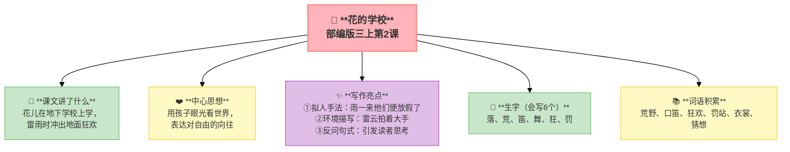

---
tags:
  - 三上
  - 语文
  - 学校生活
  - 民族团结
  - 儿童诗
---

# 第一单元 · 学校生活

> 从暑假回到校园，看不同民族的学校、听花的读书声、学孙中山的勤学好问。
> **阅读重点**：关注有新鲜感的词句
> **习作目标**：猜猜他是谁（人物描写）

---

## 1 大青树下的小学

> 部编版三上第1课
> ⏰ 先读课文三遍，再往下看
> **阅读重点**：关注有新鲜感的词句
> **习作目标**：猜猜他是谁（人物描写）

```mermaid
%%{init: {'theme': 'base', 'themeVariables': {'fontSize': '14px'}}}%%
graph TB
    classDef center fill:#FFB3BA,stroke:#FF8A80,stroke-width:2px,color:#333,font-weight:bold,font-size:16px
    classDef green fill:#C8E6C9,stroke:#66BB6A,stroke-width:1px,color:#333,font-size:13px
    classDef blue fill:#BBDEFB,stroke:#42A5F5,stroke-width:1px,color:#333,font-size:13px
    classDef yellow fill:#FFF9C4,stroke:#FFCA28,stroke-width:1px,color:#333,font-size:13px
    classDef purple fill:#E1BEE7,stroke:#AB47BC,stroke-width:1px,color:#333,font-size:13px

    center["🏫 **大青树下的小学**<br/>部编版三上第1课"]:::center

    l1["📖 **课文讲了什么**<br/>边疆小学各民族孩子一起上学"]:::green
    l2["❤️ **中心思想**<br/>团结友爱、充满欢乐的边疆小学"]:::yellow
    l3["✨ **写作亮点**<br/>①排比句式：三个"向"写有礼貌<br/>②侧面描写：环境衬托读书声好听<br/>③画面感强：民族服装、铜钟、凤尾竹"]:::purple

    r1["📝 **生字（会写12个）**<br/>晨、绒、球、汉、艳、服、装、扮、读、静、停、粗"]:::green
    r2["📚 **词语积累**<br/>早晨、鲜艳、服装、打扮、绒球花<br/>招引、粗壮、朗读、安静"]:::yellow

    center --> l1
    center --> l2
    center --> l3
    center --> r1
    center --> r2

    style center fill:#FFB3BA,stroke:#FF8A80,stroke-width:2px
```

---

### 📖 □核心 课文讲了什么

一所边疆小学，不同民族的小朋友穿着民族服装一起上课，窗外有古老的铜钟、凤尾竹，还有猴子、松鼠来"听课"。

---

### 💬 □核心 作者想说的话

**看到边疆小学的孩子们穿着民族服装一起上课、一起玩耍，作者心里暖暖的——原来学校可以这么快乐。**

---

### ✨ □了解 写作亮点

| 序号 | 亮点 | 说明 |
|:-----|:-----|:-----|
| ① | **排比句式** | "向小鸟打招呼，向老师问好，向国旗敬礼"三个"向"写出有礼貌 |
| ② | **侧面描写** | "树枝不摇了，鸟儿不叫了，蝴蝶停在花上"用环境衬托读书声好听 |
| ③ | **画面感强** | 民族服装、铜钟、凤尾竹用具体事物营造氛围 |

---

### 📝 □核心 生字（会写12个）

晨、绒、球、汉、艳、服、装、扮、读、静、停、粗

---

### 📚 □了解 词语积累

| 类别 | 词语 |
|:-----|:-----|
| **必会字词** | 早晨、鲜艳、服装、打扮、绒球花、招引、粗壮、朗读、安静 |
| **近义词** | 鲜艳——艳丽、打扮——装扮、招引——吸引、安静——宁静 |
| **反义词** | 鲜艳——暗淡、粗壮——纤细、安静——喧闹 |

---

### 🏗️ □核心 文章结构：超清晰！

| 部分 | 自然段 | 内容 | 作用 |
|:-----|:-------|:-----|:-----|
| **第一部分 🎬** | 1 | 上学路上（不同民族，鲜艳服装） | 交代背景 |
| **第二部分 🔥** | 2-3 | 来到学校、上课（古老铜钟、认真朗读） | **重点段落**，展示校园生活 |
| **第三部分 🌱** | 4 | 下课了（跳舞、做游戏、动物来看热闹） | 展现欢乐氛围 |

> **💡 写作要点**：用**排比**写出同学们的礼貌，用**侧面描写**衬托读书声的美妙。

---

## ✨ 阅读与写作：深挖课文"宝藏"

### 0️⃣ □了解 原文对照仿写

| 课文原句 | 仿写练习 |
|:---------|:---------|
| "同学们向在校园里欢唱的小鸟打招呼，向敬爱的老师问好，向高高飘扬的国旗敬礼。" | 用"向……向……向……"写一个排比句：________________________________ |

### 1️⃣ 排比句式（第1自然段）—— 语言描写

| 阅读要点 | 写法分析 | 写作小技巧 |
|:---------|:---------|:-----------|
| "向小鸟打招呼，向老师问好，向国旗敬礼" 🎵 | 三个"向"构成排比，写出同学们有礼貌 | 写校园场景可以用排比句 |

### 2️⃣ 侧面描写（第3自然段）—— 环境描写

| 阅读要点 | 写法分析 | 写作小技巧 |
|:---------|:---------|:-----------|
| "树枝不摇了，鸟儿不叫了，蝴蝶停在花朵上" 🌿 | 用环境的安静来衬托读书声好听 | 不直接说"好听"，用别人/物的反应来表现 |

---

## 📚 语言积累：词语库+句式库

> "同学们向在校园里欢唱的小鸟打招呼，向敬爱的老师问好，向高高飘扬的国旗敬礼。"
> 
> 三个"向"排比，写出了同学们有礼貌、热爱祖国的样子。

---

---

## 📋 附录

## 📋 学习自评表（教-学-评一致性）✅

| 评价维度 | 我能做到（✅） | 需再练练（🔄） |
|:---------|:--------------|:---------------|
| **结构把握** | 能说出课文写了上学路上、上课、下课三个场景 | |
| **语言运用** | 能正确读写12个生字，会用排比句写句子 | |
| **朗读理解** | 能读出校园的美好，找出有新鲜感的句子 | |
| **思辨拓展** | 能说出侧面描写的好处，仿写排比句 | |

---

## 2 花的学校

> 部编版三上第2课，印度诗人泰戈尔的散文诗
> ⏰ 先读课文三遍，再往下看
> **阅读重点**：感受童话丰富的想象
> **习作目标**：猜猜他是谁（人物描写）



---

### 📖 □核心 课文讲了什么

花儿在地下的学校里上学，雷雨来时放假了，冲出地面跳舞狂欢，急着找妈妈（大地/天空）。

---

### 💬 □核心 作者想说的话

**泰戈尔把花儿写成了和你一样大的孩子——它们也上学、也放假、也急着找妈妈。花儿的自由，就是你心里那个想出去玩的自己。**

---

### ✨ □了解 写作亮点

| 序号 | 亮点 | 说明 |
|:-----|:-----|:-----|
| ① | **拟人手法** | "雨一来，他们便放假了"把花写成盼望放假的孩子 |
| ② | **环境描写** | "雷云拍着大手"拟人写出暴风雨的声势 |
| ③ | **反问句式** | "你没有看见他们怎样地急着要到那儿去吗？"引发思考 |

---

### 📝 □核心 生字（会写6个）

落、荒、笛、舞、狂、罚

---

### 📚 □了解 词语积累

| 类别 | 词语 |
|:-----|:-----|
| **必会字词** | 荒野、口笛、狂欢、罚站、衣裳、猜想 |
| **近义词** | 荒野——荒原、狂欢——欢庆、急急忙忙——匆匆忙忙 |
| **反义词** | 放假——上学、罚站——表扬、急急忙忙——慢慢悠悠 |

---

### 🏗️ □核心 文章结构：超清晰！

| 部分 | 自然段 | 内容 | 作用 |
|:-----|:-------|:-----|:-----|
| **第一部分 🎬** | 1-2 | 花儿在地下学校上学 | 交代背景 |
| **第二部分 🔥** | 3-6 | 雷雨来时放假，花儿冲出地面跳舞狂欢 | **重点段落**，展现活泼 |
| **第三部分 🌱** | 7-9 | 花儿急着找妈妈 | 升华情感 |

> **💡 写作要点**：用**拟人**让花儿活起来，用**反问**引发读者思考。

---

## ✨ 阅读与写作：深挖课文"宝藏"

### 0️⃣ □了解 原文对照仿写

| 课文原句 | 仿写练习 |
|:---------|:---------|
| "雨一来，他们便放假了。" | 用"……一来，……便……"写一个拟人句：________________________________ |

### 1️⃣ 拟人妙用（第3自然段）—— 想象描写

| 阅读要点 | 写法分析 | 写作小技巧 |
|:---------|:---------|:-----------|
| "雨一来，他们便放假了" 🌧️ | 把花写成盼望放假的孩子 | 想象事物像人一样有情感 |

### 2️⃣ 环境烘托（第6自然段）—— 环境描写

| 阅读要点 | 写法分析 | 写作小技巧 |
|:---------|:---------|:-----------|
| "树枝在林中互相碰触着，绿叶在狂风里簌簌地响，雷云拍着大手" 🌿 | 环境描写+拟人，写出暴风雨的声势 | 用环境衬托人物心情 |

---

## 📚 语言积累：词语库+句式库

> "雨一来，他们便放假了。"
> 
> 拟人。把花写成了盼望放假的孩子。

> "你没有看见他们怎样地急着要到那儿去吗？你不知道他们为什么那样急急忙忙吗？"
> 
> 反问。花为什么急着开放？因为它们也想找妈妈（大地/天空）。

---

## 📋 学习自评表（教-学-评一致性）✅

| 评价维度 | 我能做到（✅） | 需再练练（🔄） |
|:---------|:--------------|:---------------|
| **结构把握** | 能说出花儿的学校的故事发展顺序 | |
| **语言运用** | 能正确读写6个生字，会用拟人句 | |
| **朗读理解** | 能读出花儿的活泼和自由 | |
| **思辨拓展** | 能找出拟人和反问的句子，说出妙处 | |

---

## 3* 不懂就要问（阅读任务单）

> 部编版三上第3课（略读课文——自己读，自己发现）
> ⏰ 先读课文三遍，再往下看
> **阅读重点**：关注有新鲜感的词句
> **习作目标**：猜猜他是谁（人物描写）

### 📖 □核心 课文速览

孙中山小时候在私塾读书，背了一天也不懂意思。他壮着胆子问先生，先生不但没骂他，还详细讲解了。

### 📋 阅读任务单

> 自己读课文，然后完成下面的任务。

**任务一：圈一圈新鲜词句**

读一遍课文，圈出你觉得"有新鲜感"的词句：

| 我圈的词句 | 为什么觉得新鲜？ |
|:-----------|:----------------|
| 例：私塾 | 以前的学校叫"私塾" |
| | |
| | |

**任务二：孙中山的心理变化**

| 阶段 | 心理 | 课文里哪句话？ |
|:-----|:-----|:--------------|
| 背书不懂意思 | ____ | |
| 犹豫要不要问 | ____ | |
| 壮着胆子问了 | ____ | |

**任务三：联系自己**

你有没有"不懂就问"的经历？写一两句话。

> _____________________________________________

---

## ✍️ 习作：猜猜他是谁

### 🎯 □核心 目标
用文字描写一个同学，让大家猜出是谁。**抓住特征，不写名字。**

### 📐 □了解 写作框架

| 段落 | 写什么 |
|:----:|:-------|
| ① 开头 | 他是谁？（不写名字） |
| ② 外貌特征 | 长相/发型/身高/衣着 |
| ③ 性格/爱好 | 他喜欢做什么/性格怎样 |
| ④ 典型事例 | 一件具体的事 |
| ⑤ 结尾 | 你能猜出他是谁吗？ |

### 🧩 人物描写工具箱

**外貌**
- 脸型：圆脸、瓜子脸、国字脸
- 眼睛：水汪汪的、炯炯有神、眯成一条线
- 头发：短发扎成马尾、自然卷、齐刘海
- 特别标记：酒窝、大门牙、小虎牙、痣

**性格**
- 活泼开朗、文静内向、热心肠、幽默风趣、急性子、慢性子

**爱好**
- 爱看书、爱运动、爱画画、爱唱歌、爱问问题、爱帮助人

### 📝 □了解 范文

> 这是参考，不是标准。孩子写不一样的方向也很好。

> **我们班的"运动小达人"**
>
> 他是我们班的"运动小达人"。
>
> 他个子高高的，瘦瘦的，两条长腿跑起来像一阵风。皮肤黑黑的，妈妈说那是"太阳给的勋章"。他笑起来特别阳光，露出一口白牙。
>
> 每次体育课，他总是第一个冲出去。上次校运会200米决赛，他像离弦的箭一样飞出去，第一个冲过终点线，全班同学都跳起来欢呼。
>
> 你猜到他是谁了吗？

> **我们班的"小书虫"**
>
> 她总是一个人坐在角落里看书。
>
> 她的眼睛不大，但看书的时候亮亮的，像两颗星星。头发扎成一条马尾辫，走起路来一甩一甩的。她最爱穿白色的T恤，干干净净的。
>
> 下课了，大家都冲出教室玩，只有她坐在座位上看《安徒生童话》。有一次我借她的书看，她特别高兴，跟我说了一大堆书里的故事，我这才知道——原来她不是不爱玩，是书里的世界太好玩了。
>
> 你猜到她是谁了吗？

### ⚠️ □了解 常见问题
1. ❌ "他长得很可爱" → ✅ "他圆圆的脸上总是挂着两个小酒窝"
2. ❌ "他学习很好" → ✅ "每次数学课，老师的问题刚说完，他已经举手了"
3. ❌ 写得太笼统 → ✅ 用一件具体的事证明

### 📝 □了解 同学初稿 vs 修改稿

| 初稿（太笼统） | 修改稿（加细节） |
|:--------------|:----------------|
| 他长得很可爱。 | 他圆圆的脸蛋上嵌着一双亮晶晶的大眼睛，一笑起来就露出两个小酒窝，像两个小漩涡。 |
| 他学习很好。 | 每次老师提问，他总是第一个举手；他的作业总是被老师贴在墙上当示范。 |
| 他很热心。 | 有一次我忘带铅笔盒，急得团团转，他二话不说就把自己的铅笔掰成两半，递给我一半。 |

---

## ❓ 关联性问题

1. 同样是写学校，为什么大青树下的小学让我们感觉温暖，花的学校让我们感觉自由？
2. 如果你能设计一所学校，你会把学校建在哪里？像大青树一样在边疆，还是像花的学校一样在地下？
3. 孙中山"不懂就要问"的精神在今天的小学里还适用吗？为什么？
4. 三篇课文都写了"学习"，但学习的方式完全不同，你最喜欢哪种？为什么？

---

## 🔗 跨文本对比：三篇课文怎么"写学校"

本单元三篇课文都围绕"学校生活"，但写法完全不同：

| 对比维度 | 1 大青树下的小学 | 2 花的学校 | 3 不懂就要问 |
|:---------|:-----------------|:-----------|:------------|
| **文体** | 写景散文 | 散文诗（译作） | 记叙文 |
| **视角** | 第三人称，旁观者 | 孩子般的天真幻想 | 第三人称，讲故事 |
| **主要内容** | 校园环境+上课+下课 | 花儿在地下的学校→放假→找妈妈 | 孙中山在私塾勇敢提问 |
| **写作手法** | 排比、侧面描写 | 拟人、反问、想象 | 对比、心理描写 |
| **情感色彩** | 温馨、欢乐、团结 | 自由、活泼、向往 | 紧张→坚定→豁然开朗 |
| **"学校"是真的吗** | ✅ 真实的边疆小学 | ❌ 想象的童话 | ✅ 真实的清朝私塾 |

**💡 阅读启示**：同样是写"学校"，可以写真实的校园（大青树），可以写想象中的学校（花儿的地下学校），也可以写学校里的故事（孙中山提问）。写作文时，这三种方法都可以用。

---

## 📚 课外书吧

**必读经典**
- **泰戈尔《新月集》（选篇）** —— 花的学校的作者，更多关于孩子与自然的散文诗

**趣味读物**
- **《窗边的小豆豆》黑柳彻子** —— 看看巴学园里不一样的学校生活
- **《我的小学》丰子恺** —— 大画家写自己小时候的学校趣事
- **《一年级大个子二年级小个子》古田足日** —— 日本校园故事，关于勇气和友谊

**闲书时光**
- **《了不起的狐狸爸爸》罗尔德·达尔** —— 狐狸爸爸智斗三个农场主
- **《不一样的卡梅拉》系列** —— 小鸡卡梅拉的冒险故事
- **《青蛙和蟾蜍》系列** —— 两个好朋友的日常趣事

---

## 🗣️ 语文生活

**选做（任选一项）：**

1. **口头分享**：分享你学校里最有新鲜感的一个角落或一件事——食堂里的一条长队、操场边的一棵老树、保安叔叔的一声问候……
2. **画一画**：画出你学校里最有新鲜感的角落，旁边写一两句话说明
3. **课堂小游戏**：同桌互相描述自己学校的一个角落，让对方猜是哪里

---

## ✏️ 我的发现（留白）

> 读完这个单元，我最想记下来的是：

___________________________________________

___________________________________________

> 我同桌的发现：

___________________________________________

---

## 🔄 老朋友回来啦

| 老朋友 | 出自 | 再认读 |
|:------|:-----|:-------|
| 安静 | 二上《田家四季歌》 | 窗外十分________，树枝不摇了。 |
| 朗读 | 一下 | 同学们在教室里认真________课文。 |

✅ ⬛⬛ 阅读纵向衔接：

| 老朋友 | 出自 | 再认读 |
|:-------|:-----|:-------|
| **边读边想象画面** | 二下第一单元"读诗歌，想象画面" | 本单元第一次明确提出"一边读一边想象画面"的阅读方法，从此开启"边读边想"的阅读能力训练 |
---

## 🌐 三通

1. 大青树下的小学和你的学校有什么不同？有什么相同？
2. 花儿的地下学校和我们的学校，你喜欢哪种？为什么？
3. 你有过孙中山那样"不懂就要问"的经历吗？当时是什么情况？

---

## 📎 拓展
- 延伸阅读：泰戈尔《新月集》选篇
- 口语交际："我的暑假生活"——选新鲜事讲给大家听
- 语文园地一：交流平台（关注有新鲜感的词句）＋ 词句段运用

---

## 📖 语文园地

## □核心 交流平台

- 关注有新鲜感的词语：遇到没见过的、特别有趣的词语，可以圈出来多读几遍，想想为什么这样写
- 关注有新鲜感的句子：比如用了比喻、拟人的句子，或者与平时说法不一样的表达，都可以积累下来

---

## □核心 词句段运用

- 辨字组词：晨（早晨）— 辰（星辰）；绒（绒毛）— 戒（戒尺）
- 照样子写句子：那_____，那_____，那_____，那_____，都是_____。
- 用"从……从……从……"写一段话

---

## □核心 日积月累

**所见**（清·袁枚）

牧童骑黄牛，歌声振林樾。
意欲捕鸣蝉，忽然闭口立。

