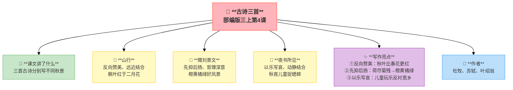
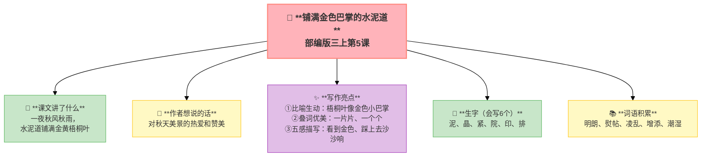
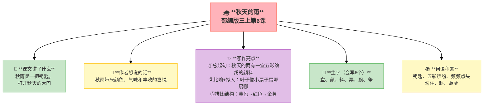
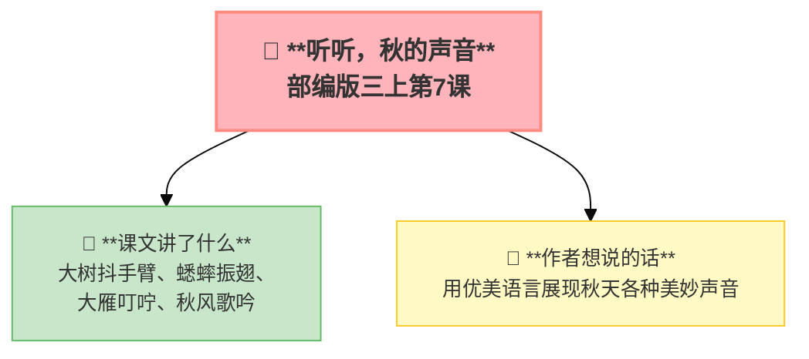

---
tags:
  - 三上
  - 语文
  - 秋天
  - 古诗
  - 日记
---

# 第二单元 · 金秋时节

> 秋天来了——看红叶、走水泥道、听秋雨、听秋的声音。
> **阅读重点**：运用多种方法理解词语
> **习作目标**：写日记

---

## 4 古诗三首

> 部编版三上第4课
> ⏰ 先读课文三遍，再往下看
> **阅读重点**：运用多种方法理解词语
> **习作目标**：写日记



---

### 📖 □核心 课文讲了什么

三首古诗分别写了不同的秋景：杜牧写山行红叶胜春花，苏轼写秋日橙黄橘绿好风景，叶绍翁写秋夜看儿童捉蟋蟀。

---

### 💬 诗人的心事

**杜牧被山路转弯处的枫林迷住了——原来秋天也可以这么美！他赶紧停下车，想多看一会儿。**

---

### 山行 · 杜牧

> 远上寒山石径斜，白云生处有人家。
> 停车坐爱枫林晚，霜叶红于二月花。

**📜 写作背景**：公元835年前后，杜牧在长安做官。一个深秋的午后，他独自驾车出城，沿着寒山石径缓缓而上。远处的白云深处隐约有人家，路边枫林像火烧云般绚烂——他看呆了，索性停下马车，在山道上久久不愿离去。

**🔑 注释**
| 词语 | 解释 |
|:-----|:-----|
| 山行 | 在山中行走 |
| 寒山 | 深秋的山（有点冷） |
| 石径 | 石头小路 |
| 坐 | 因为 |
| 霜叶 | 经霜打过的枫叶 |
| 红于 | 比……还红 |

**✨ 写作亮点**
| 写法亮点 | 课文内容 | 写作技巧 |
|:---------|:---------|:---------|
| **反向赞美** | "霜叶红于二月花" | 秋叶比春花更红，赞美秋天 |
| **远近结合** | 远山→白云→人家→枫林 | 由远及近，画面层次分明 |
| **情感真挚** | "停车坐爱" | 因为太爱，所以停下 |

---

### 赠刘景文 · 苏轼

> 荷尽已无擎雨盖，菊残犹有傲霜枝。
> 一年好景君须记，最是橙黄橘绿时。

**📜 写作背景**：好朋友刘景文那年58岁了，一生不得志，刚被提拔又遭贬谪，心情灰暗。苏轼在杭州做知州，特意写了这首诗送给他——不是廉价的同情，而是铿锵的鼓励：人生的"秋天"也很美。

**🔑 注释**
| 词语 | 解释 |
|:-----|:-----|
| 擎雨盖 | 荷叶像伞一样 |
| 菊残 | 菊花凋谢了 |
| 犹有 | 还有 |
| 傲霜枝 | 不怕霜的枝条 |
| 君 | 你 |
| 橙黄橘绿 | 橙子黄了橘子绿了，指丰收季节 |

**✨ 写作亮点**
| 写法亮点 | 课文内容 | 写作技巧 |
|:---------|:---------|:---------|
| **先抑后扬** | 荷尽菊残→橙黄橘绿 | 先写衰败，再写丰收 |
| **哲理深意** | "一年好景君须记" | 秋天也是好时节 |
| **鼓励朋友** | 送给失意的刘景文 | 用景色鼓励人生 |

---

### 夜书所见 · 叶绍翁

> 萧萧梧叶送寒声，江上秋风动客情。
> 知有儿童挑促织，夜深篱落一灯明。

**📜 写作背景**：南宋的一个秋夜，叶绍翁漂泊在外，借宿在一处旅舍。窗外秋风萧瑟，梧桐叶沙沙作响。他辗转难眠，走到窗前——却看见篱笆下亮着一盏灯，几个小孩正蹲在地上捉蟋蟀。他想起了自己的童年。

**🔑 注释**
| 词语 | 解释 |
|:-----|:-----|
| 萧萧 | 风吹树叶的声音 |
| 梧叶 | 梧桐树叶 |
| 客情 | 旅居在外的思乡之情 |
| 挑 | 用细长的东西拨弄 |
| 促织 | 蟋蟀 |
| 篱落 | 篱笆下 |

**✨ 写作亮点**
| 写法亮点 | 课文内容 | 写作技巧 |
|:---------|:---------|:---------|
| **以乐写哀** | 儿童玩得开心，诗人更想家 | 反衬手法 |
| **动静结合** | 秋风萧瑟（动）→一灯明亮（静） | 对比营造氛围 |
| **情景交融** | 秋风+客情 | 景物和心情融为一体 |

---

### 📚 □了解 词语积累

| 类别 | 词语 |
|:-----|:-----|
| **必会字词** | 寒山、石径、霜叶、擎雨盖、傲霜、橙黄橘绿、萧萧、促织 |
| **近义词** | 寒山——秋山、坐——因为、犹有——还有 |
| **反义词** | 寒冷——炎热、萧瑟——繁华 |

---

---

## 📋 附录

### 📋 学习自评表（教-学-评一致性）✅

| 评价维度 | 我能做到（✅） | 需再练练（🔄） |
|:---------|:--------------|:---------------|
| **结构把握** | 能说出三首诗分别描写的秋景 | |
| **语言运用** | 能正确朗读三首古诗，理解重点词语 | |
| **朗读理解** | 能找出诗中的名句并理解含义 | |
| **思辨拓展** | 能说出三首诗表达的情感 | |

---

## ✨ 阅读与写作：深挖课文"宝藏"

### 0️⃣ □了解 原文对照仿写

| 课文原句 | 仿写练习 |
|:---------|:---------|
| "停车坐爱枫林晚，霜叶红于二月花。" | 用"反向赞美"的手法写一个句子，赞美一样普通的事物：________________________________ |
| "荷尽已无擎雨盖，菊残犹有傲霜枝。" | 仿照"先抑后扬"的写法，先写不好，再写好的地方：________________________________ |
| "知有儿童挑促织，夜深篱落一灯明。" | 用"在……中，我看见了……"的句式写一个秋夜的画面：________________________________ |

---

## 5 铺满金色巴掌的水泥道

> 部编版三上第5课
> ⏰ 先读课文三遍，再往下看
> **阅读重点**：运用多种方法理解词语
> **习作目标**：写日记



---

### 📖 □核心 课文讲了什么

一夜秋风秋雨，上学路上水泥道铺满金黄梧桐叶，像一个个金色的小巴掌，作者一步一步小心地走，觉得这条路真美。

---

### 💬 □核心 作者想说的话

**一夜秋风吹过，水泥道上落满了梧桐叶，像铺了一地金色的小巴掌。作者每天走这条路，今天突然发现——原来脚下就藏着秋天。**

---

### ✨ □了解 写作亮点

| 序号 | 亮点 | 说明 |
|:-----|:-----|:-----|
| ① | **比喻生动** | "梧桐叶像金色的小巴掌"用熟悉事物比喻 |
| ② | **叠词优美** | "一片片""一个个"叠词增强节奏 |
| ③ | **五感描写** | 看到金色、踩上去沙沙响多感官让画面更丰富 |

---

### 📝 □核心 生字（会写6个）

泥、晶、紧、院、印、排

---

### 📚 □了解 词语积累

| 类别 | 词语 |
|:-----|:-----|
| **必会字词** | 明朗、熨帖、凌乱、增添、潮湿、增添 |
| **近义词** | 明朗——明亮、凌乱——杂乱、熨帖——贴切 |
| **反义词** | 明朗——阴暗、凌乱——整齐、湿漉漉——干爽 |

---

### 💡 理解词语的方法

1. **找近义词**：明朗 → 明亮
2. **联系上下文**："熨帖地、平展地粘在水泥道上" → 紧贴地面
3. **看字形+拆分**：凌（两点水+冰）+乱 = 不整齐
4. **联系生活**：你走过落叶满地的路吗？

---

### 🏗️ □核心 文章结构：超清晰！

| 部分 | 自然段 | 内容 | 作用 |
|:-----|:-------|:-----|:-----|
| **第一部分 🎬** | 1 | 一夜秋风秋雨 | 交代背景 |
| **第二部分 🔥** | 2-4 | 水泥道铺满金黄梧桐叶 | **重点段落**，细致描写 |
| **第三部分 🌱** | 5-6 | "我"一步一步小心地走 | 表达感受 |

> **💡 写作要点**：用**比喻**写出落叶的形状，用**五感**让描写更丰富。

---

## ✨ 阅读与写作：深挖课文"宝藏"

### 0️⃣ □了解 原文对照仿写

| 课文原句 | 仿写练习 |
|:---------|:---------|
| "每一片法国梧桐树的落叶，都像一个金色的小巴掌，熨帖地、平展地粘在水泥道上。" | 选一种秋天的落叶，用比喻句描写它的样子：________________________________ |

### 1️⃣ 比喻妙用（第3自然段）—— 景物描写

| 阅读要点 | 写法分析 | 写作小技巧 |
|:---------|:---------|:-----------|
| "梧桐叶像金色的小巴掌" 🍂 | 用熟悉事物比喻，写出落叶的形状 | 写景物时用比喻让描写更生动 |

### 2️⃣ 五感描写（第4自然段）—— 感官描写

| 阅读要点 | 写法分析 | 写作小技巧 |
|:---------|:---------|:-----------|
| "踩上去沙沙响" 🔊 | 视觉+听觉结合，让画面更丰富 | 用多种感官描写同一个场景 |

---

## 📚 语言积累：词语库+句式库

> "每一片法国梧桐树的落叶，都像一个金色的小巴掌，熨帖地、平展地粘在水泥道上。"
> 
> 比喻+叠词，写出落叶的形状和状态。

---

## 📋 学习自评表（教-学-评一致性）✅

| 评价维度 | 我能做到（✅） | 需再练练（🔄） |
|:---------|:--------------|:---------------|
| **结构把握** | 能说出课文写了水泥道的美丽 | |
| **语言运用** | 能正确读写6个生字，会用比喻句 | |
| **朗读理解** | 能读出水泥道的美丽，找出理解词语的方法 | |
| **思辨拓展** | 能说出"金色小巴掌"的妙处，仿写比喻句 | |

---

## 6 秋天的雨

> 部编版三上第6课
> ⏰ 先读课文三遍，再往下看
> **阅读重点**：运用多种方法理解词语
> **习作目标**：写日记



---

### 📖 □核心 课文讲了什么

秋天的雨是一把钥匙，打开秋天的大门——它把黄色给了银杏，红色给了枫树，金黄色给了田野，还带来了好闻的气味。

---

### 💬 □核心 作者想说的话

**秋雨不是在下雨，是在给大自然送快递——一盒颜料、一箱气味、一把声音，全都送到了。**

---

### ✨ □了解 写作亮点

| 序号 | 亮点 | 说明 |
|:-----|:-----|:-----|
| ① | **总起句** | "秋天的雨，有一盒五彩缤纷的颜料"一句总起下文展开 |
| ② | **比喻+拟人** | "黄黄的叶子像小扇子，扇哪扇哪"三个"扇"写出动态 |
| ③ | **排比结构** | 黄色→银杏、红色→枫树、金黄→田野排比让结构整齐 |

---

### 📝 □核心 生字（会写6个）

盒、颜、料、票、飘、争

---

### 📚 □了解 词语积累

| 类别 | 词语 |
|:-----|:-----|
| **必会字词** | 钥匙、五彩缤纷、频频点头、勾住、趁、菠萝 |
| **近义词** | 五彩缤纷——五颜六色、频频——不断、温柔——柔和 |
| **反义词** | 五彩缤纷——单调乏味、温柔——粗暴 |

---

### 🏗️ □核心 文章结构：超清晰！

| 部分 | 自然段 | 内容 | 作用 |
|:-----|:-------|:-----|:-----|
| **第一部分 🎬** | 1 | 秋雨是一把钥匙 | 总起全文 |
| **第二部分 🔥** | 2 | 颜料（黄→银杏、红→枫树、金黄→田野） | **重点段落**，色彩描写 |
| **第三部分 🌱** | 3 | 气味（香香的、甜甜的） | 嗅觉描写 |
| **第四部分 🌱** | 4 | 预告（冬天快来了） | 过渡 |
| **第五部分 🌱** | 5 | 秋雨给大地丰收的歌 | 总结全文 |

> **💡 写作要点**：用**总起句**统领全段，用**比喻+拟人**让描写更生动。

---

## ✨ 阅读与写作：深挖课文"宝藏"

### 0️⃣ □了解 原文对照仿写

| 课文原句 | 仿写练习 |
|:---------|:---------|
| "秋天的雨，有一盒五彩缤纷的颜料。你看，它把黄色给了银杏树，黄黄的叶子像一把把小扇子，扇哪扇哪，扇走了夏天的炎热。" | 选一个季节的风或雨，用总起句+比喻+动态词写一段话：________________________________ |

### 1️⃣ 总起句（第2自然段）—— 结构清晰

| 阅读要点 | 写法分析 | 写作小技巧 |
|:---------|:---------|:-----------|
| "秋天的雨，有一盒五彩缤纷的颜料" 🎨 | 一句总起，下文展开 | 写段落时可以用总起句 |

### 2️⃣ 比喻+拟人（第2自然段）—— 动态描写

| 阅读要点 | 写法分析 | 写作小技巧 |
|:---------|:---------|:-----------|
| "黄黄的叶子像一把把小扇子，扇哪扇哪" 🍂 | 三个"扇"写出动态感 | 用动词让描写活起来 |

---

## 📚 语言积累：词语库+句式库

> "它把黄色给了银杏树，黄黄的叶子像一把把小扇子，扇哪扇哪，扇走了夏天的炎热。"
> 
> 比喻+拟人，三个"扇"写出动态感。

---

## 📋 学习自评表（教-学-评一致性）✅

| 评价维度 | 我能做到（✅） | 需再练练（🔄） |
|:---------|:--------------|:---------------|
| **结构把握** | 能说出总—分—总结构和每段中心句 | |
| **语言运用** | 能正确读写6个生字，会用"它把……给了……"写句子 | |
| **朗读理解** | 能读出秋雨的美丽，找出总起句 | |
| **思辨拓展** | 能说出"扇哪扇哪"的妙处 | |

---

## 7* 听听，秋的声音（略读）

> 部编版三上第7课（略读课文）
> ⏰ 先读课文三遍，再往下看
> **阅读重点**：感受语言的生动
> **习作目标**：写日记



---

### 📖 □核心 课文讲了什么

听听秋的声音——大树抖手臂（落叶唰唰），蟋蟀振动翅膀（㘗㘗），大雁追上白云（叮咛），秋风掠过田野（歌吟）……

---

### 💬 □核心 作者想说的话

**秋天不只有颜色，还有声音。用心听，每一片叶子、每一滴雨、每一阵风，都在说话。**

---

### 📚 □了解 词语积累

| 类别 | 词语 |
|:-----|:-----|
| **必会字词** | 唰唰、㘗㘗、叮咛、歌吟、掠过 |

---

## ✍️ 习作：写日记

### 🎯 □核心 目标
学会日记格式，记录一天中有意思的事。

### 📐 日记格式

```
9月15日　　星期二　　晴

　　今天放学路上，我发现了一件有趣的事……
```

**三要素**：日期 + 星期 + 天气（缺一不可！）

### 📝 写什么（选材指南）

| 类型 | 例子 |
|:-----|:-----|
| 一件小事 | 今天学会系鞋带了 |
| 一个新发现 | 原来蜗牛有上万颗牙齿 |
| 一个心情 | 今天被老师表扬了/和好朋友吵架了 |
| 一个观察 | 窗台上的花开了 |
| 一个想法 | 读完《卖火柴的小女孩》我哭了 |

### 🔍 结构拆解（用颜色标出句子功能）

| 句子 | 功能 |
|:-----|:-----|
| 例：9月20日　星期五　晴 | 开头——日记格式（日期+星期+天气） |
| 例：今天语文课上，老师让我们用"五彩缤纷"造句。 | 中间——交代事件 |
| 例：我心里美滋滋的，像吃了蜜一样甜。 | 结尾——写出感受 |

### 📝 □了解 范文片段

> 这是参考，不是标准。孩子写不一样的方向也很好。

> 9月20日　　星期五　　晴
>
> 今天语文课上，老师让我们用"五彩缤纷"造句。我举手说："秋天的果园五彩缤纷，有红红的苹果、黄黄的梨、紫紫的葡萄。"老师夸我用得好，还在班上念给同学们听。我心里美滋滋的，像吃了蜜一样甜。
>
> 原来只要用心观察，就能说出好句子。我以后要多多观察！

### ⚠️ □了解 常见问题
1. ❌ 写成"流水账"（几点起床几点吃饭几点睡觉） → ✅ 选一件有意思的事写详细
2. ❌ 只写事不写感受 → ✅ 加上自己的心情和思考

### 📝 □了解 同学初稿 vs 修改稿

| 初稿（流水账，没感受） | 修改稿（加细节+心情） |
|:----------------------|:--------------------|
| 9月20日　星期五　晴<br><br>今天放学后，我走在回家的路上。路边的树叶都黄了，掉了一地。我走了一会儿就到家了。然后吃饭，写作业，睡觉。 | 9月20日　星期五　晴<br><br>今天放学后，我走在那条熟悉的小路上。咦，什么时候路边的银杏树全黄了？金黄的叶子铺了一地，像给大地铺上了一层地毯。我忍不住踩上去，"沙沙沙"，软软的，脆脆的，好像在跟我说话。秋天真美啊——以前我怎么没发现呢？ |

---

## ❓ 关联性问题

1. 同样是写秋天，古诗和现代散文给你的感受有什么不同？
2. 水泥道的落叶、秋天的雨、秋天的声音——这三个角度你最喜欢哪一个？为什么？
3. 如果你要写秋天，你会用什么颜色、什么声音来写？
4. 为什么"霜叶红于二月花"这样的诗句能流传千年？

---

## 🔗 跨文本对比：四篇课文怎么"写秋天"

本单元四篇课文都写"秋天"，但写法完全不同：

| 对比维度 | 4 古诗三首 | 5 铺满金色巴掌的水泥道 | 6 秋天的雨 | 7 听听，秋的声音 |
|:---------|:----------|:-------------------|:---------|:--------------|
| **文体** | 古诗（三首） | 散文 | 散文诗 | 现代诗 |
| **感官** | 视觉为主 | 视觉+触觉 | 视觉+嗅觉+触觉 | 听觉为主 |
| **写秋天的什么** | 山景/花果/秋夜 | 落叶铺路 | 雨的色彩和气味 | 秋天的各种声音 |
| **情感** | 赞美/鼓励/思乡 | 发现日常之美 | 赞美丰收 | 珍惜秋天 |

💡 **阅读启示**：写同一个季节，可以用眼睛看（古诗），可以用手摸（水泥道），可以用鼻子闻（秋雨），也可以用耳朵听（秋声）。调动不同感官，写出的秋天完全不同。

---

## 📚 课外书吧

- **《秋天的童话》金波** —— 用童话的眼睛看秋天，感受季节的温暖和诗意
- **《落叶跳舞》伊东宽** —— 落叶们跳起舞来会是什么样子？想象力爆棚的绘本

---

## 🗣️ 语文生活

> 带一片秋天的落叶到教室，从三个角度描述它。
>
> 提示：视觉（颜色、形状）、触觉（干枯还是湿润、光滑还是粗糙）、嗅觉（有没有特别的气味）。

---

## 🔄 老朋友回来啦

| 老朋友 | 出自 | 再认读 |
|:------|:-----|:-------|
| 金黄 | 二上 | 秋天来了，________的稻子像一片金色的海洋。 |
| 丰收 | 二上 | 秋天是一个________的季节，果园里挂满了果实。 |

✅ ⬛⬛ 阅读纵向衔接：

| 老朋友 | 出自 | 再认读 |
|:-------|:-----|:-------|
| **运用多种方法理解难懂的词语** | 一二年级侧重认读 | 本单元首次系统学习理解词语的方法（联系上下文/查字典/结合生活）→三下升级为"理解难懂的句子" |
---

## 🌐 三通

1. 为什么诗人总爱写秋天？从古诗到现代文，秋天一直是作家们偏爱的主题。
2. 秋天和其他季节比，你觉得哪里最特别？
3. 如果用一种颜色代表秋天，你选什么？为什么？

---

## 📎 拓展
- 描写秋天的成语：秋高气爽、天高云淡、硕果累累、层林尽染
- 语文园地二：词句段运用（用多种方法理解词语）

---

## 📖 语文园地

## □核心 交流平台

- 遇到不懂的词语，可以联系上下文猜意思
- 还可以查字典、找近义词、看词语的字面意思来理解
- 实在猜不出也不着急，先跳过，读完后可能就明白了

---

## □核心 词句段运用

- 形容秋天的词语：秋高气爽、天高云淡、五谷丰登、果实累累
- 用"金黄、火红、丰收、凉爽"各写一句话
- 仿写比喻句：红红的枫叶像______。

---

## □核心 日积月累

**赠刘景文**（宋·苏轼）

荷尽已无擎雨盖，菊残犹有傲霜枝。
一年好景君须记，正是橙黄橘绿时。

**山行**（唐·杜牧）

远上寒山石径斜，白云生处有人家。
停车坐爱枫林晚，霜叶红于二月花。

---

## ✏️ 我的发现（留白）

> 读完这个单元，我最想记下来的是：

___________________________________________

___________________________________________

> 我同桌的发现：

___________________________________________
