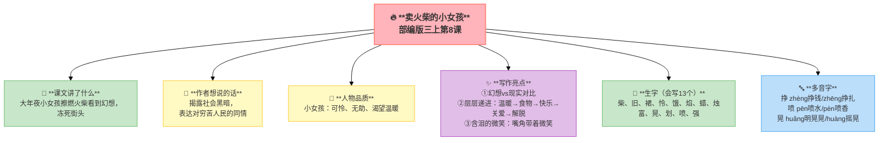
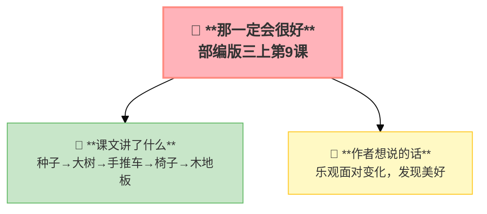
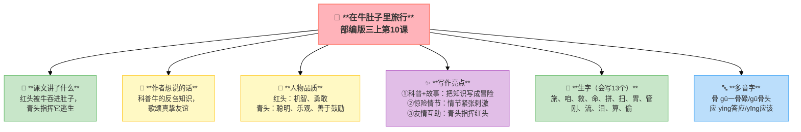
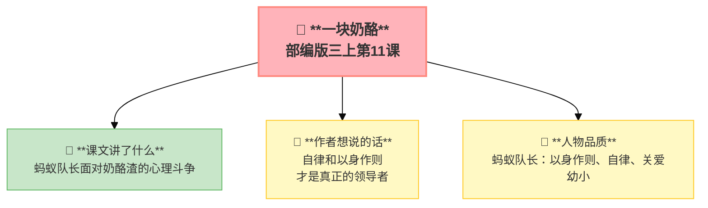

---
tags:
  - 三上
  - 语文
  - 童话
  - 安徒生
  - 想象
---

# 第三单元 · 童话世界

> 卖火柴的小女孩、一粒种子、两只蟋蟀、一块奶酪——童话里的世界真奇妙。
> **阅读重点**：感受童话丰富的想象
> **习作目标**：我来编童话

---

## 8 卖火柴的小女孩

> 部编版三上第8课，安徒生童话
> ⏰ 先读课文三遍，再往下看
> **阅读重点**：感受童话丰富的想象
> **习作目标**：我来编童话

---

### 📖 □核心 课文讲了什么

大年夜，一个小女孩在街上卖火柴，一根也没卖出去。她又冷又饿，擦燃火柴取暖——火光中看到火炉、烤鹅、圣诞树和奶奶。火柴熄灭，一切消失。第二天，人们发现冻死的小女孩，嘴角还带着微笑。

---

### 💬 □核心 作者想说的话

**大年夜，别的孩子在吃烤鹅，小女孩却在大街上卖火柴。每一次擦燃火柴，都是她最想要的东西——但火柴灭了，什么也没留下。**

---

### 👤 □了解 人物品质

| 人物 | 品质 |
|:-----|:-----|
| **小女孩** | 可怜、无助、渴望温暖和关爱 |

---

### ✨ □了解 写作亮点

| 序号 | 亮点 | 说明 |
|:-----|:-----|:-----|
| ① | **幻想vs现实对比** | 火光中美好，熄灭后残酷对比让故事更动人 |
| ② | **层层递进** | 温暖→食物→快乐→关爱→解脱幻想越来越深 |
| ③ | **含泪的微笑** | "嘴角还带着微笑"最美的画面最让人心碎 |

---

### 📝 □核心 生字（会写13个）

柴、旧、裙、怜、饿、焰、蜡、烛、富、晃、划、喷、强

---

### 🔤 □了解 多音字

| 字 | 读音 | 组词 |
|:--|:-----|:-----|
| **挣** | zhèng | 挣钱 |
| | zhēng | 挣扎 |
| **喷** | pēn | 喷水 |
| | pèn | 喷香 |
| **晃** | huǎng | 明晃晃 |
| | huàng | 摇晃 |

---

### 📚 □了解 词语积累

| 类别 | 词语 |
|:-----|:-----|
| **必会字词** | 蜷着腿、橱窗、奇异、闪烁、慈爱、灵魂、喷香 |
| **近义词** | 奇异——奇特、慈爱——慈祥、暖和——温暖 |
| **反义词** | 温暖——寒冷、幸福——痛苦、精致——粗糙 |

---

### 🏗️ □核心 文章结构：超清晰！

| 部分 | 自然段 | 内容 | 作用 |
|:-----|:-------|:-----|:-----|
| **第一部分 🎬** | 1-4 | 大年夜街头卖火柴（又冷又饿） | 交代背景 |
| **第二部分 🔥** | 5-9 | 五次擦燃火柴→五次幻想 | **重点段落**，幻想vs现实 |
| **第三部分 🌱** | 10-11 | 冻死街头，嘴角带微笑 | 悲剧结局 |

> **💡 写作要点**：用**幻想vs现实的对比**让故事更动人，用**层层递进**让情感逐步加深。

---

## ✨ 阅读与写作：深挖课文"宝藏"

### 0️⃣ □了解 原文对照仿写

| 课文原句 | 仿写练习 |
|:---------|:---------|
| "她知道这是最后一次了。她赶紧擦着了一大把火柴，要把奶奶留住。" | 仿写"最后一次"：写一个舍不得说再见的场景 |
| "谁也不知道她曾经看到过多么美丽的东西，她曾经多么幸福，跟着她奶奶一起走向新年的幸福中去。" | 仿写两个"幸福"：用同一个词写两种不同的含义 |

---

### 1️⃣ 五次擦燃火柴（第5-9自然段）—— 幻想描写

| 阅读要点 | 写法分析 | 写作小技巧 |
|:---------|:---------|:-----------|
| "大火炉→烤鹅→圣诞树→奶奶→飞走" 🔥 | 幻想越美好，现实越残酷 | 写幻想时要层层递进 |
| "谁也不知道她曾经多么幸福" 😢 | 两个"幸福"含义不同 | 用矛盾的词语制造情感冲击 |

---

## 📚 语言积累：词语库+句式库

### 1️⃣ 五次擦燃火柴表格

| 第几次 | 看到了什么 | 说明她渴望 |
|:------:|:-----------|:-----------|
| 1 | 大火炉 | 温暖 |
| 2 | 烤鹅 | 食物 |
| 3 | 圣诞树 | 快乐/节日 |
| 4 | 奶奶 | 关爱 |
| 5（一整把） | 和奶奶飞走 | 幸福/解脱 |

### 2️⃣ 重点句子

> "谁也不知道她曾经看到过多么美丽的东西，她曾经多么幸福，跟着她奶奶一起走向新年的幸福中去。"
> 
> 两个"幸福"——第一个是幻想中的幸福，第二个是死后的幸福。**含泪的微笑**。

---

---

## 📋 附录

## 📋 学习自评表（教-学-评一致性）✅

| 评价维度 | 我能做到（✅） | 需再练练（🔄） |
|:---------|:--------------|:---------------|
| **结构把握** | 能说出五次擦燃火柴的幻想内容 | |
| **语言运用** | 能正确读写13个生字，会用多音字 | |
| **朗读理解** | 能读出小女孩的可怜和幻想的美好 | |
| **思辨拓展** | 能说出两个"幸福"的含义，联系生活谈感受 | |

---

## 9* 那一定会很好（略读）

> 部编版三上第9课（略读课文）
> ⏰ 先读课文三遍，再往下看
> **阅读重点**：感受童话丰富的想象
> **习作目标**：我来编童话

---

### 📖 □核心 课文讲了什么

一粒种子变成了大树，它想跑一跑→被做成手推车，想休息→被做成椅子，想躺下→被拼成木地板。每次它都说："那一定会很好。"

---

### 💬 □核心 作者想说的话

**一粒种子从泥土里出发，一路变成大树、手推车、椅子，最后变成木地板。每一次变化，它都觉得"那一定会很好"。**

---

### 📚 □了解 词语积累

种子、变成、手推车、椅子、木地板、舒服

---

## 10 在牛肚子里旅行

> 部编版三上第10课
> ⏰ 先读课文三遍，再往下看
> **阅读重点**：感受童话丰富的想象
> **习作目标**：我来编童话

---

### 📖 □核心 课文讲了什么

两只小蟋蟀红头和青头是好朋友。红头不小心被牛吞进肚子里！它在牛嘴里→牛肚子里→又被牛反刍，最后被青头救出来。

---

### 💬 □核心 作者想说的话

**红头被牛吃进了肚子里！它在牛的胃里走了一圈——从嘴巴到肚子，再到第二个胃，最后又回到嘴里。**

---

### 👤 □了解 人物品质

| 人物 | 品质 |
|:-----|:-----|
| **红头** | 机智、勇敢、遇事冷静 |
| **青头** | 聪明、乐观、善于鼓励朋友 |

---

### ✨ □了解 写作亮点

| 序号 | 亮点 | 说明 |
|:-----|:-----|:-----|
| ① | **科普+故事** | 牛有四个胃、会反刍把知识写成冒险 |
| ② | **惊险情节** | 被吞下→在胃里→反刍→逃跑情节紧张刺激 |
| ③ | **友情互助** | 青头指挥红头友情让人感动 |

---

### 📝 □核心 生字（会写13个）

旅、咱、救、命、拼、扫、胃、管、刚、流、泪、算、偷

---

### 🔤 □了解 多音字

| 字 | 读音 | 组词 |
|:--|:-----|:-----|
| **骨** | gū | 一骨碌 |
| | gǔ | 骨头 |
| **应** | yìng | 答应 |
| | yīng | 应该 |

---

### 📚 □了解 词语积累

| 类别 | 词语 |
|:-----|:-----|
| **必会字词** | 旅行、偷偷、细嚼慢咽、贮藏、悲哀、一骨碌 |
| **近义词** | 贮藏——储存、悲哀——悲伤、勇敢——英勇 |
| **反义词** | 悲哀——高兴、偷偷——公开、勇敢——胆小 |

---

### 🏗️ □核心 文章结构：超清晰！

| 部分 | 自然段 | 内容 | 作用 |
|:-----|:-------|:-----|:-----|
| **第一部分 🎬** | 1-7 | 红头和青头玩耍 | 交代背景 |
| **第二部分 🔥** | 8-20 | 红头被牛吃掉，青头指挥逃脱 | **重点段落**，惊险情节 |
| **第三部分 🌱** | 21 | 红头被救出 | 圆满结局 |

> **💡 写作要点**：用**科普+故事**让知识变得有趣，用**对话**推动情节发展。

---

## ✨ 阅读与写作：深挖课文"宝藏"

### 0️⃣ □了解 原文对照仿写

| 课文原句 | 仿写练习 |
|:---------|:---------|
| "红头在牛肚子里随着草一起移动，从第一个胃到了第二个胃，又从第二个胃回到了嘴里。" | 仿写"路线"：用"从……到了……又……"写一个旅行路线 |
| "青头大吃一惊，它一下子蹦到牛身上，可是那头牛用尾巴轻轻一扫，青头就给摔到地上了。" | 仿写"紧张时刻"：用动作描写写一个紧急时刻 |

---

### 1️⃣ 科普知识（第13-15自然段）—— 知识融入故事

| 阅读要点 | 写法分析 | 写作小技巧 |
|:---------|:---------|:-----------|
| "牛有四个胃，用来贮藏食物" 🐄 | 把知识写成冒险故事 | 写科普童话时要把知识融入情节 |

### 2️⃣ 对话推动情节（第8-20自然段）—— 语言描写

| 阅读要点 | 写法分析 | 写作小技巧 |
|:---------|:---------|:-----------|
| "青头大叫：'躲过它的牙齿！'" 🗣️ | 用对话推动情节发展 | 写故事时多用对话让情节更紧凑 |

---

## 📚 语言积累：词语库+句式库

> "红头在牛肚子里随着草一起移动，从第一个胃到了第二个胃，又从第二个胃回到了嘴里。"
> 
> 科学知识融入故事，让读者在惊险中学习。

---

## 📋 学习自评表（教-学-评一致性）✅

| 评价维度 | 我能做到（✅） | 需再练练（🔄） |
|:---------|:--------------|:---------------|
| **结构把握** | 能说出红头在牛肚子里的旅行路线 | |
| **语言运用** | 能正确读写13个生字，会用多音字 | |
| **朗读理解** | 能读出红头的惊险和青头的机智 | |
| **思辨拓展** | 能说出"反刍"是什么意思，说出科普童话的特点 | |

---

## 11* 一块奶酪（略读）

> 部编版三上第11课（略读课文）
> ⏰ 先读课文三遍，再往下看
> **阅读重点**：感受童话丰富的想象
> **习作目标**：我来编童话

---

### 📖 □核心 课文讲了什么

蚂蚁队长带领蚂蚁们搬运一块大奶酪。掉下来的一小块奶酪渣，它想吃，但想到自己是队长，最终让小蚂蚁吃掉了。

---

### 💬 □核心 作者想说的话

**一块奶酪掉在地上，蚂蚁队长犹豫了——是捡起来吃掉，还是留给其他蚂蚁？**

---

### 👤 □了解 人物品质

| 人物 | 品质 |
|:-----|:-----|
| **蚂蚁队长** | 以身作则、自律、关爱幼小 |

---

### 📚 □了解 词语积累

奶酪、集合、搬运、毅力、诱惑、嘀咕

---

## ✍️ 习作：我来编童话

### 🎯 □核心 目标
用几个给定的角色和场景，编写一个完整的童话故事。

### 🧩 童话三要素

| 要素 | 是什么 | 怎么写 |
|:-----|:-------|:-------|
| **角色** | 国王、啄木鸟、玫瑰花…… | 给角色一个性格（骄傲的/善良的/懒惰的） |
| **场景** | 黄昏的小河边、冬天的森林里 | 用环境描写渲染氛围 |
| **情节** | 发生了什么事 | 开头→波折→解决→结局 |

### 📐 □了解 写作框架

1. **开头**：交代角色和时间地点
2. **冲突**：遇到一个问题
3. **经过**：角色做了什么
4. **结局**：问题解决了，有所感悟

### 🧩 童话魔法词库

| 时间 | 地点 | 角色 | 魔法词 |
|:-----|:-----|:-----|:-------|
| 从前、有一天、黄昏、清晨、冬天 | 森林、城堡、河边、山洞、小院 | 国王、公主、王子、动物、精灵、仙女 | 突然、神奇地、不可思议、从此、终于 |

### 🔍 结构拆解（用颜色标出句子功能）

| 句子 | 功能 |
|:-----|:-----|
| 例：春天，小河边开了一朵美丽的玫瑰花。 | 开头——交代角色和场景 |
| 例："我是世界上最美的花！" | 中间——角色性格（骄傲） |
| 例：旁边的野草紧紧地拉住她："别怕，有我们呢！" | 转折——遇到困难，获得帮助 |
| 例：从此，她再也不骄傲了。 | 结尾——角色成长，悟出道理 |

### 📝 □了解 范文

> 这是参考，不是标准。孩子写不一样的方向也很好。

> **骄傲的玫瑰花**
>
> 春天，小河边开了一朵美丽的玫瑰花。她红得像火，香得醉人。
>
> "我是世界上最美的花！"她昂着头，不理身边的野草，也不理飞舞的蝴蝶。
>
> 一天夜里，狂风大作。玫瑰花被吹得东倒西歪，她害怕极了。旁边的野草紧紧地拉住她："别怕，有我们呢！"
>
> 玫瑰花羞愧地低下了头。从此，她再也不骄傲了，和小草成了最好的朋友。

> **会飞的蚂蚁**
>
> 从前，有一只小蚂蚁叫豆豆。它每天都要搬粮食，累得满头大汗。
>
> "要是我能飞就好了，"豆豆叹了口气，"就不用天天搬东西了。"
>
> 一只蜻蜓听到了，说："你爬到我的背上，我带你去天上看看。"
>
> 豆豆高兴地爬上蜻蜓的背。蜻蜓一飞冲天——豆豆低头一看，地上的小草像一片绿色的海洋，蚂蚁洞像一个黑黑的小点。它开心得大喊："我飞起来啦！"
>
> 蜻蜓把豆豆送回家。豆豆再也不抱怨搬粮食了——因为它知道，每个小蚂蚁都有自己的本事，飞不是它该做的事，搬粮食才是。

### ✍️ 童话写作技巧
1. **拟人**：让动物/植物会说话、有感情
2. **重复**：三次结构（三次尝试、三个问题）
3. **转折**：骄傲的→变谦虚了，懒惰的→变勤快了
4. **道理**：故事最后自然带出一个道理

### ⚠️ □了解 常见问题
1. ❌ 情节太简单（没有波折） → ✅ 加点困难/冲突让故事有起伏
2. ❌ 道理是硬贴上去的 → ✅ 让故事本身说明道理

### 📝 □了解 同学初稿 vs 修改稿

**初稿**

> 啄木鸟开了一家森林超市。小兔子来买胡萝卜，啄木鸟卖给了它。小猴子来买香蕉，啄木鸟卖给了它。大家都很开心。

**问题**：没有冲突，流水账。

**修改稿**

> 啄木鸟开了一家森林超市。第一天，小兔子来买胡萝卜："我买三根！"啄木鸟称了称："一根胡萝卜一个森林币。"小兔子付了钱，蹦蹦跳跳地走了。
>
> 第二天，小狐狸来了。它指着蜂蜜问："这个怎么卖？"啄木鸟说："三叶草币一罐。"小狐狸眼珠一转："太贵了，两枚！"啄木鸟摇摇头。小狐狸只好付了钱，临走时偷偷把一罐蜂蜜藏进了帽子……
>
> 啄木鸟叫住了它："小狐狸，你头上怎么在滴蜂蜜？"
>
> 小狐狸脸红了，乖乖付了钱。从此，谁也不敢在森林超市里耍花招了。

**改动**：加了对话、细节，最重要的是加了**冲突**（小狐狸偷东西），故事就有起伏了。

---

## ❓ 关联性问题

1. 课文中出现的"反复结构"（三问三答），在生活中你见过类似的例子吗？
2. 如果卖火柴的小女孩来到现代，你觉得社会会怎么帮助她？
3. 读了四篇童话，你觉得童话和现实生活最大的区别是什么？

---

## 🔗 跨文本对比：四篇童话怎么"写奇妙"

本单元四篇课文都是童话，但主题和写法各不相同：

| 对比维度 | 8 卖火柴的小女孩 | 9 那一定会很好 | 10 在牛肚子里旅行 | 11 一块奶酪 |
|:---------|:----------------|:--------------|:----------------|:-----------|
| **主题** | 同情苦难 | 生命态度 | 科普知识 | 纪律品德 |
| **主角** | 小女孩 | 种子 | 两只蟋蟀 | 蚂蚁队长 |
| **写作手法** | 幻想与现实交织 | 拟人+生命循环 | 科普融入故事 | 通过细节写品质 |
| **情感色彩** | 悲惨→含泪微笑 | 乐观→积极面对 | 惊险→友谊可贵 | 纠结→自律可贵 |
| **是"真实"的吗** | ❌ 虚构童话 | ❌ 拟人童话 | ❌ 科普童话 | ❌ 寓言式童话 |

💡 **阅读启示**：同样是童话，可以写悲惨让人同情（卖火柴的小女孩），可以写乐观让人积极（那一定会很好），可以写知识让人长见识（在牛肚子里旅行），也可以写道理让人思考（一块奶酪）。写童话时，先想好你要表达什么。

---

## 📚 课外书吧

- 安徒生童话《丑小鸭》《拇指姑娘》
- 格林童话《青蛙王子》《灰姑娘》

---

## 🗣️ 语文生活

用"如果___会说话"开头，编一分钟童话故事。

---

## 🔄 老朋友回来啦

本单元我们又学到了很多新词，但别忘了之前学过的老朋友——翻翻前面的单元，说说下面这些词在这篇课文里有什么用：

| 老朋友 | 来自 | 用在这里…… |
|:-------|:-----|:-----------|
| **温暖** | 第一单元《大青树下的小学》 | 小女孩幻想中的大火炉给她——温暖 |
| **幸福** | 第二单元《铺满金色巴掌的水泥道》 | 两个"幸福"让你对这篇课文的感受是——？ |

✅ ⬛⬛ 阅读纵向衔接：

| 老朋友 | 出自 | 再认读 |
|:-------|:-----|:-------|
| **感受童话丰富的想象** | 二下《大象的耳朵》《蜘蛛开店》等童话故事 | 本单元是第一个系统童话单元→"感受童话丰富的想象"→三下"走进想象的世界"→四上"感受神话神奇的想象" |
---

## 🌐 三通

1. 童话和真实故事有什么不同？
2. 牛为什么有四个胃？（科学链接：反刍）
3. 如果你来改写卖火柴的小女孩的结局，你会怎么写？

---

## 📎 拓展
- 延展阅读：安徒生童话《丑小鸭》《拇指姑娘》
- 语文园地三：交流平台（童话的特点）＋ 词句段运用

---

## 📖 语文园地

## □核心 交流平台

- 童话里什么都可能发生：动物会说话、植物会走路、物品有感情
- 读童话时要大胆想象，把自己放进故事里去感受
- 注意童话里反复出现的情节和句式，它们往往藏着作者的巧思

---

## □核心 词句段运用

- 给词语编童话：国王、黄昏、厨房 → ______
- 照样子写童话句式："她在_____的时候，_____地_____着……"
- 用"一边……一边……"写童话里的小动物

---

## □核心 日积月累

**关于想象的谚语**

- 心有多大，舞台就有多大。
- 想象是灵魂的眼睛。
- 世上只有想不到的事，没有做不到的事。
- 没有大胆的想象，就没有伟大的发现。

---

## ✏️ 我的发现（留白）

> 读完这个单元，我最想记下来的是：

___________________________________________

___________________________________________

> 我同桌的发现：

___________________________________________

