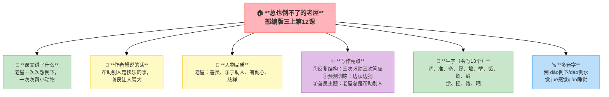
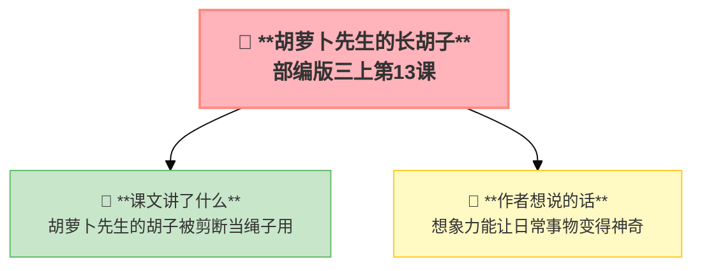
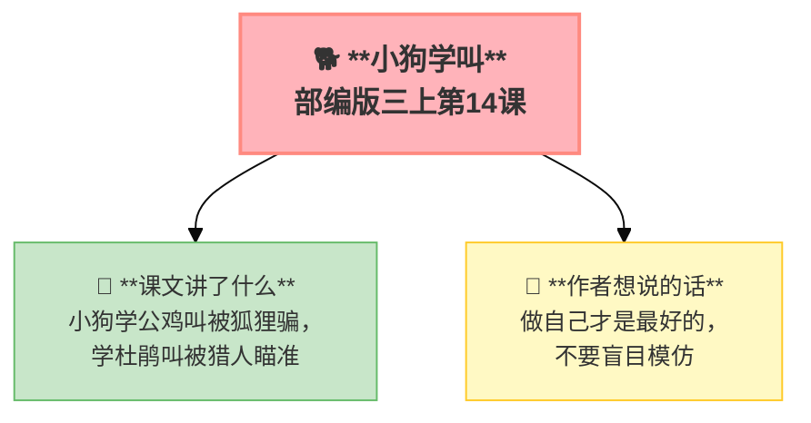

---
tags:
  - 三上
  - 语文
  - 预测策略
  - 阅读方法
  - 续写
---

# 第四单元 · 预测策略

> 一边读一边猜——接下来会发生什么？这是阅读的策略单元。
> **阅读重点**：一边读一边预测，顺着故事情节去猜想
> **习作目标**：续写故事

---

## 12 总也倒不了的老屋

> 部编版三上第12课
> ⏰ 先读课文三遍，再往下看
> **阅读重点**：一边读一边预测，顺着故事情节去猜想
> **习作目标**：续写故事

---

### 📖 □核心 课文讲了什么

老屋已经活了100多年，想倒下休息了。但每次要倒，就有小动物来求助——小猫躲暴风雨、老母鸡孵小鸡、蜘蛛织网。老屋一次次说"好吧，我就再站一会儿"……

---

### 💬 □核心 作者想说的话

**老屋已经活了一百多岁，窗户变成了黑窟窿，门板也破了。它正要倒下，小动物们一个个来求助……**

---

### 👤 □了解 人物品质

| 人物 | 品质 |
|:-----|:-----|
| **老屋** | 善良、乐于助人、有耐心、慈祥 |

---

### ✨ □了解 写作亮点

| 序号 | 亮点 | 说明 |
|:-----|:-----|:-----|
| ① | **反复结构** | 三次求助三次答应重复推进情节 |
| ② | **预测训练** | 读到小猫求助→猜老屋会不会答应边读边猜 |
| ③ | **善良主题** | 老屋总是帮助别人善良让人感动 |

---

### 📝 □核心 生字（会写13个）

洞、准、备、暴、墙、壁、饿、蜘、蛛、漂、撞、饱、晒

---

### 🔤 □了解 多音字

| 字 | 读音 | 组词 |
|:--|:-----|:-----|
| **倒** | dǎo | 倒下 |
| | dào | 倒水 |
| **觉** | jué | 感觉 |
| | jiào | 睡觉 |

---

### 📚 □了解 词语积累

| 类别 | 词语 |
|:-----|:-----|
| **必会字词** | 暴风雨、安心、偶尔、使劲、喵喵、叽叽、准备 |
| **近义词** | 偶尔——有时、安心——放心、使劲——用劲 |
| **反义词** | 偶尔——经常、安心——担心、漂亮——丑陋 |

---

### 🏗️ □核心 文章结构：超清晰！

| 部分 | 自然段 | 内容 | 作用 |
|:-----|:-------|:-----|:-----|
| **第一部分 🎬** | 1-2 | 老屋活了100多年，想倒下 | 交代背景 |
| **第二部分 🔥** | 3-9 | 小猫来求助→老母鸡来求助→蜘蛛来求助 | **重点段落**，反复结构 |
| **第三部分 🌱** | 10 | 老屋一直站着，总也倒不了 | 升华主题 |

> **💡 写作要点**：用**反复结构**推进情节，每次都是"要倒下→来求助→再站一会儿"。

---

## ✨ 阅读与写作：深挖课文"宝藏"

### 0️⃣ □了解 原文对照仿写

| 课文原句 | 仿写练习 |
|:---------|:---------|
| "好了，我到了倒下的时候了！" | 仿写"反复"：写一个角色三次说同一句话，每次引出新故事 |
| "等等，老屋！"一个小小的声音在它前面响起，"再过一个晚上，行吗？" | 仿写"求助"：用"等等……！再……，行吗？"写一个请求的句子 |

---

### 1️⃣ 反复结构（第3-9自然段）—— 情节推进

| 阅读要点 | 写法分析 | 写作小技巧 |
|:---------|:---------|:-----------|
| "好了，我到了倒下的时候了" 🏠 | 每次都说同样的话，有节奏感 | 写故事时可以用反复结构 |
| "好吧，我就再站一会儿" 💪 | 老屋每次都答应帮助 | 用重复的句式推进情节 |

### 2️⃣ 预测方法训练（贯穿全文）—— 阅读策略

| 预测方法 | 例子 | 写作小技巧 |
|:---------|:---------|:-----------|
| 根据**题目**预测 | "总也倒不了"→肯定有原因 | 题目能暗示故事内容 |
| 根据**插图**预测 | 图上老屋笑眯眯的→它可能不讨厌帮助别人 | 插图能帮助理解 |
| 根据**生活经验**预测 | 老屋像慈祥的爷爷奶奶→不会拒绝帮忙 | 联系生活理解故事 |
| 根据**故事情节**预测 | 反复结构→下一个动物还会来求助 | 情节能帮助预测 |
| 根据**阅读经验**预测 | 童话里善良的角色总有好报 | 多读书积累经验 |

---

## 📚 语言积累：词语库+句式库

> "老屋已经活了一百多岁了，它的窗户变成了黑窟窿，门板也破了洞。"
> 
> 用具体的事物写出老屋的古老。

---

---

## 📋 附录

## 📋 学习自评表（教-学-评一致性）✅

| 评价维度 | 我能做到（✅） | 需再练练（🔄） |
|:---------|:--------------|:---------------|
| **结构把握** | 能说出三次求助的反复结构 | |
| **语言运用** | 能正确读写13个生字，会用多音字 | |
| **朗读理解** | 能读出老屋的善良 | |
| **思辨拓展** | 能根据线索预测情节，说出五种预测方法 | |

---

## 13* 胡萝卜先生的长胡子（略读）

> 部编版三上第13课（略读课文）
> ⏰ 先读课文三遍，再往下看
> **阅读重点**：一边读一边预测，顺着故事情节去猜想
> **习作目标**：续写故事

---

### 📖 □核心 课文讲了什么

胡萝卜先生漏刮了一根胡子，这根胡子吸收了果酱后飞快地长。小男孩剪了一段放风筝，鸟太太剪了一段晾尿布……胡萝卜先生自己完全不知道！

---

### 💬 □核心 作者想说的话

**一根胡子沾了果酱，越长越长。它飘过大街，被风筝线看到了，被鸟太太看到了……**

---

### 📚 □了解 词语积累

胡萝卜、发愁、沾到、果酱、飘动

---

## 14* 小狗学叫（略读）

> 部编版三上第14课（略读课文）
> ⏰ 先读课文三遍，再往下看
> **阅读重点**：一边读一边预测，顺着故事情节去猜想
> **习作目标**：续写故事

---

### 📖 □核心 课文讲了什么

一只小狗不知道自己怎么叫。它先学公鸡叫——被狐狸骗去抓鸡。又学杜鹃叫——被猎人瞄准。它还是没学会狗叫，但遇到了一个更奇特的同伴……

---

### 💬 □核心 作者想说的话

**一只不会叫的狗，它决定学叫。先学了公鸡叫，又学了杜鹃叫——但每次学都闹了笑话。**

---

### 📚 □了解 词语积累

小狗、学叫、公鸡、杜鹃、狐狸、猎人

---

## ✍️ 习作：续写故事

### 🎯 □核心 目标
根据给的图片或故事开头，继续把故事写完整。

### 🧩 续写三原则

| 原则 | 解释 |
|:-----|:-----|
| **接得上** | 情节和原文一致 |
| **有波折** | 要有点困难或转折 |
| **要完整** | 有头有尾 |

### 📐 □了解 写作框架（以课本为例）

**图片**：同学们讨论过生日 → 李晓明快过生日了但爸妈不在家

**续写思路**：

1. **开头**（接图片）：同学们发现李晓明的不开心
2. **策划**：大家悄悄商量给他一个惊喜
3. **经过**：准备生日会的过程（买蛋糕、布置教室、藏礼物）
4. **高潮**：李晓明推开教室门的一刻
5. **结局**：李晓明的反应 + 大家的感受

### 🔍 结构拆解（用颜色标出句子功能）

| 句子 | 功能 |
|:-----|:-----|
| 例：放学后，班长把大家留下来开了一个"秘密会议"。 | 开头——接上文，引出策划 |
| 例："李晓明的爸爸妈妈在外地工作，我们帮他过一个特别的生日吧！" | 中间——对话推动情节 |
| 例：他推开门的一瞬间，大家跳出来齐声喊："生日快乐！" | 高潮——最精彩的一刻 |
| 例：原来给别人带来快乐，自己也会加倍快乐。 | 结尾——写出感悟 |

### 📝 □了解 范文片段

> 这是参考，不是标准。孩子写不一样的方向也很好。

> 放学后，班长把大家留下来开了一个"秘密会议"。
>
> "李晓明的爸爸妈妈在外地工作，我们帮他过一个特别的生日吧！"大家纷纷点头。
>
> 生日那天，我们提前到教室吹气球、画黑板。小丽带来了自己做的贺卡，小刚用零花钱买了小蛋糕。一切准备就绪，我们藏在桌子底下，等着李晓明进来。
>
> 他推开门的一瞬间，大家跳出来齐声喊："生日快乐！"
>
> 李晓明愣住了，眼眶一下子红了。他深深地鞠了一躬："谢谢大家，这是我过得最开心的生日！"
>
> 那一天，我们都很高兴——原来给别人带来快乐，自己也会加倍快乐。

### ⚠️ □了解 常见问题
1. ❌ 和原故事没有关系 → ✅ 保持角色和设定一致
2. ❌ 一下子跳到结尾 → ✅ 写清过程
3. ❌ 语言不够生动 → ✅ 加对话和心理活动

### 📝 □了解 同学初稿 vs 修改稿

**初稿**

> 李晓明的生日快到了，同学们决定给他一个惊喜。大家买了蛋糕，布置了教室。李晓明来了，他很开心。生日会结束了，大家回家了。

**问题**：太平淡，没有波折，像流水账。

**修改稿**

> 李晓明的生日快到了，同学们决定给他一个惊喜。
>
> "我负责买蛋糕！"小刚举手。
>
> "我来画黑板报！"小丽抢着说。
>
> 一切准备就绪。可就在生日前一天，出事了——班长发现教室钥匙不见了！
>
> "糟糕，明天进不了教室怎么办？"大家急得团团转。
>
> 小军一拍脑袋："我有办法！我去找王老师借备用钥匙。"
>
> 大家这才松了一口气。
>
> 生日那天，李晓明推开教室门，看到满屋子的气球和彩带，听到大家齐声喊"生日快乐"，他愣住了。他摸了摸桌上的贺卡，眼眶红了："谢谢……谢谢你们。"

**改动**：加了**波折**（钥匙丢了→想办法解决），故事就有了起伏。读者会想"钥匙能找到吗"——这就是预测！

---

## ❓ 关联性问题

1. 预测这种阅读方法在其他课（数学/科学）中用得上吗？
2. 老屋为什么"总也倒不了"？让你想到了生活中的谁？
3. 你有过"胡萝卜先生的长胡子"那样意外的发现吗？

---

## 🔄 跨文本对比：预测策略

| 对比维度 | 12 总也倒不了的老屋 | 13 胡萝卜先生的长胡子 | 14 小狗学叫 |
|:---------|:--------------------|:---------------------|:------------|
| 主角 | 老屋+小动物们 | 胡萝卜先生+小动物 | 一只不会叫的小狗 |
| 预测点1 | 老屋这次会倒下吗？ | 胡子还会遇到谁？ | 小狗这次能学会吗？ |
| 预测点2 | 下一个小动物是谁？ | 胡子会被用来做什么？ | 谁会来教它？ |
| 预测线索 | "好吧，我再到站一天" | 胡子不断变长 | 小狗一次次失败 |
| 结局 | 老屋一直没倒下 | 胡子帮了很多人 | 开放式三种结局 |

💡 **阅读启示**：预测不是瞎猜，要根据文中线索（伏笔）+自己的经验来推断。阅读时多问"接下来会发生什么？"，读完后验证预测——这就是主动阅读。

---

## 📚 课外书吧

- 《爷爷一定有办法》菲比·吉尔曼
- 《7号梦工厂》大卫·威斯纳

---

## 🗣️ 语文生活

给同学讲一半故事，停在关键处让大家预测结局。

---

## 🔄 老朋友回来啦

本单元我们又学到了很多新词，但别忘了之前学过的老朋友——翻翻前面的单元，说说下面这些词在这篇课文里有什么用：

| 老朋友 | 来自 | 用在这里…… |
|:-------|:-----|:-----------|
| **准备** | 第三单元《那一定会很好》 | 老屋一次次"准备"倒下，却一次次推迟——准备行动和没行动之间差了什么呢？ |
| **故事** | 第一单元《大青树下的小学》 | 预测策略就是边读边猜"故事"接下来会怎样——你猜对了几次？ |

✅ ⬛⬛ 阅读纵向衔接：

| 老朋友 | 出自 | 再认读 |
|:-------|:-----|:-------|
| **预测阅读策略** | 本单元首次系统学习阅读策略 | 三上预测→四上提问→五上提高阅读速度→六上有目的地阅读，策略能力螺旋上升 |
---

## 🌐 三通

1. 预测这种阅读方法在其他课（数学/科学）中用得上吗？
2. 老屋为什么"总也倒不了"？让你想到了生活中的谁？
3. 你有过"胡萝卜先生的长胡子"那样意外的发现吗？

---

## 📎 拓展
- 推荐阅读：预测类绘本（《爷爷一定有办法》《7号梦工厂》）
- 口语交际：名字里的故事（预测自己名字的含义）
- 语文园地四：交流平台（预测策略总结）

---

## 📖 语文园地

## □核心 交流平台

- 预测不是瞎猜，是根据题目、插图、情节线索来猜
- 读到开头猜结尾，读到上一个情节猜下一个——边读边猜让阅读更有趣
- 预测对了很有成就感，预测错了也没关系，说明作者的设计出乎意料

---

## □核心 词句段运用

- "吱呀""哗啦""咚咚"——读读这些拟声词，猜猜它们在说什么故事
- 用"因为……所以……"练习推测：因为______，所以他一定会______
- 给一个故事开头，预测三种不同的结局

---

## □核心 日积月累

**关于阅读与思考的名言**

- 学而不思则罔，思而不学则殆。——《论语》
- 读书而不思考，等于吃饭而不消化。
- 猜测是思考的开始。
- 好问的人，只做了五分钟的愚人；耻于发问的人，终身为愚人。

---

## ✏️ 我的发现（留白）

> 读完这个单元，我最想记下来的是：

___________________________________________

___________________________________________

> 我同桌的发现：

___________________________________________
