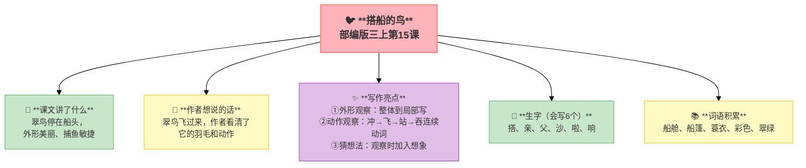
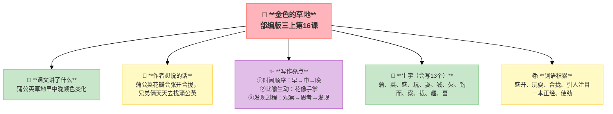

---
tags:
  - 三上
  - 语文
  - 观察
  - 习作单元
  - 写作方法
---

# 第五单元 · 观察（习作单元）

> 本单元是**习作单元**——以写作为核心，阅读为写作服务。
> **阅读重点**：体会作者是怎样细致观察的
> **习作目标**：我们眼中的缤纷世界（观察写作）

---

## 15 搭船的鸟

> 部编版三上第15课（习作单元精读课文）
> ⏰ 先读课文三遍，再往下看
> **阅读重点**：体会作者是怎样细致观察的
> **习作目标**：我们眼中的缤纷世界（观察写作）



---

### 📖 □核心 课文讲了什么

"我"和母亲坐船去外祖父家，一只翠鸟停在船头——彩色的羽毛、红色的长嘴、敏捷地捕鱼。它搭我们的船，是在赶路找吃的吗？

---

### 💬 □核心 作者想说的话

**翠鸟飞过来的时候，作者正在船上。它一下子就冲进水里，又一下子飞起来——嘴里衔着一条小鱼。就这么一瞬间，作者看清了它的羽毛、它的动作。**

---

### ✨ □了解 写作亮点

| 序号 | 亮点 | 说明 |
|:-----|:-----|:-----|
| ① | **外形观察** | 翠绿羽毛＋蓝色翅膀＋红色长嘴从整体到局部按顺序写 |
| ② | **动作观察** | 冲→飞→站→吞用动词写连续动作 |
| ③ | **猜想法** | "它要干什么呢？"观察时加入想象 |

---

### 📝 □核心 生字（会写6个）

搭、亲、父、沙、啦、响

---

### 📚 □了解 词语积累

| 类别 | 词语 |
|:-----|:-----|
| **必会字词** | 船舱、船篷、蓑衣、彩色、翠绿 |
| **近义词** | 彩色——五彩、翠绿——碧绿、漂亮——美丽 |
| **反义词** | 翠绿——枯黄、美丽——丑陋、静——动 |

---

### 🏗️ □核心 文章结构：超清晰！

| 部分 | 自然段 | 内容 | 作用 |
|:-----|:-------|:-----|:-----|
| **第一部分 🎬** | 1 | 坐船去外祖父家 | 交代背景 |
| **第二部分 🔥** | 2-3 | 翠鸟停在船头（外形描写） | **重点段落**，静态观察 |
| **第三部分 🌱** | 4-5 | 翠鸟捕鱼（动作描写） | 动态观察 |
| **第四部分 🌱** | 6 | "我"的疑问 | 引发思考 |

> **💡 写作要点**：用**从整体到局部**的顺序写外形，用**连续动词**写动作。

---

## ✨ 阅读与写作：深挖课文"宝藏"

### 0️⃣ □了解 原文对照仿写

| 课文原句 | 仿写练习 |
|:---------|:---------|
| "它的羽毛是翠绿的，翅膀带着一些蓝色，比鹦鹉还漂亮。" | 仿写一种动物外形：___的羽毛/皮毛是___的，___带着一些___，比___还___。 |
| "它一下子冲进水里……没一会儿，它飞起来了……一口把小鱼吞了下去。" | 仿写一个动作过程：___一下子___进___，___。没一会儿，它___了，___了一口把___。 |

### 1️⃣ 外形观察（第2自然段）—— 静态描写

| 阅读要点 | 写法分析 | 写作小技巧 |
|:---------|:---------|:-----------|
| "它的羽毛是翠绿的，翅膀带着一些蓝色" 🎨 | 从整体到局部：羽毛→翅膀→嘴 | 写外形要按顺序 |
| "比鹦鹉还漂亮" ✨ | 用比较突出特点 | 可以用比较突出特点 |

### 2️⃣ 动作观察（第4自然段）—— 动态描写

| 阅读要点 | 写法分析 | 写作小技巧 |
|:---------|:---------|:-----------|
| "它一下子冲进水里" 💨 | 用"冲"写出速度 | 用准确的动词 |
| "飞起来了→衔着→站在→吞了下去" 🐦 | 连续动词写出动作过程 | 用连续动词写动作 |

---

## 📚 语言积累：词语库+句式库

> "它一下子冲进水里，不见了。可是，没一会儿，它飞起来了，红色的长嘴里衔着一条小鱼。它站在船头，一口把小鱼吞了下去。"
> 
> 用"冲→飞→站→吞"四个动词写出翠鸟捕鱼的过程。

---

---

## 📋 附录

## 📋 学习自评表（教-学-评一致性）✅

| 评价维度 | 我能做到（✅） | 需再练练（🔄） |
|:---------|:--------------|:---------------|
| **结构把握** | 能说出课文写了翠鸟的外形和动作 | |
| **语言运用** | 能正确读写6个生字，会用连续动词写句子 | |
| **朗读理解** | 能读出翠鸟的漂亮和敏捷 | |
| **思辨拓展** | 能说出观察要细致，按顺序写 | |

---

## 16 金色的草地

> 部编版三上第16课（习作单元精读课文）
> ⏰ 先读课文三遍，再往下看
> **阅读重点**：体会作者是怎样细致观察的
> **习作目标**：我们眼中的缤纷世界（观察写作）



---

### 📖 □核心 课文讲了什么

"我"家窗前有一片蒲公英草地。早上花瓣合拢，草地是绿色的；中午花瓣张开，草地变成金色；傍晚花瓣再合拢，草地又绿了。

---

### 💬 □核心 作者想说的话

**蒲公英的花瓣会张开也会合拢。早上是金色的，中午变成绿色，傍晚又变回金色。兄弟俩发现这个秘密后，天天去草地上找蒲公英。**

---

### ✨ □了解 写作亮点

| 序号 | 亮点 | 说明 |
|:-----|:-----|:-----|
| ① | **时间顺序** | 早→中→晚三次变化按时间顺序写变化 |
| ② | **比喻生动** | "花像手掌"用熟悉事物解释现象 |
| ③ | **发现过程** | 观察→思考→发现写出观察的过程 |

---

### 📝 □核心 生字（会写13个）

蒲、英、盛、玩、耍、喊、欠、钓、而、察、拢、趣、喜

---

### 📚 □了解 词语积累

| 类别 | 词语 |
|:-----|:-----|
| **必会字词** | 盛开、玩耍、合拢、引人注目、一本正经、使劲 |
| **近义词** | 盛开——绽放、玩耍——嬉戏、一本正经——郑重其事 |
| **反义词** | 合拢——张开、盛开——凋谢、引人注目——默默无闻 |

---

### 🏗️ □核心 文章结构：超清晰！

| 部分 | 自然段 | 内容 | 作用 |
|:-----|:-------|:-----|:-----|
| **第一部分 🎬** | 1-2 | 发现现象：草地会变色（绿→金→绿） | 交代起因 |
| **第二部分 🔥** | 3-4 | 寻找原因：观察蒲公英的花 | **重点段落**，发现秘密 |
| **第三部分 🌱** | 5 | 得出结论：草地变色的原因 | 总结全文 |

> **💡 写作要点**：用**时间顺序**写变化，用**比喻**解释现象。

---

## ✨ 阅读与写作：深挖课文"宝藏"

### 0️⃣ □了解 原文对照仿写

| 课文原句 | 仿写练习 |
|:---------|:---------|
| "原来，蒲公英的花就像我们的手掌，可以张开、合上。" | 仿写比喻：原来，___的___就像___，可以___、___。 |
| "早上…草地是绿色的；中午…草地是金色的；傍晚…草地又变绿了。" | 仿写时间变化：早上…___是___的；中午…___是___的；傍晚…___又___了。 |

### 1️⃣ 时间顺序观察（第3-4自然段）—— 持续观察

| 阅读要点 | 写法分析 | 写作小技巧 |
|:---------|:---------|:-----------|
| "早上→中午→傍晚" ⏰ | 按时间顺序写三次变化 | 写变化要按时间顺序 |
| "蒲公英的花就像我们的手掌" 🌿 | 用比喻解释现象 | 用熟悉事物解释不熟悉的现象 |

### 2️⃣ 发现过程（第4自然段）—— 思考观察

| 阅读要点 | 写法分析 | 写作小技巧 |
|:---------|:---------|:-----------|
| "原来，蒲公英的花就像我们的手掌" 💡 | 观察→思考→发现 | 写观察要写出思考过程 |

---

## 📚 语言积累：词语库+句式库

> "原来，蒲公英的花就像我们的手掌，可以张开、合上。"
> 
> 用比喻解释现象，让读者容易理解。

---

## 📋 学习自评表（教-学-评一致性）✅

| 评价维度 | 我能做到（✅） | 需再练练（🔄） |
|:---------|:--------------|:---------------|
| **结构把握** | 能说出草地变色的原因 | |
| **语言运用** | 能正确读写13个生字，会用比喻句 | |
| **朗读理解** | 能读出发现的惊喜 | |
| **思辨拓展** | 能用自己的话解释草地变色的原因，说出观察的两个层次 | |

---

### 💡 观察的两个层次

1. **看一看就写**（观察外表）→ 翠鸟的颜色、形状
2. **持续观察发现变化**（观察过程）→ 蒲公英一天的变化

---

## ✍️ 习作：我们眼中的缤纷世界

### 🎯 □核心 目标
选择一种事物或一处场景，仔细观察后写下来。

### 📐 本单元学的观察方法

```
观察方法
├── 静态观察（翠鸟外形）
│   ├── 颜色（翠绿、蓝色、红色）
│   └── 形状（长嘴、彩色羽毛）
└── 动态观察（蒲公英变化）
    ├── 不同时间（早→中→晚）
    └── 不同状态（合拢→张开→合拢）
```

### 🧩 选材指南

| 类型 | 可以写什么 |
|:-----|:-----------|
| **动物** | 小区里的猫、鱼缸里的金鱼、窗台上的麻雀 |
| **植物** | 阳台上的花、路边的大树、家里的绿萝 |
| **场景** | 早晨的菜市场、放学时的校门口、下雨的街道 |
| **物品** | 新买的文具盒、爷爷的旧钟、妈妈的围裙 |

### 📐 □了解 写作框架

1. **开头**：我要写什么 + 在哪里观察
2. **外形/静态**：颜色、形状、大小
3. **变化/动态**：它做了什么/发生了什么变化
4. **我的感受**：通过观察我发现了什么

### 🔍 结构拆解

| 句子 | 功能 |
|:-----|:-----|
| "雨后，我在窗台上发现了一只小蜗牛。" | 开头：交代时间地点，引出观察对象 |
| "它的壳是棕色的，一圈一圈的，像一个小旋涡。" | 静态描写：外形（颜色+形状+比喻） |
| "它背着壳慢吞吞地爬，身后留下一道亮晶晶的'小路'。" | 动态描写：动作+细节 |
| "我蹲下来看了好久。" | 观察过程：写出耐心 |
| "原来蜗牛这么胆小又可爱！" | 我的发现：总结感受 |

### 📝 □了解 范文

> 这是参考，不是标准。孩子写不一样的方向也很好。

> **窗台上的小蜗牛**
>
> 雨后，我在窗台上发现了一只小蜗牛。它的壳是棕色的，一圈一圈的，像一个小旋涡。它背着壳慢吞吞地爬，身后留下一道亮晶晶的"小路"。
>
> 我蹲下来看了好久。它伸出两根触角，动来动去，好像在探测方向。我碰了一下它的触角，它马上缩了回去，过了好一会儿才又伸出来。
>
> 原来蜗牛这么胆小又可爱！我以后要多观察身边的小动物。

> **奶奶的旧钟**
>
> 奶奶房间的柜子上，放着一个老旧的座钟。它比爸爸的年龄还大。
>
> 座钟是棕色的木头做的，顶上有一个圆圆的钟面，钟面上的数字已经有些模糊了。钟的两边各有一根柱子，像两个站岗的士兵。最有趣的是钟摆——一个金色的圆盘，左右摆来摆去，发出"嘀嗒嘀嗒"的声音，一下也不停。
>
> 我盯着钟摆看了好久，发现它永远不偷懒。每一秒都"嘀嗒"一下，不早也不晚。奶奶说这个钟走了五十年了，从来没有坏过。
>
> 我想：我也要像这个钟一样，每天坚持做好自己的事。

### 📝 □了解 同学初稿 vs 修改稿

> **初稿（只有大概印象）**：
>
> 我家鱼缸里有一条小鱼，它很漂亮。它是红色的，游来游去。我喜欢它。
>
> **修改稿（用上观察方法后）**：
>
> 我家的鱼缸里有一条"红绿灯"鱼——身体细细长长的，像一根会游泳的彩色铅笔。
>
> 它的身体是透明的，从头到尾有一条荧光蓝的线，像发光的轨道。游动的时候，尾巴像扇子一样左右摇摆，鳍像小翅膀一样轻轻划水。最有趣的是它的眼睛——又大又圆，黑黑的，像两颗小黑豆。
>
> 我刚走近鱼缸，它就"嗖"地一下钻进水草里。我屏住呼吸等了一会儿，它才小心翼翼地探出头来。原来，小鱼也会害羞呢！

**修改要点**

| 初稿问题 | 修改方法 | 对应课文方法 |
|:---------|:---------|:------------|
| ❌ 笼统说"漂亮" | ✅ 写具体：颜色+形状+特点 | 翠鸟外形观察 |
| ❌ 只说"红色" | ✅ 多角度：透明+蓝线+尾巴+眼睛 | 从整体到局部 |
| ❌ 没有动作细节 | ✅ 连续动词+观察过程 | 翠鸟捕鱼动作 |
| ❌ 没有自己的发现 | ✅ 加上"原来……呢" | 蒲公英的发现过程 |

### ⚠️ □了解 常见问题
1. ❌ 笼统写"它很漂亮" → ✅ 写具体"它的羽毛是翠绿的"
2. ❌ 只写一个方面 → ✅ 外形+动作/静态+动态
3. ❌ 没有自己的发现 → ✅ 加上"我发现……""原来……"

---

## ❓ 关联性问题

1. 课文中翠鸟捕鱼和蒲公英变色的观察方法有什么不同？
2. 读了这两篇课文，你觉得观察动物和观察植物哪个更难？为什么？
3. 如果你是作者，还会从哪些角度继续观察翠鸟或蒲公英？
4. 这两篇课文的观察方法能用来看身边的事物吗？试试举一个例子。

---

## 🔄 跨文本对比：观察

| 对比维度 | 15 搭船的鸟 | 16 金色的草地 |
|:---------|:-------------|:---------------|
| 观察对象 | 翠鸟（动物） | 蒲公英（植物） |
| 观察角度 | 外形+颜色+动作+捕食 | 花朵开合+时间变化 |
| 写作手法 | 外貌描写+动作描写 | 时间顺序+对比 |
| 感官运用 | 视觉为主 | 视觉+时间维度 |
| 主题 | 人与自然的和谐 | 发现自然的秘密 |

💡 **阅读启示**：观察要有耐心（看翠鸟捕食要等，看蒲公英开合要一整天），观察要有顺序（先看整体再看局部，先看外形再看动作），观察要记录（把看到的写下来就是好作文）。

---

## 🌐 三通

1. 观察翠鸟和观察蒲公英的方法有什么不同？（一动一静）
2. 科学家也像课文中那样观察吗？（科学观察方法链接）
3. 你有过持续观察某样东西的经历吗？

---

## 📚 课外书吧

1. 法布尔《昆虫记》（儿童彩绘版）
2. 《我的野生动物朋友》蒂皮·德格雷

---

## 🗣️ 语文生活

选教室里的一个物品（粉笔盒/绿植/同桌的笔袋），用学到的方法观察3分钟后口头描述。

---

## 🔄 老朋友回来啦

| 老朋友 | 来自哪里 | 在单元中出现 |
|:-------|:---------|:------------|
| "悄悄"/"静悄悄" | 三上U1《大青树下的小学》 | 翠鸟"悄悄地"停在船头 |
| "可爱" | 多单元出现 | 翠鸟"比鹦鹉还漂亮" |

✅ ⬛⬛ 阅读纵向衔接：

| 老朋友 | 出自 | 再认读 |
|:-------|:-----|:-------|
| **留心观察周围事物** | 首次系统学习观察方法 | 本单元《搭船的鸟》《金色的草地》教观察方法→三下观察作文→四上连续观察，观察力螺旋升级 |
---

## 📎 拓展
- 延伸：法布尔《昆虫记》选篇
- 语文园地五：交流平台（总结观察方法）＋ 初试身手（观察练习）

---

## 📖 语文园地

## □核心 交流平台

- 细致观察就是用眼睛看、耳朵听、鼻子闻、手去摸、用心感受
- 观察时要抓住事物的特点：形状、颜色、大小、气味、声音……
- 同一个事物从不同角度看，会发现不一样的样子

---

## □核心 词句段运用

- 填上合适的观察词：_____的叶子、_____的香味、_____的触感
- 仿写："我仔细看了看，发现_____" ——用一句话写出你的观察
- 用"有时……有时……"描写一个事物的变化

---

## □核心 日积月累

**观察名言**

- 观察，观察，再观察。——巴甫洛夫
- 生活中不缺少美，只是缺少发现美的眼睛。——罗丹
- 处处留心皆学问，人情练达即文章。——曹雪芹
- 欲要看究竟，处处细留心。

---

## ✏️ 我的发现（留白）

> 读完这个单元，我最想记下来的是：

___________________________________________

___________________________________________

> 我同桌的发现：

___________________________________________

