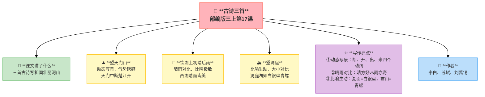
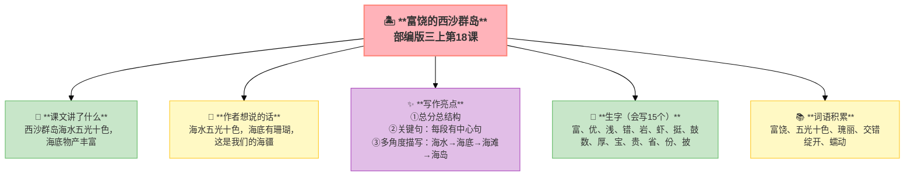
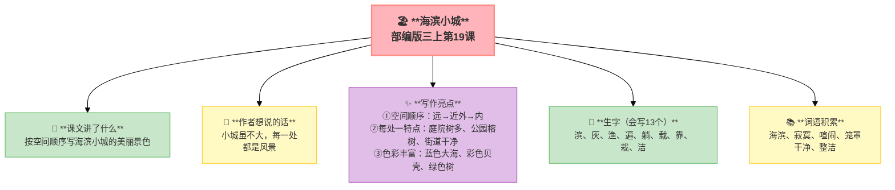
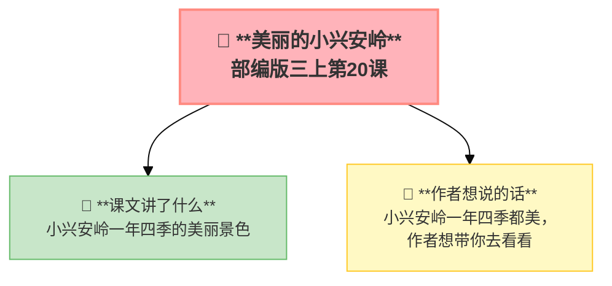

---
tags:
  - 三上
  - 语文
  - 祖国河山
  - 古诗
  - 写景
---

# 第六单元 · 祖国河山

> 天门山、西湖、洞庭湖、西沙群岛、海滨小城、小兴安岭——我们的祖国多美啊！
> **阅读重点**：借助关键句理解一段话的意思
> **习作目标**：这儿真美（写景作文）

---

## 17 古诗三首

> 部编版三上第17课
> ⏰ 先读课文三遍，再往下看
> **阅读重点**：借助关键句理解一段话的意思
> **习作目标**：这儿真美（写景作文）

---

### 📖 □核心 课文讲了什么

三首古诗分别写了不同的景色：李白写天门山中断江开，苏轼写西湖晴雨都美，刘禹锡写洞庭湖像白银盘里的青螺。

---

### 💬 诗人的心事

**李白看到天门山被楚江劈开，两座山隔江对望，他觉得这山这水都在欢迎他。刘禹锡站在洞庭湖边，月光下的湖面像一面未打磨的镜子。苏轼在西湖写下'淡妆浓抹总相宜'——不管晴天雨天，西湖都是美的。**

---

### 望天门山 · 李白

> 天门中断楚江开，碧水东流至此回。
> 两岸青山相对出，孤帆一片日边来。

**📜 写作背景**：公元725年，李白25岁。这一年他"仗剑去国，辞亲远游"——离开家乡四川，沿长江顺流而下。船到安徽当涂时，两岸青山突然夹江对峙，江面收窄，激流回旋——李白站在船头，被这气势惊得说不出话。

**🔑 注释**
| 词语 | 解释 |
|:-----|:-----|
| 天门山 | 在安徽，东梁山和西梁山隔江相对 |
| 中断 | 从中间断开 |
| 楚江 | 长江流经楚地的一段 |
| 回 | 回旋、转弯 |
| 相对出 | 两岸的山像从江边冒出来 |
| 孤帆 | 一只小船 |

**✨ 写作亮点**
| 写法亮点 | 课文内容 | 写作技巧 |
|:---------|:---------|:---------|
| **动态写景** | "断、开、出、来"四个动词 | 用动词让景物活起来 |
| **远近结合** | 远山→近水→孤帆 | 由远及近，层次分明 |
| **气势磅礴** | 中断、东流、相对出 | 写出大自然的壮美 |

---

### 饮湖上初晴后雨 · 苏轼

> 水光潋滟晴方好，山色空蒙雨亦奇。
> 欲把西湖比西子，淡妆浓抹总相宜。

**📜 写作背景**：公元1073年，苏轼在杭州做通判（副市长）。一个春日，他和朋友在湖上饮酒。一开始阳光灿烂，水波潋滟；忽然下起雨来，山色朦胧，云雾弥漫——苏轼放下酒杯，觉得两种都好美。这首诗写的就是"西湖的AB面"。

**🔑 注释**
| 词语 | 解释 |
|:-----|:-----|
| 潋滟 | 水波闪闪发光 |
| 空蒙 | 云雾迷茫的样子 |
| 西子 | 西施，古代美女 |
| 淡妆浓抹 | 淡雅或浓艳的打扮 |

**✨ 写作亮点**
| 写法亮点 | 课文内容 | 写作技巧 |
|:---------|:---------|:---------|
| **晴雨对比** | 晴方好vs雨亦奇 | 两种景色都美 |
| **比喻极致** | "欲把西湖比西子" | 把西湖比作美女西施 |
| **概括力强** | "淡妆浓抹总相宜" | 一句写尽西湖之美 |

---

### 望洞庭 · 刘禹锡

> 湖光秋月两相和，潭面无风镜未磨。
> 遥望洞庭山水翠，白银盘里一青螺。

**📜 写作背景**：公元824年，刘禹锡被贬到和州（今安徽）做刺史。赴任途中经过洞庭湖，正值秋夜——月光洒在湖面上，风平浪静，君山像一颗青螺卧在银盘里。别人被贬路上愁云惨淡，他却在欣赏湖光山色。

**🔑 注释**
| 词语 | 解释 |
|:-----|:-----|
| 相和 | 相互映衬、和谐 |
| 镜未磨 | 湖面像没打磨的铜镜（有点朦胧） |
| 山 | 君山 |
| 青螺 | 青色的螺蛳（把君山比作螺蛳） |

**✨ 写作亮点**
| 写法亮点 | 课文内容 | 写作技巧 |
|:---------|:---------|:---------|
| **比喻生动** | 湖面=白银盘，君山=青螺 | 用熟悉事物比喻 |
| **大小对比** | 大湖中一个小岛 | 画面感极强 |
| **色彩鲜明** | 白银盘（银色）＋青螺（青色） | 颜色搭配美 |

---

### 📚 □了解 词语积累

| 类别 | 词语 |
|:-----|:-----|
| **必会字词** | 天门山、中断、楚江、碧水、回旋、孤帆、潋滟、空蒙、西子 |
| **近义词** | 中断——隔开、回旋——盘旋 |
| **反义词** | 孤独——众多、出——入 |

---

---

## 📋 附录

### 📋 学习自评表（教-学-评一致性）✅

| 评价维度 | 我能做到（✅） | 需再练练（🔄） |
|:---------|:--------------|:---------------|
| **结构把握** | 能说出三首诗分别描写的景色 | |
| **语言运用** | 能正确朗读三首古诗，理解重点词语 | |
| **朗读理解** | 能找出诗中的比喻句并理解含义 | |
| **思辨拓展** | 能说出三首诗表达的情感 | |

---

## 18 富饶的西沙群岛

> 部编版三上第18课
> ⏰ 先读课文三遍，再往下看
> **阅读重点**：借助关键句理解一段话的意思
> **习作目标**：这儿真美（写景作文）

---

### 📖 □核心 课文讲了什么

西沙群岛是南海上的一群岛屿，海水五光十色，海底有珊瑚、海参、大龙虾和各种各样的鱼，海滩上有捡不完的贝壳，岛上有成群的海鸟。

---

### 💬 □核心 作者想说的话

**西沙群岛的海水五光十色，海底有珊瑚、有鱼，海滩上有贝壳、有海龟，岛上还有各种鸟。作者想说：这是我们的海疆，它真的很美。**

---

### ✨ □了解 写作亮点

| 序号 | 亮点 | 说明 |
|:-----|:-----|:-----|
| ① | **总分总结构** | 开头总写→分段细写→结尾总结结构清晰 |
| ② | **关键句** | 每段都有中心句围绕一个意思写 |
| ③ | **多角度描写** | 海水→海底→海滩→海岛多方面描写 |

---

### 📝 □核心 生字（会写15个）

富、优、浅、错、岩、虾、挺、鼓、数、厚、宝、贵、省、份、披

---

### 📚 □了解 词语积累

| 类别 | 词语 |
|:-----|:-----|
| **必会字词** | 富饶、五光十色、瑰丽、交错、绽开、蠕动 |
| **近义词** | 富饶——富足、瑰丽——美丽、宝贵——珍贵 |
| **反义词** | 富饶——贫穷、绽开——闭合、厚重——轻薄 |

---

### 🏗️ □核心 文章结构：超清晰！

| 部分 | 自然段 | 内容 | 作用 |
|:-----|:-------|:-----|:-----|
| **第一部分 🎬** | 1 | 总起：西沙群岛风景优美，物产丰富 | 总领全文 |
| **第二部分 🔥** | 2-6 | 分写：海水→海底→海滩→海岛 | **重点段落**，多角度描写 |
| **第三部分 🌱** | 7 | 总结：祖国南疆的一颗明珠 | 总结全文 |

> **💡 写作要点**：用**总分总**结构，每段用**关键句**统领。

---

## ✨ 阅读与写作：深挖课文"宝藏"

### 0️⃣ □了解 原文对照仿写

| 课文原句 | 仿写练习 |
|:---------|:---------|
| "西沙群岛一带海水五光十色，瑰丽无比：有深蓝的，淡青的，浅绿的，杏黄的。" | 仿写颜色：___一带___五光十色，瑰丽无比：有___的，___的，___的，___的。 |
| "海底的岩石上长着各种各样的珊瑚，有的像绽开的花朵，有的像分枝的鹿角。" | 仿写"有的……有的……"：___上长着各种各样的___，有的像___，有的像___。 |

### 1️⃣ 关键句运用（第2-6自然段）—— 段落结构

| 阅读要点 | 写法分析 | 写作小技巧 |
|:---------|:---------|:-----------|
| "西沙群岛一带海水五光十色" 🌊 | 每段都有中心句 | 写段落时要围绕一个意思 |
| "海底的岩石上长着各种各样的珊瑚" 🐚 | 用关键句统领段落 | 关键句放在段首 |

### 2️⃣ 多角度描写（第2-6自然段）—— 景物描写

| 阅读要点 | 写法分析 | 写作小技巧 |
|:---------|:---------|:-----------|
| "海水→海底→海滩→海岛" 🏝️ | 多角度描写让内容丰富 | 写景要多角度 |

---

## 📚 语言积累：词语库+句式库

> "西沙群岛一带海水五光十色，瑰丽无比：有深蓝的，淡青的，浅绿的，杏黄的。"
>
> 用颜色词写出海水的美丽。

---

## 📋 学习自评表（教-学-评一致性）✅

| 评价维度 | 我能做到（✅） | 需再练练（🔄） |
|:---------|:--------------|:---------------|
| **结构把握** | 能说出总分总结构和每段中心句 | |
| **语言运用** | 能正确读写15个生字，会用关键句 | |
| **朗读理解** | 能读出西沙群岛的美丽和富饶 | |
| **思辨拓展** | 能说出西沙群岛的四个特点 | |

---

## 19 海滨小城

> 部编版三上第19课
> ⏰ 先读课文三遍，再往下看
> **阅读重点**：借助关键句理解一段话的意思
> **习作目标**：这儿真美（写景作文）

---

### 📖 □核心 课文讲了什么

一座海滨小城——大海的蓝色、贝壳的彩色、树的绿色、街道的整洁。作者按空间顺序写：大海→海滩→庭院→公园→街道。

---

### 💬 □核心 作者想说的话

**小城的街道上全是树叶，连公园里也是。作者想让你知道：这座小城虽然不大，但每一处都是风景。**

---

### ✨ □了解 写作亮点

| 序号 | 亮点 | 说明 |
|:-----|:-----|:-----|
| ① | **空间顺序** | 远→近外→内按顺序写条理清晰 |
| ② | **每处一特点** | 庭院→树多公园→榕树街道→干净不重复 |
| ③ | **色彩丰富** | 蓝色大海、彩色贝壳、绿色树颜色让画面更美 |

---

### 📝 □核心 生字（会写13个）

滨、灰、渔、遍、躺、载、靠、栽、洁

---

### 📚 □了解 词语积累

| 类别 | 词语 |
|:-----|:-----|
| **必会字词** | 海滨、寂寞、喧闹、笼罩、干净、整洁 |
| **近义词** | 寂寞——孤单、喧闹——热闹、整洁——干净 |
| **反义词** | 寂寞——热闹、干净——肮脏、喧闹——安静 |

---

### 🏗️ □核心 文章结构：超清晰！

| 部分 | 自然段 | 内容 | 作用 |
|:-----|:-------|:-----|:-----|
| **第一部分 🎬** | 1-3 | 远处（大海）→近处（海滩） | 由远及近 |
| **第二部分 🔥** | 4-6 | 小城里面：庭院、公园、街道 | **重点段落**，各有特色 |

> **💡 写作要点**：用**空间顺序**写景，**由远及近**条理清晰。

---

## ✨ 阅读与写作：深挖课文"宝藏"

### 0️⃣ □了解 原文对照仿写

| 课文原句 | 仿写练习 |
|:---------|:---------|
| "大海→海滩→庭院→公园→街道" | 仿写空间顺序：选一个地方，用"由远到近"的顺序写：___→___→___→___ |
| "凤凰树开了花，开得那么热闹，小城好像笼罩在一片片红云中。" | 仿写比喻：___开了花，开得那么___，___好像___。 |

### 1️⃣ 空间顺序（第1-6自然段）—— 写景顺序

| 阅读要点 | 写法分析 | 写作小技巧 |
|:---------|:---------|:-----------|
| "大海→海滩→庭院→公园→街道" 🏖️ | 由远及近，条理清晰 | 写景要按空间顺序 |

### 2️⃣ 每处一特点（第4-6自然段）—— 景物特点

| 阅读要点 | 写法分析 | 写作小技巧 |
|:---------|:---------|:-----------|
| "庭院→树多、公园→榕树、街道→干净" 🌳 | 每个地方各有特色 | 写景要抓住特点 |

---

## 📚 语言积累：词语库+句式库

> "凤凰树开了花，开得那么热闹，小城好像笼罩在一片片红云中。"
>
> 用比喻写出花开的热闹。

---

## 📋 学习自评表（教-学-评一致性）✅

| 评价维度 | 我能做到（✅） | 需再练练（🔄） |
|:---------|:--------------|:---------------|
| **结构把握** | 能说出空间顺序和每处的特点 | |
| **语言运用** | 能正确读写13个生字 | |
| **朗读理解** | 能读出海滨小城的美丽 | |
| **思辨拓展** | 能按空间顺序写校园 | |

---

## 20* 美丽的小兴安岭（略读）

> 部编版三上第20课（略读课文）
> ⏰ 先读课文三遍，再往下看
> **阅读重点**：借助关键句理解一段话的意思
> **习作目标**：这儿真美（写景作文）

---

### 📖 □核心 课文讲了什么

小兴安岭位于东北，一年四季都美——春天雪水融化树木抽新枝，夏天草木茂盛，秋天落叶林层林尽染，冬天白雪皑皑。

---

### 💬 □核心 作者想说的话

**春天树木抽出新枝，夏天绿得像一片海洋，秋天落叶飞舞，冬天白雪覆盖。小兴安岭一年四季都美，作者想带你去看看。**

---

### 📚 □了解 词语积累

| 类别 | 词语 |
|:-----|:-----|
| **必会字词** | 东北、脑袋、严严实实、挡住、视线、花坛 |
| **近义词** | 融化——消融、苍翠——青翠 |
| **反义词** | 融化——凝结、巨大——微小 |

---

### 🏗️ □核心 文章结构：时间顺序（春→夏→秋→冬）

---

## ✍️ 习作：这儿真美

### 🎯 □核心 目标
写一处身边的景色，用上从本单元学到的**关键句**和**围绕一个意思写**的方法。

### 📐 □了解 写作框架

1. **总起**：这个地方在哪里 + 总的特点
2. **分写**（2-3个方面）
   - 按空间顺序：远处→近处/上→下/左→右
   - 或按时间顺序：早→晚/春→夏→秋→冬
3. **总结**：这个地方给我什么感受

### 🧩 写景词汇库

**颜色**：蔚蓝、碧绿、金黄、火红、雪白、五光十色

**形状**：弯弯的、圆圆的、笔直的、高低起伏

**声音**：哗啦啦、沙沙沙、叽叽喳喳、呼呼

**感受词**：凉爽、温暖、清新、湿润、热闹、安静

### 🔍 结构拆解

| 句子 | 功能 |
|:-----|:-----|
| "我们学校后面有一片小树林，那儿真美！" | 总起句：点明地点+总特点 |
| "一走进树林，就能看见一排高大的梧桐树。" | 分写1：空间顺序，由近及远 |
| "秋天到了，梧桐树的叶子变黄了，像一只只金色的蝴蝶。" | 细节描写：颜色+比喻 |
| "树林中间有一条弯弯的小路。" | 分写2：空间转移 |
| "每天放学后，我都喜欢到小树林里走一走。" | 感受：表达喜爱 |
| "这片小树林虽然不大，但它是我心中最美的地方。" | 总结：呼应开头 |

### 📝 □了解 范文

> 这是参考，不是标准。孩子写不一样的方向也很好。

> **那儿真美**
>
> 我们学校后面有一片小树林，那儿真美！
>
> 一走进树林，就能看见一排高大的梧桐树。秋天到了，梧桐树的叶子变黄了，像一只只金色的蝴蝶。风一吹，树叶飘落下来，地上铺了一层金色的地毯，踩上去沙沙响。
>
> 树林中间有一条弯弯的小路。路边的石头上长满了青苔，摸上去软软的。阳光透过树叶的缝隙洒下来，在地上画出一个个金色的小光斑。
>
> 每天放学后，我都喜欢到小树林里走一走。那里很安静，只有鸟叫声和风吹树叶的声音。坐在树下的长椅上看书，是最舒服的事。
>
> 这片小树林虽然不大，但它是我心中最美的地方。

### 📝 □了解 同学初稿 vs 修改稿

> **初稿（缺少关键句）**：
>
> 我们学校门口有一个小花园。那里有树，有花。树是绿色的，很高。花是红色的和黄色的。花园中间有一个小亭子。我很喜欢那里。
>
> **修改稿（加上关键句后）**：
>
> 我们学校门口有一个小花园，那儿可真美！
>
> **小花园里最引人注目的是那几棵桂花树。** 每到秋天，树上开满了金黄色的小花，远看像一把把碎金撒在绿叶间。走近一闻，浓浓的香味扑鼻而来，整个校园都浸在桂花香里。
>
> **花坛里的花也开得热闹。** 红的像火，黄的像金，紫的像霞。风一吹，花朵们跳起了舞。
>
> **花园中间的小亭子是同学们最爱去的地方。** 课间的时候，大家坐在亭子里看书、聊天，笑声不断。

**修改要点**

| 初稿问题 | 修改方法 |
|:---------|:---------|
| ❌ 没有关键句开头 | ✅ 总起句"那儿可真美"引出全文 |
| ❌ 没有中心句统领段落 | ✅ 每段用关键句（最引人注目/花也开得热闹/最爱去的地方） |
| ❌ 笼统描述 | ✅ 用比喻写具体（碎金/火/金/霞） |
| ❌ 只说"喜欢"不说原因 | ✅ 补充场景细节（看书、聊天、笑声） |

### ⚠️ □了解 常见问题
1. ❌ 没有中心句 → ✅ 用一句话开头概括特点
2. ❌ 东写一句西写一句 → ✅ 按顺序写（空间/时间）
3. ❌ 只写一个方面 → ✅ 多角度（颜色+形状+声音+感受）

---

## ❓ 关联性问题

1. 为什么同样写山水，李白和刘禹锡的诗那么不同？
2. 如果让你选一个地方去旅游，你会选西沙群岛、海滨小城还是小兴安岭？为什么？
3. 西沙群岛和小兴安岭的写作方法有什么不同？（总分结构 vs 时间顺序）
4. 学了这一单元，你觉得写景作文最重要的是什么？

---

## 🔗 跨文本对比

| 对比维度 | 17 古诗三首 | 18 富饶的西沙群岛 | 19 海滨小城 | 20 美丽的小兴安岭 |
|:---------|:------------|:----------------|:------------|:----------------|
| 写哪里 | 长江/西湖/洞庭湖 | 南海 | 海滨小城 | 小兴安岭 |
| 方位 | 中东部 | 最南端 | 南方沿海 | 最北部 |
| 文体 | 古诗 | 说明性散文 | 写景散文 | 写景散文 |
| 结构 | 每首独立 | 总—分—总 | 分场景描写 | 时间顺序(四季) |
| 特色 | 用比喻写山水 | 用分类写物产 | 用场景写生活 | 用变化写风景 |

💡 **阅读启示**：这一单元带我们走遍中国——从长江到南海，从海滨到大兴安岭。写景物可以用古诗（李白），可以用说明（西沙群岛），可以用游记（海滨小城），也可以用时间顺序（小兴安岭）。方法不同，但都写出了对祖国河山的热爱。

---

## 🌐 三通

1. 为什么同样写山水，李白和刘禹锡的诗那么不同？（地理+个人风格）
2. 从南到北，中国的风景有什么变化？（地理链接）
3. 你去过最美丽的地方是哪里？能用关键句描写它吗？

---

## 📚 课外书吧

1. 《中国地理绘本》全套
2. 《跟着诗词去旅行》古诗地图

---

## 🗣️ 语文生活

当小导游：选一处你去过或想去的地方，用"总分总"结构向大家介绍。

---

## 🔄 老朋友回来啦

| 老朋友 | 来自哪里 | 在单元中出现 |
|:-------|:---------|:------------|
| "宝贵" | 三上U5《搭船的鸟》 | 西沙群岛"物产丰富、风景优美" |
| "美丽" | 多单元出现 | 小兴安岭"一年四季景色诱人" |

✅ ⬛⬛ 阅读纵向衔接：

| 老朋友 | 出自 | 再认读 |
|:-------|:-----|:-------|
| **借助关键句理解一段话** | 首次学习"中心句"概念 | 本单元《富饶的西沙群岛》首次明确中心句→三下概括段落大意→四上把握主要内容→六上抓住关键句把握观点 |
---

## 📎 拓展
- 描写祖国山水的好词好句积累
- 语文园地六：词句段运用（围绕一个意思写）

---

## 📖 语文园地

## □核心 交流平台

- 关键句就是一段话里最重要的那句话，往往在开头或结尾
- 找到关键句，整段话的意思就清楚了
- 写作文时也可以用关键句开头，后面再具体描写

---

## □核心 词句段运用

- 描写景物的四字词语：风景优美、物产丰富、山清水秀、层林尽染
- 照样子写关键句："操场真热闹啊！_____，_____，_____。"
- 用"有的……有的……还有的……"写一处景物

---

## □核心 日积月累

**早发白帝城**（唐·李白）

朝辞白帝彩云间，千里江陵一日还。
两岸猿声啼不住，轻舟已过万重山。

**望天门山**（唐·李白）

天门中断楚江开，碧水东流至此回。
两岸青山相对出，孤帆一片日边来。

---

## ✏️ 我的发现（留白）

> 读完这个单元，我最想记下来的是：

___________________________________________

___________________________________________

> 我同桌的发现：

___________________________________________

