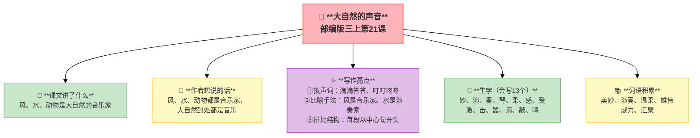
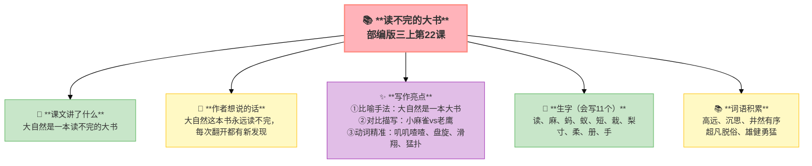
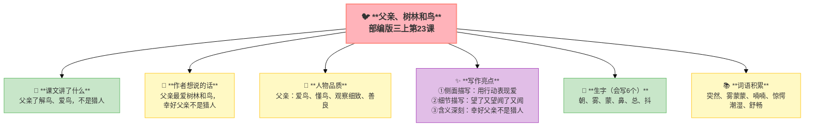

---
tags:
  - 三上
  - 语文
  - 自然
  - 声音
  - 观察
---

# 第七单元 · 自然之美

> 听大自然的声音、读不完的"大书"、父亲和树林和鸟——大自然是最好的老师。
> **阅读重点**：感受语言的生动
> **习作目标**：我有一个想法（建议类作文）

---

## 21 大自然的声音

> 部编版三上第21课
> ⏰ 先读课文三遍，再往下看
> **阅读重点**：感受语言的生动
> **习作目标**：我有一个想法（建议类作文）

---

### 📖 □核心 课文讲了什么

大自然有许多美妙的声音——风是大自然的音乐家，水也是大自然的音乐家，动物是大自然的歌手。

---

### 💬 □核心 作者想说的话

**风是大自然的音乐家，水也是，动物也是。你听——风翻动树叶、水敲打石头、鸟儿在枝头唱歌，大自然到处都是音乐。**

---

### ✨ □了解 写作亮点

| 序号 | 亮点 | 说明 |
|:-----|:-----|:-----|
| ① | **拟声词** | 滴滴答答、叮叮咚咚、哗啦啦让文字有声音 |
| ② | **比喻手法** | 风是音乐家、水是演奏家把声音写成音乐 |
| ③ | **排比结构** | 每段以中心句开头结构整齐有节奏 |

---

### 📝 □核心 生字（会写13个）

妙、演、奏、琴、柔、感、受、激、击、器、滴、敲、鸣

---

### 📚 □了解 词语积累

| 类别 | 词语 |
|:-----|:-----|
| **必会字词** | 美妙、演奏、温柔、雄伟、威力、汇聚 |
| **近义词** | 美妙——奇妙、温柔——温和、雄伟——雄壮 |
| **反义词** | 温柔——粗暴、雄伟——渺小、汇聚——分散 |

---

### 🏗️ □核心 文章结构：超清晰！

| 部分 | 自然段 | 内容 | 作用 |
|:-----|:-------|:-----|:-----|
| **第一部分 🎬** | 1 | 总起：大自然有许多美妙的声音 | 总领全文 |
| **第二部分 🔥** | 2-4 | 分写：风（音乐家）、水（音乐家）、动物（歌手） | **重点段落**，分述声音 |
| **第三部分 🌱** | 5 | 总结：大自然的声音美妙无比 | 总结全文 |

> **💡 写作要点**：用**总分总**结构，每段以**中心句**开头。

---

## ✨ 阅读与写作：深挖课文"宝藏"

### 0️⃣ □了解 原文对照仿写

| 课文原句 | 仿写练习 |
|:---------|:---------|
| "风，是大自然的音乐家" | "___，是大自然的___"（用比喻写一种自然现象） |
| "滴滴答答……叮叮咚咚……所有的树林，林子里的每片树叶" | 用三个拟声词写一个场景：______、______、______ |

### 1️⃣ 拟声词运用（第2-4自然段）—— 声音描写

| 阅读要点 | 写法分析 | 写作小技巧 |
|:---------|:---------|:-----------|
| "滴滴答答、叮叮咚咚" 💧 | 拟声词让文字有声音 | 写声音时用拟声词 |
| "轻轻柔柔的呢喃" 🍃 | 用拟声词写出不同的声音 | 不同声音用不同拟声词 |

### 2️⃣ 比喻手法（第2-3自然段）—— 声音描写

| 阅读要点 | 写法分析 | 写作小技巧 |
|:---------|:---------|:-----------|
| "风是大自然的音乐家" 🎵 | 把声音写成音乐 | 用比喻让描写更生动 |
| "水也是大自然的音乐家" 🎵 | 比喻让声音更形象 | 写声音可以用比喻 |

---

## 📚 语言积累：词语库+句式库

> "风，是大自然的音乐家，他会在森林里演奏他的手风琴。"
> 
> 拟声词+比喻，让声音更生动。

---

---

## 📋 附录

## 📋 学习自评表（教-学-评一致性）✅

| 评价维度 | 我能做到（✅） | 需再练练（🔄） |
|:---------|:--------------|:---------------|
| **结构把握** | 能说出总分总结构和三个中心句 | |
| **语言运用** | 能正确读写13个生字，会用拟声词 | |
| **朗读理解** | 能读出大自然声音的美妙 | |
| **思辨拓展** | 能用拟声词写一个场景 | |

---

## 22 读不完的大书

> 部编版三上第22课
> ⏰ 先读课文三遍，再往下看
> **阅读重点**：感受语言的生动
> **习作目标**：我有一个想法（建议类作文）

---

### 📖 □核心 课文讲了什么

大自然是一部永远读不完的大书——里面有高远的天空、千姿百态的植物、勇猛的动物……这本"书"有无穷的乐趣和奥秘。

---

### 💬 □核心 作者想说的话

**天空、大地、飞鸟、游鱼——大自然这本书永远读不完。每一次翻开，都有新的发现。**

---

### ✨ □了解 写作亮点

| 序号 | 亮点 | 说明 |
|:-----|:-----|:-----|
| ① | **比喻手法** | "大自然是一本大书"把自然比作书 |
| ② | **对比描写** | 小麻雀蹦蹦跳跳vs老鹰猛扑不同动物不同特点 |
| ③ | **动词精准** | "叽叽喳喳""盘旋""滑翔""猛扑"动词写活动物 |

---

### 📝 □核心 生字（会写11个）

读、麻、蚂、蚁、短、栽、梨、寸、柔、册、手

---

### 📚 □了解 词语积累

| 类别 | 词语 |
|:-----|:-----|
| **必会字词** | 高远、沉思、井然有序、超凡脱俗、雄健勇猛 |
| **近义词** | 井然有序——井井有条、雄健勇猛——强壮勇敢 |
| **反义词** | 井然有序——杂乱无章、广阔——狭窄 |

---

### 🏗️ □核心 文章结构：超清晰！

| 部分 | 自然段 | 内容 | 作用 |
|:-----|:-------|:-----|:-----|
| **第一部分 🎬** | 1-2 | 总起：大自然是一本读不完的大书 | 总领全文 |
| **第二部分 🔥** | 3-5 | 分写：天空、植物、动物 | **重点段落**，分述内容 |
| **第三部分 🌱** | 6 | 总结：这本书有无穷的奥秘 | 总结全文 |

> **💡 写作要点**：用**比喻**让描写更形象，用**对比**突出特点。

---

## ✨ 阅读与写作：深挖课文"宝藏"

### 0️⃣ □了解 原文对照仿写

| 课文原句 | 仿写练习 |
|:---------|:---------|
| "大自然是一本读不完的大书" | "家乡是一本/一幅___"（用比喻写家乡） |
| "小麻雀叽叽喳喳，蹦蹦跳跳；老鹰在高空盘旋" | 用对比写两种动物：______，______ |

### 1️⃣ 比喻手法（第1-2自然段）—— 形象描写

| 阅读要点 | 写法分析 | 写作小技巧 |
|:---------|:---------|:-----------|
| "大自然是一本读不完的大书" 📚 | 把自然比作书 | 用比喻让描写更形象 |

### 2️⃣ 对比描写（第5自然段）—— 动物描写

| 阅读要点 | 写法分析 | 写作小技巧 |
|:---------|:---------|:-----------|
| "小麻雀叽叽喳喳vs老鹰猛扑" 🐦 | 不同动物不同特点 | 用对比突出特点 |
| "盘旋、滑翔、猛扑" 🦅 | 动词写活动物 | 用精准动词写动物 |

---

## 📚 语言积累：词语库+句式库

> "小麻雀叽叽喳喳，蹦蹦跳跳，叫人愉悦。老鹰在高空盘旋，展翅滑翔，突然猛扑而下，给人以雄健勇猛的感觉。"
> 
> 用动词写出不同动物的特点。

---

## 📋 学习自评表（教-学-评一致性）✅

| 评价维度 | 我能做到（✅） | 需再练练（🔄） |
|:---------|:--------------|:---------------|
| **结构把握** | 能说出大自然这本"大书"里有什么 | |
| **语言运用** | 能正确读写11个生字，会用动词 | |
| **朗读理解** | 能读出大自然的奇妙 | |
| **思辨拓展** | 能用对比写两种动物 | |

---

## 23 父亲、树林和鸟

> 部编版三上第23课
> ⏰ 先读课文三遍，再往下看
> **阅读重点**：感受语言的生动
> **习作目标**：我有一个想法（建议类作文）

---

### 📖 □核心 课文讲了什么

父亲一生最喜欢树林和唱歌的鸟。他能在没有鸟叫的树林里知道哪些树上有鸟——因为鸟在清晨最容易被露水打湿羽毛。父亲不是猎人。

---

### 💬 □核心 作者想说的话

**父亲一生最爱树林和鸟。他能听出鸟在歌唱，能闻到鸟的气息，能知道鸟什么时候最快乐。但父亲说：'我真高兴，父亲不是猎人。'**

---

### 👤 □了解 人物品质

| 人物 | 品质 |
|:-----|:-----|
| **父亲** | 爱鸟、懂鸟、观察细致、善良 |

---

### ✨ □了解 写作亮点

| 序号 | 亮点 | 说明 |
|:-----|:-----|:-----|
| ① | **侧面描写** | 通过父亲了解鸟写他的爱不直接说爱用行动表现 |
| ② | **细节描写** | "望了又望，闻了又闻"叠词写出专注 |
| ③ | **含义深刻** | "幸好父亲不是猎人"爱鸟护鸟的主题 |

---

### 📝 □核心 生字（会写6个）

朝、雾、蒙、鼻、总、抖

---

### 📚 □了解 词语积累

| 类别 | 词语 |
|:-----|:-----|
| **必会字词** | 突然、雾蒙蒙、喃喃、惊愕、潮湿、舒畅 |
| **近义词** | 雾蒙蒙——雾沉沉、惊愕——惊讶、舒畅——舒服 |
| **反义词** | 潮湿——干燥、舒畅——难受、快乐——悲伤 |

---

### 🏗️ □核心 文章结构：超清晰！

| 部分 | 自然段 | 内容 | 作用 |
|:-----|:-------|:-----|:-----|
| **第一部分 🎬** | 1-2 | 父亲最喜欢树林和鸟 | 交代背景 |
| **第二部分 🔥** | 3-10 | 父亲能"听"出哪里有鸟 | **重点段落**，展示懂鸟 |
| **第三部分 🌱** | 11-12 | "我"感叹：幸好父亲不是猎人 | 升华主题 |

> **💡 写作要点**：用**侧面描写**表现人物品质，用**细节描写**让人物更生动。

---

## ✨ 阅读与写作：深挖课文"宝藏"

### 0️⃣ □了解 原文对照仿写

| 课文原句 | 仿写练习 |
|:---------|:---------|
| "我真高兴，父亲不是猎人" | "我真高兴，___不是___"（写一个让你放心的假设） |
| "望了又望，闻了又闻" | "___了又___，___了又___"（用叠词写专注动作） |

### 1️⃣ 侧面描写（第3-10自然段）—— 人物描写

| 阅读要点 | 写法分析 | 写作小技巧 |
|:---------|:---------|:-----------|
| "父亲突然站定，朝幽深的雾蒙蒙的树林" 👀 | 不直接说爱，用行动表现 | 写人物品质可以用侧面描写 |
| "望了又望，闻了又闻" 👃 | 叠词写出专注 | 用叠词写出人物的动作 |

### 2️⃣ 含义深刻（第11-12自然段）—— 主题升华

| 阅读要点 | 写法分析 | 写作小技巧 |
|:---------|:---------|:-----------|
| "我真高兴，父亲不是猎人" 💚 | 含义深刻：爱鸟护鸟 | 结尾要点明主题 |

---

## 📚 语言积累：词语库+句式库

> "父亲突然站定，朝幽深的雾蒙蒙的树林，上上下下地望了又望，用鼻子闻了又闻。"
> 
> 三个叠用修饰语 + 两个动作 = 父亲对鸟的熟悉和专注。

---

## 📋 学习自评表（教-学-评一致性）✅

| 评价维度 | 我能做到（✅） | 需再练练（🔄） |
|:---------|:--------------|:---------------|
| **结构把握** | 能说出父亲怎么了解鸟 | |
| **语言运用** | 能正确读写6个生字 | |
| **朗读理解** | 能读出父亲对鸟的喜爱 | |
| **思辨拓展** | 能说出"幸好父亲不是猎人"的含义 | |

---

## ✍️ 习作：我有一个想法

### 🎯 □核心 目标
发现生活中的问题，提出改进建议。**这是三年级第一次写议论文/建议类作文。**

### 📐 □了解 写作框架

1. **现象**：我发现了什么问题
2. **影响**：这个问题带来了什么后果
3. **建议**：我有一个想法
4. **号召**：希望大家怎么做

### 🧩 可以写什么

| 问题类型 | 例子 |
|:---------|:-----|
| **学校** | 午餐浪费、课间追逐打闹、图书角没人整理 |
| **家里** | 爸妈看手机不理人、东西乱放找不到 |
| **社区** | 垃圾分类不彻底、小区草坪被踩 |
| **社会** | 共享单车乱停、宠物随地大小便 |

### 🔍 结构拆解

| 句子 | 功能 |
|:-----|:-----|
| "我发现，每次放学时，校门口就堵得水泄不通。" | 现象：点明问题 |
| "汽车、电动车、自行车挤在一起，喇叭声此起彼伏" | 影响：具体描述后果 |
| "我觉得这样下去不行。" | 过渡：从现象到建议 |
| "我有一个想法：学校可以实行'错峰放学'" | 建议：提出具体方案 |
| "希望我们的校门口能变得安全又通畅。" | 号召：表达期望 |

### 📝 □了解 范文

> 这是参考，不是标准。孩子写不一样的方向也很好。

> **我有一个想法**
>
> 我发现，每次放学时，校门口就堵得水泄不通。汽车、电动车、自行车挤在一起，喇叭声此起彼伏，行人在车缝里钻来钻去，非常危险。
>
> 我觉得这样下去不行。堵车不仅浪费时间，还可能发生交通事故。
>
> 我有一个想法：学校可以实行"错峰放学"，不同年级隔五分钟放学。家长们可以约定一个固定的接送点，不要全挤在校门口。还可以提倡高年级同学自己走路上学。
>
> 希望我们的校门口能变得安全又通畅。

### ⚠️ □了解 常见问题
1. ❌ 只抱怨不解决 → ✅ 每个问题都配上建议
2. ❌ 建议太空 → ✅ "建议具体怎么做"（可执行）
3. ❌ 没有说服力 → ✅ 写清楚"为什么"（影响/后果）

---

### 📝 □了解 同学初稿 vs 修改稿

**初稿（只抱怨，没建议）**：

> 我发现我妈妈整天看手机。吃饭也看，走路也看，跟她说话她也不理。我觉得这样很不好，我很生气。

**修改稿（有建议，有说服力）**：

> 我发现妈妈有个不好的习惯——总是看手机。吃饭时她一边吃一边刷朋友圈，我问她问题她总说"等一会儿"。我觉得这样既影响吃饭，也让我们之间的交流变少了。
>
> 我有一个想法：我们可以定一个"无手机时间"。比如晚饭时间，全家把手机放进一个盒子里，专心吃饭聊天。这样妈妈也能好好休息眼睛，我也有机会和她说说学校的事。
>
> 希望妈妈能试试这个办法，让我们家的饭桌更有温度。

**修改要点**：从"抱怨"升级为"现象→影响→建议→号召"的完整结构。

---

## ❓ 关联性问题

1. 为什么这三篇课文都写"大自然"？它们的共同点是什么？
2. 如果21课的风、22课的动物、23课的父亲相遇了，会发生什么故事？
3. "大自然是一本读不完的大书"和"大自然的声音"说的是一回事吗？
4. 父亲能看到鸟，列宁能看到孩子的内心——他们有什么共同之处？

---

## 🔗 跨文本对比

| 对比维度 | 21 大自然的声音 | 22 读不完的大书 | 23 父亲、树林和鸟 |
|:---------|:----------------|:----------------|:-----------------|
| 主题 | 聆听自然 | 阅读自然 | 感受自然 |
| 主要感官 | 听觉 | 视觉+触觉 | 嗅觉+听觉 |
| 写作手法 | 拟人+比喻+拟声词 | 拟人+分类描写 | 对话+细节描写 |
| 情感 | 赞美自然之美 | 敬畏自然之丰富 | 对父亲和自然的爱 |
| 独特之处 | 把自然写成交响乐 | 把自然写成百科全书 | 通过父亲写自然 |

---

## 📚 课外书吧

| 书名 | 作者 | 推荐理由 |
|:-----|:-----|:---------|
| 《森林报》（春夏秋冬四册） | 维·比安基 | 像大自然的"报纸"一样，按月份告诉你森林里发生了什么 |
| 《昆虫记》选篇 | 法布尔 | 观察昆虫就像读一本"读不完的大书"，法布尔爷爷就是那个最会观察的人 |

---

## 🗣️ 语文生活

**耳朵"拍照"挑战** 📸👂

去户外（公园、小区、阳台都行）安静坐5分钟，闭上眼睛，用耳朵"拍照"——

把你听到的所有声音记下来：

| 我听到的声音 | 拟声词 | 像什么乐器/声音 |
|:------------|:-------|:----------------|
| 风吹树叶 | 沙沙沙 | 像沙锤轻轻摇晃 |
| 小鸟叫声 | 叽叽喳喳 | 像短笛吹奏 |
| ... | ... | ... |

> 💡 从这个活动里选一个场景，用拟声词+比喻写成一段话，就是一篇生动的小作文！

---

## 🔄 老朋友回来啦

| 词语 | 来自 | 课文原句 |
|:-----|:-----|:---------|
| 温柔 | 三上第2单元《秋天的雨》 | "秋天的雨，有一盒五彩缤纷的颜料"→温柔的风吹过田野 |
| 雄伟 | 本单元第21课 | "当狂风吹起，整座森林都激动起来，合奏出一首雄伟的乐曲" |

✅ ⬛⬛ 阅读纵向衔接：

| 老朋友 | 出自 | 再认读 |
|:-------|:-----|:-------|
| **摘抄积累** | 首次系统学习摘抄方法 | 本单元《大自然的声音》引导分类摘抄→养成积累习惯→为四上批注阅读积累经验 |
---

## 🌐 三通

1. **音乐链接**🎵：大自然的声音和音乐课上学过的乐器声音有什么相似？风像什么乐器？流水像什么乐器？
2. **经验与观察**🔍：为什么父亲能"看见"鸟而"我"不能？这和爷爷能看出哪棵菜长得好、妈妈能听出你哪句话在撒谎，是不是一样的道理？
3. **想象力训练**💭：如果你也有一本"读不完的大书"，你最想翻开哪一页？（海洋？星空？还是历史？）

---

## 📎 拓展
- 语文园地七：词句段运用（用生动的语言写句子）

---

## 📖 语文园地

## □核心 交流平台

- 生动的语言用得最多的就是比喻和拟人——把东西比成人或别的事物
- 拟声词也能让句子活起来：风"呼呼"地吹，雨"哗哗"地下
- 好的句子读起来像画面一样浮现在眼前，那就是"画面感"

---

## □核心 词句段运用

- 仿写拟人句："太阳从东方升起来了"→"太阳公公露出了笑脸"
- 用"轻轻柔柔""敲敲打打"等叠词填空
- 给一段平淡的文字加上比喻和拟声词，让它变生动

---

## □核心 日积月累

**大自然的名言**

- 大自然是人类的导师。
- 仁者乐山，智者乐水。——《论语》
- 自然从不背离它热爱的人。——华兹华斯
- 天地有大美而不言。——《庄子》

---

## ✏️ 我的发现（留白）

> 读完这个单元，我最想记下来的是：

___________________________________________

___________________________________________

> 我同桌的发现：

___________________________________________

