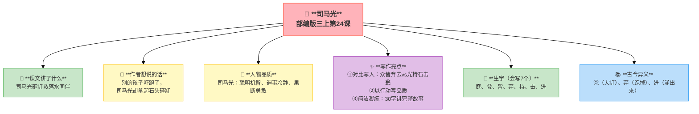
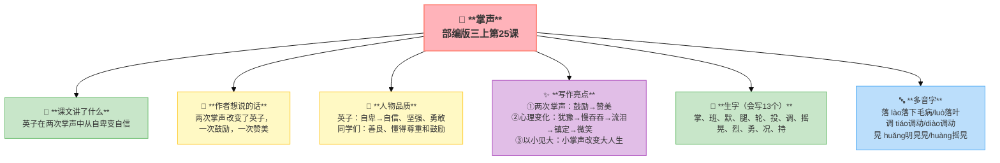
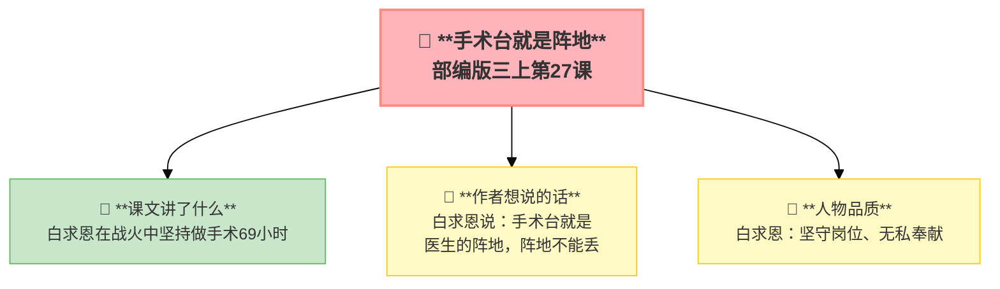

---
tags:
  - 三上
  - 语文
  - 美好品质
  - 文言文
  - 记事作文
---

# 第八单元 · 美好品质

> 司马光的机智、掌声的力量、列宁的善良、白求恩的奉献——美好的品质照亮我们前进的路。
> **阅读重点**：学习带着问题默读
> **习作目标**：那次玩得真高兴（记事作文）

---

## 24 司马光

> 部编版三上第24课（文言文）
> ⏰ 先读课文三遍，再往下看
> **阅读重点**：学习带着问题默读
> **习作目标**：那次玩得真高兴（记事作文）



---

### 📖 □核心 课文讲了什么

一群孩子在庭院里玩。一个孩子掉进大缸，大家都吓跑了。只有司马光拿起一块大石头砸破水缸，水流出来，孩子得救了。

---

### 💬 □核心 作者想说的话

**别的孩子吓跑了，司马光却拿起石头砸缸。他不是不怕，是他知道——救人比什么都重要。**

---

### 👤 □了解 人物品质

| 人物 | 品质 |
|:-----|:-----|
| **司马光** | 聪明机智、遇事冷静、果断勇敢 |

---

### ✨ □了解 写作亮点

| 序号 | 亮点 | 说明 |
|:-----|:-----|:-----|
| ① | **对比写人** | "众皆弃去"vs"光持石击瓮"用别人的慌乱衬托司马光的冷静 |
| ② | **以行动写品质** | 没写"聪明"但表现了聪明不直接说用行动表现 |
| ③ | **简洁凝练** | 30个字讲完整故事文言文的精炼之美 |

---

### 📜 原文 & 翻译

**原文**：群儿戏于庭，一儿登瓮，足跌没水中。众皆弃去，光持石击瓮破之，水迸，儿得活。

**翻译**：一群孩子在庭院里玩耍，一个孩子爬上了水缸，脚一滑掉进了水里。大家都吓跑了，只有司马光拿起石头砸破了水缸，水迸出来，孩子得救了。

---

### 🌿 重点字词

| 类别 | 词语 |
|:-----|:-----|
| **必会字词** | 庭、瓮、皆、弃、持、击、迸 |
| **古今异义** | 瓮（大缸）、弃（跑掉）、迸（涌出来） |

| 字 | 意思 | 组词 |
|:--|:-----|:-----|
| 庭 | 庭院 | 庭院、法庭 |
| 瓮 | 口小肚大的缸 | 水瓮 |
| 皆 | 都 | 皆大欢喜 |
| 弃 | 放弃、跑掉 | 抛弃、放弃 |
| 持 | 拁 | 坚持、保持 |
| 击 | 砸 | 攻击、打击 |
| 迸 | 涌出来 | 迸发、迸裂 |

---

### 🏗️ □核心 文章结构：超清晰！

| 部分 | 内容 | 作用 |
|:-----|:-----|:-----|
| **第一部分 🎬** | 群儿戏于庭，一儿登瓮，足跌没水中 | 交代起因 |
| **第二部分 🔥** | 众皆弃去，光持石击瓮破之 | **重点段落**，对比写人 |
| **第三部分 🌱** | 水迸，儿得活 | 结局 |

> **💡 写作要点**：用**对比**突出人物品质，用**简洁凝练**的语言写故事。

---

## ✨ 阅读与写作：深挖课文"宝藏"

### 0️⃣ □了解 原文对照仿写

| 课文原句 | 仿写练习 |
|:---------|:---------|
| "众皆弃去，光持石击瓮破之" | "众皆___，光___"（用对比写一个勇敢的人） |
| "一儿登瓮，足跌没水中" | "一___，___"（用简短的句子写一个意外） |

### 1️⃣ 对比写人（第2句）—— 人物描写

| 阅读要点 | 写法分析 | 写作小技巧 |
|:---------|:---------|:-----------|
| "众皆弃去"vs"光持石击瓮" 👦 | 用别人的慌乱衬托司马光的冷静 | 写人物时可以用对比 |

### 2️⃣ 以行动写品质（全文）—— 品质描写

| 阅读要点 | 写法分析 | 写作小技巧 |
|:---------|:---------|:-----------|
| 没写"聪明"但表现了聪明 💡 | 不直接说，用行动表现 | 写人物品质可以用行动表现 |

---

## 📚 语言积累：词语库+句式库

> "众皆弃去，光持石击瓮破之。"
> 
> 对比写人，用别人的慌乱衬托司马光的冷静。

---

---

## 📋 附录

## 📋 学习自评表（教-学-评一致性）✅

| 评价维度 | 我能做到（✅） | 需再练练（🔄） |
|:---------|:--------------|:---------------|
| **结构把握** | 能说出故事的起因、经过、结果 | |
| **语言运用** | 能正确朗读文言文，说出重点字词的意思 | |
| **朗读理解** | 能把文言文翻译成现代文 | |
| **思辨拓展** | 能说出对比写人的好处，背诵全文 | |

---

## 25 掌声

> 部编版三上第25课
> ⏰ 先读课文三遍，再往下看
> **阅读重点**：学习带着问题默读
> **习作目标**：那次玩得真高兴（记事作文）



---

### 📖 □核心 课文讲了什么

英子得过小儿麻痹症，走路一摇一晃。新来的老师让她上台讲故事，同学们给了她两次掌声——第一次是鼓励，第二次是称赞。掌声改变了英子，她变得开朗自信了。

---

### 💬 □核心 作者想说的话

**英子总是低着头，因为她腿有残疾。但两次掌声改变了她——一次是鼓励，一次是赞美。从此，英子像变了一个人。**

---

### 👤 □了解 人物品质

| 人物 | 品质 |
|:-----|:-----|
| **英子** | 自卑→自信、坚强、勇敢 |
| **同学们** | 善良、懂得尊重和鼓励 |

---

### ✨ □了解 写作亮点

| 序号 | 亮点 | 说明 |
|:-----|:-----|:-----|
| ① | **两次掌声** | 鼓励→赞美同样的动作不同的含义 |
| ② | **心理变化** | 犹豫→慢吞吞→流泪→镇定→微笑用动作和表情写内心 |
| ③ | **以小见大** | 小掌声改变大人生小事见大主题 |

---

### 📝 □核心 生字（会写13个）

掌、班、默、腿、轮、投、调、摇、晃、烈、勇、况、持

---

### 🔤 □了解 多音字

| 字 | 读音 | 组词 |
|:--|:-----|:-----|
| **落** | lào | 落下毛病 |
| | luò | 落叶 |
| **调** | tiáo | 调动 |
| | diào | 调动 |
| **晃** | huǎng | 明晃晃 |
| | huàng | 摇晃 |

---

### 📚 □了解 词语积累

| 类别 | 词语 |
|:-----|:-----|
| **必会字词** | 小儿麻痹症、姿势、情况、镇定、情绪、讲述、鼓励 |
| **近义词** | 鼓励——鼓舞、镇定——沉着、犹豫——迟疑 |
| **反义词** | 镇定——慌张、忧郁——开朗、犹豫——果断 |

---

### 🏗️ □核心 文章结构：超清晰！

| 部分 | 自然段 | 内容 | 作用 |
|:-----|:-------|:-----|:-----|
| **第一部分 🎬** | 1-2 | 英子的自卑（总是最后一个到教室） | 交代背景 |
| **第二部分 🔥** | 3-6 | 老师让她上台→两次掌声→英子讲完故事 | **重点段落**，两次掌声 |
| **第三部分 🌱** | 7 | 英子的改变（开朗自信） | 升华主题 |

> **💡 写作要点**：用**两次掌声**推动情节，用**心理变化**写人物成长。

---

## ✨ 阅读与写作：深挖课文"宝藏"

### 0️⃣ □了解 原文对照仿写

| 课文原句 | 仿写练习 |
|:---------|:---------|
| "英子犹豫了一会儿，慢吞吞地站了起来" | "___犹豫了一会儿，___地___了___"（用动作写犹豫） |
| "教室里骤然间响起了掌声" | "教室里骤然间___"（写一个突然发生的场景） |

### 1️⃣ 两次掌声（第3-6自然段）—— 情感描写

| 阅读要点 | 写法分析 | 写作小技巧 |
|:---------|:---------|:-----------|
| "第一次掌声：鼓励、支持" 👏 | 掌声让英子鼓足勇气 | 写情感变化可以用动作 |
| "第二次掌声：赞美、肯定" 👏 | 掌声让英子从此变了 | 同样的动作可以有不同的含义 |

### 2️⃣ 心理变化（第3-6自然段）—— 人物描写

| 阅读要点 | 写法分析 | 写作小技巧 |
|:---------|:---------|:-----------|
| "犹豫→慢吞吞→流泪→镇定→微笑" 😊 | 用动作和表情写内心 | 写心理变化可以用动作表情 |

---

## 📚 语言积累：词语库+句式库

> "英子犹豫了一会儿，慢吞吞地站了起来，眼圈红红的。"
> 
> 用动作和神态写出英子的犹豫和难过。

---

## 📋 学习自评表（教-学-评一致性）✅

| 评价维度 | 我能做到（✅） | 需再练练（🔄） |
|:---------|:--------------|:---------------|
| **结构把握** | 能说出英子在掌声前后的变化 | |
| **语言运用** | 能正确读写13个生字，会用多音字 | |
| **朗读理解** | 能读出英子的心情变化 | |
| **思辨拓展** | 能说出掌声的力量，联系生活谈鼓励的重要性 | |

---

## 26 灰雀

> 部编版三上第26课
> ⏰ 先读课文三遍，再往下看
> **阅读重点**：学习带着问题默读，通过对话读懂人物内心
> **习作目标**：那次玩得真高兴（记事作文）

```mermaid
%%{init: {'theme': 'base', 'themeVariables': {'fontSize': '14px'}}}%%
graph TB
    classDef center fill:#FFB3BA,stroke:#FF8A80,stroke-width:2px,color:#333,font-weight:bold,font-size:16px
    classDef green fill:#C8E6C9,stroke:#66BB6A,stroke-width:1px,color:#333,font-size:13px
    classDef blue fill:#BBDEFB,stroke:#42A5F5,stroke-width:1px,color:#333,font-size:13px
    classDef yellow fill:#FFF9C4,stroke:#FFCA28,stroke-width:1px,color:#333,font-size:13px
    classDef purple fill:#E1BEE7,stroke:#AB47BC,stroke-width:1px,color:#333,font-size:13px

    center["🕊️ **灰雀**<br/>部编版三上第26课"]:::center

    l1["📖 **课文讲了什么**<br/>列宁在公园里发现一只灰雀不见了，<br/>遇到一个小男孩。通过交谈，<br/>男孩认识到错误，主动把灰雀放回来。"]:::green
    l2["👤 **人物品质**<br/>列宁：善解人意、循循善诱<br/>男孩：诚实、知错能改"]:::yellow
    l3["💕 **三种"爱"的对比**<br/>列宁爱灰雀→给它自由<br/>男孩爱灰雀→想占有它<br/>列宁爱男孩→尊重、保护自尊心"]:::purple

    r1["📝 **生字（会写12个）**<br/>雀、郊、养、粉、粒<br/>男、或、者、冻、惜、肯、诚"]:::green
    r2["🔤 **多音字**<br/>散 sàn散步 / sǎn散漫<br/>宁 níng宁静 / nìng宁愿<br/>的 de我的 / dí的确"]:::blue
    r3["📚 **词语积累**<br/>郊外、散步、胸脯、仰望<br/>严厉、可惜"]:::yellow

    b1["✨ **写作亮点**<br/>①明线+暗线双线结构<br/>②对话推动情节发展<br/>③"自言自语"的言外之意<br/>④留白式结尾，意味深长"]:::purple
    b2["💬 **作者想说的话**<br/>列宁喜欢灰雀，<br/>更喜欢诚实的孩子"]:::pink

    center --> l1
    center --> l2
    center --> l3
    center --> r1
    center --> r2
    center --> r3
    center --> b1
    center --> b2

    style center fill:#FFB3BA,stroke:#FF8A80,stroke-width:2px
```

---

### 📖 □核心 课文讲了什么

列宁在公园里发现一只灰雀不见了，遇到一个小男孩。通过交谈，男孩认识到错误，主动把灰雀放回来。

---

### 💬 □核心 作者想说的话

**列宁喜欢灰雀，更喜欢诚实的孩子。当他发现灰雀不见了，他没有责怪小男孩，而是用温柔的方式让他自己说出来。**

---

### 👤 □了解 人物品质

| 人物 | 品质 |
|:-----|:-----|
| **列宁** | 善解人意、循循善诱 |
| **男孩** | 诚实、知错能改 |

---

### 💕 三种"爱"的对比

| 人物 | 怎么"爱" | 结果 |
|:-----|:---------|:-----|
| **列宁** | 爱灰雀→给它自由 | 灰雀快乐歌唱 |
| **男孩** | 爱灰雀→想占有它 | 灰雀不见了 |
| **列宁爱男孩** | 尊重、保护自尊心 | 男孩主动改正 |

---

### ✨ □了解 写作亮点

| 序号 | 亮点 | 说明 |
|:-----|:-----|:-----|
| ① | **明线+暗线双线结构** | 明线是灰雀，暗线是男孩的心理变化 |
| ② | **对话推动情节发展** | 全篇用对话展开，没有旁白叙述 |
| ③ | **"自言自语"的言外之意** | 列宁表面说给自己听，实际说给男孩听 |
| ④ | **留白式结尾，意味深长** | 不写男孩承认错误，让读者自己体会 |

---

### 📝 □核心 生字（会写12个）

雀、郊、养、粉、粒、男、或、者、冻、惜、肯、诚

---

### 🔤 □了解 多音字

| 字 | 读音 | 组词 |
|:--|:-----|:-----|
| **ɢ** | sn | ɢ |
| | sǎn | 散漫 |
| **宁** | níng | 宁静 |
| | nìng | 宁愿 |
| **的** | de | 我的 |
| | dí | 的确 |

---

### 📚 □了解 词语积累

郊外、散步、胸脯、仰望、严厉、可惜

---

## 🏗️ 文章结构：超清晰！

| 部分 | 自然段 | 内容 | 作用 |
|:-----|:-------|:-----|:-----|
| **第一部分 🎬** | 1 | 列宁喜欢灰雀，经常喂它们 | 交代起因，为下文做铺垫 |
| **第二部分 🔥** | 2-10 | 灰雀不见了，列宁与男孩对话 | **重点段落**，对话推动情节 |
| **第三部分 🌱** | 11-13 | 灰雀回来，列宁知道男孩是诚实的 | 点明主题，升华情感 |

> **💡 写作要点1**：文章采用"**明线+暗线**"的双线结构。**明线**是灰雀的"在→不在→在"，**暗线**是男孩的"犯错→挣扎→改正"。写故事时，可以用一条看得见的线索和一条情感线索交织推进。

---

## ✨ 阅读与写作：深挖课文"宝藏"

### 0️⃣ □了解 原文对照仿写

| 课文原句 | 仿写练习 |
|:---------|:---------|
| "没……我没看见。" | 用省略号和吞吞吐吐写一句紧张的话："___……___" |
| "列宁自言自语地说："多好的灰雀呀，可惜再也飞不回来了。"" | 写一句"说给自己听，实际说给别人听"的话 |

### 1️⃣ 可爱的灰雀（第1自然段）—— 外貌描写+动作描写

| 阅读要点 | 写法分析 | 写作小技巧 |
|:---------|:---------|:-----------|
| "两只胸脯是粉红的，一只胸脯是深红的" 🎨 | 用**颜色对比**写出灰雀的漂亮 | 写小动物要抓住颜色特征 |
| "来回跳动，婉转地歌唱" 🎵 | **动作+声音**结合，写出动态美 | 动静结合让描写更生动 |
| "每次...都要...还经常..." 🔄 | 用**频率词**写出列宁的喜爱 | "每次""经常"能表现习惯和情感 |

---

### 2️⃣ 巧妙的对话（第2-10自然段）—— 言外之意+心理变化

> 本段是学习"**通过对话读懂人物内心**"的绝佳范例 ✨

| 说话人 | 说的话 | 潜台词（心里想的） | 朗读语气 |
|:-------|:-------|:-------------------|:---------|
| **列宁** 😊 | "孩子，你看见过一只深红色胸脯的灰雀吗？" | 我知道你可能知道它在哪儿 | 温和、试探 |
| **男孩** 😰 | "没……我没看见。" | 我慌了，我不敢承认 | 吞吞吐吐、紧张 |
| **列宁** 😟 | "一定是飞走了或者是冻死了。" | 我知道是你捉的，但我不揭穿你 | 担心、惋惜 |
| **列宁** 😔 | "多好的灰雀呀，可惜再也飞不回来了。" | 你不是真的爱它，爱它就让它自由 | 自言自语（实则说给男孩听） |
| **男孩** 😤 | "会飞回来的，一定会飞回来的。它还活着。" | 我错了，我决定放它回来 | 坚定、下决心 |
| **男孩** 💪 | "一定会飞回来！" | 我一定能做到！ | 坚定、坚决 |

> **💡 写作要点2**：写对话时，可以不用"说"字，用"看看""微笑""低着头"等**神态动作**来替代，让对话更生动。这就是"**提示语**"的妙用！

---

### 3️⃣ 感人的结尾（第11-13自然段）—— 留白式写法

灰雀回来了，男孩低着头。列宁没有追问，没有批评——只是说"你好，灰雀，昨天你到哪儿去了？"

**留白**：不写男孩承认错误，让读者自己体会。这种写法更高级！

---

### 4️⃣ 思辨与探究 —— 让阅读更有深度 🤔

| 思辨问题 | 引导方向 | 表达小技巧 |
|:---------|:---------|:-----------|
| "列宁为什么不直接问男孩，而是跟灰雀说话？" | 从"保护自尊心"角度思考，体会说话的智慧。 | 用"因为……所以……"的句式，把因果关系说清楚。 |
| "男孩捉灰雀是'不爱'吗？和列宁的'爱'有什么不同？" | 区分"占有之爱"和"放手之爱"，培养辩证思维。 | "同样是爱，一个是……另一个是……"的对比句式。 |
| "如果你是那个男孩，听了列宁的话你会怎么想？" | 换位思考，联系自己的经历谈感受。 | "如果我是他，我会……因为……" |

---

## 📚 语言积累：词语库+句式库

### 1️⃣ 重点词语

| 类别 | 词语 |
|:-----|:-----|
| **必会字词** 📚 | 郊外、散步、胸脯、仰望、欢快、面包渣、或者、严寒、自言自语、可惜、肯定、果然、欢蹦乱跳、诚实 |
| **多音字** 🔤 | 散(sàn散步/sǎn散漫)、宁(níng宁静/nìng宁愿)、的(de我的/dí的确) |
| **近义词** 💛 | 经常——常常、婉转——动听、喜爱——喜欢、果然——果真、可惜——惋惜、诚实——老实 |
| **反义词** ⚡ | 高大——矮小、喜爱——讨厌、仰望——俯视、肯定——否定、诚实——虚假、严寒——酷热 |

---

## 📋 学习自评表（教-学-评一致性）✅

> 完成挑战后，对照下表给自己打个勾，清晰看到自己的进步轨迹！

| 评价维度 | 我能做到（✅） | 需再练练（🔄） |
|:---------|:--------------|:---------------|
| **结构把握** | 能说出故事的起因、经过、结果，知道明线和暗线两条线索。 | |
| **语言运用** | 能正确读写12个生字，会用"自言自语""果然"造句。 | |
| **朗读理解** | 能分角色朗读，读出列宁的温和智慧和男孩的心理变化。 | |
| **思辨拓展** | 能说出列宁"爱"和男孩"爱"有什么不同，理解什么是真正的尊重。 | |

---

## 27* 手术台就是阵地（略读）

> 部编版三上第27课（略读课文）
> ⏰ 先读课文三遍，再往下看
> **阅读重点**：学习带着问题默读
> **习作目标**：那次玩得真高兴（记事作文）



---

### 📖 □核心 课文讲了什么

1939年齐会战斗中，白求恩大夫在离前线不远的小庙里做手术。敌机轰炸，他也不离开，说"手术台是医生的阵地"。他连续工作了69个小时，救治了上百名伤员。

---

### 💬 □核心 作者想说的话

**炮弹在身边爆炸，白求恩大夫却稳稳地站在手术台前。他说：'手术台就是医生的阵地。'阵地不能丢。**

---

### 👤 □了解 人物品质

| 人物 | 品质 |
|:-----|:-----|
| **白求恩** | 坚守岗位、无私奉献、国际主义精神、对工作极端负责 |

---

### 📚 □了解 词语积累

| 类别 | 词语 |
|:-----|:-----|
| **必会字词** | 手术台、阵地、战斗、打响、气焰、疯狂 |
| **近义词** | 激烈——猛烈、陆续——连续、危险——危急 |
| **反义词** | 危险——安全、结束——开始、快速——缓慢 |

---

### 🏗️ □核心 文章结构

> 结构：交代背景（齐会战斗打响）→白求恩坚持在手术台上不肯离开→连续工作69小时，总结全文

---

## 📚 语言积累：词语库+句式库

> "手术台是医生的阵地。战士们没有离开他们的阵地，我怎么能离开自己的阵地呢？"
> 
> 反问句，表现出白求恩坚守岗位的决心。

## ✍️ 习作：那次玩得真高兴

### 🎯 □核心 目标
写一次玩耍的经历，按顺序把经过写清楚，写出快乐的心情。

### 📐 □了解 写作框架

1. **开头**：什么时候、和谁、在哪里玩
2. **经过**：怎么玩的（先……然后……最后……）
3. **感受**：为什么高兴 + 有什么收获

### 🧩 写"高兴"的词语库

| 程度 | 词语 |
|:-----|:-----|
| 一般高兴 | 开心、快乐、愉快 |
| 比较高兴 | 兴高采烈、眉开眼笑 |
| 非常高兴 | 欢呼雀跃、手舞足蹈、一蹦三尺高 |
| 心里感受 | 心里像喝了蜜一样甜、嘴角止不住上扬 |

### 🔍 结构拆解

| 句子 | 功能 |
|:-----|:-----|
| "去年暑假，我和爸爸去海边玩。那是我第一次见到大海！" | 开头：交代时间人物，表达期待 |
| "一到海边，我就脱了鞋冲向沙滩。" | 动作：写兴奋 |
| "沙子细细的，踩上去软软的，像踩在棉花上。" | 感官：触觉+比喻 |
| "我弯腰捡贝壳——有白色的、粉色的、螺旋形的" | 细节：颜色+形状 |
| "最开心的是下海玩水。" | 过渡：从沙滩到大海 |
| "那次海边之旅我一直记在心里。" | 结尾：呼应开头，点明感受 |

### 📝 □了解 范文

> 这是参考，不是标准。孩子写不一样的方向也很好。

> **那次玩得真高兴**
>
> 去年暑假，我和爸爸去海边玩。那是我第一次见到大海！
>
> 一到海边，我就脱了鞋冲向沙滩。沙子细细的，踩上去软软的，像踩在棉花上。我弯腰捡贝壳——有白色的、粉色的、螺旋形的，每一个都不一样，我捡了一大把装进口袋。
>
> 最开心的是下海玩水。海浪一步一步朝我涌来，我跳起来躲开，但还是被溅了一身。海水咸咸的，我舔了一下，皱起了眉头，爸爸笑得直不起腰。后来我套着游泳圈漂在水面上，像一只胖海豚，随着波浪一起一伏。
>
> 那次海边之旅我一直记在心里。每次看到书桌上的贝壳，就会想起那天的大海、沙滩和我和爸爸的笑声。

### ⚠️ □了解 常见问题
1. ❌ 写成"流水账" → ✅ 详略得当，选最精彩的部分重点写
2. ❌ 只有动作没有感受 → ✅ 加上心情变化（期待→紧张→开心→回味）

---

### 📝 □了解 同学初稿 vs 修改稿

**初稿（流水账，缺感受）**：

> 那次玩得真高兴。星期天我和小明去公园玩。我们先玩了滑梯，然后玩了秋千，后来我们去玩沙子。玩了很久，天黑了就回家了。我很高兴。

**修改稿（有情感弧线，有细节）**：

> 星期天下午，我和小明去公园玩。一进公园大门，我就看到了那个高高的滑梯——哇，比我还高半个头！
>
> 我爬上去的时候，腿有点发抖，心里像揣了一只小兔子。小明在旁边喊："别怕，我接着你！"我闭上眼睛，"嗖"地滑了下去——风在耳边呼呼地响，一下子就到了地面！我睁开眼睛，咧嘴笑了。原来滑梯一点也不可怕！
>
> 后来我们又去荡秋千。我越荡越高，感觉自己像一只飞翔的小鸟，天空伸手就能够到。夕阳把我们的影子拉得好长好长，我们才依依不舍地回家。
>
> 那天我不仅玩得开心，还学会了一件事：有些事情看起来可怕，试了才知道没那么难。

**修改要点**：增加"期待→紧张→开心→回味"的情感弧线，补充感官细节（风声、心跳、夕阳）。

---

## ❓ 关联性问题

1. 司马光砸缸和今天的"急救知识"有什么联系？如果当时有电话，司马光还会砸缸吗？
2. 掌声为什么能改变一个人？你什么时候得到过"掌声"（不一定是真的鼓掌）？
3. 列宁明明知道是男孩捉了灰雀，为什么不直接说？如果是你，你会怎么做？
4. 白求恩为什么说"手术台就是阵地"？医生和战士有什么相同和不同？
5. 四篇课文中，哪个人的品质你最想拥有？为什么？

---

## 🔗 跨文本对比

| 对比维度 | 24 司马光 | 25 掌声 | 26 灰雀 | 27 手术台就是阵地 |
|:---------|:----------|:--------|:--------|:-----------------|
| 主人公 | 司马光（古代） | 英子（现代） | 列宁+男孩（现代） | 白求恩（现代） |
| 品质 | 机智勇敢 | 自信自强 | 善解人意+诚实 | 坚守岗位 |
| 事件 | 砸缸救人 | 掌声改变人生 | 列宁智教男孩 | 战火中做手术 |
| 文体 | 文言文 | 记叙文 | 记叙文 | 记叙文 |
| 写作手法 | 对比写人 | 心理变化 | 双线结构+对话 | 环境衬托+比喻 |

💡 **阅读启示**：美好的品质可以是机智（司马光）、鼓励（掌声）、宽容（灰雀）、奉献（白求恩）。写人物品质时，不要直接说"他很勇敢"，要用具体的事让人物自己"说话"。

---

## 📚 课外书吧

| 书名 | 作者 | 推荐理由 |
|:-----|:-----|:---------|
| 《爱的教育》 | 亚米契斯 | 用一个个小故事告诉你什么是美好的品质，每一篇都温暖人心 |
| 《司马光砸缸》绘本版 | 多个版本可选 | 经典故事的图文版，看看不同画家怎么画同一个故事 |

---

## 🗣️ 语文生活

**品质故事会** 🎤

讲一个身边同学的好品质故事，用一两件具体的事来证明——

| 不要说（空洞） | 要说（具体） |
|:---------------|:-------------|
| "他很善良" | "上次同桌忘带午饭，他把自己的一半分给同桌" |
| "她很勇敢" | "她第一个举手报名参加朗诵比赛，虽然声音都在发抖" |
| "他很诚实" | "他打碎了花瓶，主动跟老师承认了" |

> 💡 回家讲给爸爸妈妈听，让他们猜猜你讲的是谁？

---

## 🔄 老朋友回来啦

| 词语 | 来自 | 课文原句 |
|:-----|:-----|:---------|
| 诚实 | 二下《画杨桃》 | "好——笑！"有几个同学抢着答道→画杨桃教会我们要诚实 |
| 勇敢 | 多单元积累 | 从司马光到白求恩，勇敢有不同模样 |

✅ ⬛⬛ 阅读纵向衔接：

| 老朋友 | 出自 | 再认读 |
|:-------|:-----|:-------|
| **带着问题默读** | 首次明确提出"带着问题默读" | 本单元《掌声》要求"默读课文并思考"→三下理解难懂句子→四上批注阅读→五下体会人物内心 |
---

## 🌐 三通

1. **安全与科学**🛡️：司马光砸缸和今天的"急救知识"有什么联系？如果当时有电话，司马光还会砸缸吗？还有没有别的救人方法？
2. **心理学的力量**🧠：掌声为什么能改变一个人？你什么时候得到过"掌声"（不一定是真的鼓掌，可能是一句鼓励的话）？
3. **人际与成长**🤝：你和同学之间有没有发生过类似"灰雀"的故事——你原谅了别人或者别人原谅了你？当时是什么感受？

---

## 📎 拓展
- 延伸阅读：《司马光砸缸》的其他版本故事
- 口语交际：请教（学会有礼貌地提问）
- 语文园地八：交流平台（默读方法总结）

---

## 📖 语文园地

## □核心 交流平台

- 默读时不出声、不动嘴唇，只用眼睛看
- 边读边想问题：谁？做了什么？为什么？结果怎样？
- 遇到读不懂的地方，停下来想一想，或做个记号回头再读

---

## □核心 词句段运用

- 辨字组词：司（司机）— 同（同学）；掌（掌声）— 撑（撑伞）
- 用"默默地""轻轻地""慢慢地"写一段动作描写
- 学习用连续动词写一个场面：____、____、____、____

---

## □核心 日积月累

**关于品质的名言**

- 不迁怒，不贰过。——《论语》
- 爱人者，人恒爱之；敬人者，人恒敬之。——《孟子》
- 与人善言，暖于布帛；伤人以言，深于矛戟。——《荀子》
- 仁者爱人，有礼者敬人。——《孟子》

---

## ✏️ 我的发现（留白）

> 读完这个单元，我最想记下来的是：

___________________________________________

___________________________________________

> 我同桌的发现：

___________________________________________

