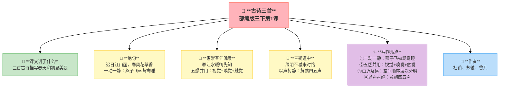
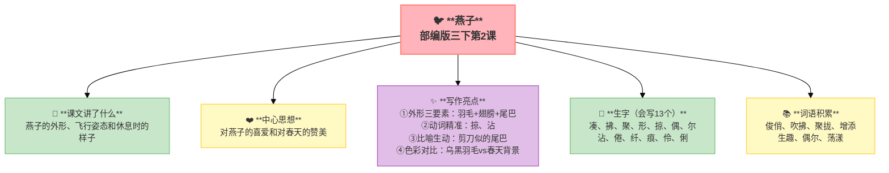
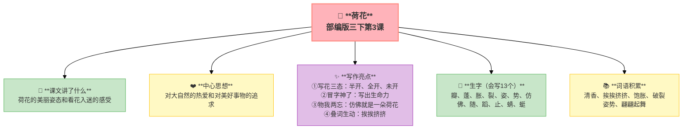
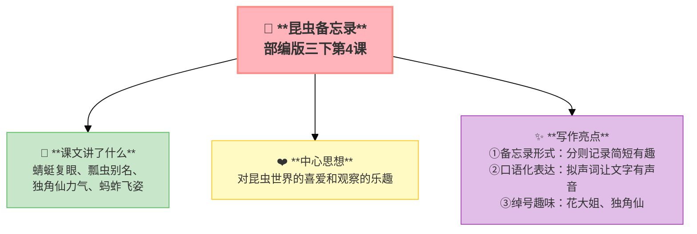

---
tags:
  - 三下
  - 语文
  - 可爱的生灵
  - 古诗
  - 写景
  - 观察
---

# 第一单元 · 可爱的生灵

> 春天来了——看看燕子的身姿、闻闻荷花的清香、听听昆虫的故事。
> **阅读重点**：边读边想象画面
> **习作目标**：我的植物朋友（观察卡片→作文）

---

## 1 古诗三首

> 部编版三下第1课
> ⏰ 先读课文三遍，再往下看
> **阅读重点**：边读边想象画面
> **习作目标**：我的植物朋友（观察卡片→作文）

---

### 📖 □核心 课文讲了什么

三首古诗分别描写了春天和初夏的美丽景象——杜甫写春日燕子鸳鸯，苏轼题画中春江鸭戏，曾几记初夏山行绿荫。

---

### 💬 诗人的心事

**杜甫看到两只黄鹂在翠柳间歌唱，一行白鹭飞上青天，心情一下子好了。苏轼在惠崇的画里看到了早春——竹外桃花三两枝，春江水暖鸭先知。曾几走在山间小路，绿荫不减来时路，忽然听到几声黄鹂叫。**

---

### ✨ □了解 写作亮点

| 序号 | 亮点 | 说明 |
|:-----|:-----|:-----|
| ① | **一动一静** | "飞"燕子＋"睡"鸳鸯，动静结合画面更生动 |
| ② | **五感并用** | 丽（视觉）、香（嗅觉）、暖（触觉），多感官描写如临其境 |
| ③ | **由近及远** | 竹外桃花→春江→蒌蒿芦芽，空间顺序层次分明 |
| ④ | **以声衬静** | "添得黄鹂四五声"，用声音写出山林的生机 |
| ⑤ | **移步换景** | 小溪→山路→绿阴，边走边看动态描写 |

---

### 📝 □核心 生字（会写X个）

融、燕、鸳、鸯、惠、崇、芦、芽、短、梅、溪、泛、减

---

### 📚 □了解 词语积累

| 类别 | 词语 |
|:-----|:-----|
| **必会字词** | 迟日、泥融、鸳鸯、蒌蒿、芦芽、河豚、泛尽 |
| **近义词** | 丽——美、香——芳、暖——热 |
| **反义词** | 暖——寒、来——去、减——增 |

---

## 🏗️ 文章结构：超清晰！

| 部分 | 内容 | 作用 |
|:-----|:-----|:-----|
| **绝句** | 迟日江山丽→春风花草香→泥融飞燕子→沙暖睡鸳鸯 | 春日美景，动静结合 |
| **惠崇春江晚景** | 竹外桃花→春江水暖→蒌蒿芦芽→河豚欲上 | 题画诗，由近及远 |
| **三衢道中** | 梅子黄时→小溪泛尽→绿阴不减→黄鹂四五声 | 初夏山行，移步换景 |

> **💡 写作要点**：用**多感官**描写景物，用**动静结合**让画面更生动。

---

## ✨ 阅读与写作：深挖课文"宝藏"

### 1️⃣ 绝句 · 杜甫 —— 动静结合+多感官

| 阅读要点 | 写法分析 | 写作小技巧 |
|:---------|:---------|:-----------|
| "飞"燕子＋"睡"鸳鸯 🐦 | 一动一静，画面有生气 | 写景时可以动静结合 |
| 丽（视觉）、香（嗅觉）、暖（触觉） 🌸 | 多感官并用，如临其境 | 写景要调动多种感官 |

### 2️⃣ 惠崇春江晚景 · 苏轼 —— 由近及远+想象

| 阅读要点 | 写法分析 | 写作小技巧 |
|:---------|:---------|:-----------|
| 竹外桃花→春江→蒌蒿芦芽 🎋 | 空间顺序，层次分明 | 按空间顺序写景 |
| "正是河豚欲上时" 🐟 | 由景物联想到时令 | 可以加入合理想象 |

### 3️⃣ 三衢道中 · 曾几 —— 移步换景+以声衬静

| 阅读要点 | 写法分析 | 写作小技巧 |
|:---------|:---------|:-----------|
| "添得黄鹂四五声" 🎵 | 用声音写出山林的生机 | 以声衬静让画面更美 |
| "日日晴"vs梅雨季 ☀️ | 意外之喜，心情更好 | 对比可以突出惊喜 |

### 🖋️ □了解 原文对照仿写

| 原句 | 仿写练习 |
|:-----|:---------|
| "迟日江山丽，春风花草香" | 仿写：____日____丽，____风____香（用感官写季节） |
| "竹外桃花三两枝，春江水暖鸭先知" | 仿写：____外____三两____，____水____先知（用景物暗示季节） |
| "绿阴不减来时路，添得黄鹂四五声" | 仿写：____不减来时路，添得____四五声（以声衬静） |

---

## 📚 语言积累：词语库+句式库

> "泥融飞燕子，沙暖睡鸳鸯。"
> 
> 动静结合，写出春日的生机与温暖。

> "竹外桃花三两枝，春江水暖鸭先知。"
> 
> 由景物联想到时令，富有哲理。

---

---

## 📋 附录

## 📋 学习自评表（教-学-评一致性）✅

| 评价维度 | 我能做到（✅） | 需再练练（🔄） |
|:---------|:--------------|:---------------|
| **结构把握** | 能说出每首诗描写的季节和景象 | |
| **语言运用** | 能正确朗读三首古诗，说出重点字词的意思 | |
| **朗读理解** | 能找出诗中的动词或形容词 | |
| **思辨拓展** | 能说出诗中的写作技巧，背诵三首古诗 | |

---

## 2 燕子

> 部编版三下第2课
> ⏰ 先读课文三遍，再往下看
> **阅读重点**：边读边想象画面
> **习作目标**：我的植物朋友（观察卡片→作文）

---

### 📖 □核心 课文讲了什么

描写了燕子的外形特点、飞行姿态和休息时的样子，表达了作者对燕子的喜爱之情。

---

### 💬 □核心 作者想说的话

**燕子的羽毛是黑色的，翅膀尖尖的，尾巴像剪刀。它飞过稻田，飞过柳树，飞累了就停在电线上——像五线谱上的小音符。**

---

### 👤 □了解 人物品质

| 人物 | 品质 |
|:-----|:-----|
| **燕子** | 活泼机灵、可爱 |

---

### ✨ □了解 写作亮点

| 序号 | 亮点 | 说明 |
|:-----|:-----|:-----|
| ① | **外形三要素** | 羽毛＋翅膀＋尾巴，从整体到部分抓住特征 |
| ② | **动词精准** | "掠"飞得快、"沾"轻轻点水，一个动词写出一种姿态 |
| ③ | **比喻生动** | "剪刀似的尾巴"，用熟悉事物比喻形象 |
| ④ | **色彩对比** | 乌黑的羽毛vs春天的背景，黑色在彩色中更醒目 |

---

### 📝 □核心 生字（会写13个）

凑、拂、聚、形、掠、偶、尔、沾、倦、纤、痕、伶、俐

---

### 📚 □了解 词语积累

| 类别 | 词语 |
|:-----|:-----|
| **必会字词** | 俊俏、吹拂、聚拢、增添、生趣、偶尔、荡漾 |
| **近义词** | 俊俏——漂亮、聚拢——聚集、偶尔——有时 |
| **反义词** | 聚拢——分散、偶尔——经常、增添——减少 |

---

## 🏗️ 文章结构：超清晰！

| 部分 | 自然段 | 内容 | 作用 |
|:-----|:-------|:-----|:-----|
| **第一部分 🎬** | 1 | 燕子的外形（羽毛→翅膀→尾巴） | 交代描写对象 |
| **第二部分 🔥** | 2-3 | 燕子的飞行（斜飞、横掠、沾水） | **重点段落**，动态描写 |
| **第三部分 🌱** | 4 | 燕子的休息（多么有趣的一幅画呀） | 升华情感 |

> **💡 写作要点**：用**从整体到部分**的方法写外形，用**精准动词**写动态。

---

## ✨ 阅读与写作：深挖课文"宝藏"

### 1️⃣ 可爱的外形（第1自然段）—— 外貌描写

| 阅读要点 | 写法分析 | 写作小技巧 |
|:---------|:---------|:-----------|
| "一身乌黑羽毛，一对轻快翅膀，剪刀似的尾巴" 🎨 | 从整体到部分，抓住特征 | 写外形要按顺序，抓住特点 |
| "剪刀似的尾巴" ✂️ | 用熟悉事物比喻，形象生动 | 比喻要贴切、形象 |

### 2️⃣ 优美的飞行（第2-3自然段）—— 动作描写

| 阅读要点 | 写法分析 | 写作小技巧 |
|:---------|:---------|:-----------|
| "斜着身子在天空中掠过" 🐦 | "掠"字写出飞行之快 | 动词要精准 |
| "沾了一下水面就飞走了" 💧 | "沾"字写出轻盈姿态 | 一个动词一种姿态 |

### 🖋️ □了解 原文对照仿写

| 原句 | 仿写练习 |
|:-----|:---------|
| "一身乌黑的羽毛，一对轻快有力的翅膀，加上剪刀似的尾巴" | 仿写：一身____的____，一对____的____，加上____似的____（用"整体→部分"写外形） |

---

## 📚 语言积累：词语库+句式库

> "一身乌黑的羽毛，一对轻快有力的翅膀，加上剪刀似的尾巴，凑成了那样可爱的活泼的小燕子。"
> 
> 从整体到部分写外形，抓住特征。

---

## 📋 学习自评表（教-学-评一致性）✅

| 评价维度 | 我能做到（✅） | 需再练练（🔄） |
|:---------|:--------------|:---------------|
| **结构把握** | 能说出燕子外形的三个特点 | |
| **语言运用** | 能正确读写13个生字，会用多音字 | |
| **朗读理解** | 能找出描写燕子飞行的动词 | |
| **思辨拓展** | 能用"……似的……"写比喻句 | |

---

## 3 荷花

> 部编版三下第3课
> ⏰ 先读课文三遍，再往下看
> **阅读重点**：边读边想象画面
> **习作目标**：我的植物朋友（观察卡片→作文）

---

### 📖 □核心 课文讲了什么

描写了荷花的美丽姿态和"我"看荷花入迷的感受，表达了对荷花的喜爱和对大自然的热爱。

---

### 💬 □核心 作者想说的话

**荷叶挨挨挤挤的，像一个个碧绿的大圆盘。白荷花在这些大圆盘之间冒出来——有的才展开两三片花瓣，有的全展开了，有的还是花骨朵。作者看着看着，觉得自己也变成了一朵荷花。**

---

### ✨ □了解 写作亮点

| 序号 | 亮点 | 说明 |
|:-----|:-----|:-----|
| ① | **写花三态** | 半开、全开、未开，把一个事物写出多种样子 |
| ② | **"冒"字神了** | "荷花从这些大圆盘之间冒出来"，不用"长"用"冒"，写出生命力 |
| ③ | **物我两忘** | "我忽然觉得自己仿佛就是一朵荷花"，看花看入迷，最高审美 |
| ④ | **叠词生动** | "挨挨挤挤""饱胀饱胀"，叠词增强画面感和节奏 |

---

### 📝 □核心 生字（会写13个）

瓣、蓬、胀、裂、姿、势、仿、佛、随、蹈、止、蜻、蜓

---

### 📚 □了解 词语积累

| 类别 | 词语 |
|:-----|:-----|
| **必会字词** | 清香、挨挨挤挤、饱胀、破裂、姿势、翩翩起舞 |
| **近义词** | 清香——幽香、姿势——姿态、仿佛——好像 |
| **反义词** | 饱胀——干瘪、破裂——完整 |

---

## 🏗️ 文章结构：超清晰！

| 部分 | 自然段 | 内容 | 作用 |
|:-----|:-------|:-----|:-----|
| **第一部分 🎬** | 1 | 去看荷花（闻到清香） | 交代起因 |
| **第二部分 🔥** | 2-3 | 荷叶（挨挨挤挤）＋荷花三态（半开、全开、未开） | **重点段落**，描写荷花 |
| **第三部分 🌱** | 4 | "我"的想象（变成荷花舞蹈） | 升华情感 |
| **第四部分 🌱** | 5 | 回到现实（不是荷花，是看花的人） | 点明主题 |

> **💡 写作要点**：用**多种姿态**写一个事物，用**物我两忘**表达喜爱。

---

## ✨ 阅读与写作：深挖课文"宝藏"

### 1️⃣ 美丽的荷花（第2-3自然段）—— 景物描写

| 阅读要点 | 写法分析 | 写作小技巧 |
|:---------|:---------|:-----------|
| "荷叶挨挨挤挤的，像一个个碧绿的大圆盘" 🍃 | 比喻生动，写出荷叶的多和绿 | 写景物可以用比喻 |
| "有的才展开两三片花瓣儿" 🌸 | 写花三态，各有不同 | 写事物可以写多种姿态 |
| "荷花从这些大圆盘之间冒出来" 💧 | "冒"字写出生命力 | 动词要精准 |

### 2️⃣ 物我两忘（第4自然段）—— 想象描写

| 阅读要点 | 写法分析 | 写作小技巧 |
|:---------|:---------|:-----------|
| "我忽然觉得自己仿佛就是一朵荷花" 🌺 | 看花看入迷，物我两忘 | 写喜爱可以用想象表达 |

### 🖋️ □了解 原文对照仿写

| 原句 | 仿写练习 |
|:-----|:---------|
| "荷叶挨挨挤挤的，像一个个碧绿的大圆盘" | 仿写：____挨挨挤挤的，像一个个____（比喻写形态） |
| "有的才展开两三片花瓣儿。有的花瓣儿全展开了……有的还是花骨朵儿" | 仿写：有的____，有的____，有的____（用"有的……有的……有的……"写多态） |

---

## 📚 语言积累：词语库+句式库

> "荷叶挨挨挤挤的，像一个个碧绿的大圆盘。"
> 
> 比喻生动，写出荷叶的多和绿。

> "有的才展开两三片花瓣儿。有的花瓣儿全展开了，露出嫩黄色的小莲蓬。有的还是花骨朵儿，看起来饱胀得马上要破裂似的。"
> 
> 用"有的……有的……有的……"写出荷花的三种姿态。

---

## 📋 学习自评表（教-学-评一致性）✅

| 评价维度 | 我能做到（✅） | 需再练练（🔄） |
|:---------|:--------------|:---------------|
| **结构把握** | 能说出荷花的三种姿态 | |
| **语言运用** | 能正确读写13个生字，会用多音字 | |
| **朗读理解** | 能说出"冒"字好在哪里 | |
| **思辨拓展** | 能用"有的……有的……有的……"写排比 | |

---

## 4* 昆虫备忘录（略读）

> 部编版三下第4课（略读课文）
> ⏰ 先读课文三遍，再往下看
> **阅读重点**：边读边想象画面
> **习作目标**：我的植物朋友（观察卡片→作文）

---

### 📖 □核心 课文讲了什么

几则关于昆虫的短笔记——蜻蜓的复眼、瓢虫的别名、独角仙的力气、蚂蚱的飞姿。

---

### 💬 □核心 作者想说的话

**汪曾祺用几则短笔记下了昆虫的小秘密——复眼、别名、力气、飞姿。不是说明文，是他和昆虫之间的悄悄话。**

---

### ✨ □了解 写作亮点

| 序号 | 亮点 | 说明 |
|:-----|:-----|:-----|
| ① | **备忘录形式** | 分则记录，简短有趣，说明性文字也可以很活泼 |
| ② | **口语化表达** | "吃晚饭的时候，呜——扑！"，拟声词让文字有声音 |
| ③ | **绰号趣味** | "花大姐""独角仙"，用外号让昆虫更亲切 |

---

### 📚 □了解 词语积累

| 类别 | 词语 |
|:-----|:-----|
| **必会字词** | 复眼、花大姐、独角仙、蚂蚱 |
| **近义词** | 漂亮——美丽、灵敏——灵活 |
| **反义词** | 漂亮——丑陋 |

---

## 🏗️ 文章结构：超清晰！

| 部分 | 内容 | 作用 |
|:-----|:-----|:-----|
| **复眼** | 蜻蜓的复眼能看到什么 | 介绍昆虫特点 |
| **花大姐** | 瓢虫的别名和特点 | 介绍昆虫特点 |
| **独角仙** | 独角仙的力气大 | 介绍昆虫特点 |
| **蚂蚱** | 蚂蚱的飞姿 | 介绍昆虫特点 |

> **💡 写作要点**：用**备忘录形式**记录观察，用**口语化表达**让文字更活泼。

---

## ✍️ 习作：我的植物朋友

### 🎯 □核心 目标
选一种植物，先用**观察卡片**记录，再写成作文。

### 🧩 观察卡（先做卡片！）

| 项目 | 记录 |
|:----|:-----|
| 名称 | 绿萝 |
| 样子 | 心形叶子，绿油油的，藤蔓从花盆垂下来 |
| 颜色 | 深绿色，新叶有点嫩黄 |
| 气味 | 淡淡的青草味，几乎闻不到 |
| 触感 | 叶子滑滑的，凉凉的 |
| 变化 | 浇了水叶子立刻精神起来 |
| 我的感受 | 它很好养，几天不浇水也能活，生命力顽强 |

### 📐 □了解 写作框架

1. **开头**：我的植物朋友是谁 + 在哪里
2. **外形**：按顺序写（整体→部分）
3. **特点**：它有什么特别之处
4. **互动**：我怎么照顾它 + 它给我的快乐

### 🔍 结构拆解

| 部分 | 内容 | 作用 |
|:-----|:-----|:-----|
| **开头** | 点明植物朋友是谁，在哪里 | 引出描写对象 |
| **外形** | 整体→部分，写颜色、形状、气味 | 抓住特征 |
| **特点** | 它和别的植物有什么不同 | 突出个性 |
| **结尾** | 我和它的故事，我的感受 | 升华情感 |

### 📝 □了解 范文

> 这是参考，不是标准。孩子写不一样的方向也很好。

> **我的植物朋友——向日葵**
>
> 我家小院里种了一棵向日葵，它是我的好朋友。
>
> 它的茎又粗又直，像一根绿色的棍子。叶子大大的，像一把把蒲扇。最引人注目的是它的花——金黄色的花瓣围着一圈棕色的花盘，像一个灿烂的太阳。
>
> 我发现向日葵有个秘密：它的花盘会跟着太阳转！早上它面向东方，中午抬起头朝向天空，傍晚又转向西方。难怪它叫"向日葵"！
>
> 秋天到了，向日葵的花盘里长满了瓜子。我剥了一颗尝了尝——又香又脆！
>
> 向日葵不仅美丽，还给我带来了好吃的瓜子，我特别喜欢它。

### ⚠️ □了解 常见问题
1. ❌ 不观察直接写 → ✅ 先做观察卡，有记录再动笔
2. ❌ 只写好看/不好看 → ✅ 写变化、写习性、写互动
3. ❌ 没有感情 → ✅ 把植物当朋友来写

### 📝 □了解 同学初稿 vs 修改稿

| 对比项 | 初稿（同学A） | 修改稿 |
|:-------|:-------------|:-------|
| **开头** | 我家有一盆绿萝。 | 我家书桌上放着一盆绿萝，它的藤蔓像绿色的瀑布一样垂下来。 |
| **外形** | 叶子是绿色的，心形的。 | 叶子是心形的，翠绿翠绿的，像一把把撑开的小绿伞。新发的叶子嫩黄嫩黄的，卷成一个小卷，可爱极了。 |
| **互动** | 我每天给它浇水。 | 我每天放学回家第一件事就是去看它——用手摸摸叶子，滑滑的凉凉的；凑近闻闻，有一股淡淡的青草味。 |
| **评价** | 比较平淡，没有感情 | 加入了比喻和五感描写，读起来更生动 |

---

## ❓ 关联性问题

1. 为什么《绝句》里燕子飞和鸳鸯睡是"一动一静"？这种写法在《燕子》一课里也有吗？
2. 昆虫备忘录用"备忘录"形式写观察——你能不能也做一份"春天备忘录"？
3. 本单元的诗和散文都写春天，你更喜欢哪一种？为什么？

---

## 🔗 跨文本对比

| 对比维度 | 1 古诗三首 | 2 燕子 | 3 荷花 | 4 昆虫备忘录 |
|:-----|:-----|:-----|:-----|:-----|
| 描写对象 | 春日初夏景色 | 燕子（动物） | 荷花（植物） | 昆虫（科普） |
| 文体 | 古诗 | 写景散文 | 写景散文 | 科普散文 |
| 感官运用 | 视觉+听觉 | 视觉+拟声 | 视觉+嗅觉+想象 | 视觉+知识 |
| 表达方式 | 抒情 | 描写+抒情 | 描写+想象 | 说明+描写 |
| 共同主题 | 对生灵的喜爱与赞美 |

💡 **阅读启示**：写生灵可以从不同角度入手——古诗用凝练的语言写瞬间感受，散文用丰富的细节写持续的观察，科普用准确的知识写自然的奥妙。无论哪种，都要带着"爱"去写。

---

## 📚 课外书吧

1. **《春风带我去散步》**——金波散文集，用诗意的语言写春天的花、草、虫、鸟
2. **《昆虫记》选篇**——法布尔笔下的昆虫世界，看看真实的昆虫和课文里的有什么不同

## 🗣️ 语文生活

> **去公园找三种春天的痕迹，用一句话描述每种。**
>
> 比如：柳树的枝条变软了，上面鼓起了一个个小苞；泥土里钻出了嫩绿的小草芽；湖面上的冰全化了，阳光照在上面亮闪闪的。

## 🔄 老朋友回来啦

| 词语 | 之前在哪见过 | 本单元出现 |
|:-----|:------------|:----------|
| 聚拢 | 三上第六单元《富饶的西沙群岛》"各种各样的鱼聚拢在一起" | 《燕子》"聚拢" |
| 饱胀 | 本课新学 | 《荷花》"饱胀得马上要破裂似的" |
| 姿态 | 三上第五单元《搭船的鸟》"多么美丽的彩色翅膀" | 《荷花》"姿势"（同义） |

✅ ⬛⬛ 阅读纵向衔接：

| 老朋友 | 出自 | 再认读 |
|:-------|:-----|:-------|
| **边读边想象画面** | 三上第一单元"一边读一边想象" | 从"想画面"升级到"想意境"——《燕子》《荷花》进一步提升 |
## 🌐 三通

1. **春天在哪里？** 古诗和散文写春天有什么不同？
2. **燕子从南方飞回来是什么科学原理？** 候鸟迁徙和气候有什么关系？
3. **你观察过哪种小动物的春天行为？** 它们在春天和冬天有什么不同？

---

## 📎 拓展
- 语文园地一：交流平台（想象画面）＋ 词句段运用

## ✏️ 我的发现（留白）

> 读完这个单元，我最想记下来的是：

___________________________________________

___________________________________________

> 我同桌的发现：

___________________________________________

---

## 📖 语文园地

> 春天来了——看看燕子的身姿、闻闻荷花的清香、听听昆虫的故事。
> **阅读重点**：边读边想象画面
> **习作目标**：我的植物朋友（观察卡片→作文）

> ⏰ 先读课文三遍，再往下翻
---

## □核心 交流平台

- 读到描写景物的句子，闭上眼睛在脑海里"放电影"
- 注意作者是从哪些角度写的：视觉（颜色）、嗅觉（气味）、触觉（温度）
- 想象画面要调动五官感受，不只用眼睛"看"

---

## □核心 词句段运用

- 辨字组词：崇（崇高）— 踪（踪迹）；拂（吹拂）— 佛（仿佛）
- 仿写比喻句："荷花已经开了不少了。荷叶挨挨挤挤的，像一个个碧绿的大圆盘。"
- 用"翩翩起舞""波光粼粼"各写一句话

---

## □核心 日积月累

**忆江南**（唐·白居易）

江南好，风景旧曾谙。
日出江花红胜火，
春来江水绿如蓝。
能不忆江南？

**绝句**（唐·杜甫）

迟日江山丽，春风花草香。
泥融飞燕子，沙暖睡鸳鸯。
