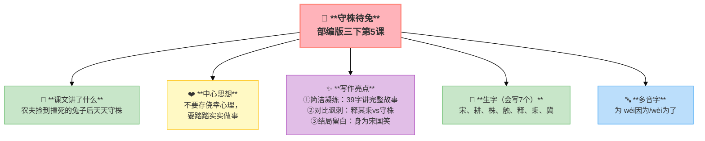
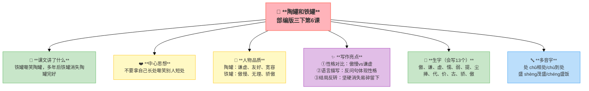
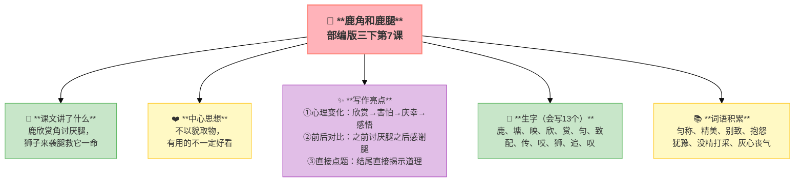
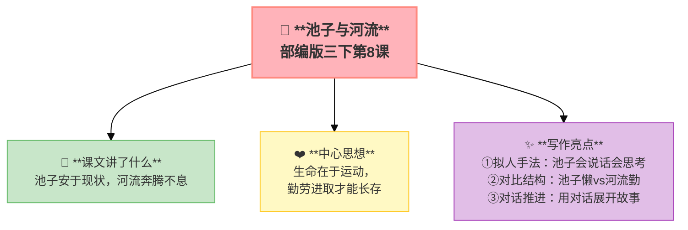

---
tags:
  - 三下
  - 语文
  - 寓言故事
  - 寓言
  - 道理
  - 文言文
---

# 第二单元 · 寓言故事

> 守株待兔、陶罐铁罐、鹿角鹿腿、池子河流——小故事里藏着大道理。
> **阅读重点**：读寓言，明道理
> **习作目标**：看图画，写一写（看图作文）

---

## 5 守株待兔（文言文）

> 部编版三下第5课（文言文）
> ⏰ 先读课文三遍，再往下看
> **阅读重点**：读寓言，明道理
> **习作目标**：看图画，写一写（看图作文）

---

### 📖 □核心 课文讲了什么

一个农夫偶然捡到撞死在树桩上的兔子，就放下农具天天守等，结果田荒了，兔子也没来。

---

### 💬 □核心 作者想说的话

**一个农夫偶然捡到一只撞死在树桩上的兔子，从此放下锄头，天天守在树桩旁等兔子。结果呢？庄稼荒了，兔子再也没来。**

---

### ✨ □了解 写作亮点

| 序号 | 亮点 | 说明 |
|:-----|:-----|:-----|
| ① | **简洁凝练** | 39个字讲完整故事，文言文的精炼之美 |
| ② | **对比讽刺** | "释其耒"vs"守株"，放下正事去等偶然，讽刺效果强 |
| ③ | **结局留白** | "而身为宋国笑"，不说结果，让读者自己体会 |

---

### 📝 □核心 生字（会写7个）

宋、耕、株、触、释、耒、冀

---

### 🔤 □了解 多音字

| 字 | 读音 | 组词 |
|:--|:-----|:-----|
| **为** | wéi | 因为 |
| | wèi | 为了 |

---

### 📚 □了解 词语积累

| 类别 | 词语 |
|:-----|:-----|
| **必会字词** | 宋、耕、株、触、释、耒、冀 |
| **古今异义** | 走（跑）、释（放下）、为（被） |

---

## 🏗️ 文章结构：超清晰！

| 部分 | 内容 | 作用 |
|:-----|:-----|:-----|
| **第一部分 🎬** | 宋人有耕者。田中有株 | 交代背景 |
| **第二部分 🔥** | 兔走触株，折颈而死。因释其耒而守株，冀复得兔 | **重点段落**，守株待兔 |
| **第三部分 🌱** | 兔不可复得，而身为宋国笑 | 结局，讽刺 |

> **💡 写作要点**：用**简洁凝练**的语言写故事，用**对比**突出讽刺效果。

---

## ✨ 阅读与写作：深挖课文"宝藏"

### 1️⃣ 原文 & 翻译

**原文**：宋人有耕者。田中有株。兔走触株，折颈而死。因释其耒而守株，冀复得兔。兔不可复得，而身为宋国笑。

**翻译**：宋国有一个耕田的人。田里有一棵树桩。一只兔子跑过来撞在树桩上，折断脖子死了。于是他就放下农具守着树桩，希望能再捡到兔子。兔子不可能再得到了，他自己却被宋国人笑话。

### 2️⃣ 重点字词

| 字 | 意思 | 组词 |
|:--|:-----|:-----|
| 株 | 树桩 | 树株、守株待兔 |
| 触 | 撞到 | 触摸、接触 |
| 释 | 放下 | 释放、爱不释手 |
| 耒 | 农具 | 耒耜 |
| 冀 | 希望 | 希冀 |

### 🖋️ □了解 原文对照仿写

| 原句 | 仿写练习 |
|:-----|:---------|
| "因释其耒而守株，冀复得兔" | 仿写：因____其____而____，冀____（用文言写一个"侥幸心理"场景） |
| "兔不可复得，而身为宋国笑" | 仿写：____不可复得，而身为____笑（用"……而……"写因果转折） |

---

### 💡 □了解 道理与思辨

**不要心存侥幸**，不要妄想不劳而获。

| 思辨问题 | 引导方向 | 表达小技巧 |
|:---------|:---------|:-----------|
| "农夫为什么会被宋国人笑话？" | 从"不劳而获"角度思考 | "因为……所以……"的句式 |
| "如果你是农夫，捡到兔子后会怎么做？" | 换位思考，合理选择 | "如果我是他，我会……因为……" |

---

## 📚 语言积累：词语库+句式库

> "因释其耒而守株，冀复得兔。"
> 
> 用简洁的语言写出农夫的侥幸心理。

---

---

## 📋 附录

## 📋 学习自评表（教-学-评一致性）✅

| 评价维度 | 我能做到（✅） | 需再练练（🔄） |
|:---------|:--------------|:---------------|
| **结构把握** | 能说出故事的起因、经过、结果 | |
| **语言运用** | 能正确朗读文言文，说出重点字词的意思 | |
| **朗读理解** | 能把文言文翻译成现代文 | |
| **思辨拓展** | 能说出寓言的道理，背诵全文 | |

---

## 6 陶罐和铁罐

> 部编版三下第6课
> ⏰ 先读课文三遍，再往下看
> **阅读重点**：读寓言，明道理
> **习作目标**：看图画，写一写（看图作文）

---

### 📖 □核心 课文讲了什么

铁罐傲慢地嘲笑陶罐"一碰就碎"，多年后宫殿倒塌，铁罐锈成土，陶罐却完好无损。

---

### 💬 □核心 作者想说的话

**铁罐总是嘲笑陶罐：'你敢碰我吗？'陶罐说：'不敢。'几百年后，陶罐还在，铁罐早已氧化不见了。**

---

### 👤 □了解 人物品质

| 人物 | 品质 |
|:-----|:-----|
| **陶罐** | 谦虚、友好、宽容 |
| **铁罐** | 傲慢、无理、骄傲 |

---

### ✨ □了解 写作亮点

| 序号 | 亮点 | 说明 |
|:-----|:-----|:-----|
| ① | **性格对比** | 铁罐傲慢vs陶罐谦虚，对比让形象更鲜明 |
| ② | **语言描写** | 铁罐的反问句、感叹句，语言体现性格 |
| ③ | **结局反转** | 坚硬的消失了，易碎的留下了，寓意深刻 |

---

### 📝 □核心 生字（会写13个）

傲、谦、虚、懦、弱、提、尘、捧、代、价、古、骄、傲

---

### 🔤 □了解 多音字

| 字 | 读音 | 组词 |
|:--|:-----|:-----|
| **处** | chǔ | 相处 |
| | chù | 到处 |
| **盛** | shèng | 茂盛 |
| | chng | ʢ |

---

### 📚 □了解 词语积累

| 类别 | 词语 |
|:-----|:-----|
| **必会字词** | 骄傲、傲慢、谦虚、懦弱、轻蔑、争辩、价值 |
| **近义词** | 傲慢——骄傲、谦虚——虚心、懦弱——软弱 |
| **反义词** | 骄傲——谦虚、懦弱——坚强、轻蔑——尊重 |

---

## 🏗️ 文章结构：超清晰！

| 部分 | 自然段 | 内容 | 作用 |
|:-----|:-------|:-----|:-----|
| **第一部分 🎬** | 1-9 | 铁罐骄傲，陶罐谦虚，铁罐多次嘲笑 | 交代背景，引出冲突 |
| **第二部分 🔥** | 10-17 | 陶罐温和回应（我们和睦相处吧） | **重点段落**，对话推进 |
| **第三部分 🌱** | 18 | 许多年后，铁罐消失，陶罐被挖出 | 结局反转，升华主题 |

> **💡 写作要点**：用**性格对比**突出人物，用**结局反转**深化寓意。

---

## ✨ 阅读与写作：深挖课文"宝藏"

### 1️⃣ 巧妙的对话（第2-9自然段）—— 人物描写

| 说话人 | 说的话 | 潜台词 | 朗读语气 |
|:-------|:-------|:-------|:---------|
| **铁罐** 😤 | "你敢碰我吗？陶罐子！" | 我比你强多了！ | 傲慢、挑衅 |
| **陶罐** 😊 | "不敢，铁罐兄弟。" | 我不想和你争吵 | 谦虚、友好 |
| **铁罐** 😤 | "我就知道你不敢，懦弱的东西！" | 你太没用了！ | 轻蔑、嘲讽 |
| **陶罐** 😊 | "我们和睦相处吧，何必互相伤害呢？" | 我们各有长处 | 温和、真诚 |

### 2️⃣ 对比表 —— 性格+结局

| 对比项 | 陶罐 | 铁罐 |
|:-------|:-----|:-----|
| **态度** | 谦虚、友好 | 傲慢、无理 |
| **话语** | "我们和睦相处吧" | "你敢碰我吗？" |
| **结局** | 完好无损，被挖出 | 锈蚀消失，无影无踪 |

### 🖋️ □了解 原文对照仿写

| 原句 | 仿写练习 |
|:-----|:---------|
| "你敢碰我吗？陶罐子！" / "不敢，铁罐兄弟。" | 仿写一段"骄傲vs谦虚"的对话（用两个不同性格的人物对话） |

---

### 💡 □了解 道理与思辨

每个人都有长处和短处，不要拿自己的长处嘲笑别人的短处。

| 思辨问题 | 引导方向 | 表达小技巧 |
|:---------|:---------|:-----------|
| "铁罐为什么消失了？" | 从"材料特点"角度思考 | "因为……所以……"的句式 |
| "如果你是陶罐，会怎么对待铁罐？" | 换位思考，体会宽容的力量 | "如果我是他，我会……因为……" |

---

## 📚 语言积累：词语库+句式库

> "你敢碰我吗？陶罐子！"
> 
> 反问句，表现出铁罐的傲慢。

> "不敢，铁罐兄弟。"
> 
> 简单的回答，表现出陶罐的谦虚。

---

## 📋 学习自评表（教-学-评一致性）✅

| 评价维度 | 我能做到（✅） | 需再练练（🔄） |
|:---------|:--------------|:---------------|
| **结构把握** | 能说出陶罐和铁罐的不同态度和结局 | |
| **语言运用** | 能正确读写13个生字，会用多音字 | |
| **朗读理解** | 能分角色朗读，读出不同语气 | |
| **思辨拓展** | 能说出寓言的道理，理解"尺有所短，寸有所长" | |

---

## 7 鹿角和鹿腿

> 部编版三下第7课
> ⏰ 先读课文三遍，再往下看
> **阅读重点**：读寓言，明道理
> **习作目标**：看图画，写一写（看图作文）

---

### 📖 □核心 课文讲了什么

鹿欣赏自己美丽的角，却讨厌细长的腿。遇到狮子时，角差点被挂住，腿却帮它逃生。

---

### 💬 □核心 作者想说的话

**鹿看到自己的角：'啊，多么匀称的角！'看到自己的腿：'唉，太细了。'可遇到狮子时，细长的腿救了它，漂亮的角却差点让它送命。**

---

### ✨ □了解 写作亮点

| 序号 | 亮点 | 说明 |
|:-----|:-----|:-----|
| ① | **心理变化** | 欣赏→害怕→庆幸→感悟，用心情变化推动故事 |
| ② | **前后对比** | 之前讨厌腿，之后感谢腿，反转让道理更深刻 |
| ③ | **直接点题** | "两只美丽的角差点儿送了我的命"，结尾直接揭示道理 |

---

### 📝 □核心 生字（会写13个）

鹿、塘、映、欣、赏、匀、致、配、传、哎、狮、追、叹

---

### 📚 □了解 词语积累

| 类别 | 词语 |
|:-----|:-----|
| **必会字词** | 匀称、精美、别致、抱怨、犹豫、没精打采、灰心丧气 |
| **近义词** | 精美——精致、别致——新颖、抱怨——埋怨 |
| **反义词** | 没精打采——精神抖擞、灰心丧气——信心满满 |

---

## 🏗️ 文章结构：超清晰！

| 部分 | 自然段 | 内容 | 作用 |
|:-----|:-------|:-----|:-----|
| **第一部分 🎬** | 1-4 | 池塘边喝水（欣赏角，抱怨腿） | 交代背景，引出矛盾 |
| **第二部分 🔥** | 5-6 | 遇到狮子→角被挂住→腿帮逃生 | **重点段落**，情节反转 |
| **第三部分 🌱** | 7 | 感叹（角差点害死我，腿却救了我） | 升华主题，揭示道理 |

> **💡 写作要点**：用**心理变化**推动情节，用**前后对比**深化寓意。

---

## ✨ 阅读与写作：深挖课文"宝藏"

### 1️⃣ 鹿的心情变化（全文）—— 心理描写

| 阅读要点 | 写法分析 | 写作小技巧 |
|:---------|:---------|:-----------|
| "啊！我的身段多么匀称，我的角多么精美别致！" 😊 | 用感叹句写出欣赏和自豪 | 写心情可以用感叹句 |
| "唉，这四条腿太细了，怎么配得上这两只角呢？" 😞 | 用反问句写出抱怨和不满 | 写心情可以用反问句 |
| "两只美丽的角差点儿送了我的命，可四条难看的腿却让我狮口逃生！" 💪 | 用对比揭示道理 | 结尾可以直接点题 |

### 🖋️ □了解 原文对照仿写

| 原句 | 仿写练习 |
|:-----|:---------|
| "啊！我的身段多么匀称，我的角多么精美别致！" | 仿写：啊！我的____多么____，我的____多么____（用感叹句写"欣赏自己"的句子） |
| "两只美丽的角差点儿送了我的命，可四条难看的腿却让我狮口逃生！" | 仿写：____差点儿____，可____却让我____（用对比句写一个"反转"） |

---

### 💡 □了解 道理与思辨

**不要以貌取"物"**——有用的东西不一定好看，好看的东西不一定有用。

| 思辨问题 | 引导方向 | 表达小技巧 |
|:---------|:---------|:-----------|
| "鹿的角和腿各有什么作用？" | 从"功能vs美观"角度思考 | "角可以……腿可以……"的句式 |
| "生活中有没有'好看但没用'的东西？" | 联系生活实际，培养辩证思维 | "比如……虽然好看，但是……" |

---

## 📚 语言积累：词语库+句式库

> "两只美丽的角差点儿送了我的命，可四条难看的腿却让我狮口逃生！"
> 
> 用对比句揭示道理，前后转折。

---

## 📋 学习自评表（教-学-评一致性）✅

| 评价维度 | 我能做到（✅） | 需再练练（🔄） |
|:---------|:--------------|:---------------|
| **结构把握** | 能说出鹿对角和腿态度的变化 | |
| **语言运用** | 能正确读写13个生字，会用多音字 | |
| **朗读理解** | 能读出鹿的心情变化 | |
| **思辨拓展** | 能说出寓言的道理，联系生活谈"好看vs有用" | |

---

## 8* 池子与河流（略读）

> 部编版三下第8课（略读课文）
> ⏰ 先读课文三遍，再往下看
> **阅读重点**：读寓言，明道理
> **习作目标**：看图画，写一写（看图作文）

---

### 📖 □核心 课文讲了什么

池子安于现状天天睡觉，河流忙碌奔腾不息。多年后池子干涸，河流依然滚滚向前。

---

### 💬 □核心 作者想说的话

**池子说：'我安安稳稳地躺着，多舒服。'河流说：'我每天奔流不息。'结果池子淤泥堆满，河流长流不断。**

---

### ✨ □了解 写作亮点

| 序号 | 亮点 | 说明 |
|:-----|:-----|:-----|
| ① | **拟人手法** | 池子会说话、会思考，把事物当人写生动有趣 |
| ② | **对比结构** | 池子的懒vs河流的勤，对比突出主题 |
| ③ | **对话推进** | 用池子和河流的对话展开，对话让故事更有张力 |

---

### 📚 □了解 词语积累

| 类别 | 词语 |
|:-----|:-----|
| **必会字词** | 池子、河流、安逸、忙碌、奔腾、清闲 |
| **近义词** | 安逸——舒适、忙碌——繁忙 |
| **反义词** | 安逸——忙碌、清闲——繁忙 |

---

## 🏗️ 文章结构：超清晰！

| 部分 | 内容 | 作用 |
|:-----|:-----|:-----|
| **第一部分 🎬** | 池子安于现状，天天睡觉 | 交代背景 |
| **第二部分 🔥** | 河流忙碌奔腾不息 | **重点段落**，对比展开 |
| **第三部分 🌱** | 多年后池子干涸，河流依然滚滚向前 | 结局，揭示道理 |

> **💡 写作要点**：用**拟人手法**让事物会说话，用**对比结构**突出主题。

---

## 📚 语言积累：词语库+句式库

> "水要流动才能保持清洁。"
> 
> 简单的话揭示深刻的道理。

---

### 💡 □了解 道理与思辨

**生命在于运动**。懒惰安逸的终将消亡，勤劳进取的才能长存。

| 思辨问题 | 引导方向 | 表达小技巧 |
|:---------|:---------|:-----------|
| "池子为什么干涸了？" | 从"运动vs静止"角度思考 | "因为……所以……"的句式 |
| "你愿意做池子还是河流？" | 联系生活实际，表达自己的选择 | "我愿意做……因为……" |

---

## 📚 语言积累：词语库+句式库

> "水要流动才能保持清洁。"
> 
> 简单的话揭示深刻的道理。

---

## 📋 学习自评表（教-学-评一致性）✅

| 评价维度 | 我能做到（✅） | 需再练练（🔄） |
|:---------|:--------------|:---------------|
| **结构把握** | 能说出池子和河流的不同态度和结局 | |
| **语言运用** | 能正确读写重点词语 | |
| **朗读理解** | 能分角色朗读池子和河流的对话 | |
| **思辨拓展** | 能说出寓言的道理，理解"生命在于运动" | |

---

## ✍️ 习作：看图画，写一写

### 🎯 □核心 目标
观察一幅图画，把看到的、想到的按顺序写下来。

### 📐 □了解 写作框架

1. **整体观察**（一句话概括）
2. **背景/环境**（时间地点天气）
3. **主体内容**（谁在干什么，按顺序写）
4. **细节/想象**（给画面加故事）
5. **感受**（看完这幅图你想说什么）

### 🔍 结构拆解

| 部分 | 内容 | 作用 |
|:-----|:-----|:-----|
| **整体观察** | 一句话说清图画主要场景 | 开头点题 |
| **背景环境** | 时间、地点、天气 | 交代背景 |
| **主体内容** | 谁在干什么，按顺序写 | 核心描写 |
| **细节想象** | 加入人物对话、心理活动 | 丰富画面 |
| **结尾感受** | 看完图想说什么 | 升华主题 |

### 📝 □了解 同学初稿 vs 修改稿

| 对比项 | 初稿（同学B） | 修改稿 |
|:-------|:-------------|:-------|
| **开头** | 这是一幅图。图上有几个小朋友在放风筝。 | 蓝蓝的天空中飘着几朵白云，几个小朋友在草地上放风筝。 |
| **顺序** | 先写小明在放风筝，又写远处的楼房，又写天上的云 | 按"天空→草地→放风筝的小朋友→远处"的顺序，条理更清晰 |
| **想象** | 他们玩得很开心。 | 小明拉着风筝线，心想："再高一点！一定能超过那只蝴蝶风筝！" |
| **评价** | 杂乱无章，没有重点 | 有顺序、有想象、有细节 |

---

## ❓ 关联性问题

1. 守株待兔和池子与河流都讲"不劳而获"——两个故事的主角有什么不同？
2. 陶罐和铁罐、鹿角和鹿腿都用了"对比"手法——你发现对比在寓言里有什么作用？
3. 学完四个寓言后，能不能总结：寓言是怎么"讲故事说道理"的？

---

## 🔗 跨文本对比

| 对比维度 | 5 守株待兔 | 6 陶罐和铁罐 | 7 鹿角和鹿腿 | 8 池子与河流 |
|:-----|:-----|:-----|:-----|:-----|
| 文体 | 文言文寓言 | 现代寓言 | 寓言（改编） | 诗歌体寓言 |
| 主角 | 农民 | 陶罐+铁罐 | 鹿 | 池子+河流 |
| 反面 | 不劳而获 | 骄傲自大 | 只看外表 | 贪图安逸 |
| 正能量 | 勤劳 | 谦虚 | 实用 | 奋斗 |
| 道理 | 不要依赖运气 | 要看到别人优点 | 有用比好看重要 | 生命在于运动 |

---

## 📚 课外书吧

1. **《伊索寓言》**——世界上最有名的寓言集，狐狸和葡萄、龟兔赛跑都出自这里
2. **《中国古代寓言故事》**——守株待兔、揠苗助长、井底之蛙……每一个都是中国智慧

## 🗣️ 语文生活

> **周末观察身边的人或事，看看有没有"寓言"能在生活中找到？**
>
> 比如：同学考试前不好好复习（"临时抱佛脚"——跟守株待兔的农夫像不像？）
>
> 试着把观察到的写成一段话，看看像不像"生活寓言"。

## 🔄 老朋友回来啦

| 词语 | 之前在哪见过 | 本单元出现 |
|:-----|:------------|:----------|
| 骄傲 | 三上第四单元《总也倒不了的老屋》"我很骄傲" | 《陶罐和铁罐》"骄傲的铁罐" |
| 价值 | 三上第六单元《富饶的西沙群岛》"更有价值" | 《陶罐和铁罐》"你将来会很有价值" |
| 欣赏 | 本课新学 | 《鹿角和鹿腿》"欣赏" |
| 别致 | 三上第七单元《大自然的声音》"别致" | 《鹿角和鹿腿》"精美别致" |

✅ ⬛⬛ 阅读纵向衔接：

| 老朋友 | 出自 | 再认读 |
|:-------|:-----|:-------|
| **读懂寓言** | 二下《揠苗助长》《亡羊补牢》 | 二下初识→三下系统学：明白故事→体会道理→联系生活 |
## 🌐 三通

1. **古代寓言 × 现代生活：** 守株待兔的农夫，在现在社会还有吗？（比如买彩票想一夜暴富）
2. **寓言 × 道德：** 为什么寓言结尾都要有一个"道理"？能不能没有道理？
3. **中外寓言大比拼：** 你更喜欢中国寓言还是伊索寓言？它们讲故事的方式有什么不同？

---

## 📎 拓展
- 延伸阅读：《伊索寓言》《中国古代寓言故事》
- 口语交际：该不该实行班干部轮流制
- 语文园地二：交流平台（寓言的特点）

---

## 📖 语文园地

> 守株待兔、陶罐铁罐、鹿角鹿腿、池子河流——小故事里藏着大道理。
> **阅读重点**：读寓言，明道理
> **习作目标**：看图画，写一写（看图作文）

> ⏰ 先读课文三遍，再往下翻
---

## □核心 交流平台

- 寓言故事篇幅虽短，但背后都有一个深刻的道理
- 读寓言时先读懂故事，再想一想作者想告诉我们什么
- 同一个寓言可以从不同角度理解，没有标准答案

---

## □核心 词句段运用

- 成语积累：守株待兔、掩耳盗铃、亡羊补牢、画蛇添足、刻舟求剑
- 选一个成语寓言，讲出故事并说出道理
- 仿写对话——用提示语在中间、在前面、在后面三种形式

---

## □核心 日积月累

**邯郸学步（文言片段）**

寿陵余子之学行于邯郸，未得国能，又失其故行矣，直匍匐而归耳。

**寓言成语小积累**

- 画龙点睛 | 画蛇添足 | 自相矛盾 | 掩耳盗铃
- 寓理于事，含蓄深刻；小故事，大智慧。