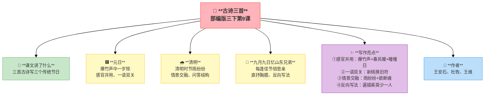
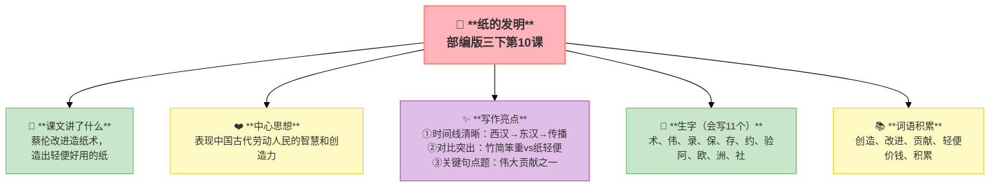
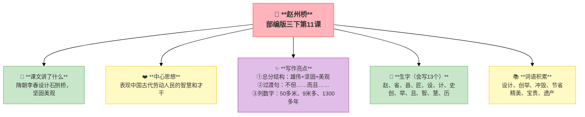
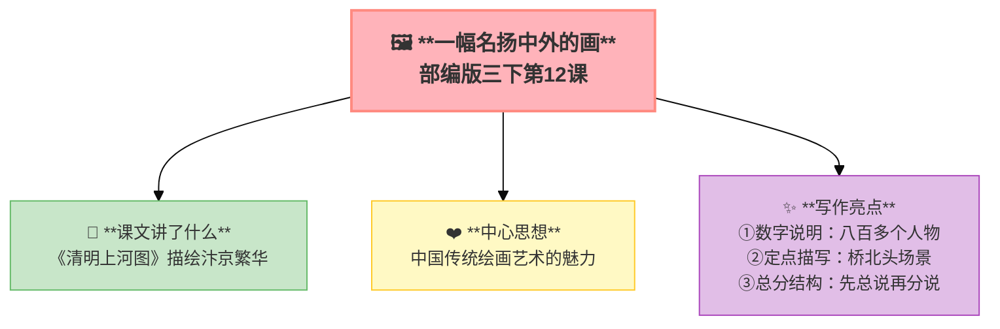

---
tags:
  - 三下
  - 语文
  - 中华传统文化
  - 古诗
  - 发明
  - 建筑
---

# 第三单元 · 中华传统文化

> 春节、清明、重阳——在古诗里过节；纸、桥、画——看古人的智慧。
> **阅读重点**：围绕一个意思把一段话写清楚
> **习作目标**：中华传统节日（综合性学习）

---

## 9 古诗三首

> 部编版三下第9课
> ⏰ 先读课文三遍，再往下看
> **阅读重点**：围绕一个意思把一段话写清楚
> **习作目标**：中华传统节日（综合性学习）

---

### 📖 □核心 课文讲了什么

三首古诗分别描写了三个传统节日——王安石写春节除旧迎新，杜牧写清明雨中问路，王维写重阳思念家乡。

---

### 💬 □核心 作者想说的话

**通过描写传统节日的习俗和诗人的情感，表达了对传统文化的热爱和对家乡亲人的思念。**

---

### ✨ □了解 写作亮点

| 序号 | 亮点 | 说明 |
|:-----|:-----|:-----|
| ① | **感官并用** | 爆竹声（听觉）、春风暖（触觉）、曈曈日（视觉） |
| ② | **一语双关** | "新桃换旧符"既写习俗又写改革 |
| ③ | **情景交融** | 雨纷纷＋欲断魂，景物和心情合二为一 |
| ④ | **反向写法** | 不写我想兄弟，写兄弟少一人，思念更深 |

---

### 📝 □核心 生字（会写X个）

屠、苏、旧、符、欲、魂、借、酒、牧、兄、独、异、佳

---

### 📚 □了解 词语积累

| 类别 | 词语 |
|:-----|:-----|
| **必会字词** | 元日、屠苏、曈曈、桃符、清明、纷纷、断魂、茱萸 |
| **近义词** | 除——去、送——暖、思——念 |
| **反义词** | 新——旧、少——多 |

---

## 🏗️ 文章结构：超清晰！

| 部分 | 内容 | 作用 |
|:-----|:-----|:-----|
| **元日** | 爆竹声→春风暖→曈曈日→换桃符 | 春节除旧迎新 |
| **清明** | 雨纷纷→欲断魂→借问酒家→牧童遥指 | 清明雨中问路 |
| **九月九日忆山东兄弟** | 独在异乡→每逢佳节→遥知兄弟→少一人 | 重阳思念家乡 |

> **💡 写作要点**：用**多感官**写节日，用**情景交融**表达情感。

---

## ✨ 阅读与写作：深挖课文"宝藏"

### 1️⃣ 元日 · 王安石 —— 感官并用+一语双关

| 阅读要点 | 写法分析 | 写作小技巧 |
|:---------|:---------|:-----------|
| 爆竹声（听觉）、春风暖（触觉）、曈曈日（视觉） 🎆 | 多感官描写节日气氛 | 写节日要调动多种感官 |
| "新桃换旧符" 🔄 | 既写习俗又写改革 | 可以一语双关 |

### 2️⃣ 清明 · 杜牧 —— 情景交融+问答结构

| 阅读要点 | 写法分析 | 写作小技巧 |
|:---------|:---------|:-----------|
| 雨纷纷＋欲断魂 🌧️ | 景物和心情合二为一 | 情景交融更动人 |
| 借问→遥指 🗣️ | 有问有答，画面感强 | 可以用问答结构 |

### 3️⃣ 九月九日忆山东兄弟 · 王维 —— 直抒胸臆+反向写法

| 阅读要点 | 写法分析 | 写作小技巧 |
|:---------|:---------|:-----------|
| "每逢佳节倍思亲" 💕 | 直接说出思念，引发共鸣 | 可以直抒胸臆 |
| "遍插茱萸少一人" 👤 | 从对方角度写，思念更深 | 反向写法更深刻 |

### 🖋️ □了解 原文对照仿写

| 原句 | 仿写练习 |
|:-----|:---------|
| "爆竹声中一岁除，春风送暖入屠苏" | 仿写：____声中一岁除，____送暖入____（用"声音+温暖"写一个节日） |
| "遥知兄弟登高处，遍插茱萸少一人" | 仿写：遥知____登高____，遍插____少一人（用"从对方角度写"表达思念） |

---

### 💡 □了解 道理与思辨

| 思辨问题 | 引导方向 | 表达小技巧 |
|:---------|:---------|:-----------|
| "为什么'每逢佳节倍思亲'？" | 联系生活实际，体会节日的团圆意义 | "因为……所以……"的句式 |
| "如果你在外地，会怎么想家？" | 换位思考，表达自己的感受 | "如果我是他，我会……因为……" |

---

## 📚 语言积累：词语库+句式库

> "爆竹声中一岁除，春风送暖入屠苏。"
> 
> 用声音和触觉写春节的热闹。

> "清明时节雨纷纷，路上行人欲断魂。"
> 
> 情景交融，写出清明的哀思。

> "独在异乡为异客，每逢佳节倍思亲。"
> 
> 直抒胸臆，表达思乡之情。

---

---

## 📋 附录

## 📋 学习自评表（教-学-评一致性）✅

| 评价维度 | 我能做到（✅） | 需再练练（🔄） |
|:---------|:--------------|:---------------|
| **结构把握** | 能说出每首诗写的节日 | |
| **语言运用** | 能正确朗读三首古诗，说出重点字词的意思 | |
| **朗读理解** | 能找出诗中的名句并理解含义 | |
| **思辨拓展** | 能背诵三首古诗，理解诗人的情感 | |

---

## 10 纸的发明

> 部编版三下第10课
> ⏰ 先读课文三遍，再往下看
> **阅读重点**：围绕一个意思把一段话写清楚
> **习作目标**：中华传统节日（综合性学习）

---

### 📖 □核心 课文讲了什么

造纸术是中国四大发明之一，东汉蔡伦用树皮、麻头、破布造出了轻便好用的纸。

---

### 💬 □核心 作者想说的话

**通过介绍造纸术的发明和改进，表现了中国古代劳动人民的智慧和创造力。**

---

### ✨ □了解 写作亮点

| 序号 | 亮点 | 说明 |
|:-----|:-----|:-----|
| ① | **时间线清晰** | 西汉→东汉→传播，按时间顺序写演变 |
| ② | **对比突出** | 竹简笨重vs纸轻便，对比让优点更明显 |
| ③ | **关键句点题** | "伟大贡献之一"，首尾呼应强调意义 |

---

### 📝 □核心 生字（会写X个）

术、伟、录、保、存、约、验、阿、欧、洲、社

---

### 📚 □了解 词语积累

| 类别 | 词语 |
|:-----|:-----|
| **必会字词** | 创造、改进、贡献、轻便、价钱、积累 |
| **近义词** | 创造——发明、改进——改良、轻便——轻巧 |
| **反义词** | 轻便——笨重、便宜——昂贵 |

---

## 🏗️ 文章结构：超清晰！

| 部分 | 内容 | 作用 |
|:-----|:-----|:-----|
| **第一部分 🎬** | 造纸术的重要性（伟大贡献） | 总起，点明意义 |
| **第二部分 🔥** | 纸发明前的书写材料（龟甲→竹简→帛） | **重点段落**，对比铺垫 |
| **第三部分 🔥** | 蔡伦改进造纸术（原料＋方法） | **重点段落**，详细介绍 |
| **第四部分 🌱** | 造纸术的传播（传到全世界） | 总结，升华意义 |

> **💡 写作要点**：用**时间线**写演变，用**对比**突出优点。

---

## ✨ 阅读与写作：深挖课文"宝藏"

### 1️⃣ 书写材料演变表 —— 对比说明

| 时期 | 书写材料 | 缺点 |
|:-----|:---------|:-----|
| 西汉前 | 龟甲、兽骨、青铜 | 太重/太贵 |
| 西汉 | 竹简、木牍 | 笨重 |
| 西汉 | 帛 | 太贵 |
| 东汉（蔡伦） | 纸 | 轻便、便宜 |

### 2️⃣ 关键句分析

| 关键句 | 作用 |
|:-------|:-----|
| "造纸术是中国四大发明之一" | 总起，点明重要性 |
| "大约在一千九百年前的东汉时代" | 时间说明，交代背景 |
| "用这种方法造的纸，原料容易得到……" | 说明优点，解释原因 |

### 🖋️ □了解 原文对照仿写

| 原句 | 仿写练习 |
|:-----|:---------|
| "龟甲和兽骨上的文字……竹片和木片……帛……" | 仿写：用"先……后来……再后来……"写一个事物的发展变化过程 |

---

### 💡 □了解 道理与思辨

| 思辨问题 | 引导方向 | 表达小技巧 |
|:---------|:---------|:-----------|
| "为什么说造纸术是伟大贡献？" | 联系生活实际，体会纸的重要性 | "因为……所以……"的句式 |
| "如果生活中没有纸会怎样？" | 想象没有纸的生活，感受发明的意义 | "如果没有纸，那么……" |

---

## 📚 语言积累：词语库+句式库

> "造纸术是中国四大发明之一。"
> 
> 总起句，点明造纸术的重要地位。

> "大约在一千九百年前的东汉时代，有个叫蔡伦的人……"
> 
> 用时间和人物引入，条理清晰。

---

## 📋 学习自评表（教-学-评一致性）✅

| 评价维度 | 我能做到（✅） | 需再练练（🔄） |
|:---------|:--------------|:---------------|
| **结构把握** | 能说出造纸术的发明和改进过程 | |
| **语言运用** | 能正确读写11个生字，会用多音字 | |
| **朗读理解** | 能填写书写材料演变表 | |
| **思辨拓展** | 能说出造纸术的伟大贡献，联系生活谈纸的重要性 | |

---

## 11 赵州桥

> 部编版三下第11课
> ⏰ 先读课文三遍，再往下看
> **阅读重点**：围绕一个意思把一段话写清楚
> **习作目标**：中华传统节日（综合性学习）

---

### 📖 □核心 课文讲了什么

赵州桥是隋朝李春设计的石拱桥，没有桥墩，坚固美观，是宝贵的历史遗产。

---

### 💬 □核心 作者想说的话

**通过介绍赵州桥的设计特点和美观造型，表现了中国古代劳动人民的智慧和才干。**

---

### ✨ □了解 写作亮点

| 序号 | 亮点 | 说明 |
|:-----|:-----|:-----|
| ① | **总分结构** | 雄伟＋坚固＋美观，围绕一个意思展开 |
| ② | **过渡句** | "不但……而且……"，承上启下连接自然 |
| ③ | **列数字** | 50多米、9米多、1300多年，用数字说明更准确 |

---

### 📝 □核心 生字（会写X个）

赵、省、县、匠、设、计、史、创、举、且、智、慧、历

---

### 📚 □了解 词语积累

| 类别 | 词语 |
|:-----|:-----|
| **必会字词** | 设计、创举、冲毁、节省、精美、宝贵、遗产 |
| **近义词** | 精美——精致、宝贵——珍贵、创举——壮举 |
| **反义词** | 节省——浪费、精美——粗糙 |

---

## 🏗️ 文章结构：超清晰！

| 部分 | 自然段 | 内容 | 作用 |
|:-----|:-------|:-----|:-----|
| **第一部分 🎬** | 1 | 赵州桥的位置和设计者 | 交代背景 |
| **第二部分 🔥** | 2 | 雄伟（长50多米，宽9米多，没有桥墩） | **重点段落**，雄伟特点 |
| **第三部分 🔥** | 3 | 坚固（小桥洞减轻冲击） | **重点段落**，坚固原因 |
| **第四部分 🔥** | 4 | 美观（栏板上雕刻着精美的龙） | **重点段落**，美观造型 |

> **💡 写作要点**：用**总分结构**围绕一个意思写，用**过渡句**连接段落。

---

## ✨ 阅读与写作：深挖课文"宝藏"

### 1️⃣ 赵州桥的三个特点 —— 说明方法

| 特点 | 内容 | 说明方法 |
|:-----|:-----|:---------|
| **雄伟** | 长50多米，宽9米多，没有桥墩 | 列数字 |
| **坚固** | 小桥洞减轻洪水冲击 | 举例子 |
| **美观** | 栏板上雕刻着精美的龙 | 描写 |

### 2️⃣ 过渡句分析

> "这座桥不但坚固，而且美观。"

**作用**：承上启下，连接"坚固"和"美观"两个部分。

### 🖋️ □了解 原文对照仿写

| 原句 | 仿写练习 |
|:-----|:---------|
| "赵州桥非常雄伟。桥长五十多米，有九米多宽" | 仿写：____非常____。____长____多米，有____米多____（用列数字写一个建筑物） |
| "这座桥不但坚固，而且美观。" | 仿写：这座____不但____，而且____。（用"不但……而且……"写过渡句） |

---

### 💡 □了解 道理与思辨

| 思辨问题 | 引导方向 | 表达小技巧 |
|:---------|:---------|:-----------|
| "赵州桥为什么能保存1300多年？" | 从设计角度思考，体会古人的智慧 | "因为……所以……"的句式 |
| "赵州桥的'创举'是什么？" | 理解"没有桥墩"的设计意义 | "赵州桥的创举是……因为……" |

---

## 📚 语言积累：词语库+句式库

> "这座桥不但坚固，而且美观。"
> 
> 过渡句，承上启下。

> "有的刻着两条相互缠绕的龙，嘴里吐出美丽的水花；有的刻着两条飞龙，前爪相互抵着，各自回首遥望……"
> 
> 排比句，写出栏板上龙的姿态。

---

## 📋 学习自评表（教-学-评一致性）✅

| 评价维度 | 我能做到（✅） | 需再练练（🔄） |
|:---------|:--------------|:---------------|
| **结构把握** | 能说出赵州桥的三个特点 | |
| **语言运用** | 能正确读写13个生字，会用多音字 | |
| **朗读理解** | 能找出过渡句，理解其作用 | |
| **思辨拓展** | 能用"不但……而且……"写句子 | |

---

## 12* 一幅名扬中外的画（略读）

> 部编版三下第12课（略读课文）
> ⏰ 先读课文三遍，再往下看
> **阅读重点**：围绕一个意思把一段话写清楚
> **习作目标**：中华传统节日（综合性学习）

---

### 📖 □核心 课文讲了什么

北宋张择端画的《清明上河图》，描绘了汴京的繁华，画上有八百多个人物，是中国绘画史上的瑰宝。

---

### 💬 □核心 作者想说的话

**通过介绍《清明上河图》的内容和艺术价值，表现了中国传统绘画艺术的魅力。**

---

### ✨ □了解 写作亮点

| 序号 | 亮点 | 说明 |
|:-----|:-----|:-----|
| ① | **数字说明** | 八百多个人物、几十条船，用数字突出画的价值 |
| ② | **定点描写** | 桥北头的情景，聚焦一个点写活一个场景 |
| ③ | **总分结构** | 先总说画，再分说细节，条理清晰 |

---

### 📚 □了解 词语积累

| 类别 | 词语 |
|:-----|:-----|
| **必会字词** | 名扬中外、北宋、都城、汴京、热闹 |
| **近义词** | 热闹——喧闹、名扬中外——闻名中外 |
| **反义词** | 热闹——冷清 |

---

## 🏗️ 文章结构：超清晰！

| 部分 | 内容 | 作用 |
|:-----|:-----|:-----|
| **第一部分 🎬** | 总说《清明上河图》 | 交代背景 |
| **第二部分 🔥** | 分说画中内容（人物、街市、桥北头） | **重点段落**，详细介绍 |
| **第三部分 🌱** | 总结画的价值 | 升华意义 |

> **💡 写作要点**：用**总分结构**介绍事物，用**定点描写**写活场景。

---

## 📚 语言积累：词语库+句式库

> "画上的街市可热闹了。"
> 
> 总起句，引出街市的热闹场景。

---

### 💡 □了解 道理与思辨

| 思辨问题 | 引导方向 | 表达小技巧 |
|:---------|:---------|:-----------|
| "《清明上河图》为什么有名？" | 从艺术价值和历史价值思考 | "因为……所以……"的句式 |
| "如果你看到这幅画，会关注哪里？" | 联系自己的兴趣，表达看法 | "我最关注……因为……" |

---

## 📚 语言积累：词语库+句式库

> "画上的街市可热闹了。"
> 
> 总起句，引出街市的热闹场景。

---

## 📋 学习自评表（教-学-评一致性）✅

| 评价维度 | 我能做到（✅） | 需再练练（🔄） |
|:---------|:--------------|:---------------|
| **结构把握** | 能说出《清明上河图》的主要内容 | |
| **语言运用** | 能正确读写重点词语 | |
| **朗读理解** | 能找出画中最有意思的部分 | |
| **思辨拓展** | 能说出这幅画为什么有名 | |

---

## ✍️ 习作：中华传统节日（综合性学习）

### 🎯 □核心 目标
选一个传统节日，收集资料，了解节日的来历、习俗，写一篇介绍文章。

### 📐 □了解 写作框架

1. **节日名称和时间**
2. **节日的来历**
3. **节日的习俗**
4. **我是怎么过节的**
5. **节日感受**

### 🧩 传统节日素材

| 节日 | 时间 | 习俗 | 吃食 |
|:----|:----|:-----|:-----|
| 春节 | 正月初一 | 贴春联、放鞭炮、拜年 | 饺子、年糕 |
| 元宵节 | 正月十五 | 看花灯、猜灯谜 | 汤圆 |
| 清明节 | 4月5日左右 | 扫墓、踏青 | 青团 |
| 端午节 | 五月初五 | 赛龙舟、挂艾草 | 粽子 |
| 中秋节 | 八月十五 | 赏月、拜月 | 月饼 |
| 重阳节 | 九月初九 | 登高、敬老 | 重阳糕 |

### 📝 □了解 同学初稿 vs 修改稿

| 对比项 | 初稿（同学C） | 修改稿 |
|:-------|:-------------|:-------|
| **开头** | 端午节要吃粽子。 | "五月五，是端阳"——每年农历五月初五，迎来了我最喜欢的端午节。 |
| **来历** | 端午节是为了纪念屈原。 | 相传爱国诗人屈原投江殉国，人们为了不让鱼虾吃他的身体，纷纷往江里扔粽子、划龙舟。 |
| **习俗** | 我吃粽子，看龙舟。 | 奶奶包粽子的手可巧了——碧绿的粽叶在她手里一折一叠，糯米和红枣就变成了三角形的粽子。 |
| **评价** | 像列清单，没有画面 | 有来历、有习俗、有画面，读起来像真的在过节 |

---

## ❓ 关联性问题

1. 古诗三首写了春节、清明、重阳三个节日——你能用一句话总结，古人在这些节日里做什么吗？
2. 纸的发明和赵州桥都用"时间线"来写——为什么写传统文化要用时间线？
3. 本单元四篇课文写了节日、科技、建筑、绘画——你发现"传统文化"包括哪些方面了吗？

---

## 🔗 跨文本对比

| 对比维度 | 9 古诗三首 | 10 纸的发明 | 11 赵州桥 | 12 一幅名扬中外的画 |
|:-----|:-----|:-----|:-----|:-----|
| 主题 | 传统节日 | 传统科技 | 传统建筑 | 传统艺术 |
| 文体 | 古诗 | 说明文 | 说明文 | 说明文 |
| 时间线 | 春节/清明/重阳 | 从古到今 | 历时1400年 | 900年前 |
| 共同点 | 都是中国文化瑰宝，都体现了古人的智慧和情感 |

💡 **阅读启示**：传统文化不只是"旧东西"——它是活着的记忆。过春节时放爆竹喝屠苏（古诗），写字用的纸是蔡伦发明的（纸），走过的桥有1400年历史（赵州桥），看到的古画画的是宋朝的街市（清明上河图）。文化就在我们身边。

---

## 📚 课外书吧

1. **《中国传统文化图鉴》**——节日、建筑、科技、艺术，一本书看遍中国传统文化
2. **《清明上河图》绘本版**——带着课本去看这幅画，一定能发现更多细节

## 🗣️ 语文生活

> **选一个传统节日，向家人做个"节日小讲座"——说清楚来历、习俗和你的感受。**
>
> 最好能让家里人补充他们小时候是怎么过这个节的，三代人的节日故事一定很有意思。

## 🔄 老朋友回来啦

| 词语 | 之前在哪见过 | 本单元出现 |
|:-----|:------------|:----------|
| 贡献 | 三下第三课《荷花》"贡献" | 《纸的发明》"伟大贡献" |
| 创举 | 本单元新学 | 《赵州桥》"创举" |
| 宝贵 | 三上第六单元《富饶的西沙群岛》"宝贵的肥料" | 《赵州桥》"宝贵的历史遗产" |
| 热闹 | 三上第二单元《铺满金色巴掌的水泥道》"很热闹" | 《一幅名扬中外的画》"街市可热闹了" |

✅ ⬛⬛ 阅读纵向衔接：

| 老朋友 | 出自 | 再认读 |
|:-------|:-----|:-------|
| **围绕一个意思把一段话写清楚** | 三上第六单元"借助关键句理解一段话" | 三上从阅读角度学→三下从写作角度学，读写结合 |
## 🌐 三通

1. **古人过节vs现代过节：** 古人在春节喝屠苏酒、放爆竹，现在我们怎么过春节？什么变了，什么没变？
2. **中国的"四大发明"还有什么？** 造纸术是其中之一，你知道其他三个吗？它们对世界有什么影响？
3. **除了文中提到的，中国还有哪些传统艺术？** 戏曲、书法、瓷器……选一个最感兴趣的来说说。

---

## 📎 拓展
- 综合性学习展示：手抄报、节日故事会
- 语文园地三：交流平台（围绕一个意思写）

---

## 📖 语文园地

> 春节、清明、重阳——在古诗里过节；纸、桥、画——看古人的智慧。
> **阅读重点**：围绕一个意思把一段话写清楚
> **习作目标**：中华传统节日（综合性学习）

> ⏰ 先读课文三遍，再往下翻
---

## □核心 交流平台

- 一段话只讲一个意思——确定中心句后围绕它展开
- 先想好要写什么，再逐句展开，不跑题、不啰嗦
- 可以先用"总——分"结构：先总说，再分说

---

## □核心 词句段运用

- 辨字组词：魂（灵魂）— 魄（气魄）；酒（喝酒）— 洒（洒水）
- 围绕一个意思写一段话，题目三选一："花园真美""操场上真热闹""妈妈很辛苦"
- 收集关于传统节日的诗句

---

## □核心 日积月累

**元日**（宋·王安石）

爆竹声中一岁除，春风送暖入屠苏。
千门万户曈曈日，总把新桃换旧符。

**清明**（唐·杜牧）

清明时节雨纷纷，路上行人欲断魂。
借问酒家何处有，牧童遥指杏花村。