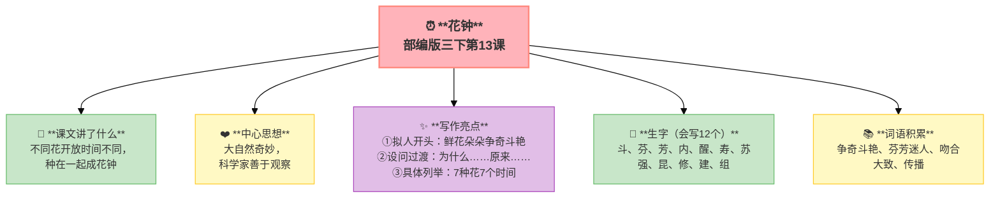
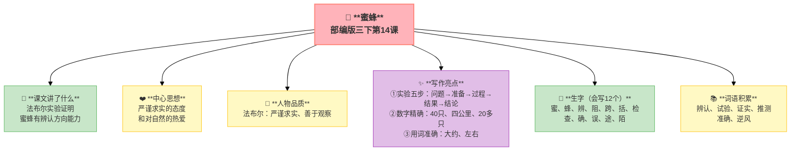
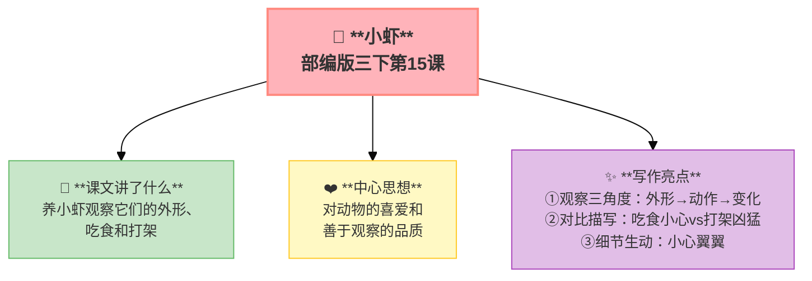

---
tags:
  - 三下
  - 语文
  - 观察与发现
  - 观察
  - 科学
  - 实验
---

# 第四单元 · 观察与发现

> 花钟的秘密、蜜蜂的方向感、小虾的习性——做一个善于发现的人。
> **阅读重点**：借助关键句概括一段话的大意
> **习作目标**：我做了一项小实验（实验作文）

---

## 13 花钟

> 部编版三下第13课
> ⏰ 先读课文三遍，再往下看
> **阅读重点**：借助关键句概括一段话的大意
> **习作目标**：我做了一项小实验（实验作文）

---

### 📖 □核心 课文讲了什么

不同的花开放时间不同，因为温度、湿度、光照、昆虫活动不同。植物学家把不同时间开放的花种在一起，就成了"花钟"。

---

### 💬 □核心 作者想说的话

**通过介绍不同花开放时间不同的原因，表现了大自然的奇妙和科学家善于观察的品质。**

---

### ✨ □了解 写作亮点

| 序号 | 亮点 | 说明 |
|:-----|:-----|:-----|
| ① | **拟人开头** | "鲜花朵朵，争奇斗艳"，把花当人写生动 |
| ② | **设问过渡** | "为什么……呢？原来……"，自问自答引发好奇 |
| ③ | **具体列举** | 7种花＋7个时间，用例子说明道理 |

---

### 📝 □核心 生字（会写X个）

斗、芬、芳、内、醒、寿、苏、强、昆、修、建、组

---

### 📚 □了解 词语积累

| 类别 | 词语 |
|:-----|:-----|
| **必会字词** | 争奇斗艳、芬芳迷人、吻合、大致、传播 |
| **近义词** | 争奇斗艳——百花齐放、吻合——符合 |
| **反义词** | 芬芳——恶臭、大致——精确 |

---

## 🏗️ 文章结构：超清晰！

| 部分 | 自然段 | 内容 | 作用 |
|:-----|:-------|:-----|:-----|
| **第一部分 🎬** | 1 | 现象：不同的花在不同时间开放 | 交代现象 |
| **第二部分 🔥** | 2-3 | 原因：温度、湿度、光照、昆虫活动 | **重点段落**，解释原因 |
| **第三部分 🌱** | 4 | 应用：植物学家修建"花钟" | 升华意义 |

> **💡 写作要点**：用**设问**引发好奇，用**具体例子**说明道理。

---

## ✨ 阅读与写作：深挖课文"宝藏"

### 1️⃣ 花钟时间表 —— 说明方法

| 时间 | 花 | 原因 |
|:---:|:---|:-----|
| 凌晨4点 | 牵牛花 | 气温低、湿度大 |
| 5点 | 蔷薇 | 同上 |
| 7点 | 睡莲 | 光照变化 |
| 中午12点 | 午时花 | 光照最强 |
| 下午3点 | 万寿菊 | 温度最高 |
| 晚上7点 | 月光花 | 夜间开放 |
| 8点 | 夜来香 | 吸引夜行昆虫 |

### 2️⃣ 关键句分析

| 关键句 | 作用 |
|:-------|:-----|
| "不同的植物为什么开花的时间不同呢？" | 设问，引发好奇 |
| "原来，植物开花的时间，与温度、湿度、光照……" | 回答，解释原因 |

### 🖋️ □了解 原文对照仿写

| 原句 | 仿写练习 |
|:-----|:---------|
| "凌晨四点，牵牛花吹起了紫色的小喇叭" | 仿写：凌晨____：____花____（用"时间+花+拟人动作"写一种花） |
| "五点左右，艳丽的蔷薇绽开了笑脸" | 仿写：____点左右，____的____（用拟人写时间） |

---

### 💡 □了解 道理与思辨

| 思辨问题 | 引导方向 | 表达小技巧 |
|:---------|:---------|:-----------|
| "为什么不同的花开放时间不同？" | 理解温度、湿度、光照对花的影响 | "因为……所以……"的句式 |
| "你能设计一个花钟吗？" | 联系生活实际，发挥想象力 | "我想把……种在……因为……" |

---

## 📚 语言积累：词语库+句式库

> "鲜花朵朵，争奇斗艳，芬芳迷人。"
> 
> 拟人句，写出花的美丽。

> "不同的植物为什么开花的时间不同呢？"
> 
> 设问句，引发好奇。

---

---

## 📋 附录

## 📋 学习自评表（教-学-评一致性）✅

| 评价维度 | 我能做到（✅） | 需再练练（🔄） |
|:---------|:--------------|:---------------|
| **结构把握** | 能说出花开放时间不同的原因 | |
| **语言运用** | 能正确读写12个生字，会用多音字 | |
| **朗读理解** | 能借助关键句概括段意 | |
| **思辨拓展** | 能说出花钟时间表，联系生活谈观察 | |

---

## 14 蜜蜂

> 部编版三下第14课
> ⏰ 先读课文三遍，再往下看
> **阅读重点**：借助关键句概括一段话的大意
> **习作目标**：我做了一项小实验（实验作文）

---

### 📖 □核心 课文讲了什么

法布尔做了一个实验：四十只蜜蜂，四公里外放飞，二十多只准确飞回——蜜蜂有辨认方向的能力。

---

### 💬 □核心 作者想说的话

**通过蜜蜂辨认方向的实验，表现了科学家严谨求实的态度和对自然的热爱。**

---

### 👤 □了解 人物品质

| 人物 | 品质 |
|:-----|:-----|
| **法布尔** | 严谨求实、善于观察、热爱科学 |

---

### ✨ □了解 写作亮点

| 序号 | 亮点 | 说明 |
|:-----|:-----|:-----|
| ① | **实验五步** | 问题→准备→过程→结果→结论，按步骤写条理清晰 |
| ② | **数字精确** | 40只、四公里、20多只，用数字让实验更可信 |
| ③ | **用词准确** | "大约""左右"，体现科学的严谨性 |

---

### 📝 □核心 生字（会写X个）

蜜、蜂、辨、阻、跨、括、检、查、确、误、途、陌

---

### 📚 □了解 词语积累

| 类别 | 词语 |
|:-----|:-----|
| **必会字词** | 辨认、试验、证实、推测、准确、逆风 |
| **近义词** | 辨认——识别、证实——证明、推测——推想 |
| **反义词** | 准确——错误、逆风——顺风 |

---

## 🏗️ 文章结构：超清晰！

| 部分 | 自然段 | 内容 | 作用 |
|:-----|:-------|:-----|:-----|
| **第一部分 🎬** | 1 | 提出问题：蜜蜂有辨认方向的能力吗？ | 交代问题 |
| **第二部分 🔥** | 2 | 实验准备：40只蜜蜂、白色记号、纸袋 | **重点段落**，准备阶段 |
| **第三部分 🔥** | 3 | 实验过程：四公里外放掉 | **重点段落**，操作过程 |
| **第四部分 🔥** | 4 | 实验结果：二十多只飞回来了 | **重点段落**，结果呈现 |
| **第五部分 🌱** | 5 | 实验结论：蜜蜂有辨总方向的能力 | 总结，得出结论 |

> **💡 写作要点**：用**实验五步**写实验过程，用**数字**增强可信度。

---

## ✨ 阅读与写作：深挖课文"宝藏"

### 1️⃣ 实验报告结构 —— 说明方法

| 步骤 | 内容 |
|:----|:-----|
| **提出问题** | 蜜蜂有辨认方向的能力吗？ |
| **准备** | 40只蜜蜂、白色记号、纸袋 |
| **过程** | 四公里外放掉 |
| **结果** | 二十多只飞回来了 |
| **结论** | 蜜蜂有辨认方向的能力 |

### 2️⃣ 用词准确 —— 科学精神

| 阅读要点 | 写法分析 | 写作小技巧 |
|:---------|:---------|:-----------|
| "大约""左右" 📏 | 体现科学的严谨性 | 写实验要用词准确 |
| "二十多只" 🐝 | 不说"二十只"，留有余地 | 数字要准确但不绝对 |

### 🖋️ □了解 原文对照仿写

| 原句 | 仿写练习 |
|:-----|:---------|
| "我想，它们飞得这么低，怎么能看到遥远的家呢？" | 仿写：我想，____这么____，怎么能____呢？（用反问写疑问） |
| "蜜蜂靠的不是超常的记忆力，而是一种我无法解释的本能。" | 仿写：____靠的不是____，而是____。（用"不是……而是……"写结论） |

---

### 💡 □了解 道理与思辨

| 思辨问题 | 引导方向 | 表达小技巧 |
|:---------|:---------|:-----------|
| "蜜蜂为什么能辨认方向？" | 从生物本能角度思考 | "因为……所以……"的句式 |
| "法布尔的实验为什么可信？" | 理解科学实验的严谨性 | "因为……所以……"的句式 |

---

## 📚 语言积累：词语库+句式库

> "蜜蜂靠的不是超常的记忆力，而是一种我无法解释的本能。"
> 
> 用"不是……而是……"的句式，得出结论。

---

## 📋 学习自评表（教-学-评一致性）✅

| 评价维度 | 我能做到（✅） | 需再练练（🔄） |
|:---------|:--------------|:---------------|
| **结构把握** | 能说出实验的五个步骤 | |
| **语言运用** | 能正确读写12个生字，会用多音字 | |
| **朗读理解** | 能填写实验报告结构表 | |
| **思辨拓展** | 能用"先……然后……最后……"写过程 | |

---

## 15* 小虾（略读）

> 部编版三下第15课（略读课文）
> ⏰ 先读课文三遍，再往下看
> **阅读重点**：借助关键句概括一段话的大意
> **习作目标**：我做了一项小实验（实验作文）

---

### 📖 □核心 课文讲了什么

"我"养了一些小虾，它们有的透明有的灰黑，吃食小心翼翼，打架却很凶猛。

---

### 💬 □核心 作者想说的话

**通过观察小虾的外形、吃食和打架，表现了作者对小虾的喜爱和善于观察的品质。**

---

### ✨ □了解 写作亮点

| 序号 | 亮点 | 说明 |
|:-----|:-----|:-----|
| ① | **观察三角度** | 外形→动作→变化，由表及里由静到动 |
| ② | **对比描写** | 吃食小心vs打架凶猛，对比让特点更鲜明 |
| ③ | **细节生动** | "小心翼翼""很凶猛"，形容词让画面更具体 |

---

### 📚 □了解 词语积累

| 类别 | 词语 |
|:-----|:-----|
| **必会字词** | 小虾、透明、灰黑、小心翼翼、凶猛 |
| **近义词** | 小心翼翼——谨小慎微、凶猛——凶恶 |
| **反义词** | 小心翼翼——粗心大意、凶猛——温顺 |

---

## 🏗️ 文章结构：超清晰！

| 部分 | 内容 | 作用 |
|:-----|:-----|:-----|
| **第一部分 🎬** | 小虾的外形（透明、灰黑） | 交代描写对象 |
| **第二部分 🔥** | 小虾吃食（小心翼翼） | **重点段落**，动作描写 |
| **第三部分 🔥** | 小虾打架（很凶猛） | **重点段落**，对比描写 |
| **第四部分 🌱** | "我"对小虾的喜爱 | 升华情感 |

> **💡 写作要点**：用**多角度观察**写动物，用**对比**突出特点。

---

## 📚 语言积累：词语库+句式库

> "它们吃食物的时候，总是小心翼翼的。"
> 
> 用"小心翼翼"写出小虾吃食的样子。

> "但是打架的时候就很凶猛。"
> 
> 用"但是"转折，形成对比。

---

### 💡 □了解 道理与思辨

| 思辨问题 | 引导方向 | 表达小技巧 |
|:---------|:---------|:-----------|
| "小虾吃食和打架有什么不同？" | 从对比角度观察动物 | "吃食时……打架时……"的句式 |
| "你会怎么观察小动物？" | 联系生活实际，分享观察方法 | "我会先看……再看……最后看……" |

---

## 📚 语言积累：词语库+句式库

> "它们吃食物的时候，总是小心翼翼的。"
> 
> 用"小心翼翼"写出小虾吃食的样子。

> "但是打架的时候就很凶猛。"
> 
> 用"但是"转折，形成对比。

---

## 📋 学习自评表（教-学-评一致性）✅

| 评价维度 | 我能做到（✅） | 需再练练（🔄） |
|:---------|:--------------|:---------------|
| **结构把握** | 能说出小虾的三个特点 | |
| **语言运用** | 能正确读写重点词语 | |
| **朗读理解** | 能读出小虾的有趣 | |
| **思辨拓展** | 能说出观察小动物的方法 | |

---

## ✍️ 习作：我做了一项小实验

### 🎯 □核心 目标
写一个自己做过的小实验，按**实验步骤**写清楚。

### 🧩 实验作文框架

| 部分 | 写什么 |
|:----|:-------|
| **实验名称** | 什么实验 |
| **准备材料** | 用了什么 |
| **实验过程** | 先……然后……最后…… |
| **实验结果** | 发生了什么 |
| **我的结论** | 为什么会这样 |

### 🧩 简单小实验推荐

| 实验 | 材料 | 原理 |
|:----|:----|:-----|
| 鸡蛋浮起来 | 水杯、盐、鸡蛋 | 盐水密度大 |
| 彩虹桥 | 水杯、纸巾、色素 | 毛细现象 |
| 会跳舞的葡萄干 | 雪碧、葡萄干 | 二氧化碳气泡 |
| 火山爆发 | 小苏打、白醋 | 酸碱反应 |

### 📝 □了解 同学初稿 vs 修改稿

| 对比项 | 初稿（同学D） | 修改稿 |
|:-------|:-------------|:-------|
| **开头** | 我做了一个实验。 | 你见过鸡蛋在水里浮起来吗？今天我就做了一个"鸡蛋浮起来"的实验。 |
| **过程** | 先把盐放到水里，再把鸡蛋放进去，鸡蛋浮起来了。 | 我先往杯子里倒了半杯水，小心翼翼地放进鸡蛋——鸡蛋沉到了杯底。接着我往水里加了一勺盐，搅拌溶解……神奇的事情发生了！鸡蛋慢慢地浮了起来！ |
| **结果** | 鸡蛋浮起来了。 | 鸡蛋像一艘小船一样浮在水面上，我伸手按它，它又弹回来！ |
| **评价** | 太简单，没有细节 | 有疑问→有过程→有结果→有感受，还用了顺序词 |

---

## ❓ 关联性问题

1. 花钟和蜜蜂都用了"设问"开头——设问有什么好处？你能用设问开头写一段话吗？
2. 小虾的"对比描写"（吃食小心vs打架凶猛）如果用在学习观察小动物时，该怎么用？
3. 本单元三篇课文分别是"长期观察""实验观察""饲养观察"——你最喜欢哪种观察方法？为什么？

---

## 🔗 跨文本对比

| 对比维度 | 13 花钟 | 14 蜜蜂 | 15 小虾 |
|:---------|:--------|:--------|:--------|
| 观察对象 | 花（植物） | 蜜蜂（昆虫） | 小虾（水生动物） |
| 观察方法 | 长期记录规律 | 做实验 | 饲养观察 |
| 科学成分 | 生物钟规律 | 昆虫行为学 | 动物行为 |
| 写作结构 | 现象→原因→应用 | 实验：疑问→过程→结论 | 静止→活动→受惊 |
| 共同主题 | 留心观察，处处有发现 |

💡 **阅读启示**：观察不是"看一眼"就完事了。花钟要记录不同时间的花开花落（长期观察），蜜蜂要做实验验证猜想（实验观察），小虾要养起来天天看（持续观察）。三种观察方法都可以用到自己的习作中。

---

## 📚 课外书吧

1. **《昆虫记》**——法布尔用一辈子的时间观察昆虫，每只虫子在他笔下都是主角
2. **《第一次发现》**——用"大发现"的方式教孩子观察自然

## 🗣️ 语文生活

> **选一个生活中的"小实验"做一做（比如泡豆子、种蒜苗），用"实验五步法"写一篇观察日记。**
>
> 别忘了每天拍照记录变化——一周后看看你的豆子/蒜苗长成什么样了！

## 🔄 老朋友回来啦

| 词语 | 之前在哪见过 | 本单元出现 |
|:-----|:------------|:----------|
| 观察 | 三下第一单元《昆虫备忘录》"观察昆虫" | 本单元主题"观察与发现" |
| 准确 | 本单元新学 | 《蜜蜂》"准确" |
| 解释 | 三上第八单元《手术台就是阵地》"解释" | 《蜜蜂》"无法解释" |
| 发现 | 三上第五单元"发现" | 本单元主题"观察与发现" |

✅ ⬛⬛ 阅读纵向衔接：

| 老朋友 | 出自 | 再认读 |
|:-------|:-----|:-------|
| **借助关键句概括段落大意** | 三上第六单元《富饶的西沙群岛》中心句 | 三上"找中心句"→三下"概括大意"→四上"把握主要内容" |
## 🌐 三通

1. **花钟 × 生物钟：** 为什么不同的花在不同的时间开放？这和人的"生物钟"有什么相似？
2. **蜜蜂的导航 × 科学方法：** 法布尔怎么证明蜜蜂能认路？你觉得还有哪些方法可以测试？
3. **观察 × 写作：** 为什么自己观察过的东西写出来特别生动？你有过"观察后写作"的经历吗？

---

## 📎 拓展
- 延伸阅读：法布尔《昆虫记》选段
- 语文园地四：交流平台（概括段意的方法）

---

## 📖 语文园地

> 花钟的秘密、蜜蜂的方向感、小虾的习性——做一个善于发现的人。
> **阅读重点**：借助关键句概括一段话的大意
> **习作目标**：我做了一项小实验（实验作文）

> ⏰ 先读课文三遍，再往下翻
---

## □核心 交流平台

- 概括段落大意要抓住关键句，去掉细节和例子
- 关键句可能在开头、中间或结尾，找到它就能快速把握段落
- 用自己的话说大意，字数越少越好，但要保留核心信息

---

## □核心 词句段运用

- 用"先……接着……然后……最后……"写实验过程
- 填上合适的动词：____温度、____方向、____瓶盖、____颜色
- 照样子写拟人句："凌晨四点，牵牛花吹起了紫色的小喇叭。"

---

## □核心 日积月累

**关于观察与探索的名言**

- 观察是智慧最重要的来源。
- 提出一个问题往往比解决一个问题更重要。——爱因斯坦
- 一切推理都必须从观察和实验中来。——伽利略
- 好奇心是学者的第一美德。——居里夫人