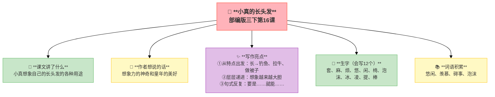
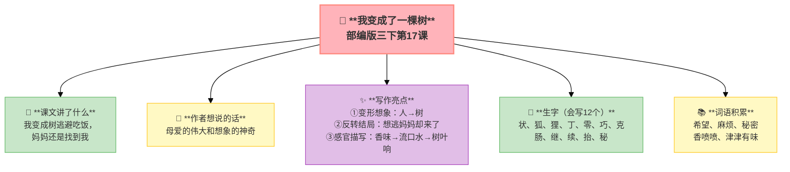

---
tags:
  - 三下
  - 语文
  - 想象世界
  - 想象
  - 习作单元
---

# 第五单元 · 想象世界（习作单元）

> 小真的长头发、我变成了一棵树——想象力比知识更重要。
> **阅读重点**：走进想象的世界，感受想象的神奇
> **习作目标**：奇妙的想象（想象作文）

---

## 16 小真的长头发

> 部编版三下第16课
> ⏰ 先读课文三遍，再往下看
> **阅读重点**：走进想象的世界，感受想象的神奇
> **习作目标**：奇妙的想象（想象作文）

---

### 📖 □核心 课文讲了什么

小真只有短短的娃娃头，但她想象自己的头发长起来——能钓鱼、能拉牛、能做被子、能晾衣服……她的想象比谁的头发都长！

---

### 💬 □核心 作者想说的话

**小真的头发可以长到什么程度？她想象自己的长头发可以套住牛、可以当绳子跳、可以当被子盖——越想越长，越想越有趣。**

---

### ✨ □了解 写作亮点

| 序号 | 亮点 | 说明 |
|:-----|:-----|:-----|
| ① | **从特点出发** | "长"→钓鱼、拉牛、做被子，抓住一个特点展开想象 |
| ② | **层层递进** | 一个比一个更夸张，想象越来越大胆 |
| ③ | **句式反复** | "要是……就能……"，用反复句式增强节奏 |

---

### 📝 □核心 生字（会写X个）

套、麻、烦、悠、闲、椅、泡、沫、冰、凌、提、棒

---

### 📚 □了解 词语积累

| 类别 | 词语 |
|:-----|:-----|
| **必会字词** | 悠闲、羡慕、碍事、泡沫 |
| **近义词** | 悠闲——闲适、羡慕——仰慕 |
| **反义词** | 悠闲——忙碌、羡慕——嫉妒 |

---

## 🏗️ 文章结构：超清晰！

| 部分 | 内容 | 作用 |
|:-----|:-----|:-----|
| **第一部分 🎬** | 小叶和小美有长头发，小真没有 | 交代背景，引出想象 |
| **第二部分 🔥** | 小真不服气，开始想象 | **重点段落**，想象展开 |
| **第三部分 🔥** | 想象清单：钓鱼→拉牛→做被子→晾衣服 | **重点段落**，层层递进 |
| **第四部分 🌱** | 小叶和小美听入迷了 | 结尾，表现想象的魅力 |

> **💡 写作要点**：从**一个特点**出发展开想象，用**层层递进**让想象更大胆。

---

## ✨ 阅读与写作：深挖课文"宝藏"

### 1️⃣ 小真的想象清单 —— 想象方法

| 想象 | 功能 |
|:-----|:-----|
| 头发垂到水里 | 钓鱼！ |
| 头发甩到树上 | 套住牛！ |
| 头发烫起来变成树林 | 让小鸟做窝！ |
| 头发当被子 | 盖在身上又香又暖！ |
| 头发当晾衣绳 | 晾衣服！ |

**方法**：从"长"这个特点出发，想出一连串的用途。**特点→联想→夸张。**

### 2️⃣ 反复句式 —— 语言特点

| 阅读要点 | 写法分析 | 写作小技巧 |
|:---------|:---------|:-----------|
| "要是……就能……" 🔄 | 用反复句式增强节奏 | 写想象可以用反复句式 |
| 一个比一个更夸张 📈 | 层层递进，想象越来越大胆 | 想象要层层递进 |

### 🖋️ □了解 原文对照仿写

| 原句 | 仿写练习 |
|:-----|:---------|
| "要是把头发垂到水里，就能钓到鱼了。" | 仿写：要是把____，就能____了。（用"要是……就能……"展开想象） |
| "要是把头发甩到树上，就能套住牛了。" | 仿写：要是把头发____，就能____了。（再想一个更大胆的用途） |

---

### 💡 □了解 道理与思辨

| 思辨问题 | 引导方向 | 表达小技巧 |
|:---------|:---------|:-----------|
| "小真的想象从哪里来？" | 理解想象要从特点出发 | "从……出发，想到……"的句式 |
| "你能像小真一样想象吗？" | 联系生活实际，发挥想象力 | "要是……就能……"的句式 |

---

## 📚 语言积累：词语库+句式库

> "要是把头发垂到水里，就能钓到鱼了。"
> 
> 用"要是……就能……"写出想象。

> "要是把头发甩到树上，就能套住牛了。"
> 
> 反复句式，增强节奏。

---

---

## 📋 附录

## 📋 学习自评表（教-学-评一致性）✅

| 评价维度 | 我能做到（✅） | 需再练练（🔄） |
|:---------|:--------------|:---------------|
| **结构把握** | 能说出小真想象的五个用途 | |
| **语言运用** | 能正确读写12个生字，会用多音字 | |
| **朗读理解** | 能读出小真想象的有趣 | |
| **思辨拓展** | 能用"要是……就能……"写句子 | |

---

## 17 我变成了一棵树

> 部编版三下第17课
> ⏰ 先读课文三遍，再往下看
> **阅读重点**：走进想象的世界，感受想象的神奇
> **习作目标**：奇妙的想象（想象作文）

---

### 📖 □核心 课文讲了什么

"我"不想吃饭想一直玩，就变成了一棵树。结果妈妈还是端着好吃的来了，还住在树上的鸟窝里。

---

### 💬 □核心 作者想说的话

**英英不想吃饭，她想变成一棵树。结果真的变了！长出了各种形状的鸟窝，小动物们都来了——但妈妈也来了，她端着饭站在树下。**

---

### ✨ □了解 写作亮点

| 序号 | 亮点 | 说明 |
|:-----|:-----|:-----|
| ① | **变形想象** | 人→树，现实做不到的想象里全可以 |
| ② | **反转结局** | 想逃离妈妈，妈妈却找来了，想象中有温情 |
| ③ | **感官描写** | 香味→流口水→树叶响，用感官推动情节 |

---

### 📝 □核心 生字（会写X个）

状、狐、狸、丁、零、巧、克、肠、继、续、抬、秘

---

### 📚 □了解 词语积累

| 类别 | 词语 |
|:-----|:-----|
| **必会字词** | 希望、麻烦、秘密、香喷喷、津津有味 |
| **近义词** | 希望——盼望、麻烦——烦琐 |
| **反义词** | 希望——失望、麻烦——简单 |

---

## 🏗️ 文章结构：超清晰！

| 部分 | 自然段 | 内容 | 作用 |
|:-----|:-------|:-----|:-----|
| **第一部分 🎬** | 1-2 | "我"不想吃饭想玩 | 交代起因 |
| **第二部分 🔥** | 3-6 | "我"变成了一棵树→各种动物住进鸟窝 | **重点段落**，想象展开 |
| **第三部分 🔥** | 7-10 | 妈妈也来了，还带来好吃的 | **重点段落**，反转温情 |
| **第四部分 🌱** | 11-12 | "我"闻着香味流口水（树叶哗啦啦响） | 结尾，温馨有趣 |

> **💡 写作要点**：用**变形想象**创造奇幻世界，用**反转结局**表达温情。

---

## ✨ 阅读与写作：深挖课文"宝藏"

### 1️⃣ 变形想象 —— 想象方法

| 阅读要点 | 写法分析 | 写作小技巧 |
|:---------|:---------|:-----------|
| "我"变成了一棵树 🌳 | 现实做不到的，想象里全可以 | 想象可以变形 |
| 各种动物住进鸟窝 🐦 | 想象要有细节，更丰富 | 想象要加细节 |

### 2️⃣ 感官描写 —— 写作技巧

| 阅读要点 | 写法分析 | 写作小技巧 |
|:---------|:---------|:-----------|
| 香味→流口水→树叶响 🍃 | 用感官推动情节 | 写想象可以用感官 |

### 🖋️ □了解 原文对照仿写

| 原句 | 仿写练习 |
|:-----|:---------|
| "我真希望变成一棵树，这样就不用回去吃饭了。" | 仿写：我真希望变成____，这样就不用____了。（用"希望变成"开头写想象） |
| "呀，妈妈来了……她不知道我变成了树！" | 仿写：呀，____来了！他/她不知道____！（用语气词开头写一个反转） |

---

### 💡 □了解 道理与思辨

| 思辨问题 | 引导方向 | 表达小技巧 |
|:---------|:---------|:-----------|
| "为什么'我'会变成树？" | 理解想象背后的情感 | "因为……所以……"的句式 |
| "妈妈为什么能找到'我'？" | 体会母爱的伟大 | "因为妈妈……所以……"的句式 |

---

## 📚 语言积累：词语库+句式库

> "我真希望变成一棵树，这样就不用回去吃饭了。"
> 
> 用"真希望"表达愿望。

> "呀，妈妈来了！"
> 
> 用语气词表达惊喜。

---

## 📋 学习自评表（教-学-评一致性）✅

| 评价维度 | 我能做到（✅） | 需再练练（🔄） |
|:---------|:--------------|:---------------|
| **结构把握** | 能说出"我"变形后的经历 | |
| **语言运用** | 能正确读写12个生字，会用多音字 | |
| **朗读理解** | 能读出想象的神奇和妈妈的爱 | |
| **思辨拓展** | 能想象自己会变成什么 | |

---

## ✍️ 习作：奇妙的想象

### 🎯 □核心 目标
写一个想象故事，让读者觉得"哇，太神奇了！"

### 🧩 想象方法

| 方法 | 说明 | 例子 |
|:-----|:-----|:-----|
| **反着想** | 把现实反过来 | 如果我变成了蚂蚁会怎样？ |
| **极端想** | 把某个特点放大 | 如果我的书包能无限变大？ |
| **拟人想** | 物品变成人 | 文具盒里的文具吵架了？ |
| **穿越想** | 去另一个世界 | 我走进了课本里的世界 |

### 📐 □了解 写作框架

1. **起因**：怎么开始的
2. **奇妙经历**：发生了什么
3. **波折**：遇到什么困难
4. **结局**：怎么样了

### 🧩 题目推荐

| 题目 | 方向 |
|:-----|:-----|
| 一本有魔法的书 | 书里的内容会变成真的 |
| 手罢工啦 | 手不干了，会发生什么 |
| 滚来滚去的小土豆 | 小土豆要去哪里 |
| 假如人类可以冬眠 | 冬天全部睡觉会怎样 |

### 🔍 结构拆解

| 步骤 | 内容 | 写作提示 |
|:-----|:-----|:---------|
| **① 开头** | 交代起因——"如果……会怎样？" | 用一个问题或一个假设开头 |
| **② 奇妙经历** | 发生了什么奇幻的事 | 写出变化的过程，加细节 |
| **③ 波折/困难** | 遇到了什么麻烦 | 有波折故事才好看 |
| **④ 结局** | 最后怎么样了 | 可以温馨、可以搞笑、可以出人意料 |

### 📝 □了解 同学初稿 vs 修改稿（详细版）

| 对比项 | 初稿（同学E） | 修改稿 |
|:-------|:-------------|:-------|
| **起因** | 我想变成一朵云。 | 我趴在窗前，看着天上飘来飘去的白云，心想：要是能变成一朵云，该多好啊！ |
| **奇妙经历** | 我飞上天了，和小鸟玩。 | 我慢慢飘上了天空，身体变得轻飘飘的——我真的变成了一朵云！我一会儿变成小白兔，一会儿变成棉花糖；小鸟从我身边飞过，我轻轻碰了碰它的翅膀。 |
| **波折** | 忽然下雨了，我摔下来了。 | 忽然，天上打了一个响雷！我的身体变得越来越重，原来是变成了乌云。雨点从我身上哗啦啦地落下去——我是不是要消失了？ |
| **结局** | 原来是个梦。 | 就在这时，妈妈的声音传来："起床了，小懒虫！"我睁开眼，原来是个梦……可是我真的好喜欢变成云的感觉！ |
| **评价** | 太简单，没有细节和画面感 | 有起因→有想象→有波折→有反转，画面感强，读起来像真的一样 |

---

## ❓ 关联性问题

1. 小真和"我"（我变成了一棵树）都在想象——她们的想象有什么不同？（一个是一件事的多种用途，一个是整个故事的想象）
2. 两篇课文的结局有什么共同点？想想为什么想象故事需要一个温暖的结局。
3. 本单元是习作单元——你从这两篇课文中学到了哪些"写想象作文"的方法？至少说3个。

---

## 🔗 跨文本对比

| 对比维度 | 16 小真的长头发 | 17 我变成了一棵树 |
|:---------|:----------------|:-----------------|
| 想象起点 | 头发变长 | 变成一棵树 |
| 想象方式 | 头发能干各种事 | 身上长出鸟窝 |
| 夸张程度 | 超级夸张 | 奇幻变身 |
| 情感底色 | 快乐的想象 | 妈妈的爱 |
| 共同点 | 大胆想象，自圆其说 |

💡 **阅读启示**：写想象作文的秘诀——选一个"如果"开头（如果头发很长/如果我变成了……），然后想：会发生什么？会遇到谁？最后要有"爱"或"温暖"的底色。再奇妙的想象，也要让读者觉得"好像是真的"。

---

## 📚 课外书吧

1. **《小真的长头发》完整绘本**——看看小真还有哪些更大胆的想象
2. **《神奇校车》系列**——每一次都是奇幻的冒险，又有科学的底色

## 🗣️ 语文生活

> **和家人一起玩"如果……会怎样"的想象游戏。**
>
> 每人说一个"如果"，其他人都来补充"会发生什么"。比如：如果我们家的猫会说话……如果冰箱里的食物能自己跑出来……

## 🔄 老朋友回来啦

| 词语 | 之前在哪见过 | 本单元出现 |
|:-----|:------------|:----------|
| 悠闲 | 三下第三课《荷花》"悠闲" | 《小真的长头发》"悠闲" |
| 羡慕 | 本单元新学 | 《小真的长头发》"羡慕" |
| 秘密 | 三上第八单元《掌声》"秘密" | 《我变成了一棵树》"秘密" |
| 继续 | 三上第七单元《父亲、树林和鸟》"继续" | 《我变成了一棵树》"继续" |

✅ ⬛⬛ 阅读纵向衔接：

| 老朋友 | 出自 | 再认读 |
|:-------|:-----|:-------|
| **想象作文"如果……会怎样"** | 三上第三单元童话想象 | 从"感受想象"到"创造想象"——用"如果……会怎样"打开想象之门 |
## 🌐 三通

1. **想象 × 科学：** 小真的头发能钓鱼、晾衣服——你觉得头发真的能承受这些重量吗？查查头发的拉力是多少？
2. **想象 × 美术：** 如果你来画"小真的长头发"，你会怎么画？课本里的插图和你想象的一样吗？
3. **想象 × 电影：** 你看过《头脑特工队》或《寻梦环游记》吗？这些电影里的"想象"和课文有什么相似之处？

---

## 📎 拓展
- 延伸阅读：《小真的长头发》完整绘本
- 语文园地五：交流平台（想象方法总结）

---

## ✏️ 我的发现（留白）

> 读完这个单元，我最想记下来的是：

___________________________________________

___________________________________________

> 我同桌的发现：

___________________________________________

---

## 📖 语文园地

> 小真的长头发、我变成了一棵树——想象力比知识更重要。
> **阅读重点**：走进想象的世界，感受想象的神奇
> **习作目标**：奇妙的想象（想象作文）

> ⏰ 先读课文三遍，再往下翻
---

## □核心 交流平台

- 想象作文可以从"如果……会怎样"开始——如果我会飞、如果我变小了……
- 想象要大胆但不乱来，要有一定的逻辑，"意料之外，情理之中"
- 好的想象作文能让读者觉得"哇，原来还可以这样！"

---

## □核心 词句段运用

- "宇宙的另一边是这一边的倒影"——根据这个思路续写一段
- 用"在……在……在……"写想象中的神奇经历
- 把现实中的小事物变得不平凡：普通的书包能______

---

## □核心 日积月累

**关于想象的名言**

- 想象力比知识更重要，因为知识是有限的。——爱因斯坦
- 看了《海的女儿》，你会知道什么叫想象力的巅峰。
- 想象力统治世界。——拿破仑
- 没有想象，就没有创造。