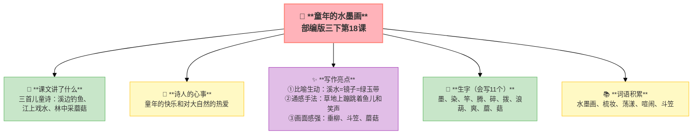
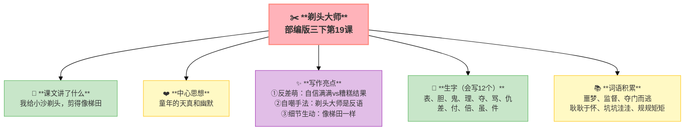
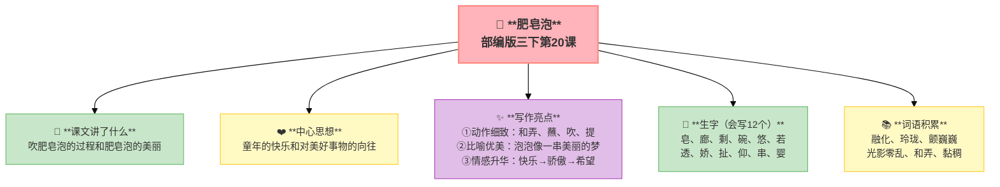
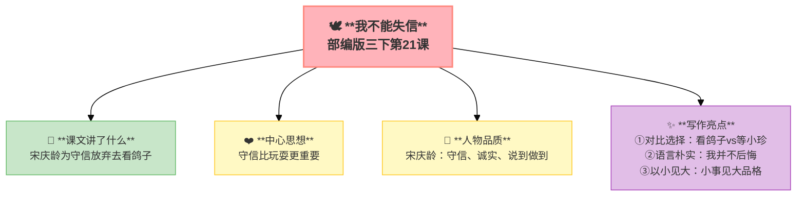

---
tags:
  - 三下
  - 语文
  - 多彩童年
  - 诗歌
  - 写人
  - 童年
---

# 第六单元 · 多彩童年

> 童年的水墨画、剃头大师、泡泡里的快乐、守信的宋庆龄——每个孩子的童年都不一样。
> **阅读重点**：运用多种方法理解难懂的句子
> **习作目标**：身边那些有特点的人（写人作文）

---

## 18 童年的水墨画

> 部编版三下第18课
> ⏰ 先读课文三遍，再往下看
> **阅读重点**：运用多种方法理解难懂的句子
> **习作目标**：身边那些有特点的人（写人作文）

---

### 📖 □核心 课文讲了什么

三首儿童诗像三幅水墨画——溪边钓鱼的孩子、江上戏水的鸭群、林中采蘑菇的小手。

---

### 💬 □核心 作者想说的话

**通过描绘三个童年场景，表达了童年的快乐和对大自然的热爱。**

---

### ✨ □了解 写作亮点

| 序号 | 亮点 | 说明 |
|:-----|:-----|:-----|
| ① | **比喻生动** | "溪水=镜子=绿玉带"，多个比喻叠加画面更丰富 |
| ② | **通感手法** | "草地上蹦跳着鱼儿和笑声"，把心情写成动作 |
| ③ | **画面感强** | 垂柳、斗笠、蘑菇，用具体事物营造意境 |

---

### 📝 □核心 生字（会写X个）

墨、染、竿、腾、碎、拨、浪、葫、爽、蘑、菇

---

### 📚 □了解 词语积累

| 类别 | 词语 |
|:-----|:-----|
| **必会字词** | 水墨画、梳妆、荡漾、喧闹、斗笠 |
| **近义词** | 喧闹——热闹、梳妆——打扮 |
| **反义词** | 喧闹——安静 |

---

## 🏗️ 文章结构：超清晰！

| 部分 | 内容 | 作用 |
|:-----|:-----|:-----|
| **溪边** | 垂柳→钓鱼→鱼儿上钩→笑声蹦跳 | 童年钓鱼的快乐 |
| **江上** | 像鸭群跳入→水花四溅→戏水 | 童年戏水的快乐 |
| **林中** | 雨后松林→蘑菇像小伞→戴斗笠采蘑菇 | 童年采蘑菇的快乐 |

> **💡 写作要点**：用**比喻**和**通感**让画面更生动，用**具体事物**营造意境。

---

## ✨ 阅读与写作：深挖课文"宝藏"

### 1️⃣ 难句理解 —— 理解方法

| 阅读要点 | 写法分析 | 写作小技巧 |
|:---------|:---------|:-----------|
| "垂柳把溪水当作梳妆的镜子，山溪像绿玉带一样平静" 🌿 | 找比喻——溪水=镜子=绿玉带 | 写景可以用比喻 |
| "草地上蹦跳着鱼儿和笑声" 😄 | 通感——笑声会蹦跳？其实是孩子们太开心了 | 写心情可以用通感 |

### 2️⃣ 画面感 —— 意境营造

| 阅读要点 | 写法分析 | 写作小技巧 |
|:---------|:---------|:-----------|
| 垂柳、斗笠、蘑菇 🍄 | 用具体事物营造意境 | 写景要用具体事物 |

### 🖋️ □了解 原文对照仿写

| 原句 | 仿写练习 |
|:-----|:---------|
| "垂柳把溪水当作梳妆的镜子，山溪像绿玉带一样平静" | 仿写：____把____当作____，____像____一样____（用比喻写一个画面） |
| "草地上蹦跳着鱼儿和笑声" | 仿写：____上蹦跳着____和____（用通感写快乐） |

---

### 💡 □了解 道理与思辨

| 思辨问题 | 引导方向 | 表达小技巧 |
|:---------|:---------|:-----------|
| "三首诗分别写了什么场景？" | 理解三个童年场景 | "溪边……江上……林中……"的句式 |
| "你最喜欢哪个场景？" | 联系自己的童年经历 | "我最喜欢……因为……"的句式 |

---

## 📚 语言积累：词语库+句式库

> "垂柳把溪水当作梳妆的镜子，山溪像绿玉带一样平静。"
> 
> 多个比喻叠加，画面更丰富。

> "草地上蹦跳着鱼儿和笑声。"
> 
> 通感手法，把心情写成动作。

---

---

## 📋 附录

## 📋 学习自评表（教-学-评一致性）✅

| 评价维度 | 我能做到（✅） | 需再练练（🔄） |
|:---------|:--------------|:---------------|
| **结构把握** | 能说出三首诗的三个场景 | |
| **语言运用** | 能正确读写11个生字，会用多音字 | |
| **朗读理解** | 能读出诗歌的韵律美 | |
| **思辨拓展** | 能说出比喻和通感的好处 | |

---

## 19 剃头大师

> 部编版三下第19课
> ⏰ 先读课文三遍，再往下看
> **阅读重点**：运用多种方法理解难懂的句子
> **习作目标**：身边那些有特点的人（写人作文）

---

### 📖 □核心 课文讲了什么

小沙最怕剃头，"我"自告奋勇给他剃头，结果剪得像梯田——"我"成了"剃头大师"。

---

### 💬 □核心 作者想说的话

**通过"我"给小沙剃头的趣事，表现了童年的天真和幽默。**

---

### ✨ □了解 写作亮点

| 序号 | 亮点 | 说明 |
|:-----|:-----|:-----|
| ① | **反差萌** | 自信满满vs糟糕结果，反差产生幽默 |
| ② | **自嘲手法** | "剃头大师"其实是自嘲，用反语增加趣味 |
| ③ | **细节生动** | "像梯田一样"，比喻让画面更滑稽 |

---

### 📝 □核心 生字（会写X个）

表、胆、鬼、理、夺、骂、仇、差、付、倍、虽、件

---

### 📚 □了解 词语积累

| 类别 | 词语 |
|:-----|:-----|
| **必会字词** | 噩梦、监督、夺门而逃、耿耿于怀、坑坑洼洼、规规矩矩 |
| **近义词** | 监督——监视、耿耿于怀——念念不忘 |
| **反义词** | 规规矩矩——调皮捣蛋、坑坑洼洼——平平整整 |

---

## 🏗️ 文章结构：超清晰！

| 部分 | 自然段 | 内容 | 作用 |
|:-----|:-------|:-----|:-----|
| **第一部分 🎬** | 1-6 | 小沙怕剃头（被师傅折腾） | 交代背景 |
| **第二部分 🔥** | 7-14 | "我"自告奋勇→剃头过程→越剪越糟 | **重点段落**，幽默展开 |
| **第三部分 🌱** | 15-17 | 结果（坑坑洼洼像梯田）→"大师"称号 | 结尾，自嘲幽默 |

> **💡 写作要点**：用**反差**制造幽默，用**自嘲**增加趣味。

---

## ✨ 阅读与写作：深挖课文"宝藏"

### 1️⃣ 幽默在哪？ —— 理解方法

| 阅读要点 | 写法分析 | 写作小技巧 |
|:---------|:---------|:-----------|
| "我"的自信满满 vs 实际的糟糕结果 😂 | 反差产生幽默 | 写趣事可以用反差 |
| "剃头大师"其实是自嘲 🤣 | 用反语增加趣味 | 可以用自嘲写趣事 |

### 2️⃣ 细节描写 —— 写作技巧

| 阅读要点 | 写法分析 | 写作小技巧 |
|:---------|:---------|:-----------|
| "像梯田一样" 🌾 | 比喻让画面更滑稽 | 写趣事可以用比喻 |

### 🖋️ □了解 原文对照仿写

| 原句 | 仿写练习 |
|:-----|:---------|
| "我觉得自己像个剃头大师。" | 仿写：我觉得自己像个____（用自嘲写一件你做过的"糗事"） |
| "剪刀所到之处，头发纷纷飘落，像下了一场黑雪。"（文中隐含的比喻） | 仿写：____所到之处，____纷纷____，像____（用比喻写一个场景） |

---

### 💡 □了解 道理与思辨

| 思辨问题 | 引导方向 | 表达小技巧 |
|:---------|:---------|:-----------|
| ""我"的剃头技术怎么样？" | 理解反差幽默 | "虽然……但是……"的句式 |
| ""剃头大师"是什么意思？" | 理解自嘲手法 | "其实是……因为……"的句式 |

---

## 📚 语言积累：词语库+句式库

> "我觉得自己像个剃头大师。"
> 
> 自嘲手法，用反语增加趣味。

> "剪刀所到之处，头发纷纷飘落。"
> 
> 用动作描写写出剃头的过程。

---

## 📋 学习自评表（教-学-评一致性）✅

| 评价维度 | 我能做到（✅） | 需再练练（🔄） |
|:---------|:--------------|:---------------|
| **结构把握** | 能说出"我"剃头的步骤 | |
| **语言运用** | 能正确读写12个生字，会用多音字 | |
| **朗读理解** | 能读出故事的幽默 | |
| **思辨拓展** | 能说出"剃头大师"的幽默在哪 | |

---

## 20 肥皂泡

> 部编版三下第20课
> ⏰ 先读课文三遍，再往下看
> **阅读重点**：运用多种方法理解难懂的句子
> **习作目标**：身边那些有特点的人（写人作文）

---

### 📖 □核心 课文讲了什么

"我"最爱玩肥皂泡——用碎肥皂融化吹出轻圆的泡儿，它们随风飘散，像一串美丽的梦。

---

### 💬 □核心 作者想说的话

**通过描写吹肥皂泡的乐趣，表达了童年的快乐和对美好事物的向往。**

---

### ✨ □了解 写作亮点

| 序号 | 亮点 | 说明 |
|:-----|:-----|:-----|
| ① | **动作细致** | 和弄、蘸、吹、提，一连串动词写出过程 |
| ② | **比喻优美** | "泡泡像一串美丽的梦"，把泡泡比作梦富有诗意 |
| ③ | **情感升华** | 快乐→骄傲→希望，从玩乐到有梦想 |

---

### 📝 □核心 生字（会写X个）

皂、廊、剩、碗、悠、若、透、娇、扯、仰、串、婴

---

### 📚 □了解 词语积累

| 类别 | 词语 |
|:-----|:-----|
| **必会字词** | 融化、玲珑、颤巍巍、光影零乱、和弄、黏稠 |
| **近义词** | 玲珑——精巧、颤巍巍——颤悠悠 |
| **反义词** | 黏稠——稀薄 |

---

## 🏗️ 文章结构：超清晰！

| 部分 | 自然段 | 内容 | 作用 |
|:-----|:-------|:-----|:-----|
| **第一部分 🎬** | 1-2 | 怎么吹肥皂泡（方法） | 交代方法 |
| **第二部分 🔥** | 3-4 | 肥皂泡的样子（轻圆、脆丽、颤巍巍） | **重点段落**，样子描写 |
| **第三部分 🔥** | 5-6 | 肥皂泡飘散（飞到天上、落到扇子） | **重点段落**，动态描写 |
| **第四部分 🌱** | 7 | "我"的感受（快乐、骄傲、希望） | 升华情感 |

> **💡 写作要点**：用**动作描写**写过程，用**比喻**让描写更优美。

---

## ✨ 阅读与写作：深挖课文"宝藏"

### 1️⃣ 难句理解 —— 理解方法

| 阅读要点 | 写法分析 | 写作小技巧 |
|:---------|:---------|:-----------|
| "那一个个轻清脆丽的小球，像一串美丽的梦" 💭 | 比喻——泡泡像梦，因为都是美丽的、短暂的 | 写泡泡可以用比喻 |
| "目送着她们，我心里充满了快乐、骄傲与希望" 😊 | 情感升华——从玩乐到有梦想 | 写感受可以升华情感 |

### 2️⃣ 动作描写 —— 写作技巧

| 阅读要点 | 写法分析 | 写作小技巧 |
|:---------|:---------|:-----------|
| 和弄、蘸、吹、提 🫧 | 一连串动词写出过程 | 写过程要用动词 |

### 🖋️ □了解 原文对照仿写

| 原句 | 仿写练习 |
|:-----|:---------|
| "那一个个轻清脆丽的小球，像一串美丽的梦" | 仿写：那一个个____，像____（用比喻写一个你喜欢的玩具或事物） |
| "目送着她们，我心里充满了快乐、骄傲与希望" | 仿写：目送着____，我心里充满了____、____与____（用三个词写内心感受） |

---

### 💡 □了解 道理与思辨

| 思辨问题 | 引导方向 | 表达小技巧 |
|:---------|:---------|:-----------|
| "为什么泡泡像梦？" | 理解比喻的妙处 | "因为……所以……"的句式 |
| "为什么'我'会感到骄傲和希望？" | 联系生活实际，体会情感 | "因为……所以……"的句式 |

---

## 📚 语言积累：词语库+句式库

> "那一个个轻清脆丽的小球，像一串美丽的梦。"
> 
> 比喻优美，把泡泡比作梦。

> "目送着她们，我心里充满了快乐、骄傲与希望。"
> 
> 情感升华，从玩乐到有梦想。

---

## 📋 学习自评表（教-学-评一致性）✅

| 评价维度 | 我能做到（✅） | 需再练练（🔄） |
|:---------|:--------------|:---------------|
| **结构把握** | 能说出吹肥皂泡的步骤 | |
| **语言运用** | 能正确读写12个生字，会用多音字 | |
| **朗读理解** | 能读出肥皂泡的美丽 | |
| **思辨拓展** | 能用比喻句写一种游戏 | |

---

## 21* 我不能失信（略读）

> 部编版三下第21课（略读课文）
> ⏰ 先读课文三遍，再往下看
> **阅读重点**：运用多种方法理解难懂的句子
> **习作目标**：身边那些有特点的人（写人作文）

---

### 📖 □核心 课文讲了什么

宋庆龄答应朋友小珍教她叠花篮，虽然全家要去伯伯家看鸽子，但她选择留下来守信。

---

### 💬 □核心 作者想说的话

**通过宋庆龄守信的故事，告诉我们守信比玩耍更重要，答应了的事就要做到。**

---

### 👤 □了解 人物品质

| 人物 | 品质 |
|:-----|:-----|
| **宋庆龄** | 守信、诚实、说到做到 |

---

### ✨ □了解 写作亮点

| 序号 | 亮点 | 说明 |
|:-----|:-----|:-----|
| ① | **对比选择** | 看鸽子vs等小珍，用选择突出守信 |
| ② | **语言朴实** | "我并不后悔"，简单的话更有力量 |
| ③ | **以小见大** | 一件小事体现品质，小事见大品格 |

---

### 📚 □了解 词语积累

| 类别 | 词语 |
|:-----|:-----|
| **必会字词** | 宋庆龄、叠花篮、守信、后悔 |
| **近义词** | 守信——诚信、后悔——懊悔 |
| **反义词** | 守信——失信 |

---

## 🏗️ 文章结构：超清晰！

| 部分 | 内容 | 作用 |
|:-----|:-----|:-----|
| **第一部分 🎬** | 宋庆龄答应小珍叠花篮 | 交代约定 |
| **第二部分 🔥** | 全家要去伯伯家，宋庆龄选择留下来 | **重点段落**，选择守信 |
| **第三部分 🌱** | "我并不后悔" | 结尾，点明主题 |

> **💡 写作要点**：用**对比选择**突出品质，用**以小见大**体现品格。

---

## 📚 语言积累：词语库+句式库

> "我并不后悔，因为我没有失信。"
> 
> 简单的话，表现出守信的重要性。

---

### 💡 □了解 道理与思辨

| 思辨问题 | 引导方向 | 表达小技巧 |
|:---------|:---------|:-----------|
| "宋庆龄为什么不后悔？" | 理解守信的重要性 | "因为……所以……"的句式 |
| "你会怎么选择？" | 联系生活实际，表达看法 | "如果是我，我会……因为……" |

---

## 📚 语言积累：词语库+句式库

> "我并不后悔，因为我没有失信。"
> 
> 简单的话，表现出守信的重要性。

---

## 📋 学习自评表（教-学-评一致性）✅

| 评价维度 | 我能做到（✅） | 需再练练（🔄） |
|:---------|:--------------|:---------------|
| **结构把握** | 能说出宋庆龄的选择 | |
| **语言运用** | 能正确读写重点词语 | |
| **朗读理解** | 能读出宋庆龄的坚定 | |
| **思辨拓展** | 能说出守信的重要性 | |

---

## ✍️ 习作：身边那些有特点的人

### 🎯 □核心 目标
写一个身边有特点的人，用具体事例写出他的特点。

### 🧩 特点词库

| 特点 | 可以写的事例 |
|:-----|:-------------|
| **小书虫** | 课间也看书、去图书馆借一堆书 |
| **热心肠** | 帮同学值日、借文具给别人 |
| **爱问问题** | 每节课都举手、打破砂锅问到底 |
| **运动健将** | 跑步最快、跳绳冠军 |
| **幽默大王** | 讲笑话逗全班笑、说段子 |
| **昆虫迷** | 抓虫子观察、知道各种昆虫的名字 |

### 📐 □了解 写作框架

1. **标签式开头**
2. **整体特点**
3. **具体事例（重点！）**
4. **结尾升华**

### 📝 □了解 同学初稿 vs 修改稿

| 对比项 | 初稿（同学F） | 修改稿 |
|:-------|:-------------|:-------|
| **开头** | 我的同桌是个"小书虫"。 | 要问我们班谁最爱看书，那一定非我的同桌莫属——我们都管他叫"小书虫"。 |
| **事例** | 他上课也看书，下课也看书。 | 下课铃一响，大家都冲出教室玩，只有他从桌肚里掏出一本《西游记》，迫不及待地翻开。老师走进教室上课了，他还在看，直到同桌碰了碰他的胳膊，他才猛地抬头——"啊？上课了？" |
| **细节** | 他看书很认真。 | 他的眼睛直勾勾地盯着书页，眉毛一会儿皱起来，一会儿舒展开。看到好笑的地方，还会"噗嗤"一声笑出来。 |
| **评价** | 只说特点，没有事例 | 一个具体的事例胜过一百句"他很爱看书" |

---

## ❓ 关联性问题

1. 童年的水墨画用"诗歌"写童年，剃头大师用"幽默故事"写童年——你更喜欢哪种写法？为什么？
2. 肥皂泡和剃头大师都是写"玩"——你觉得哪种"童年玩法"最有意思？为什么？
3. 本单元四篇课文，哪个人物给你的印象最深？能不能用一句话说说为什么？

---

## 🔗 跨文本对比

| 对比维度 | 18 童年的水墨画 | 19 剃头大师 | 20 肥皂泡 | 21 我不能失信 |
|:---------|:----------------|:------------|:----------|:--------------|
| 内容 | 溪边/江上/林中 | 给表弟剃头 | 吹肥皂泡 | 等小珍 |
| 文体 | 儿童诗（组诗） | 记叙文 | 散文 | 记叙文（传记类） |
| 情感 | 快乐自由 | 幽默慌张 | 美好梦幻 | 诚实守信 |
| 写作手法 | 意象+留白 | 夸张+幽默 | 比喻+想象 | 对话+心理 |

💡 **阅读启示**：每个人的童年都不同——有的在溪边钓鱼（水墨画），有的在家捣蛋（剃头大师），有的在吹肥皂泡（冰心），有的在学习做人（宋庆龄）。你的童年是什么样？写下来就是最好的童年故事。

---

## 📚 课外书吧

1. **《繁星·春水》**——冰心的诗和散文，纯净优美，适合慢慢读
2. **《小淘气尼古拉》**——一个法国小男孩的童年趣事，读起来会忍不住哈哈大笑

## 🗣️ 语文生活

> **采访一位家人（爸爸/妈妈/爷爷/奶奶），问问他/她小时候最有意思的一件事。**
>
> 用"我的____小时候……"开头，写成一段话，看看以前的孩子和现在的你童年有什么不同。

## 🔄 老朋友回来啦

| 词语 | 之前在哪见过 | 本单元出现 |
|:-----|:------------|:----------|
| 平静 | 三上第一单元《大青树下的小学》"安静" | 《童年的水墨画》"平静" |
| 监督 | 三上第八单元《灰雀》"监督" | 《剃头大师》"监督" |
| 骄傲 | 三下第二单元《陶罐和铁罐》"骄傲" | 《肥皂泡》"骄傲" |
| 后悔 | 三上第四单元《不会叫的狗》"后悔" | 《我不能失信》"后悔" |

✅ ⬛⬛ 阅读纵向衔接：

| 老朋友 | 出自 | 再认读 |
|:-------|:-----|:-------|
| **理解难懂的句子** | 三上第二单元"理解难懂的词语" | 词语层面→句子层面，方法一致(联系上下文/结合生活)，难度升级 |
## 🌐 三通

1. **童年 × 时代：** 爸爸妈妈的童年和你的童年有什么不同？你更想过谁的童年？
2. **童年 × 文学：** 为什么作家最喜欢写童年？冰心、陈淼为什么长大以后还要写小时候的故事？
3. **童年 × 游戏：** 课文学到的童年游戏（钓鱼、剃头、吹泡泡）和你现在玩的游戏有什么不同？

---

## 📎 拓展
- 延伸阅读：冰心《繁星·春水》选篇
- 语文园地六：交流平台（理解难句的方法）

---

## 📖 语文园地

> 童年的水墨画、剃头大师、泡泡里的快乐、守信的宋庆龄——每个孩子的童年都不一样。
> **阅读重点**：运用多种方法理解难懂的句子
> **习作目标**：身边那些有特点的人（写人作文）

> ⏰ 先读课文三遍，再往下翻
---

## □核心 交流平台

- 遇到难懂的句子，可以联系上下文、结合生活经验来理解
- 还可以看看句子用了什么修辞手法，想表达什么情感
- 如果是方言或特殊说法，可以查资料或请教别人

---

## □核心 词句段运用

- 形容人的词语：勤学好问、乐于助人、心灵手巧、活泼可爱
- 用"像……一样"写人的特点：他像______一样______
- 仿写"是人不是人"的写法："剃头大师"其实不会剃头——用反语写人

---

## □核心 日积月累

**关于童年的名言**

- 儿童散学归来早，忙趁东风放纸鸢。——清·高鼎《村居》
- 童年是人生最宝贵的财富。
- 牧童骑黄牛，歌声振林樾。——清·袁枚《所见》
- 最值得珍惜的，是那颗没有长大的心。