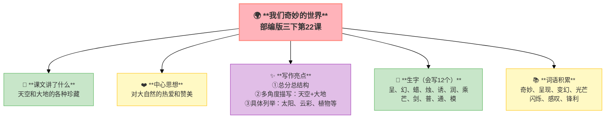
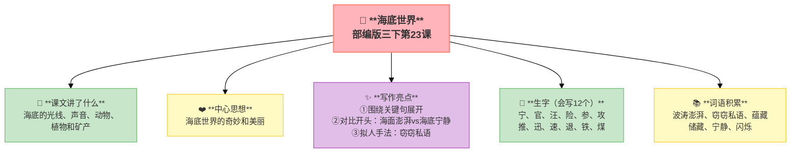
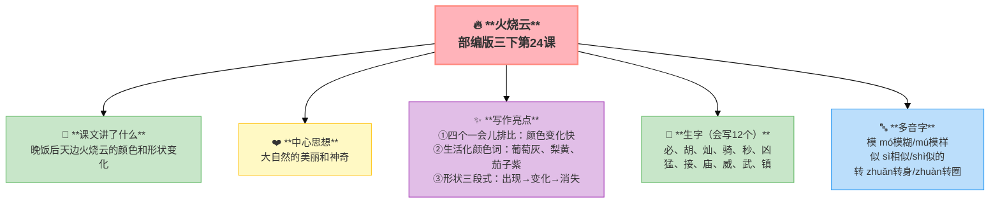

---
tags:
  - 三下
  - 语文
  - 奇妙的世界
  - 萧红
  - 写景散文
  - 颜色描写
---

# 第七单元 · 奇妙的世界

> 天空和大地的珍藏、海底的神秘、火烧云的绚丽——世界真奇妙！
> **阅读重点**：了解课文是从哪几个方面把事物写清楚的
> **习作目标**：国宝大熊猫（搜集资料/介绍类作文）

---

## 22 我们奇妙的世界

> 部编版三下第22课
> ⏰ 先读课文三遍，再往下看
> **阅读重点**：了解课文是从哪几个方面把事物写清楚的
> **习作目标**：国宝大熊猫（搜集资料/介绍类作文）

---

### 📖 □核心 课文讲了什么

这是一个奇妙的世界——一切都在生长变化。天空的珍藏：太阳、云彩、雨点、冰雪、鸟飞、蝴蝶；大地的珍藏：植物、水果、岩石、贝壳。

---

### 💬 □核心 作者想说的话

**通过描写天空和大地的珍藏，表达了对大自然的热爱和对奇妙世界的赞美。**

---

### ✨ □了解 写作亮点

| 序号 | 亮点 | 说明 |
|:-----|:-----|:-----|
| ① | **总分总结构** | 总说奇妙→分说天空和大地→总结奇妙 |
| ② | **多角度描写** | 从天空和大地两个方面展开 |
| ③ | **具体列举** | 列举太阳、云彩、植物等具体事物 |

---

### 📝 □核心 生字（会写X个）

呈、幻、蜡、烛、诱、润、乘、芒、剑、普、通、模

---

### 📚 □了解 词语积累

| 类别 | 词语 |
|:-----|:-----|
| **必会字词** | 奇妙、呈现、变幻、光芒、闪烁、感叹、锋利 |
| **近义词** | 奇妙——神奇、呈现——展现、变幻——变化 |
| **反义词** | 奇妙——普通、闪烁——暗淡 |

---

## 🏗️ 文章结构：超清晰！

| 部分 | 内容 | 作用 |
|:-----|:-----|:-----|
| **第一部分 🎬** | 总：这是一个奇妙的世界 | 总起，点明主题 |
| **第二部分 🔥** | 天空的珍藏（太阳→云彩→雨点→冰雪） | **重点段落**，天空描写 |
| **第三部分 🔥** | 大地的珍藏（植物→水果→岩石→贝壳） | **重点段落**，大地描写 |
| **第四部分 🌱** | 总：世界上存在的奇妙事物是无穷的 | 总结，升华主题 |

> **💡 写作要点**：用**总分总**结构写，从**多个方面**展开。

---

## ✨ 阅读与写作：深挖课文"宝藏"

### 1️⃣ 天空的珍藏 —— 景物描写

| 阅读要点 | 写法分析 | 写作小技巧 |
|:---------|:---------|:-----------|
| 太阳升起→落下 🌅 | 按时间顺序写 | 写景可以按时间顺序 |
| 云彩各种形状 ☁️ | 用比喻写形状 | 写云可以用比喻 |

### 2️⃣ 大地的珍藏 —— 景物描写

| 阅读要点 | 写法分析 | 写作小技巧 |
|:---------|:---------|:-----------|
| 植物生长→开花→结果 🌱 | 按生长过程写 | 写植物可以按生长过程 |
| 水果颜色变化 🍎 | 用颜色词写变化 | 写水果可以用颜色词 |

### 🖋️ □了解 原文对照仿写

| 原句 | 仿写练习 |
|:-----|:---------|
| "这是一个奇妙的世界，一切看上去都是有生命的。" | 仿写：这是一个____的____，一切____（用总起句开头写一个地方） |
| "太阳升起来了……太阳落下了"（一天的时间顺序） | 仿写：用"从早到晚"写一个地方的景色变化 |

---

### 💡 □了解 道理与思辨

| 思辨问题 | 引导方向 | 表达小技巧 |
|:---------|:---------|:-----------|
| "天空和大地各有什么珍藏？" | 理解多角度描写 | "天空有……大地有……"的句式 |
| "为什么说世界是奇妙的？" | 联系生活实际，体会奇妙 | "因为……所以……"的句式 |

---

## 📚 语言积累：词语库+句式库

> "这是一个奇妙的世界，一切看上去都是有生命的。"
> 
> 总起句，点明主题。

> "天空的珍藏：太阳、云彩、雨点、冰雪……"
> 
> 列举法，具体描写。

---

---

## 📋 附录

## 📋 学习自评表（教-学-评一致性）✅

| 评价维度 | 我能做到（✅） | 需再练练（🔄） |
|:---------|:--------------|:---------------|
| **结构把握** | 能说出天空和大地的珍藏 | |
| **语言运用** | 能正确读写12个生字，会用多音字 | |
| **朗读理解** | 能找出课文的关键句 | |
| **思辨拓展** | 能从不同方面介绍一个事物 | |

---

## 23 海底世界

> 部编版三下第23课
> ⏰ 先读课文三遍，再往下看
> **阅读重点**：了解课文是从哪几个方面把事物写清楚的
> **习作目标**：国宝大熊猫（搜集资料/介绍类作文）

---

### 📖 □核心 课文讲了什么

海底是怎样的？海面上波涛澎湃的时候，海底依然宁静。海底有发光的鱼、各种各样的声音、丰富的动物、茂密的植物和丰富的矿产。

---

### 💬 □核心 作者想说的话

**通过描写海底的景色和物产，表现了海底世界的奇妙和美丽。**

---

### ✨ □了解 写作亮点

| 序号 | 亮点 | 说明 |
|:-----|:-----|:-----|
| ① | **围绕关键句展开** | 每段都有关键句，围绕关键句展开描写 |
| ② | **对比开头** | 海面波涛澎湃vs海底宁静，对比突出特点 |
| ③ | **拟人手法** | "窃窃私语"，把海底声音当人写 |

---

### 📝 □核心 生字（会写X个）

宁、官、汪、险、参、攻、推、迅、速、退、铁、煤

---

### 📚 □了解 词语积累

| 类别 | 词语 |
|:-----|:-----|
| **必会字词** | 波涛澎湃、窃窃私语、蕴藏、储藏、宁静、闪烁 |
| **近义词** | 宁静——安静、蕴藏——储藏 |
| **反义词** | 宁静——喧闹、黑暗——明亮 |

---

## 🏗️ 文章结构：超清晰！

| 部分 | 自然段 | 内容 | 作用 |
|:-----|:-------|:-----|:-----|
| **第一部分 🎬** | 1 | 海底是怎样的？ | 提出问题 |
| **第二部分 🔥** | 2 | 海底有光（发光鱼） | **重点段落**，光线描写 |
| **第三部分 🔥** | 3 | 海底有声音（窃窃私语） | **重点段落**，声音描写 |
| **第四部分 🔥** | 4 | 海底的动物各有各的活动方法 | **重点段落**，动物描写 |
| **第五部分 🔥** | 5 | 海底有植物（海藻） | **重点段落**，植物描写 |
| **第六部分 🔥** | 6 | 海底有矿产（石油、天然气） | **重点段落**，矿产描写 |

> **💡 写作要点**：用**关键句**统领段落，从**多个方面**写清楚。

---

## ✨ 阅读与写作：深挖课文"宝藏"

### 1️⃣ 每段的关键句 —— 说明方法

| 段落 | 关键句 | 写了什么 |
|:----|:-------|:---------|
| 2 | 海底有光 | 发光鱼 |
| 3 | 海底有声音 | 窃窃私语 |
| 4 | 海里的动物各有各的活动方法 | 海参、乌贼、贝类等 |
| 5 | 海底有植物 | 海藻 |
| 6 | 海底有矿产 | 石油、天然气 |

### 2️⃣ 拟人手法 —— 写作技巧

| 阅读要点 | 写法分析 | 写作小技巧 |
|:---------|:---------|:-----------|
| "窃窃私语" 🗣️ | 把海底声音当人写 | 写声音可以用拟人 |

### 🖋️ □了解 原文对照仿写

| 原句 | 仿写练习 |
|:-----|:---------|
| "你可知道，大海深处是什么样的吗？" | 仿写：你可知道，____是什么样的吗？（用设问开头写一个地方） |
| "海里的动物，各有各的活动方法。" | 仿写：____，各有各的____（用总起句统领一段） |

---

### 💡 □了解 道理与思辨

| 思辨问题 | 引导方向 | 表达小技巧 |
|:---------|:---------|:-----------|
| "海底有什么？" | 理解多角度描写 | "海底有……有……还有……"的句式 |
| "海底为什么是宁静的？" | 联系科学知识，理解原因 | "因为……所以……"的句式 |

---

## 📚 语言积累：词语库+句式库

> "你可知道，大海深处是什么样的吗？"
> 
> 设问句，引发好奇。

> "海底是否没有一点儿声音呢？不是的。"
> 
> 自问自答，引起注意。

---

## 📋 学习自评表（教-学-评一致性）✅

| 评价维度 | 我能做到（✅） | 需再练练（🔄） |
|:---------|:--------------|:---------------|
| **结构把握** | 能说出海底的五个方面 | |
| **语言运用** | 能正确读写12个生字，会用多音字 | |
| **朗读理解** | 能找出每段的关键句 | |
| **思辨拓展** | 能围绕一个意思把一段话写清楚 | |

---

## 24* 火烧云（略读）

> 部编版三下第24课
> ⏰ 先读课文三遍，再往下看
> **阅读重点**：了解课文是从哪几个方面把事物写清楚的
> **习作目标**：国宝大熊猫（搜集资料/介绍类作文）

---

### 📖 □核心 课文讲了什么

晚饭过后，火烧云上来了——天空像着了火，颜色不断变幻，形状从马变狗变狮子，一会儿工夫就下去了。

---

### 💬 □核心 作者想说的话

**通过描写火烧云的颜色和形状变化，表现了大自然的美丽和神奇。**

---

### ✨ □了解 写作亮点

| 序号 | 亮点 | 说明 |
|:-----|:-----|:-----|
| ① | **四个"一会儿"排比** | 排比写出变化快，像走马灯一样 |
| ② | **生活化颜色词** | 葡萄灰、梨黄、茄子紫，用熟悉事物命名颜色 |
| ③ | **"说也说不出来"** | 用"说不出来"反衬颜色太多了 |
| ④ | **形状变化三段式** | 出现→变化→消失，层层推进 |

---

### 📝 □核心 生字（会写X个）

必、胡、灿、骑、秒、凶、猛、接、庙、威、武、镇

---

### 📚 □了解 词语积累

| 类别 | 词语 |
|:-----|:-----|
| **必会字词** | 火烧云、霞光、红彤彤、金灿灿、凶猛、威武、镇静、恍恍惚惚 |
| **多音字** | 模(mó模糊/mú模样)、似(sì相似/shì似的)、转(zhuǎn转身/zhuàn转圈) |
| **近义词** | 镇静——镇定、凶猛——凶恶、威武——威严 |
| **反义词** | 镇静——慌张、凶猛——温顺、模糊——清晰 |
| **ABB颜色词** | 红彤彤、金灿灿、黄澄澄、绿油油、白茫茫、黑乎乎 |

---

## 🏗️ 文章结构：超清晰！

| 部分 | 自然段 | 内容 | 作用 |
|:-----|:-------|:-----|:-----|
| **第一部分 🎬** | 1 | 地上（霞光照上来） | 交代背景 |
| **第二部分 🔥** | 2 | 天上（火烧云上来） | **重点段落**，火烧云上来 |
| **第三部分 🔥** | 3-4 | 颜色变化 | **重点段落**，颜色描写 |
| **第四部分 🔥** | 5-7 | 形状变化（马→狗→狮子） | **重点段落**，形状描写 |
| **第五部分 🌱** | 8 | 地上（火烧云下去了） | 结尾，火烧云下去 |

> **💡 写作要点**：用**排比**写颜色变化，用**三段式**写形状变化。

---

## 📚 语言积累：词语库+句式库

> "天上的云从西边一直烧到东边，红彤彤的，好像是天空着了火。"
> 
> 用"烧"字写出火烧云的动态。

> "一会儿红彤彤，一会儿金灿灿，一会儿半紫半黄，一会儿半灰半百合色。"
> 
> 排比写出颜色变化快。

---

## ✍️ 习作：国宝大熊猫

### 🎯 □核心 目标
搜集资料，整合信息，从几个方面介绍大熊猫。

### 🧩 资料搜集清单

| 方面 | 问题 |
|:----|:-----|
| 基本特征 | 大熊猫是猫吗？属于什么科？ |
| 外形 | 长什么样？为什么叫"熊猫"？ |
| 分布 | 生活在哪儿？（四川/陕西/甘肃） |
| 食物 | 吃什么？一天吃多少竹子？ |
| 习性 | 会爬树吗？冬眠吗？ |
| 保护现状 | 为什么是国宝？有多少只？ |

### 📐 □了解 写作框架

1. **引入**：用一种有趣的方式开头
2. **外形**：按顺序描写
3. **生活习性**：吃什么、住在哪、爱干什么
4. **为什么是国宝**：珍稀、中国特有、外交礼物
5. **结尾**：我们要保护大熊猫

### 📝 □了解 同学初稿 vs 修改稿

| 对比项 | 初稿（同学G） | 修改稿 |
|:-------|:-------------|:-------|
| **开头** | 大熊猫是国宝。 | "身穿黑白大棉袄，天生戴着黑墨镜"——猜猜这是什么动物？对了，就是我们的国宝大熊猫！ |
| **外形** | 大熊猫是黑白相间的。 | 大熊猫的身体圆滚滚的，像一个大皮球。它的毛色黑白分明——脑袋和肚子是白的，眼睛、耳朵和四肢是黑的。最有趣的是它的"黑眼圈"，好像没睡醒一样，可爱极了！ |
| **习性** | 大熊猫吃竹子。 | 大熊猫是个"大吃货"——一天要花12个小时吃竹子，能吃掉20公斤！它坐在地上，两只前爪捧着竹子，像我们在吃甘蔗一样，咔嚓咔嚓嚼得可香了。 |
| **评价** | 像百度百科，不生动 | 有谜语开头→有外形描写→有有趣的习惯，读起来有画面 |

---

## ❓ 关联性问题

1. 我们奇妙的世界写"天空+大地"，海底世界写"海底"——你觉得作者为什么选这两个地方来写"奇妙"？
2. 火烧云的颜色描写用了"葡萄灰、梨黄、茄子紫"，你还能用什么水果来命名颜色？
3. 本单元三篇课文都是写"奇妙"——你觉得生活中还有哪些"奇妙"？能不能用课文里学到的方法来写？

---

## 🔗 跨文本对比

| 对比维度 | 22 我们奇妙的世界 | 23 海底世界 | 24 火烧云 |
|:---------|:------------------|:------------|:----------|
| 描写范围 | 整个世界（天空+大地） | 海底 | 天空的云 |
| 文体 | 散文 | 科普说明文 | 散文（回忆性） |
| 时间维度 | 一天+四季 | 固定介绍 | 日落前后 |
| 感官运用 | 视觉+触觉+听觉 | 视觉+听觉 | 视觉为主 |
| 共同主题 | 世界充满奇妙，要用心去发现 |

💡 **阅读启示**：奇妙的世界就在我们身边——抬头看天空（火烧云的变化），低头想大海（海底的神秘），放眼望四周（四季的轮回）。写"奇妙"不需要去远方，只要你有一双善于发现的眼睛。

---

## 📚 课外书吧

1. **《呼兰河传》（选读）**——萧红用诗意的语言写她小时候看到的火烧云和菜园子
2. **《海底两万里》**——跟着尼摩船长潜入深海，看看海底到底有多奇妙

## 🗣️ 语文生活

> **选一个你身边觉得"奇妙"的事物，用"总分总"的结构写一段话。**
>
> 可以是一只蜗牛怎么爬墙，也可以是一株向日葵怎么跟着太阳转。关键是——像课文里一样，从多个方面来写。

## 🔄 老朋友回来啦

| 词语 | 之前在哪见过 | 本单元出现 |
|:-----|:------------|:----------|
| 呈现 | 本单元新学 | 《我们奇妙的世界》"呈现" |
| 变幻 | 三上第一单元《大青树下的小学》"变化" | 《火烧云》"变幻" |
| 威武 | 三上第七单元《大自然的声音》本课未出现 | 《火烧云》"威武" |
| 镇静 | 本单元新学 | 《火烧云》"镇静" |

✅ ⬛⬛ 阅读纵向衔接：

| 老朋友 | 出自 | 再认读 |
|:-------|:-----|:-------|
| **了解课文是从哪几个方面写清楚** | 三上第六单元"围绕一个意思写清楚" | 从"一段话围绕中心句"→"全篇几个方面写清楚"，条理能力螺旋上升 |

## 🌐 三通

1. **奇妙 × 科学：** "火烧云"其实是自然现象——日落时阳光散射形成的。你知道这是什么原理吗？
2. **奇妙 × 环保：** 海底世界说"海底有矿产"——保护海洋为什么这么重要？
3. **奇妙 × 写作：** 三篇课文教你三个"写奇妙"的方法——你觉得哪个方法最适合你？

---

## 📎 拓展
- 延伸阅读：萧红《呼兰河传》选段
- 口语交际：劝告（用道理和情感说服别人）
- 语文园地七：词句段运用（从不同方面写清楚）

---

## 📖 语文园地

> 天空和大地的珍藏、海底的神秘、火烧云的绚丽——世界真奇妙！
> **阅读重点**：了解课文是从哪几个方面把事物写清楚的
> **习作目标**：国宝大熊猫（搜集资料/介绍类作文）

> ⏰ 先读课文三遍，再往下翻
---

## □核心 交流平台

- 写清楚一件事物，要分几个方面来写：外形、习性、生活环境……
- 每个方面独立成段，段与段之间有顺序
- 用上表示顺序的词语："首先""其次""最后"或者"在……方面"

---

## □核心 词句段运用

- 收集关于大熊猫的信息：外形__、分布__、食性__、特点__
- 用"从……到……，从……到……"写一段描述性文字
- 学习用数据说话："大熊猫一天能吃掉____千克竹子"

---

## □核心 日积月累

**关于探索的名言**

- 世界上不缺少美，只缺少发现美的眼睛。——罗丹
- 大自然是世界上最有趣的教科书。
- 探索真理比占有真理更为可贵。——爱因斯坦
- 天地玄黄，宇宙洪荒。——《千字文》