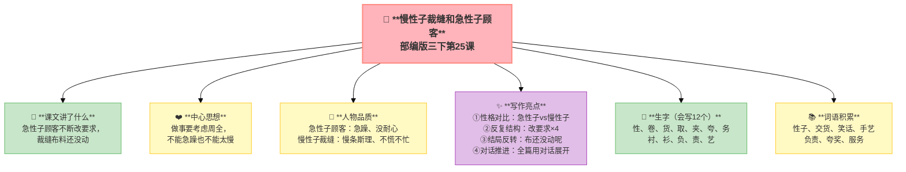
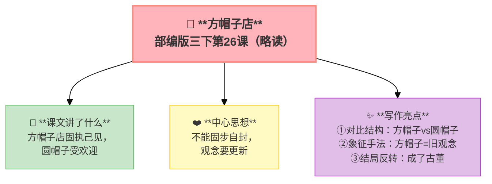
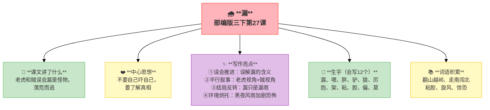
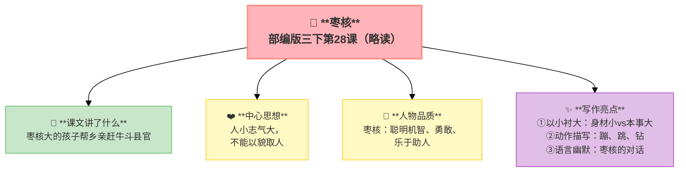

---
tags:
  - 三下
  - 语文
  - 有趣的故事
  - 故事
  - 复述
  - 民间故事
---

# 第八单元 · 有趣的故事

> 慢性子裁缝和急性子顾客、漏、枣核——故事里充满了意外和趣味。
> **阅读重点**：了解故事的主要内容，复述故事
> **习作目标**：这样想象真有趣（反转想象作文）

---

## 25 慢性子裁缝和急性子顾客

> 部编版三下第25课
> ⏰ 先读课文三遍，再往下看
> **阅读重点**：了解故事的主要内容，复述故事
> **习作目标**：这样想象真有趣（反转想象作文）

---

### 📖 □核心 课文讲了什么

急性子顾客要做棉袄，遇到慢性子裁缝。顾客一次次改要求（棉袄→夹袄→衬衫→春装），裁缝每次都慢悠悠答应——最后说"布还没动呢"！

---

### 💬 □核心 作者想说的话

**通过急性子顾客和慢性子裁缝的故事，告诉我们做事要考虑周全，不能急躁也不能太慢。**

---

### 👤 □了解 人物品质

| 人物 | 品质 |
|:-----|:-----|
| **急性子顾客** | 急躁、没耐心 |
| **慢性子裁缝** | 慢条斯理、不慌不忙 |

---

### ✨ □了解 写作亮点

| 序号 | 亮点 | 说明 |
|:-----|:-----|:-----|
| ① | **性格对比** | 急性子vs慢性子，对比让冲突更鲜明 |
| ② | **反复结构** | 顾客改要求×4，重复推进情节积累期待 |
| ③ | **结局反转** | "布还没动呢"，最大的意外就是最大的幽默 |
| ④ | **对话推进** | 全篇用对话展开，对话让故事更生动 |

---

### 📝 □核心 生字（会写X个）

性、卷、货、取、夹、夸、务、衬、衫、负、责、艺

---

### 📚 □了解 词语积累

| 类别 | 词语 |
|:-----|:-----|
| **必会字词** | 性子、交货、笑话、手艺、负责、夸奖、服务 |
| **近义词** | 性子——脾气、负责——尽责 |
| **反义词** | 慢性子——急性子、夸奖——批评 |

---

## 🏗️ 文章结构：超清晰！

| 部分 | 内容 | 作用 |
|:-----|:-----|:-----|
| **第一部分 🎬** | 第一天：急性子顾客来了（要做棉袄） | 交代起因 |
| **第二部分 🔥** | 第二天：顾客改主意（做夹袄） | **重点段落**，反复推进 |
| **第三部分 🔥** | 第三天：顾客又改主意（做衬衫） | **重点段落**，反复推进 |
| **第四部分 🔥** | 后来：顾客还想改（做春装） | **重点段落**，反复推进 |
| **第五部分 🌱** | 结局：裁缝说"布料还夹在柜子里" | 结尾，反转幽默 |

> **💡 写作要点**：用**反复结构**推进情节，用**结局反转**制造幽默。

---

## ✨ 阅读与写作：深挖课文"宝藏"

### 1️⃣ 急性子vs慢性子对比表 —— 人物描写

| 对比项 | 急性子顾客 | 慢性子裁缝 |
|:-------|:-----------|:-----------|
| **说话** | 又急又快 | 慢悠悠 |
| **要求** | 要快！越快越好 | 急什么 |
| **时间** | 今天→明天→三天 | 明年冬天 |
| **结局** | 被自己急坏了 | 布还没动 |

### 2️⃣ 对话推进 —— 写作技巧

| 阅读要点 | 写法分析 | 写作小技巧 |
|:---------|:---------|:-----------|
| 全篇用对话展开 🗣️ | 对话让故事更生动 | 写故事可以用对话推进 |

### 🖋️ □了解 原文对照仿写

| 原句 | 仿写练习 |
|:-----|:---------|
| "裁缝说：'我和别的裁缝不一样，我是个性子最慢的裁缝啊。'" | 仿写：设计一段"慢vs急"对话（一个人慢慢说，一个人急得跳脚） |

---

### 💡 □了解 道理与思辨

| 思辨问题 | 引导方向 | 表达小技巧 |
|:---------|:---------|:-----------|
| "急性子和慢性子各有什么优缺点？" | 理解性格的两面性 | "急性子……慢性子……"的对比句式 |
| "如果你是裁缝，会怎么做？" | 联系生活实际，表达看法 | "如果是我，我会……因为……" |

---

## 📚 语言积累：词语库+句式库

> "顾客噌的一下跳起来：'你怎么才告诉我？'"
> 
> 用动作和语言写出顾客的急躁。

> "裁缝慢悠悠地说：'不着急。'"
> 
> 用语言写出裁缝的慢性子。

---

---

## 📋 附录

## 📋 学习自评表（教-学-评一致性）✅

| 评价维度 | 我能做到（✅） | 需再练练（🔄） |
|:---------|:--------------|:---------------|
| **结构把握** | 能说出顾客改要求的次数 | |
| **语言运用** | 能正确读写12个生字，会用多音字 | |
| **朗读理解** | 能分角色读出两种性格 | |
| **思辨拓展** | 能按时间顺序复述故事 | |

---

## 26* 方帽子店（略读）

> 部编版三下第26课（略读课文）
> ⏰ 先读课文三遍，再往下看
> **阅读重点**：了解故事的主要内容，复述故事
> **习作目标**：这样想象真有趣（反转想象作文）

---

### 📖 □核心 课文讲了什么

帽子店只卖方帽子，因为老板认为"从来如此"。但孩子们做了圆帽子来戴——最后方帽子成了古董。

---

### 💬 □核心 作者想说的话

**通过方帽子店的故事，告诉我们不能固步自封，时代在变观念也要更新。**

---

### ✨ □了解 写作亮点

| 序号 | 亮点 | 说明 |
|:-----|:-----|:-----|
| ① | **对比结构** | 方帽子vs圆帽子，新旧对比突出主题 |
| ② | **象征手法** | 方帽子=旧观念，用具体事物象征抽象道理 |
| ③ | **结局反转** | 古董店取代帽子店，时代进步的必然 |

---

### 📚 □了解 词语积累

| 类别 | 词语 |
|:-----|:-----|
| **必会字词** | 方帽子、圆帽子、古董、固执 |
| **近义词** | 固执——顽固、古董——老古董 |
| **反义词** | 方——圆、新——旧 |

---

## 🏗️ 文章结构：超清晰！

| 部分 | 内容 | 作用 |
|:-----|:-----|:-----|
| **第一部分 🎬** | 方帽子店只卖方帽子 | 交代背景 |
| **第二部分 🔥** | 孩子们做圆帽子来戴 | **重点段落**，对比展开 |
| **第三部分 🌱** | 方帽子成了古董 | 结尾，揭示道理 |

> **💡 写作要点**：用**象征手法**表达道理，用**对比结构**突出主题。

---

## 📚 语言积累：词语库+句式库

> "他们圆圆的脑袋藏在方帽子里，紧的地方太紧，宽的地方太宽。"
> 
> 用对比写出方帽子的不舒服。

---

## 27 漏

> 部编版三下第27课
> ⏰ 先读课文三遍，再往下看
> **阅读重点**：了解故事的主要内容，复述故事
> **习作目标**：这样想象真有趣（反转想象作文）

---

### 📖 □核心 课文讲了什么

老虎和贼都想去偷驴，听到老婆婆说"怕漏"，以为"漏"是怪物。他们互相吓唬，落荒而逃——结果"漏"只是漏雨！

---

### 💬 □核心 作者想说的话

**通过老虎和贼互相以为对方是"漏"的故事，告诉我们不要自己吓自己，要了解真相。**

---

### ✨ □了解 写作亮点

| 序号 | 亮点 | 说明 |
|:-----|:-----|:-----|
| ① | **误会推进** | 老虎和贼都误解"漏"，误会产生幽默 |
| ② | **平行叙事** | 老虎视角＋贼视角，双线叙事更有张力 |
| ③ | **结局反转** | "漏"只是漏雨，最大的意外是虚惊一场 |
| ④ | **环境烘托** | 黑夜、旋风、大雨，恐怖氛围加剧误会 |

---

### 📝 □核心 生字（会写X个）

漏、喂、胖、驴、狼、厉、抱、架、粘、胶、偏、莫

---

### 📚 □了解 词语积累

| 类别 | 词语 |
|:-----|:-----|
| **必会字词** | 翻山越岭、走南闯北、粘胶、旋风、惊恐 |
| **近义词** | 惊恐——恐惧、翻山越岭——跋山涉水 |
| **反义词** | 惊恐——镇定 |

---

## 🏗️ 文章结构：超清晰！

| 部分 | 内容 | 作用 |
|:-----|:-----|:-----|
| **第一部分 🎬** | 老公公家：老婆婆说"怕漏" | 交代起因 |
| **第二部分 🔥** | 老虎听到：以为"漏"是怪物 | **重点段落**，误会开始 |
| **第三部分 🔥** | 贼听到：也以为"漏"是怪物 | **重点段落**，误会加深 |
| **第四部分 🔥** | 逃跑路上：老虎驮着贼跑 | **重点段落**，平行叙事 |
| **第五部分 🔥** | 树下：互相看见→都以为对方是"漏" | **重点段落**，误会高潮 |
| **第六部分 🌱** | 天亮：什么都没发生 | 结尾，真相大白 |

> **💡 写作要点**：用**误会**推进情节，用**平行叙事**增加张力。

---

## ✨ 阅读与写作：深挖课文"宝藏"

### 1️⃣ 复述方法（本单元重点）—— 按地点变化复述

| 地点 | 关键情节 |
|:-----|:---------|
| 老公公家 | 老婆婆说"漏"→老虎和贼听到 |
| 逃跑路上 | 老虎驮着贼跑 |
| 树下 | 老虎和贼互相看见→都以为对方是"漏" |
| 天亮 | 什么都没发生 |

**方法**：抓住角色+地点+关键情节。

### 2️⃣ 环境烘托 —— 写作技巧

| 阅读要点 | 写法分析 | 写作小技巧 |
|:---------|:---------|:-----------|
| 黑夜、旋风、大雨 🌧️ | 恐怖氛围加剧误会 | 写故事可以用环境烘托 |

### 🖋️ □了解 原文对照仿写

| 原句 | 仿写练习 |
|:-----|:---------|
| "老虎吓得浑身发抖，贼也吓得腿脚发软。" | 仿写：____吓得____，____也吓得____（用两个"吓得"写紧张场景） |

---

### 💡 □了解 道理与思辨

| 思辨问题 | 引导方向 | 表达小技巧 |
|:---------|:---------|:-----------|
| ""漏"到底是什么？" | 理解误会的产生和消除 | "原来……不是……"的句式 |
| "老虎和贼为什么害怕？" | 联系生活实际，体会心理 | "因为他们以为……所以……"的句式 |

---

## 📚 语言积累：词语库+句式库

> "老虎吓得浑身发抖，贼也吓得腿脚发软。"
> 
> 用动作写出恐惧。

> "原来'漏'是漏雨啊！"
> 
> 用感叹句表达恍然大悟。

---

## 📋 学习自评表（教-学-评一致性）✅

| 评价维度 | 我能做到（✅） | 需再练练（🔄） |
|:---------|:--------------|:---------------|
| **结构把握** | 能说出故事的起因、经过、结果 | |
| **语言运用** | 能正确读写12个生字，会用多音字 | |
| **朗读理解** | 能读出故事的紧张和幽默 | |
| **思辨拓展** | 能按地点变化复述故事 | |

---

## 28* 枣核（略读）

> 部编版三下第28课（略读课文）
> ⏰ 先读课文三遍，再往下看
> **阅读重点**：了解故事的主要内容，复述故事
> **习作目标**：这样想象真有趣（反转想象作文）

---

### 📖 □核心 课文讲了什么

一个像枣核那么大的孩子，人小志气大——帮乡亲们赶牛、斗县官，把县官气得哇哇叫。

---

### 💬 □核心 作者想说的话

**通过枣核的故事，告诉我们人小志气大，不能以貌取人。**

---

### 👤 □了解 人物品质

| 人物 | 品质 |
|:-----|:-----|
| **枣核** | 聪明机智、勇敢、乐于助人 |

---

### ✨ □了解 写作亮点

| 序号 | 亮点 | 说明 |
|:-----|:-----|:-----|
| ① | **以小衬大** | 身材小vs本事大，反差突出人物特点 |
| ② | **动作描写** | 蹦、跳、钻，一连串动词写活人物 |
| ③ | **语言幽默** | 枣核的对话，幽默语言增加趣味 |

---

### 📚 □了解 词语积累

| 类别 | 词语 |
|:-----|:-----|
| **必会字词** | 枣核、蹦跳、钻、县官、欺负 |
| **近义词** | 聪明——机智、欺负——欺压 |
| **反义词** | 聪明——愚蠢、欺负——保护 |

---

## 🏗️ 文章结构：超清晰！

| 部分 | 内容 | 作用 |
|:-----|:-----|:-----|
| **第一部分 🎬** | 枣核的出生和特点（人小志大） | 交代背景 |
| **第二部分 🔥** | 帮乡亲赶牛 | **重点段落**，展现本事 |
| **第三部分 🔥** | 斗县官 | **重点段落**，展现智慧 |
| **第四部分 🌱** | 把县官气得哇哇叫 | 结尾，幽默收场 |

> **💡 写作要点**：用**以小衬大**突出人物，用**动作描写**写活人物。

---

## 📚 语言积累：词语库+句式库

> "枣核蹦到县官面前：'你能把我怎么样？'"
> 
> 用动作和语言写出枣核的勇敢。

---

## ✍️ 习作：这样想象真有趣

### 🎯 □核心 目标
选择一种动物，把它的某个特征**反过来想**（变大、变小、会飞、会跑、会说话……），编一个有趣的故事。

### 🧩 反转想象

| 动物 | 原特征 | 反转 | 故事方向 |
|:-----|:-------|:-----|:---------|
| 蚂蚁 | 很小 | 变得比树还大 | 它怎么走路？吃什么？大家怕它？ |
| 蜗牛 | 很慢 | 跑得比豹子还快 | 壳怎么办？它还想慢下来？ |
| 母鸡 | 不会飞 | 飞上天空 | 能飞多高？要不要参加飞行比赛？ |
| 老鹰 | 很强壮 | 变得胆小如鼠 | 它怕什么？怎么捕食？ |
| 乌龟 | 很慢 | 健步如飞 | 壳还会是负担吗？和兔子再赛跑？ |

### 📐 □了解 写作框架

1. **开头**：这只动物本来是什么样 + 发生了什么变化
2. **变化后**：它有了什么新本事
3. **发生了什么**：用变化后的能力做了什么事
4. **结局**：它喜欢这个变化吗？

### 📝 □了解 同学初稿 vs 修改稿

| 对比项 | 初稿（同学H） | 修改稿 |
|:-------|:-------------|:-------|
| **开头** | 蚂蚁变得比树还大。 | 从前有一只小蚂蚁叫豆豆，它总觉得自己太小了，谁都能踩它一脚。有一天，它捡到一颗亮晶晶的魔法豆…… |
| **变化** | 它变大了，超级大。 | 豆豆刚把魔法豆吞下去，身体就开始膨胀——它的腿变粗了，肚子变大了，触角伸到了天上！它低头一看，以前的大树现在只有它的一半高！ |
| **冲突** | 别的动物都怕它。 | "救命啊！有怪兽！"小鸟吓得飞走了，兔子吓得躲进了洞里。豆豆想解释："我不是怪兽，我是豆豆啊！"可是它的声音太大了，像打雷一样——动物们更害怕了。 |
| **结局** | 它又变小了，很开心。 | 魔法豆只有一天的魔力。太阳下山时，豆豆又变回了原来的样子。"还是做小蚂蚁好，"豆豆说，"虽然小，但可以交到很多朋友！" |
| **评价** | 只有骨架，没有血肉 | 有起因→变化→冲突→感悟，细节丰满，读起来像真的一样 |

---

## ❓ 关联性问题

1. 慢性子裁缝和急性子顾客、方帽子店都靠"反差"制造幽默——你能说出它们分别是什么反差吗？
2. 漏和枣核都是民间故事——民间故事一般有什么特点？（提示：想想它们的开头和结尾）
3. 学完本单元四个故事，你觉得"有趣的故事"必须满足什么条件？

---

## 🔗 跨文本对比

| 对比维度 | 25 慢性子裁缝和急性子顾客 | 26 方帽子店 | 27 漏 | 28 枣核 |
|:---------|:------------------------|:------------|:------|:--------|
| 故事来源 | 现代原创 | 现代原创 | 民间故事 | 民间故事 |
| 故事特点 | 性格反差 | 打破传统 | 误会叠误会 | 智斗坏人 |
| 笑点类型 | 对话幽默 | 固执可笑 | 误会滑稽 | 智慧逗趣 |
| 共同主题 | 有趣的故事既让人笑，又引人思考 |

💡 **阅读启示**：有趣的故事不是乱写——它们都有"巧思"：有的靠人物性格的反差（慢vs急），有的靠颠覆常规（打破"向来如此"），有的靠误会制造笑料（"漏"的误会），有的靠聪明的"小人物"赢得胜利（枣核）。写有趣的故事，选一种"巧思"就够了。

---

## 📚 课外书吧

1. **《中国民间故事》**——牛郎织女、孟姜女、白蛇传……每一个都是有趣又感人的故事
2. **《伊索寓言》**——狐狸和葡萄、龟兔赛跑——用一个有趣的故事说一个道理

## 🗣️ 语文生活

> **在家办一个"趣味故事会"——每人讲一个有趣的故事，看谁能把大家逗笑。**
>
> 可以讲自己编的故事，也可以讲课文里的故事。记住：有趣的秘密就是"反差+反转"！

## 🔄 老朋友回来啦

| 词语 | 之前在哪见过 | 本单元出现 |
|:-----|:------------|:----------|
| 服务 | 三下第七单元《海底世界》本单元 | 《慢性子裁缝和急性子顾客》"服务" |
| 夸奖 | 本单元新学 | 《慢性子裁缝和急性子顾客》"夸奖" |
| 性格 | 三下第二单元《陶罐和铁罐》"性格" | 《慢性子裁缝和急性子顾客》"性格" |
| 欺负 | 三上第三单元《一块奶酪》"欺负" | 《枣核》"欺负" |

✅ ⬛⬛ 阅读纵向衔接：

| 老朋友 | 出自 | 再认读 |
|:-------|:-----|:-------|
| **复述故事** | 二下《蜘蛛开店》"根据示意图讲故事" | 二下简单复述→三下借助关键词复述→五上创造性复述 |
## 🌐 三通

1. **有趣的故事 × 戏剧：** 4篇课文如果排成课本剧——你选哪一篇？怎么演才能更搞笑？
2. **有趣的故事 × 写作：** "反转"是好故事的秘诀之一——你能不能用"本来……没想到……"写一个反转？
3. **民间故事大探索：** 漏和枣核是中国的民间故事——你知道国外也有"小人物战胜大坏蛋"的民间故事吗？

---

## 📎 拓展
- 延伸阅读：民间故事《枣核》《漏》的完整版
- 口语交际：趣味故事会（讲一个有趣的故事）
- 语文园地八：交流平台（复述方法总结）

---

## 📖 语文园地

> 慢性子裁缝和急性子顾客、漏、枣核——故事里充满了意外和趣味。
> **阅读重点**：了解故事的主要内容，复述故事
> **习作目标**：这样想象真有趣（反转想象作文）

> ⏰ 先读课文三遍，再往下翻
---

## □核心 交流平台

- 复述故事要先理清故事的起因、经过、结果
- 抓住关键情节，用自己的话把故事讲出来
- 可以借助表格、示意图或者关键词来帮助记忆

---

## □核心 词句段运用

- 积累"不……不……"式的词语：不紧不慢、不慌不忙、不声不响
- 给一个人设两个相反的特点（如慢性子+急性子），想象会发生什么故事
- 用"有……有……有……还有……"写一段人物群像

---

## □核心 日积月累

**大林寺桃花**（唐·白居易）

人间四月芳菲尽，山寺桃花始盛开。
长恨春归无觅处，不知转入此中来。

**关于讲述的名言**

- 故事是生活的比喻。
- 会讲故事的人，拥有世界。