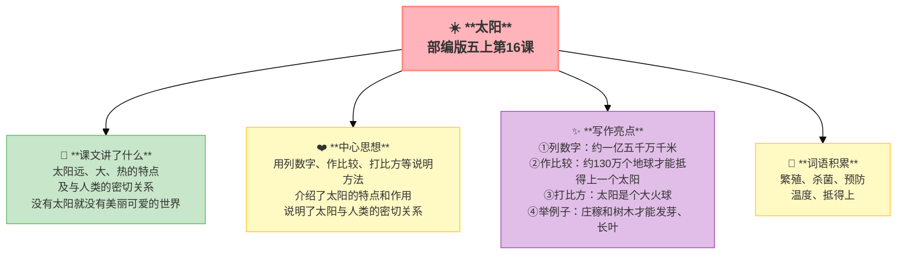

---
tags:
  - 五上
  - 语文
  - 说明文
  - 太阳
---

# 16 太阳

> 部编版五上第五单元 · 习作单元：说明文
> **阅读重点**：了解基本的说明方法
> **习作目标**：介绍一种事物

---

## 📖 课文讲了什么

太阳离我们一亿五千万千米远、体积约130万个地球那么大、表面温度约5500摄氏度——有了太阳，地球上才有生命。

---

## ❤️ 中心思想

**用列数字、作比较、打比方等说明方法，介绍了太阳的特点和作用，说明了太阳与人类的密切关系。**

---

## 📝 生字

（见课本生字表）

---

## 🔤 多音字

（见课本）

---

## 📚 词语积累

### 必会字词

| 词语 | 解释 |
|:----|:-----|
| **繁殖** | 生物产生新个体 |
| **杀菌** | 杀死细菌 |
| **预防** | 防止 |
| **温度** | 冷热程度 |
| **抵得上** | 相当于 |

---

## 🏗️ 文章结构：超清晰！

| 自然段 | 内容 |
|:-------|:-----|
| 第一部分 | 特点（远 → 大 → 热） |
| 第二部分 | 作用（植物→动物→煤炭→气候→人类健康→杀菌） |
| 结论 | 没有太阳就没有我们这个美丽可爱的世界 |

---

## ✨ 阅读与写作：深挖课文"宝藏"

| 写法亮点 | 课文内容 | 写作技巧 |
|:---------|:---------|:---------|
| **列数字** | "约一亿五千万千米""约5500摄氏度" | 用具体数字把抽象变具体 |
| **作比较** | "约130万个地球的体积才能抵得上一个太阳" | 和熟悉的事物对比，更直观 |
| **打比方** | "太阳会发光，会发热，是个大火球" | 用比喻让陌生变熟悉 |
| **举例子** | "有了太阳，庄稼和树木才能发芽、长叶、开花、结果" | 举例说明，清楚易懂 |

---

## 📚 语言积累：词语库+句式库

### 说明方法速查

| 方法 | 定义 | 课文例子 |
|:----|:-----|:---------|
| **列数字** | 用具体数字 | "约一亿五千万千米" |
| **作比较** | 和熟悉的事物比 | "约130万个地球的体积才能抵得上一个太阳" |
| **打比方** | 比喻 | "太阳会发光，会发热，是个大火球" |
| **举例子** | 举例说明 | "有了太阳，地球上的庄稼和树木才能发芽、长叶、开花、结果" |
| **分类别** | 分几类 | 太阳对植物/动物/人/气候的影响 |

---

## 📋 学习自评表

| 评价维度 | 我能…… | ⭐⭐⭐ |
|:---------|:-------|:------|
| **读** | 读懂太阳的特点和作用 | □ |
| **找** | 找出文中的列数字、作比较、打比方 | □ |
| **说** | 说出至少三种说明方法 | □ |
| **写** | 用列数字+作比较写一段说明文字 | □ |
