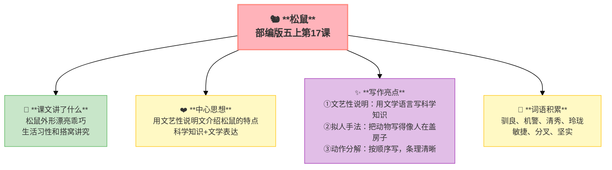

---
tags:
  - 五上
  - 语文
  - 说明文
  - 松鼠
---

# 17 松鼠

> 部编版五上第五单元 · 习作单元：说明文
> **阅读重点**：了解基本的说明方法
> **习作目标**：介绍一种事物

---

## 📖 课文讲了什么

| 核心问题 | 主要内容 |
|:---------|:---------|
| 松鼠是什么样的动物？它怎么搭窝？ | 外形漂亮乖巧 → 生活习性 → 搭窝讲究 |

**一句话速览**：松鼠面容清秀、玲珑乖巧，搭窝非常讲究——先搬小木片、再用苔藓编扎、最后加一层盖，又干净又暖和。

---

## ❤️ 中心思想

**用文艺性说明文介绍松鼠的特点，科学知识+文学表达。**

---

## 📝 生字

（见课本生字表）

---

## 🔤 多音字

（见课本）

---

## 📚 词语积累

### 必会字词

| 词语 | 解释 |
|:----|:-----|
| **驯良** | 和顺善良 |
| **机警** | 机智警觉 |
| **清秀** | 清新秀丽 |
| **玲珑** | 精巧细致 |
| **敏捷** | 动作迅速灵敏 |
| **分叉** | 分成两岔 |
| **坚实** | 坚固结实 |

---

## 🏗️ 文章结构：超清晰！

| 自然段 | 内容 |
|:-------|:-----|
| 外形特征 | 面容→眼睛→面孔→尾巴 |
| 生活习性 | 驯良→机警→敏捷 |
| 搭窝过程 | 搬→编→盖——讲究、干净、暖和 |

---

## ✨ 阅读与写作：深挖课文"宝藏"

| 写法亮点 | 课文内容 | 写作技巧 |
|:---------|:---------|:---------|
| **文艺性说明** | "面容清秀""帽缨形的尾巴" | 用文学语言写科学知识 |
| **拟人手法** | "它们搭窝的时候，先搬些小木片……" | 把动物写得像人在盖房子 |
| **动作分解** | 搭窝过程：搬→放→编扎→挤紧→加盖 | 按顺序写，条理清晰 |

---

## 📚 语言积累：词语库+句式库

### 对比：文艺性 vs 平实说明

| 对比项 | 《太阳》（平实） | 《松鼠》（文艺） |
|:-------|:----------------|:----------------|
| 语言 | 客观数据 | 生动描写 |
| 写法 | 列数字、作比较 | 比喻、拟人 |
| 目的 | 让人知道 | 让人喜欢 |

---

## 📋 学习自评表

| 评价维度 | 我能…… | ⭐⭐⭐ |
|:---------|:-------|:------|
| **读** | 读出松鼠的可爱 | □ |
| **说** | 说出松鼠的外形和搭窝特点 | □ |
| **品** | 比较"平实说明"和"文艺性说明"的区别 | □ |
| **写** | 用文艺性说明写一种小动物 | □ |
