---
tags:
  - 五上
  - 语文
  - 自然之趣
  - 古诗词三首
  - 古诗
---

# 21 古诗词三首

> 部编版五上第七单元 · 自然之趣
> **阅读重点**：初步体会景物的静态美和动态美
> **习作目标**：____即景（写景）

```mermaid
%%{init: {'theme': 'base', 'themeVariables': {'fontSize': '14px'}}}%%
graph TB
    classDef center fill:#FFB3BA,stroke:#FF8A80,stroke-width:2px,color:#333,font-weight:bold,font-size:16px
    classDef green fill:#C8E6C9,stroke:#66BB6A,stroke-width:1px,color:#333,font-size:13px
    classDef blue fill:#BBDEFB,stroke:#42A5F5,stroke-width:1px,color:#333,font-size:13px
    classDef yellow fill:#FFF9C4,stroke:#FFCA28,stroke-width:1px,color:#333,font-size:13px
    classDef purple fill:#E1BEE7,stroke:#AB47BC,stroke-width:1px,color:#333,font-size:13px

    center["📜 **古诗词三首**<br/>部编版五上第21课"]:::center

    l1["📖 **课文讲了什么**<br/>王维的山居、张继的夜泊<br/>纳兰性德的思乡<br/>三种不同的"自然之趣""]:::green
    l2["❤️ **中心思想**<br/>王维对山居生活的向往<br/>张继旅途中的愁思<br/>纳兰性德行军途中的思乡之情"]:::yellow

    l3["📜 **山居秋暝·王维**<br/>山居生活的宁静美好"]:::blue
    l4["✏️ 写作亮点：动静结合、以动衬静、诗中有画"]:::purple

    l5["📜 **枫桥夜泊·张继**<br/>旅途中的落寞愁思"]:::blue
    l6["✏️ 写作亮点：意象群堆叠、以声写静"]:::purple

    l7["📜 **长相思·纳兰性德**<br/>行军途中的思乡之情"]:::blue
    l8["✏️ 写作亮点：上下阕对比、反复强化"]:::purple

    center --> l1
    center --> l2
    center --> l3
    center --> l4
    center --> l5
    center --> l6
    center --> l7
    center --> l8

    style center fill:#FFB3BA,stroke:#FF8A80,stroke-width:2px
```

---

## 📖 课文讲了什么

一首山水田园、一首落寞失眠、一首风雪思乡——三种不同的"自然之趣"。

---

## ❤️ 中心思想

**三首诗词分别表达了王维对山居生活的向往、张继旅途中的愁思、纳兰性德行军途中的思乡之情。**

---

## 📝 生字

（见课本生字表）

---

## 🔤 多音字

（见课本）

---

## 📚 词语积累

### 山居秋暝 · 王维

> 空山新雨后，天气晚来秋。
> 明月松间照，清泉石上流。
> 竹喧归浣女，莲动下渔舟。
> 随意春芳歇，王孙自可留。

> 💡 读着玩——读顺了就好，感受节奏和画面

**📜 写作背景**：王维晚年买了一栋别墅——终南山下的辋川别业。这里山清水秀，他没事就带着朋友到处逛，写诗画画。这首诗就是他在辋川时写的。那是一个秋天的傍晚，刚下过雨，空气特别清新。王维一个人走在山间小路上，看到明月从松树间洒下清辉、听到泉水在石头上哗哗流淌——他觉得这里比官场好一万倍，决定不走了。

**🔑 注释**
| 词语 | 解释 |
|:-----|:-----|
| 暝 | 傍晚、黄昏 |
| 浣女 | 洗衣服的女子 |
| 随意 | 任凭 |
| 歇 | 凋谢、消散 |
| 王孙 | 原指贵族子弟，这里指诗人自己 |

### 枫桥夜泊 · 张继

> 月落乌啼霜满天，江枫渔火对愁眠。
> 姑苏城外寒山寺，夜半钟声到客船。

> 💡 读着玩——读顺了就好，感受节奏和画面

**📜 写作背景**：约755年，张继进京赶考——落榜了。他垂头丧气地坐船回家，路过苏州时天已经黑了。船停在枫桥下，他躺在船舱里翻来覆去睡不着。月亮落下去了，乌鸦叫了几声，江面上寒气逼人——这就是落榜生的真实写照啊。半夜里，寒山寺的钟声传来，一下一下敲在他心坎上。他爬起来，就着船上的油灯，写下了这首"史上最落寞的失眠诗"。

**🔑 注释**
| 词语 | 解释 |
|:-----|:-----|
| 枫桥 | 在苏州阊门外 |
| 夜泊 | 夜晚停船靠岸 |
| 姑苏 | 苏州的别称 |
| 寒山寺 | 苏州寺庙名 |

### 长相思 · 纳兰性德

> 山一程，水一程，身向榆关那畔行，夜深千帐灯。
> 风一更，雪一更，聒碎乡心梦不成，故园无此声。

> 💡 读着玩——读顺了就好，感受节奏和画面

**📜 写作背景**：1682年，康熙皇帝去东北巡视边境，纳兰性德作为御前侍卫随行。这支队伍浩浩荡荡地从北京出发，翻山越岭——山一程、水一程——往山海关方向走。到了晚上，成千上万的帐篷在旷野里点起灯火，壮观极了。但是纳兰性德睡不着——帐篷外面风雪交加，吵得他做不了梦。他想家了：北京家里的夜晚安静温暖，哪有这种鬼声音？

**🔑 注释**
| 词语 | 解释 |
|:-----|:-----|
| 榆关 | 山海关 |
| 那畔 | 那边 |
| 千帐灯 | 千万顶帐篷里的灯火 |
| 聒 | 声音嘈杂 |
| 故园 | 故乡、家乡 |

---

### 词语解释

| 词语 | 画面式解释 |
|:-----|:----------|
| 暝 | 想象一下，太阳慢慢下山了，天色越来越暗——不是全黑，是那种朦朦胧胧的傍晚 |
| 浣女 | 想象一下，一群姑娘蹲在小溪边，把衣服浸在水里搓啊搓，边洗边笑，水花溅得到处都是 |
| 王孙 | 想象一下，一个读书人站在山间，指着自己说"我就是那个可以留下来的人" |
| 夜泊 | 想象一下，天黑了，船夫把船靠到岸边停下，系好缆绳——今晚就在船上睡了 |
| 姑苏 | 想象一下，一个古老又美丽的江南城市，小桥流水，白墙黑瓦，连名字都好听——苏州 |
| 聒 | 想象一下，帐篷外面狂风"呼呼"地吹，大雪"沙沙"地打，吵得你翻来覆去怎么都睡不着 |
| 那畔 | 想象一下，你用手指着远处山海关的方向——"就在那边" |

---

## 🏗️ 文章结构：超清晰！

| 自然段 | 内容 |
|:-------|:-----|
| 山居秋暝 | 空山→明月→清泉→竹林→莲叶 |
| 枫桥夜泊 | 月落→乌啼→霜→江枫→渔火→钟声 |
| 长相思 | 上阕：行军（壮观）→ 下阕：思乡（孤独） |

---

## ✨ 阅读与写作：深挖课文"宝藏"

### 山居秋暝

| 写法亮点 | 课文内容 | 写作技巧 |
|:---------|:---------|:---------|
| **动静结合** | 静：明月照松林；动：清泉流石上、竹喧、莲动 | 静中有动，画面生动 |
| **以动衬静** | "竹喧归浣女，莲动下渔舟" | 声音和动作衬托出山林的幽静 |
| **诗中有画** | 空山→明月→清泉→竹林→莲叶 | 一句一幅画，画面感极强 |

### 枫桥夜泊

| 写法亮点 | 课文内容 | 写作技巧 |
|:---------|:---------|:---------|
| **意象群堆叠** | 月落+乌啼+霜+江枫+渔火+钟声 | 多个意象叠加，营造愁绪氛围 |
| **以声写静** | "夜半钟声到客船" | 深夜钟声加倍衬托孤独 |
| **通感手法** | "霜满天"——霜在地上，却说满天 | 写出寒意无处不在的感觉 |

### 长相思

| 写法亮点 | 课文内容 | 写作技巧 |
|:---------|:---------|:---------|
| **上下阕对比** | 上阕写行军（壮观）→ 下阕写思乡（孤独） | 壮观的背后是千万人的乡愁 |
| **反复强化** | "山一程，水一程""风一更，雪一更" | 反复中写出路途的漫长与艰难 |
| **对比思乡** | "故园无此声" | 外面的风雪vs家里的宁静，对比出思念 |

---

## 📋 学习自评表

| 评价维度 | 我能…… | ⭐⭐⭐ |
|:---------|:-------|:------|
| **读** | 正确流利地朗读三首诗词 | □ |
| **解** | 说出每首诗词写的景色和情感 | □ |
| **品** | 找出诗词中的静态和动态描写 | □ |
| **背** | 背诵三首古诗词 | □ |
