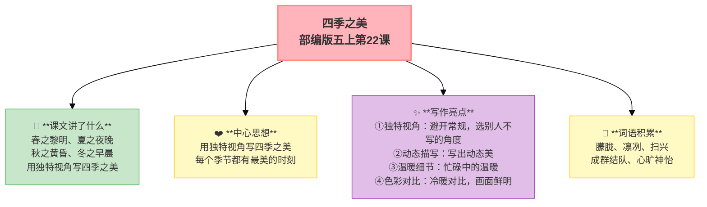

---
tags:
  - 五上
  - 语文
  - 自然之趣
  - 四季之美
  - 写景
---

# 22 四季之美

> 部编版五上第七单元 · 自然之趣
> **阅读重点**：初步体会景物的静态美和动态美
> **习作目标**：____即景（写景）

---

## 📖 课文讲了什么

| 核心问题 | 主要内容 |
|:---------|:---------|
| 作者选了哪个季节的什么时间段来写？ | 春之黎明、夏之夜晚、秋之黄昏、冬之早晨——独特的选材视角 |

**一句话速览**：春天最美是黎明，夏天最美是夜晚，秋天最美是黄昏，冬天最美是早晨——用独特视角写四季之美。

---

## ❤️ 中心思想

**用独特视角写四季之美，每个季节都有最美的时刻。**

---

## 📝 生字

（见课本生字表）

---

## 🔤 多音字

（见课本）

---

## 📚 词语积累

### 必会字词

| 词语 | 解释 |
|:----|:-----|
| **朦胧** | 模糊不清 |
| **凛冽** | 刺骨地寒冷 |
| **扫兴** | 情绪低落 |
| **成群结队** | 一群群 |
| **心旷神怡** | 心情舒畅 |

---

## 🏗️ 文章结构：超清晰！

| 自然段 | 内容 |
|:-------|:-----|
| 春之黎明 | 东方泛鱼肚白→染红霞 |
| 夏之夜晚 | 萤火虫翩翩飞舞 |
| 秋之黄昏 | 归鸦急飞→大雁比翼 |
| 冬之早晨 | 雪地白→炭火红 |

---

## ✨ 阅读与写作：深挖课文"宝藏"

| 写法亮点 | 课文内容 | 写作技巧 |
|:---------|:---------|:---------|
| **独特视角** | 别人写白天写正午，作者写黎明/夜晚/黄昏/早晨 | 避开常规，选别人不写的角度 |
| **动态描写** | "成群结队的大雁在高空中比翼联飞" | 写出动态美 |
| **温暖细节** | "点点归鸦急急匆匆地朝窠里飞去" | 忙碌中的温暖，画面动人 |
| **色彩对比** | 冬：雪的白 vs 炭火的红 | 冷暖对比，画面鲜明 |

---

## 📋 学习自评表

| 评价维度 | 我能…… | ⭐⭐⭐ |
|:---------|:-------|:------|
| **读** | 读出四季不同的美 | □ |
| **说** | 说出作者选了哪四个时间段 | □ |
| **品** | 找出文中的动态描写 | □ |
| **写** | 用独特的视角写一个季节 | □ |
