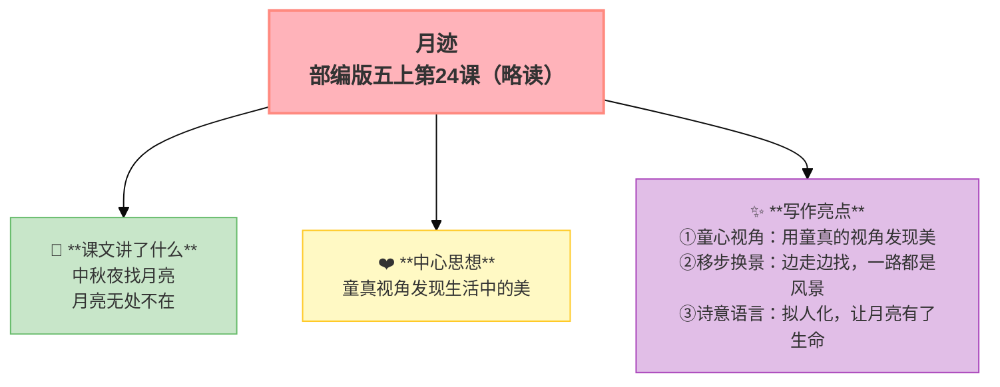

---
tags:
  - 五上
  - 语文
  - 自然之趣
  - 月迹
  - 写景
---

# 24 月迹

> 部编版五上第七单元 · 自然之趣（略读）
> **阅读重点**：初步体会景物的静态美和动态美
> **习作目标**：____即景（写景）

---

## 📖 课文讲了什么

| 核心问题 | 主要内容 |
|:---------|:---------|
| 月亮在哪里？"我们"找到了吗？ | 中秋夜找月亮——镜子里、院子里、水盆里、酒杯里、眼睛里……无处不在 |

**一句话速览**：中秋夜"我们"找月亮——镜子里、水盆里、葡萄叶上、爷爷的酒杯里、弟弟妹妹的眼睛里……月亮无处不在。

---

## ❤️ 中心思想

**童真视角发现生活中的美。**

---

## 📝 生字

（见课本生字表）

---

## 🔤 多音字

（见课本）

---

## 📚 词语积累

（略读课文，词语见课本）

---

## 🏗️ 文章结构：超清晰！

| 自然段 | 内容 |
|:-------|:-----|
| 镜中找月 | 镜子里看到月亮 |
| 院中望月 | 院子里抬头看月亮 |
| 水中盼月 | 水盆里看到月亮的影子 |
| 眼中见月 | 酒杯里、眼睛里都有月亮 |

---

## ✨ 阅读与写作：深挖课文"宝藏"

| 写法亮点 | 课文内容 | 写作技巧 |
|:---------|:---------|:---------|
| **童心视角** | 孩子的眼睛看世界 | 用童真的视角发现美 |
| **移步换景** | 镜中→院中→水盆→酒杯→眼中 | 边走边找，一路都是风景 |
| **诗意语言** | "月亮是长了腿的" | 拟人化，让月亮有了生命 |

---

## 📋 学习自评表

| 评价维度 | 我能…… | ⭐⭐⭐ |
|:---------|:-------|:------|
| **读** | 读出童真童趣 | □ |
| **说** | 说说月亮都出现在了哪些地方 | □ |
| **品** | 体会"童心视角"的妙处 | □ |
