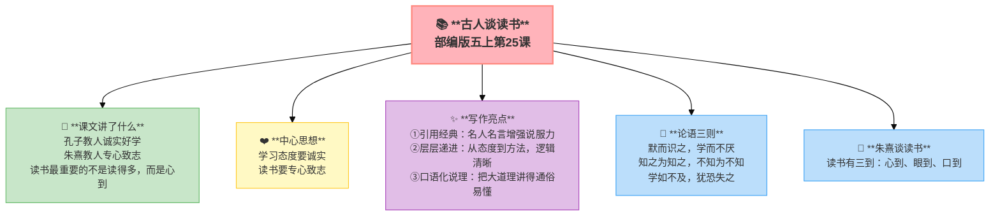

---
tags:
  - 五上
  - 语文
  - 读书明智
  - 古人谈读书
  - 议论文
---

# 25 古人谈读书

> 部编版五上第八单元 · 读书明智
> **阅读重点**：根据要求梳理信息，把握内容要点
> **习作目标**：推荐一本书

---

## 📖 课文讲了什么

孔子教人诚实好学，朱熹教人专心致志——读书最重要的不是读得多，而是心到。

---

## ❤️ 中心思想

**孔子和朱熹谈读书方法，强调了学习态度要诚实、读书要专心致志的重要性。**

---

## 📝 生字

（见课本生字表）

---

## 🔤 多音字

（见课本）

---

## 📚 词语积累

### 论语三则

> 默而识之，学而不厌，诲人不倦。——孔子
> 知之为知之，不知为不知，是知也。——孔子
> 学如不及，犹恐失之。——孔子

**🔑 注释**
| 词语 | 解释 |
|:-----|:-----|
| 识 | 记住 |
| 厌 | 满足 |
| 诲 | 教导 |
| 是知也 | 这才是真正的智慧 |

### 朱熹谈读书

> 余尝谓：读书有三到，谓心到、眼到、口到。心不在此，则眼不看仔细，心眼既不专一，却只漫浪诵读，决不能记，记亦不能久也。

**🔑 注释**
| 词语 | 解释 |
|:-----|:-----|
| 余 | 我 |
| 尝 | 曾经 |
| 漫浪 | 随意、不认真 |
| 决 | 一定（否定） |

---

### 词语解释

| 词语 | 画面式解释 |
|:-----|:----------|
| 识 | 想象一下，你把一个东西仔仔细细地看在眼里，把它印在脑子里——怎么都忘不掉 |
| 厌 | 想象一下，你吃你最爱的菜，吃了一碗又一碗——"厌"就是吃够了、满足了，不再想要了 |
| 诲 | 想象一下，老师耐心地教你做题，一遍不会教两遍，两遍不会教三遍——不嫌烦 |
| 漫浪 | 想象一下，一个人拿着书眼睛却看向窗外，嘴里念念有词但根本没过脑子 |
| 余 | 想象一下，一个人指着自己的鼻子说"我"——在古代，"余"就是"我"的意思 |

---

## 🏗️ 文章结构：超清晰！

| 自然段 | 内容 |
|:-------|:-----|
| 论语三则 | 孔子谈学习态度：诚实好学 |
| 朱熹谈读书 | 读书三到：心到、眼到、口到 |

---

## ✨ 阅读与写作：深挖课文"宝藏"

| 写法亮点 | 课文内容 | 写作技巧 |
|:---------|:---------|:---------|
| **引用经典** | 直接引用孔子、朱熹的原话 | 名人名言增强说服力 |
| **层层递进** | 孔子的学习态度 → 朱熹的具体方法 | 从态度到方法，逻辑清晰 |
| **口语化说理** | "心不在此，则眼不看仔细" | 把大道理讲得通俗易懂 |

---

## 📋 学习自评表

| 评价维度 | 我能…… | ⭐⭐⭐ |
|:---------|:-------|:------|
| **读** | 正确流利地朗读古文 | □ |
| **解** | 说出"读书三到"是哪三到 | □ |
| **背** | 背诵课文中的名言 | □ |
| **行** | 在实际阅读中做到"三到" | □ |
