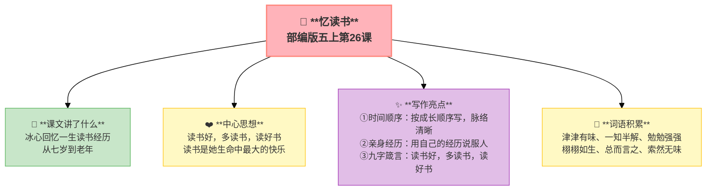

---
tags:
  - 五上
  - 语文
  - 读书明智
  - 忆读书
  - 议论文
---

# 26 忆读书

> 部编版五上第八单元 · 读书明智
> **阅读重点**：根据要求梳理信息，把握内容要点
> **习作目标**：推荐一本书

---

## 📖 课文讲了什么

| 核心问题 | 主要内容 |
|:---------|:---------|
| 冰心一生的读书经历是怎样的？她总结出了什么？ | 七岁读《三国演义》→十二三岁读《红楼梦》→中年后读各种书→总结：读书好，多读书，读好书 |

**一句话速览**：冰心回忆自己一生的读书经历——从七岁到老年，读书是她生命中最大的快乐，她送给孩子们九个字：读书好，多读书，读好书。

---

## ❤️ 中心思想

**读书好，多读书，读好书。读书是她生命中最大的快乐。**

---

## 📝 生字

（见课本生字表）

---

## 🔤 多音字

（见课本）

---

## 📚 词语积累

### 必会字词

| 词语 | 解释 |
|:----|:-----|
| **津津有味** | 很有兴趣 |
| **一知半解** | 知道得少、不理解 |
| **勉勉强强** | 凑合 |
| **栩栩如生** | 非常逼真 |
| **总而言之** | 总的来说 |
| **统而言之** | 总体上说 |
| **索然无味** | 没一点趣味 |

---

## 🏗️ 文章结构：超清晰！

| 自然段 | 内容 |
|:-------|:-----|
| 七岁 | 读《三国演义》——一知半解但津津有味 |
| 十二三岁 | 读《红楼梦》——开始懂得人情世故 |
| 中年后 | 广泛阅读——形成了自己的选书标准 |
| 总结 | 读书好，多读书，读好书 |

---

## ✨ 阅读与写作：深挖课文"宝藏"

| 写法亮点 | 课文内容 | 写作技巧 |
|:---------|:---------|:---------|
| **时间顺序** | 七岁→十二三岁→中年→晚年 | 按成长顺序写，脉络清晰 |
| **亲身经历** | 讲自己读过的书、真实的感受 | 用自己的经历说服人，最有力 |
| **九字箴言** | "读书好，多读书，读好书" | 结尾用短句总结，易记易传 |

---

## 📋 学习自评表

| 评价维度 | 我能…… | ⭐⭐⭐ |
|:---------|:-------|:------|
| **读** | 梳理冰心的读书经历 | □ |
| **说** | 说出"读书好，多读书，读好书"的含义 | □ |
| **理** | 按时间顺序整理信息 | □ |
| **用** | 用冰心的选书标准选一本好书 | □ |
