---
tags:
  - 五下
  - 语文
  - 童年往事
  - 古诗
---

# 第01课 古诗三首

> 部编版五下第1单元 · 阅读重点：体会课文表达的思想感情 · 习作目标：那一刻，我长大了

```mermaid
%%{init: {'theme': 'base', 'themeVariables': {'fontSize': '14px'}}}%%
graph TB
    classDef center fill:#FFB3BA,stroke:#FF8A80,stroke-width:2px,color:#333,font-weight:bold,font-size:16px
    classDef green fill:#C8E6C9,stroke:#66BB6A,stroke-width:1px,color:#333,font-size:13px
    classDef blue fill:#BBDEFB,stroke:#42A5F5,stroke-width:1px,color:#333,font-size:13px
    classDef yellow fill:#FFF9C4,stroke:#FFCA28,stroke-width:1px,color:#333,font-size:13px
    classDef purple fill:#E1BEE7,stroke:#AB47BC,stroke-width:1px,color:#333,font-size:13px

    center["📜 **古诗三首**<br/>部编版五下第1课"]:::center

    l1["📖 **课文讲了什么**<br/>范成大写学种瓜<br/>杨万里记弄冰<br/>雷震画牧童吹笛"]:::green
    l2["❤️ **中心思想**<br/>三首古诗描写了田园劳动、寒冬弄冰、黄昏牧归三个童年场景<br/>表达了对童年生活的怀念和喜爱"]:::yellow

    l3["📜 **四时田园杂兴·范成大**<br/>田园劳动，孩童学种瓜"]:::blue
    l4["✏️ 写作亮点：以小儿写大、白描手法"]:::purple

    l5["📜 **稚子弄冰·杨万里**<br/>寒冬弄冰的童趣"]:::blue
    l6["✏️ 写作亮点：有声有色、转折惊喜"]:::purple

    l7["📜 **村晚·雷震**<br/>黄昏牧归的自由自在"]:::blue
    l8["✏️ 写作亮点：色彩构图、动静结合"]:::purple

    center --> l1
    center --> l2
    center --> l3
    center --> l4
    center --> l5
    center --> l6
    center --> l7
    center --> l8

    style center fill:#FFB3BA,stroke:#FF8A80,stroke-width:2px
```

## 📖 课文讲了什么

范成大写孩童学种瓜，杨万里记稚子弄冰，雷震画牧童吹笛——三段不一样的童年时光。

## ❤️ 中心思想

**三首古诗分别描写了田园劳动、寒冬弄冰、黄昏牧归三个童年场景，表达了对童年生活的怀念和喜爱。**

---

## 四时田园杂兴（其三十一）· 范成大
> 昼出耘田夜绩麻，村庄儿女各当家。
> 童孙未解供耕织，也傍桑阴学种瓜。

> 💡 读着玩——读顺了就好，感受节奏和画面

**📜 写作背景**：范成大晚年辞官回到苏州老家，在石湖边过起了田园生活。他看到农民一年到头忙忙碌碌——白天去田里干活，晚上回家搓麻线，连小孩子都在桑树底下有模有样地学种瓜。他被这种质朴的生活打动了，一口气写了六十首《四时田园杂兴》——按春夏秋冬把田园生活写了个遍。这一首是夏天的场景。

**💡 逸事**：范成大是个"外交硬汉"——别看他写田园诗温柔得很，当年出使金国时硬气得不得了。金国皇帝让他行跪拜礼，他死活不跪，把金国皇帝气得够呛。回国后他写了一份详细的北方见闻报告，画了地图，想帮朝廷北伐。结果朝廷根本没当回事。他一气之下辞官回家种地去了——没想到这一"退休"，倒写出了中国最好的田园诗。

**🏛️ 时代回响**：南宋时期，田园诗重新流行起来——因为越来越多的文人对朝廷失望，选择回乡隐居。范成大跟杨万里、陆游、尤袤合称"中兴四大诗人"。跟别的田园诗人不一样，范成大不光写风景，还写农民的辛苦——"昼出耘田夜绩麻"不是浪漫，是真的累。他不是躲在书斋里想象田园，而是真的在乡下生活、真的观察过。

**🔑 注释**
| 词语 | 解释 |
|:-----|:-----|
| 耘田 | 除草 |
| 绩麻 | 把麻搓成线 |
| 各当家 | 各人都担当一定的工作 |
| 童孙 | 幼小的孙子/小孩子 |
| 未解 | 不懂得 |
| 供 | 从事、参加 |
| 傍 | 靠近 |
| 桑阴 | 桑树荫下 |

## ✨ 阅读与写作：深挖课文"宝藏"

| 写法亮点 | 课文内容 | 写作技巧 |
|:---------|:---------|:---------|
| **以小儿写大** | "童孙未解供耕织，也傍桑阴学种瓜" | 用孩子的视角写出劳动的传承 |
| **白描手法** | 昼出耘田、夜绩麻、学种瓜 | 不加修饰，像照片一样真实 |
| **对比映衬** | 大人忙碌 vs 孩童学样 | 劳动的严肃中透出童年的天真 |

---

## 稚子弄冰 · 杨万里 · 杨万里
> 稚子金盆脱晓冰，彩丝穿取当银铮。
> 敲成玉磬穿林响，忽作玻璃碎地声。

> 💡 读着玩——读顺了就好，感受节奏和画面

**📜 写作背景**：杨万里是个特别喜欢小孩子的人——他写了好多关于小孩的诗。一个寒冷的冬天早晨，他看到一个小孩从铜盆里取出冻好的冰块，用彩色丝线穿起来当锣敲，冰块发出清脆悦耳的声音，孩子玩得不亦乐乎——突然"啪"一声，冰块摔碎了。杨万里在旁边看得哈哈大笑，赶紧把这一幕记了下来。他一生写了四千多首诗，这种"生活小镜头"是他最拿手的。

**💡 逸事**：杨万里的性格特别"正"——他当了大官，但一辈子刚正不阿，不肯拍马屁。他晚年辞官回家，家里穷得叮当响，连像样的家具都没有。有人劝他：你好歹是个退休高官，给自己谋点福利不行吗？他翻了个白眼：我不干那种事。他给书房取名叫"诚斋"——诚实地做人、诚实地写诗。他写的诗也是出了名的"生活化"——别人写诗用典故，他写诗写平常事、用平常话，读起来特别亲切。

**🏛️ 时代回响**：宋朝是中国古代生活最精致的时代之一——城市繁华、商业发达、老百姓的日子比以前好多了。宋代文人特别喜欢写"日常生活"——喝茶、赏花、逗小孩、逛集市。杨万里是这种"日常美学"的代表人物。他的诗里没有大道理，就是一个个生活的"抓拍"——孩子弄冰、追蝴蝶、学种瓜……一千年前的童年，和今天没什么两样。

**🔑 注释**
| 词语 | 解释 |
|:-----|:-----|
| 稚子 | 幼小的孩子 |
| 金盆 | 金属盆（铜盆） |
| 脱晓冰 | 取出早晨冻好的冰块 |
| 彩丝 | 彩色丝线 |
| 银铮 | 古代打击乐器，像锣 |
| 玉磬 | 玉制的乐器，声音清脆 |
| 玻璃 | 古指天然水晶/玉石 |
| 穿林响 | 声音穿过树林 |

## ✨ 阅读与写作：深挖课文"宝藏"

| 写法亮点 | 课文内容 | 写作技巧 |
|:---------|:---------|:---------|
| **有声有色** | "敲成玉磬穿林响，忽作玻璃碎地声" | 用声音写出快乐的瞬间，还能听到冰碎的声音 |
| **转折惊喜** | 从"穿林响"忽然到"碎地声" | 情节转折让诗更有戏剧性 |
| **细节抓拍** | "彩丝穿取当银铮" | 像相机抓拍一样，定格一个精彩瞬间 |

---

## 村晚 · 雷震
> 草满池塘水满陂，山衔落日浸寒漪。
> 牧童归去横牛背，短笛无腔信口吹。

> 💡 读着玩——读顺了就好，感受节奏和画面

**📜 写作背景**：雷震骑着马路过一个南方小村庄。那正是夕阳西下的时候——池塘里的水满满的，长满了青草；远处的山像是叼着半个太阳，倒映在凉凉的水波里。他正看得出神，一个牧童骑在牛背上慢悠悠地回来了——这小孩也不着急回家，横坐在牛背上，拿着短笛随口乱吹。雷震被这幅画面打动了：这才是生活该有的样子啊。

**💡 逸事**：雷震在历史上留下的资料很少，但他写了这首《村晚》——够了。有人说他是宋朝人，有人说他是明朝人，有人说是进士出身，有人说什么都不确定。他就像这首诗本身一样——淡淡的、安安静静的，不需要被太多人记住。他的《村晚》是"南宋乡村四小诗"之一（跟范成大的田园诗、杨万里的生活诗、翁卷的乡村诗并列）。

**🏛️ 时代回响**：中国古代乡村诗的"黄金时代"在南宋——战乱让文人更向往宁静的生活。"牧童"是中国文学里一个特别的形象——他不一定是真的放牛娃，而是一种"自由自在"的象征。雷震的牧童跟别的牧童不一样：他不光是在放牛，他是"横牛背"——侧着身子坐，很随意的样子。笛子也是"无腔信口吹"——没有曲调，想到哪吹到哪。这就是自由的味道。

**🔑 注释**
| 词语 | 解释 |
|:-----|:-----|
| 陂 | 池塘、水岸 |
| 衔 | 叼着、含着 |
| 漪 | 水波纹 |
| 横牛背 | 横坐在牛背上 |
| 无腔 | 没有固定的曲调 |
| 信口 | 随口、随意 |

## ✨ 阅读与写作：深挖课文"宝藏"

| 写法亮点 | 课文内容 | 写作技巧 |
|:---------|:---------|:---------|
| **色彩构图** | "草满池塘""山衔落日" | 像一幅画，远近高低层次分明 |
| **自由意境** | "短笛无腔信口吹" | 自由自在、不被规矩约束的状态 |
| **动静结合** | 青山落日（静）+ 牧童笛声（动） | 动静相衬，画面更生动鲜活 |

---

## 📚 语言积累：词语库+句式库

### 古诗自评表

| 评价维度 | 我能…… | ⭐⭐⭐ |
|:---------|:-------|:------|
| **读** | 正确、流利地朗读三首古诗 | □ |
| **解** | 说出三首诗描写的童年生活场景 | □ |
| **品** | 找出诗中描写孩童动作的关键词 | □ |
| **背** | 背诵三首古诗 | □ |

## 📋 学习自评表

| 评价维度 | 我能…… | ⭐⭐⭐ |
|:---------|:-------|:------|
| **读** | 正确、流利地朗读三首古诗 | □ |
| **解** | 说出三首诗描写的童年生活场景 | □ |
| **品** | 找出诗中描写孩童动作的关键词 | □ |
| **背** | 背诵三首古诗 | □ |
