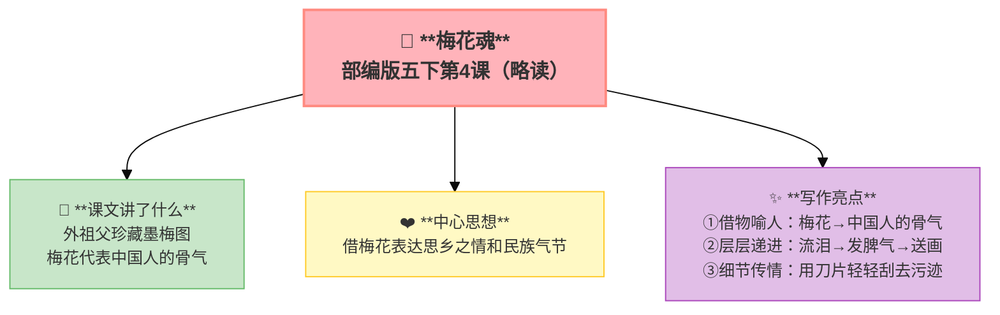

---
tags:
  - 五下
  - 语文
  - 童年往事
  - 散文
---

# 第04课 梅花魂（略读）

> 部编版五下第1单元 · 阅读重点：体会课文表达的思想感情 · 习作目标：那一刻，我长大了

## 📖 课文讲了什么

| 核心问题 | 主要内容 |
|:---------|:---------|
| "梅花魂"中的"魂"指的是什么？ | 外祖父珍藏墨梅图→泪读唐诗→怒斥弄脏画→送画赠别 |

**一句话速览**：外祖父是华侨，他珍藏着一幅墨梅图。教"我"读唐诗时会流泪、因"我"弄脏梅花图而发脾气、临别时把梅花图送给"我"。梅花代表了中国人的骨气——不管在哪里，都要有梅花的品格。

## ✨ 阅读与写作：深挖课文"宝藏"

| 写法亮点 | 课文内容 | 写作技巧 |
|:---------|:---------|:---------|
| **借物喻人** | 梅花→中国人的骨气 | 用具体事物写抽象品格 |
| **层层递进** | 流泪→发脾气→送画 | 情感一步步推向高潮 |
| **细节传情** | 外祖父"用刀片轻轻刮去污迹" | 一个动作写出对画的珍爱 |

## 📚 语言积累：词语库+句式库

## 📋 学习自评表

| 评价维度 | 我能…… | ⭐⭐⭐ |
|:---------|:-------|:------|
| **读** | 读出外祖父的思乡情 | □ |
| **说** | 说出"梅花魂"的含义 | □ |
| **品** | 体会外祖父的三次情感变化 | □ |
