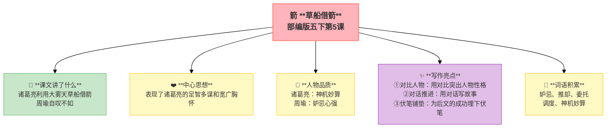

---
tags:
  - 五下
  - 语文
  - 古典名著
  - 小说
---

# 第05课 草船借箭

> 部编版五下第2单元 · 阅读重点：学习阅读古典名著的方法 · 习作目标：写读后感



## 📖 课文讲了什么

周瑜妒忌诸葛亮的才能，要诸葛亮十天内造十万支箭。诸葛亮说"只要三天"，并立下军令状。他利用大雾天，用草人骗曹军射箭——轻松"借"到十万多支箭。周瑜自叹不如。

## ❤️ 中心思想

**讲述了诸葛亮神机妙算，利用大雾天草船借箭的故事，表现了诸葛亮的足智多谋和宽广胸怀。**

---

## 📜 知背景
- 选自《三国演义》第四十六回
- 作者：**罗贯中**（元末明初）
- 背景：赤壁之战前夕

## 🏗️ 文章结构：超清晰！

```
周瑜刁难（十天造十万支箭）
    ↓
诸葛亮接招（只要三天，立军令状）
    ↓
准备草船（二十条船、草人、青布幔）
    ↓
大雾借箭（曹操不敢出兵，射箭万支）
    ↓
周瑜叹服（"诸葛亮神机妙算"）
```

## 📝 生字

## 🔤 多音字

## 📚 词语积累

### 必会字词

| 词语 | 解释 |
|:----|:-----|
| **妒忌** | 因别人好而憎恨 |
| **推却** | 推辞、拒绝 |
| **委托** | 请托别人办 |
| **调度** | 安排调派 |
| **神机妙算** | 计谋高明 |

### 近义词

### 反义词

## ✨ 阅读与写作：深挖课文"宝藏"

| 写法亮点 | 课文内容 | 写作技巧 |
|:---------|:---------|:---------|
| **对比人物** | 诸葛亮神机妙算 vs 周瑜心胸狭窄 vs 曹操谨慎多疑 | 用对比突出人物性格 |
| **对话推进** | 诸葛亮与周瑜的对话推动情节 | 不用旁白，用对话写故事 |
| **伏笔铺垫** | 前文写"三天后有大雾" | 为后文的成功埋下伏笔 |

## 📚 语言积累：词语库+句式库

## 📋 学习自评表

| 评价维度 | 我能…… | ⭐⭐⭐ |
|:---------|:-------|:------|
| **读** | 读出人物对话的语气 | □ |
| **说** | 讲清楚草船借箭的过程 | □ |
| **品** | 分析诸葛亮、周瑜、曹操的性格 | □ |
| **想** | 说出"神机妙算"表现在哪里 | □ |
