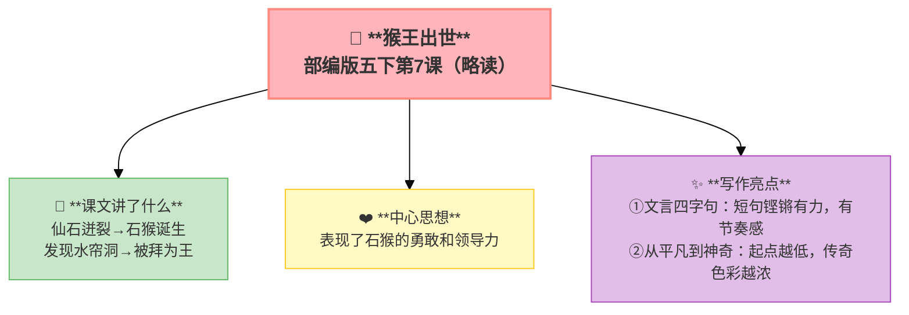

---
tags:
  - 五下
  - 语文
  - 古典名著
  - 小说
---

# 第07课 猴王出世（略读）

> 部编版五下第2单元 · 阅读重点：学习阅读古典名著的方法 · 习作目标：写读后感

## 📖 课文讲了什么

| 核心问题 | 主要内容 |
|:---------|:---------|
| 石猴是怎么成为"美猴王"的？ | 仙石迸裂 → 石猴诞生 → 发现水帘洞 → 被拜为王 |

**一句话速览**：花果山上一块仙石迸裂，产一石猴。石猴发现水帘洞，被群猴拜为"美猴王"。

## ✨ 阅读与写作：深挖课文"宝藏"

| 写法亮点 | 课文内容 | 写作技巧 |
|:---------|:---------|:---------|
| **文言四字句** | "食草木，饮涧泉，采山花，觅树果" | 短句铿锵有力，有节奏感 |
| **从平凡到神奇** | 一块石头 → 通灵石猴 | 起点越低，传奇色彩越浓 |

## 📚 语言积累：词语库+句式库

## 📋 学习自评表

| 评价维度 | 我能…… | ⭐⭐⭐ |
|:---------|:-------|:------|
| **读** | 正确流利地朗读古文 | □ |
| **说** | 讲出石猴成王的经过 | □ |
| **悟** | 感受文言短句的节奏美 | □ |
