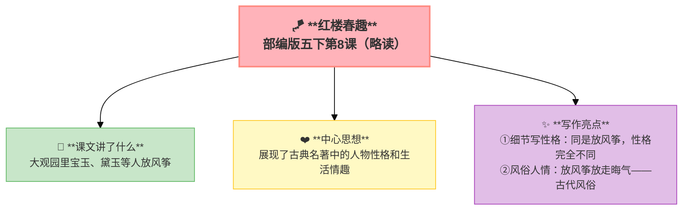

---
tags:
  - 五下
  - 语文
  - 古典名著
  - 小说
---

# 第08课 红楼春趣（略读）

> 部编版五下第2单元 · 阅读重点：学习阅读古典名著的方法 · 习作目标：写读后感

## 📖 课文讲了什么

| 核心问题 | 主要内容 |
|:---------|:---------|
| 大观园里放风筝这件事写出了什么？ | 宝玉、黛玉、宝钗等人放风筝——黛玉放走病根，宝玉的风筝飞不起来 |

**一句话速览**：宝玉、黛玉、宝钗等人在大观园里放风筝。黛玉的风筝飞走了——大家说"把病根儿都放去了"。宝玉的风筝怎么也飞不起来，急得跺脚。

## ✨ 阅读与写作：深挖课文"宝藏"

| 写法亮点 | 课文内容 | 写作技巧 |
|:---------|:---------|:---------|
| **细节写性格** | 黛玉放走风筝不心疼，宝玉急得跺脚 | 同是放风筝，性格完全不同 |
| **风俗人情** | "把病根儿都放去了" | 放风筝放走晦气——古代风俗 |

## 📚 语言积累：词语库+句式库

## 📋 学习自评表

| 评价维度 | 我能…… | ⭐⭐⭐ |
|:---------|:-------|:------|
| **读** | 了解古典小说的语言风格 | □ |
| **说** | 说出放风筝这件事写出了什么 | □ |
| **悟** | 会用"猜、跳、借助影视"读名著 | □ |

### 💡 阅读古典名著的建议
1. 遇到不懂的词语可以**猜**（联系上下文）
2. 不懂的地方可以**跳过去**（不影响整体理解）
3. 借助**影视作品**帮助理解
