---
tags:
  - 五下
  - 语文
  - 家国情怀
  - 古诗
---

# 第09课 古诗三首

> 部编版五下第4单元 · 阅读重点：通过动作、语言、神态体会人物内心 · 习作目标：他____了（神态+动作+心理）

```mermaid
%%{init: {'theme': 'base', 'themeVariables': {'fontSize': '14px'}}}%%
graph TB
    classDef center fill:#FFB3BA,stroke:#FF8A80,stroke-width:2px,color:#333,font-weight:bold,font-size:16px
    classDef green fill:#C8E6C9,stroke:#66BB6A,stroke-width:1px,color:#333,font-size:13px
    classDef blue fill:#BBDEFB,stroke:#42A5F5,stroke-width:1px,color:#333,font-size:13px
    classDef yellow fill:#FFF9C4,stroke:#FFCA28,stroke-width:1px,color:#333,font-size:13px
    classDef purple fill:#E1BEE7,stroke:#AB47BC,stroke-width:1px,color:#333,font-size:13px

    center["📜 **古诗三首**<br/>部编版五下第9课"]:::center

    l1["📖 **课文讲了什么**<br/>王昌龄写报国决心<br/>王维写送别深情<br/>陆游写百姓期盼"]:::green
    l2["❤️ **中心思想**<br/>将士们誓死报国的决心<br/>朋友间的依依惜别之情<br/>对沦陷区百姓的深切同情"]:::yellow

    l3["📜 **从军行·王昌龄**<br/>边关将士誓死报国"]:::blue
    l4["✏️ 写作亮点：大处写景、小处写情、誓言收束"]:::purple

    l5["📜 **送元二使安西·王维**<br/>送别故人的深情厚谊"]:::blue
    l6["✏️ 写作亮点：以景衬情、以酒写别"]:::purple

    l7["📜 **秋夜将晓出篱门迎凉有感·陆游**<br/>沦陷区百姓的苦苦期盼"]:::blue
    l8["✏️ 写作亮点：先扬后抑、替人呐喊"]:::purple

    center --> l1
    center --> l2
    center --> l3
    center --> l4
    center --> l5
    center --> l6
    center --> l7
    center --> l8

    style center fill:#FFB3BA,stroke:#FF8A80,stroke-width:2px
```

## 📖 课文讲了什么

王昌龄写边关将士的报国决心，王维写送别故人的深情厚谊，陆游写沦陷区百姓的苦苦期盼。

## ❤️ 中心思想

**三首古诗分别表达了将士们誓死报国的决心、朋友间的依依惜别之情、对沦陷区百姓的深切同情。**

---

## 从军行 · 王昌龄
> 青海长云暗雪山，孤城遥望玉门关。
> 黄沙百战穿金甲，不破楼兰终不还。

> 💡 读着玩——读顺了就好，感受节奏和画面

**📜 写作背景**：王昌龄当时在西北边塞漫游——他在长安混得不太如意，索性跑到边疆去开开眼界。站在青海湖边，抬头是祁连山上终年不化的白雪，远处是孤零零的玉门关。那一带常年打仗——黄沙漫天，将士们的铠甲穿了一年又一年，磨得千疮百孔。但没有人退缩——"不破楼兰终不还"不是口号，是真实的精神。王昌龄看着这些满脸风霜的士兵，心里涌起了深深的敬意。

**💡 逸事**：王昌龄被称为"七绝圣手"——写七言绝句，没人比得过他。但他这辈子特别坎坷：考中进士后当了几年小官，因为"不拘小节"被人告状，一贬再贬——从南京贬到湖南，再从湖南贬到贵州。安史之乱爆发时他逃难回家，路过亳州，被一个叫闾丘晓的刺史给杀了。就因为闾丘晓嫉妒他的才华。后来闾丘晓也被处死了——但王昌龄回不来了。一代"诗家夫子"，死得这么窝囊，令人唏嘘。

**🏛️ 时代回响**：盛唐时期国力强盛，边疆战事不断——这对普通百姓是灾难，对诗人却是"创作题材"。一大批诗人跑去边塞体验生活，写下了大量"边塞诗"。王昌龄、高适、岑参、王之涣——被称为"边塞四大诗人"。唐朝人有一种"英雄主义"情结：为国守边疆是光荣的事。这种精神在后来的朝代越来越少了——只有在盛唐，才有这种"黄沙百战穿金甲"的豪气。

**🔑 注释**
| 词语 | 解释 |
|:-----|:-----|
| 青海 | 青海湖 |
| 长云 | 漫天乌云 |
| 雪山 | 祁连山 |
| 孤城 | 边塞孤城 |
| 玉门关 | 通往西域的关隘 |
| 穿 | 磨穿 |
| 金甲 | 金属铠甲 |
| 楼兰 | 借指敌人 |
| 还 | 回家 |

## ✨ 阅读与写作：深挖课文"宝藏"

| 写法亮点 | 课文内容 | 写作技巧 |
|:---------|:---------|:---------|
| **大处写景** | "青海长云暗雪山，孤城遥望玉门关" | 用广角镜头写边塞的苍凉 |
| **小处写情** | "黄沙百战穿金甲" | 一个"穿"字写出战争的艰苦 |
| **誓言收束** | "不破楼兰终不还" | 用决绝的誓言表达坚定的决心 |

---

## 送元二使安西 · 王维 · 王维
> 渭城朝雨浥轻尘，客舍青青柳色新。
> 劝君更尽一杯酒，西出阳关无故人。

> 💡 读着玩——读顺了就好，感受节奏和画面

**📜 写作背景**：元二（姓元，排行老二）奉命出使安西都护府——那是今天的甘肃新疆一带，唐朝的西北边疆，距离长安几千公里。王维在渭城（咸阳附近）为他送行。早上刚下了一场小雨，打湿了路上的尘土，旅店旁边的柳树被洗得翠绿。两个人喝了不知多少杯酒，王维还是不想放他走——"再喝一杯吧，出了阳关就再也没有老朋友了。"这不是客套话——安西太远了，这一去可能一辈子都见不到了。

**💡 逸事**：王维和元二的关系有多好？史书上没有记载元二是谁——他只是一个普通的使者。但王维为他写下的这首诗，让"元二"这个名字流传了一千多年。王维这个人其实挺高冷的——他晚年隐居辋川，朋友不多，但每个朋友都是真心的。这种"淡而深"的感情，比他那些写山水的诗还打动人。这首诗后来被谱成曲子叫《阳关三叠》，成为中国古代最著名的送别曲。

**🏛️ 时代回响**：唐朝的疆域极大——安西都护府在今天的吐鲁番、库车一带，从长安过去要走好几个月。出使西域是一项极其艰苦的任务——风沙、酷暑、严寒、盗匪……很多人去了就回不来了。所以"西出阳关无故人"不是夸张——是真的再难相见。唐代送别诗特别发达——因为交通不便，每一次离别都可能是永别。一杯酒里装的，可能是最后一面。

**🔑 注释**
| 词语 | 解释 |
|:-----|:-----|
| 渭城 | 咸阳附近 |
| 朝雨 | 早晨的雨 |
| 浥 | 打湿 |
| 客舍 | 旅店 |
| 柳色新 | 柳树被雨洗得翠绿 |
| 更尽 | 再喝完 |
| 阳关 | 通往西域的关隘 |
| 故人 | 老朋友 |

## ✨ 阅读与写作：深挖课文"宝藏"

| 写法亮点 | 课文内容 | 写作技巧 |
|:---------|:---------|:---------|
| **以景衬情** | "渭城朝雨浥轻尘，客舍青青柳色新" | 清新的景色反衬离别的伤感 |
| **以酒写别** | "劝君更尽一杯酒" | 所有的感情都在这一杯酒里 |
| **不说破** | "西出阳关无故人" | 不说"我会想你"，说"那里没有老朋友" |

---

## 秋夜将晓出篱门迎凉有感 · 陆游
> 三万里河东入海，五千仞岳上摩天。
> 遗民泪尽胡尘里，南望王师又一年。

> 💡 读着玩——读顺了就好，感受节奏和画面

**📜 写作背景**：1192年的一个秋天，陆游已经68岁了——他回到绍兴老家已经十多年了。那天晚上特别闷热，他在床上翻来覆去睡不着。天快亮的时候，他爬起来推开篱笆门走到院子里，想透透气。北方吹来一阵凉风，他突然想到了北方的沦陷区——三万里黄河向东奔流入海、五千仞华山高耸入云，那是多么壮丽的河山啊！可沦陷区的老百姓在金人的统治下，眼泪都流干了——他们在南方望了一年又一年，盼着朝廷的军队打回去。可是朝廷呢？还在西湖边喝酒唱歌。

**💡 逸事**：陆游是"南宋第一倔老头"。68岁了，按理说该享清福了——他偏不。他天天惦记着北伐的事，写诗骂朝廷软弱。有一天他做了一个梦——梦到自己骑着战马冲过冰河，杀向北方。醒来发现是个梦，60多岁的老人当场哭了。他写了十几首"记梦"诗——都是梦到打仗收复中原。现实中做不到的事，只能在梦里实现了。85岁临终前，他给儿子写的遗嘱不是分家产，而是"王师北定中原日，家祭无忘告乃翁"。

**🏛️ 时代回响**：南宋的"遗民"是一个特殊的群体——北方沦陷区里的汉族人，他们穿着金人的衣服、说着金人的话，但心里还认为自己是宋朝人。他们偷偷地祭拜宋朝的祖先，打听着南方朝廷的消息。每年秋天大雁南飞的时候，他们就往南看——"王师什么时候来？"朝廷始终没有来。陆游这首诗不是写自己的感受，是替那些不会写诗的北方遗民在呐喊。

**🔑 注释**
| 词语 | 解释 |
|:-----|:-----|
| 三万里河 | 黄河（夸张写法） |
| 五千仞岳 | 华山（仞：古代计量单位） |
| 摩天 | 碰到天 |
| 遗民 | 沦陷区的百姓 |
| 泪尽 | 眼泪流干了 |
| 胡尘 | 金人统治下的风尘 |
| 南望 | 向南遥望 |
| 王师 | 宋朝的军队 |

## ✨ 阅读与写作：深挖课文"宝藏"

| 写法亮点 | 课文内容 | 写作技巧 |
|:---------|:---------|:---------|
| **先扬后抑** | 前两句山河壮丽 → 后两句百姓悲惨 | 反差越大，情感越强烈 |
| **替人呐喊** | "遗民泪尽胡尘里，南望王师又一年" | 替不会写诗的人发出心声 |
| **数字震撼** | "三万里""五千仞""又一年" | 用夸张数字写出山河壮阔和等待之久 |

---

## 📝 生字

## 🔤 多音字

## 📚 词语积累：词语库+句式库

### 古诗自评表

| 评价维度 | 我能…… | ⭐⭐⭐ |
|:---------|:-------|:------|
| **读** | 正确、流利地朗读三首古诗 | □ |
| **解** | 说出三首诗各自表达的情感 | □ |
| **品** | 找出诗中的关键词体会内心 | □ |
| **背** | 背诵三首古诗 | □ |

## 📋 学习自评表

| 评价维度 | 我能…… | ⭐⭐⭐ |
|:---------|:-------|:------|
| **读** | 正确、流利地朗读三首古诗 | □ |
| **解** | 说出三首诗各自表达的情感 | □ |
| **品** | 找出诗中的关键词体会内心 | □ |
| **背** | 背诵三首古诗 | □ |
