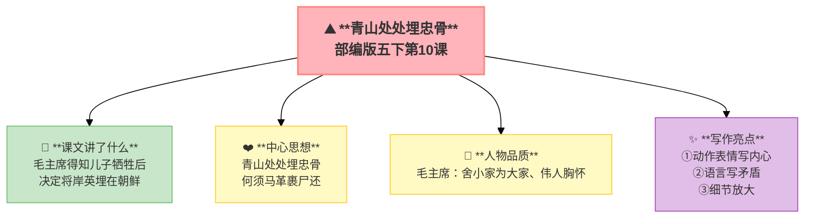

---
tags:
  - 五下
  - 语文
  - 家国情怀
  - 小说
---

# 第10课 青山处处埋忠骨

> 部编版五下第4单元 · 阅读重点：通过动作、语言、神态体会人物内心 · 习作目标：他____了（神态+动作+心理）



## 📖 课文讲了什么

| 核心问题 | 主要内容 |
|:---------|:---------|
| 毛主席在得知儿子牺牲后经历了怎样的内心挣扎？ | 噩耗传来 → 极度悲痛 → 内心挣扎 → 决定埋骨朝鲜 |

**一句话速览**：毛主席的儿子毛岸英在抗美援朝战争中牺牲。电报传来，毛主席极度悲痛——他拿着电报看了很久、想把儿子的遗体运回国内、但最终还是决定把岸英埋在朝鲜。"青山处处埋忠骨，何须马革裹尸还。"

---

## 📜 知背景
- 作者：**晓年**
- 背景：抗美援朝战争，毛岸英在朝鲜战场牺牲

## 🏗️ 文章结构：超清晰！

```
电报传来（毛岸英牺牲）
    ↓
毛主席的悲痛（看电报、站起、望天花板）
    ↓
内心挣扎（想运回 vs 应以国家为先）
    ↓
最终决定（青山处处埋忠骨）
    ↓
签字（强忍悲痛，写下同意）
```

## 📝 生字

## 🔤 多音字

## 📚 词语积累

### 必会字词

| 词语 | 解释 |
|:----|:-----|
| **拟定** | 初步制定 |
| **参谋** | 出主意的人 |
| **锻炼** | 通过实践提高 |
| **眷恋** | 深切留恋 |
| **奔赴** | 奔向 |
| **踌躇** | 犹豫不决 |

### 近义词

### 反义词

## ✨ 阅读与写作：深挖课文"宝藏"

| 写法亮点 | 课文内容 | 写作技巧 |
|:---------|:---------|:---------|
| **动作表情写内心** | "毛主席不由自主地站起来，仰起头，望着天花板，强忍着心中的悲痛" | 不用写"他很痛苦"，动作神态就够了 |
| **语言写矛盾** | "哪个战士的血肉之躯不是父母所生？" | 用反问说服自己，写出内心挣扎 |
| **细节放大** | 电报看了很久、目光无限眷恋 | 一个细节胜过千言万语 |

## 📚 语言积累：词语库+句式库

## 📋 学习自评表

| 评价维度 | 我能…… | ⭐⭐⭐ |
|:---------|:-------|:------|
| **读** | 读出毛主席的悲痛和伟大 | □ |
| **找** | 找出描写毛主席动作神态的句子 | □ |
| **品** | 说出哪些细节写出了内心挣扎 | □ |
| **想** | 体会"青山处处埋忠骨"的含义 | □ |
