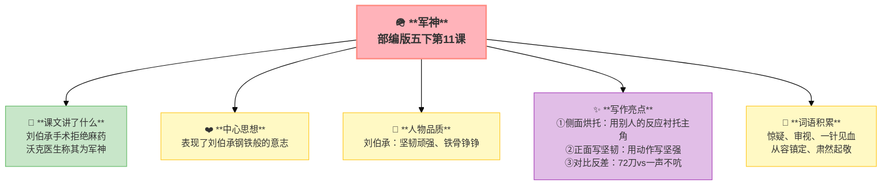

---
tags:
  - 五下
  - 语文
  - 家国情怀
  - 小说
---

# 第11课 军神

> 部编版五下第4单元 · 阅读重点：通过动作、语言、神态体会人物内心 · 习作目标：他____了（神态+动作+心理）



## 📖 课文讲了什么

| 核心问题 | 主要内容 |
|:---------|:---------|
| 为什么沃克医生称刘伯承为"军神"？ | 求医 → 拒绝麻药 → 手术72刀不吭声 → 沃克称赞 |

**一句话速览**：刘伯承眼睛受伤做手术，坚持不用麻药——因为怕损伤大脑。沃克医生割了72刀，刘伯承一声不吭。沃克医生称他为"军神"。

---

## 📜 知背景
- 作者：**毕必成**
- 人物原型：刘伯承（中华人民共和国元帅），1916年右眼中弹手术

## 🏗️ 文章结构：超清晰！

```
求医（刘伯承到诊所，从容镇定）
    ↓
对话（拒绝麻药，沃克惊疑）
    ↓
手术（紧紧抓住床单，一声不吭）
    ↓
72刀（沃克数着刀数，越来越敬佩）
    ↓
称赞（"你是军神！"）
```

## 📝 生字

## 🔤 多音字

## 📚 词语积累

### 必会字词

| 词语 | 解释 |
|:----|:-----|
| **惊疑** | 惊讶疑惑 |
| **审视** | 仔细看 |
| **一针见血** | 说话切中要害 |
| **从容镇定** | 沉稳不慌乱 |
| **肃然起敬** | 恭敬地产生敬意 |

### 近义词

### 反义词

## ✨ 阅读与写作：深挖课文"宝藏"

| 写法亮点 | 课文内容 | 写作技巧 |
|:---------|:---------|:---------|
| **侧面烘托** | 沃克反应：冷漠 → 惊疑 → 敬佩 → 肃然起敬 | 用别人的反应衬托主角的厉害 |
| **正面写坚韧** | "一声不吭""紧紧抓住床单" | 用动作写坚强，不用形容词 |
| **对比反差** | 72刀 vs 一声不吭 | 数字越大，沉默越震撼 |

## 📚 语言积累：词语库+句式库

## 📋 学习自评表

| 评价维度 | 我能…… | ⭐⭐⭐ |
|:---------|:-------|:------|
| **读** | 读出刘伯承的坚毅 | □ |
| **找** | 找出沃克医生的心理变化线索 | □ |
| **品** | 说出"军神"的含义 | □ |
| **写** | 学习用侧面烘托写人物 | □ |
