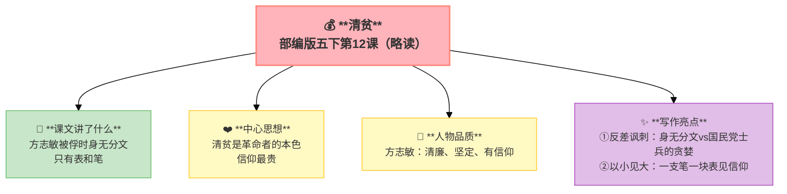

---
tags:
  - 五下
  - 语文
  - 家国情怀
  - 散文
---

# 第12课 清贫（略读）

> 部编版五下第4单元 · 阅读重点：通过动作、语言、神态体会人物内心 · 习作目标：他____了（神态+动作+心理）

## 📖 课文讲了什么

| 核心问题 | 主要内容 |
|:---------|:---------|
| "清贫"对方志敏来说意味着什么？ | 被俘 → 士兵搜身 → 只有表和笔 → 信仰最贵 |

**一句话速览**：方志敏被俘时，两个国民党兵搜他的身——以为他是大官一定有钱，结果除了一块表和一支笔，什么也没有。方志敏一生清贫，却拥有了最宝贵的财富——革命信仰。

## ✨ 阅读与写作：深挖课文"宝藏"

| 写法亮点 | 课文内容 | 写作技巧 |
|:---------|:---------|:---------|
| **反差讽刺** | 士兵以为"发大财" vs 搜不出一个铜板 | 用反差写出共产党人的清廉 |
| **以小见大** | 一块表 + 一支笔 = 全部财产 | 具体的物品写出伟大的品格 |

## 📚 语言积累：词语库+句式库

## 📋 学习自评表

| 评价维度 | 我能…… | ⭐⭐⭐ |
|:---------|:-------|:------|
| **读** | 读出方志敏的清廉与坚定 | □ |
| **说** | 说出"清贫"的含义 | □ |
| **想** | 体会什么是真正的"富有" | □ |
