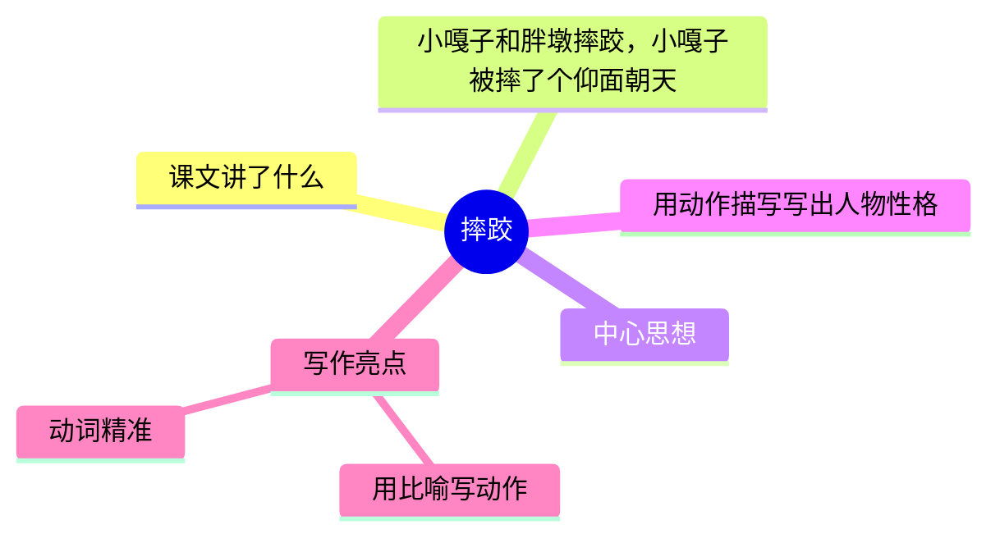
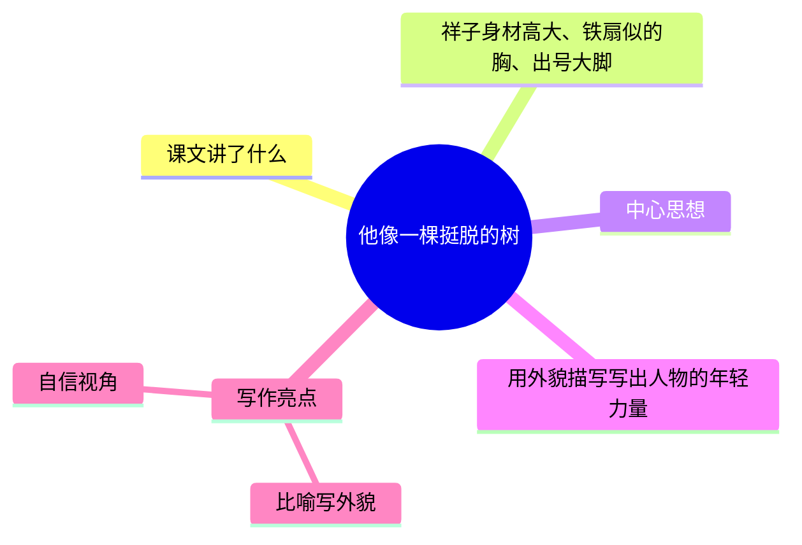
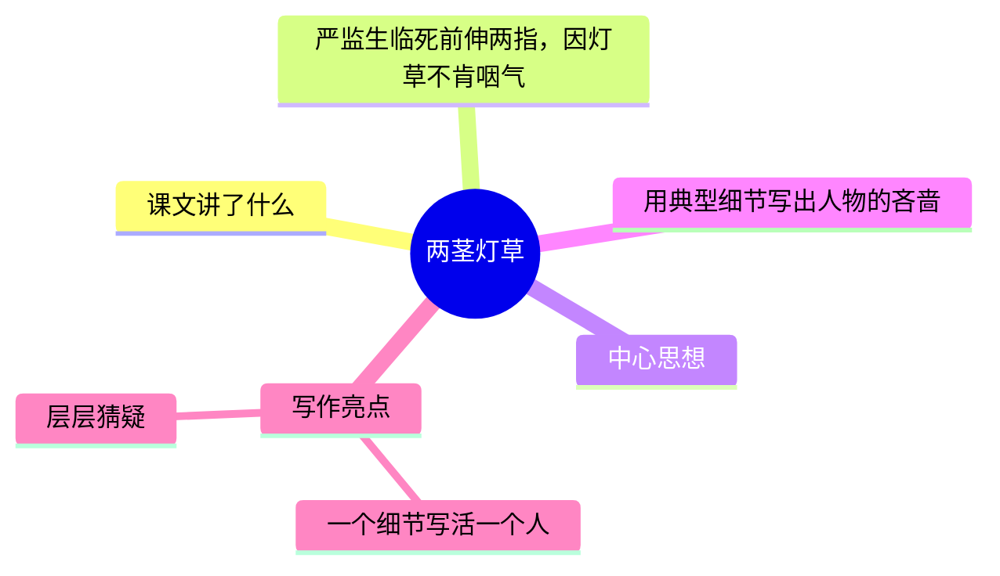

---
tags:
  - 五下
  - 语文
  - 习作单元
  - 写人
  - 人物描写一组
---

# 第13课 人物描写一组

> 部编版五下第五单元（习作单元）· 写人
> **阅读重点**：学习描写人物的基本方法
> **习作目标**：形形色色的人

---

## 摔跤（《小兵张嘎》）— 动作描写

### 📖 课文讲了什么

| 核心问题 | 主要内容 |
|:---------|:---------|
| 作者怎么用动作写出摔跤的激烈？ | 小嘎子想用巧劲，胖墩仗着力气大，小嘎子被摔了个仰面朝天 |

**一句话速览**：小嘎子和胖墩摔跤——小嘎子想用巧劲，胖墩仗着力气大。两人转了三圈，小嘎子被胖墩一推摔了个仰面朝天。

---

### ❤️ 中心思想

用动作描写写出人物性格。

---

### ✨ 写作亮点

| 写法亮点 | 课文内容 | 写作技巧 |
|:---------|:---------|:---------|
| **用比喻写动作** | "虎势儿一站""公鸡打架似的对起阵来" | 用读者熟悉的事物比喻，画面感强 |
| **动词精准** | "一叉一搂""转来转去""推" | 每个动词都写出不同的动作特点 |

---

### 📋 学习自评表（教-学-评一致性）

| 评价维度 | 我能…… | ⭐⭐⭐ |
|:---------|:-------|:------|
| **读** | 读出摔跤的紧张感 | □ |
| **找** | 找出描写动作的关键动词 | □ |
| **写** | 能用比喻写动作 | □ |

---

## 他像一棵挺脱的树（《骆驼祥子》）— 外貌描写

### 📖 课文讲了什么

| 核心问题 | 主要内容 |
|:---------|:---------|
| 作者怎么写祥子的身材和精气神？ | 祥子高大 → 铁扇胸 → 直硬背 → 出号大脚 |

**一句话速览**：祥子身材高大、铁扇似的胸、直硬的背、露出那对"出号"的大脚——年轻、自信、充满力量。

---

### ❤️ 中心思想

用外貌描写写出人物的年轻力量。

---

### ✨ 写作亮点

| 写法亮点 | 课文内容 | 写作技巧 |
|:---------|:---------|:---------|
| **比喻写外貌** | "铁扇面似的胸""像一棵挺脱的树" | 用比喻写出外形的力度 |
| **自信视角** | 祥子自己看自己——"多么宽，多么威严" | 通过人物自视写出自信 |

---

### 📋 学习自评表（教-学-评一致性）

| 评价维度 | 我能…… | ⭐⭐⭐ |
|:---------|:-------|:------|
| **读** | 读出祥子的年轻力量 | □ |
| **找** | 找出描写外貌的关键词 | □ |
| **写** | 能用比喻写一个人的外形 | □ |

---

## 两茎灯草（《儒林外史》）— 典型细节

### 📖 课文讲了什么

| 核心问题 | 主要内容 |
|:---------|:---------|
| 严监生伸出两根手指是什么意思？ | 临死前伸两指 → 众人猜 → 赵氏挑掉一茎灯草 → 咽气 |

**一句话速览**：严监生临死前伸着两根手指，不肯咽气。家人猜来猜去——最后赵氏挑掉一茎灯草，他才点头咽气。

---

### ❤️ 中心思想

用典型细节写出人物的吝啬。

---

### ✨ 写作亮点

| 写法亮点 | 课文内容 | 写作技巧 |
|:---------|:---------|:---------|
| **一个细节写活一个人** | 两根手指 + 灯草 | 最吝啬的人物，只需要一个最小的细节 |
| **层层猜疑** | 家人猜了各种可能，读者也猜 | 制造悬念，让结局更有冲击力 |

---

### 📋 学习自评表（教-学-评一致性）

| 评价维度 | 我能…… | ⭐⭐⭐ |
|:---------|:-------|:------|
| **读** | 读出严监生的吝啬 | □ |
| **品** | 说出"两根手指"为什么经典 | □ |
| **写** | 能用典型细节写一个人物特点 | □ |
