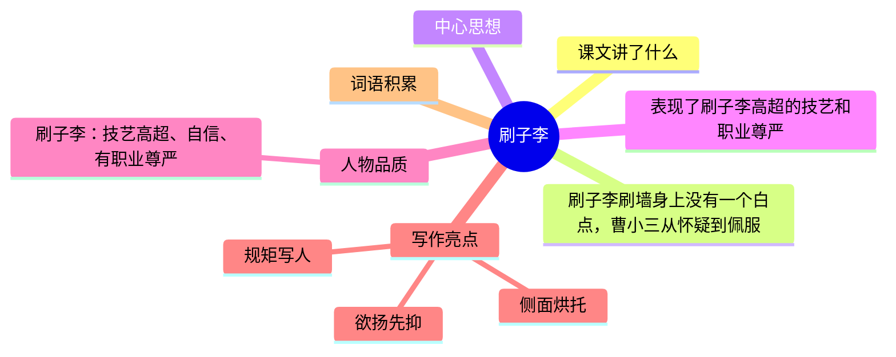

---
tags:
  - 五下
  - 语文
  - 习作单元
  - 写人
  - 刷子李
---

# 第14课 刷子李

> 部编版五下第五单元（习作单元）· 写人
> **阅读重点**：学习描写人物的基本方法
> **习作目标**：形形色色的人

---



### 📖 课文讲了什么

| 核心问题 | 主要内容 |
|:---------|:---------|
| 刷子李的"绝活"到底是什么？曹小三为什么从怀疑到佩服？ | 规矩 → 刷墙 → 寻找白点 → 发现"白点" → 真相 → 佩服 |

**一句话速览**：刷子李刷墙，刷完后身上绝没有一个白点——这是他立下的规矩。徒弟曹小三第一天跟师傅干活，看到师傅刷完真的有白点——其实是烟洞烧的小洞，不是白浆。

---

### ❤️ 中心思想

表现了刷子李高超的技艺和职业尊严。

---

### 📜 知背景

- 作者：**冯骥才**（当代作家）
- 选自《俗世奇人》——写天津卫的奇人异事

---

### ✨ 写作亮点

| 写法亮点 | 课文内容 | 写作技巧 |
|:---------|:---------|:---------|
| **侧面烘托** | 曹小三：质疑 → 观察 → 发现白点 → 失望 → 佩服 | 通过旁观者的反应写主角的厉害 |
| **欲扬先抑** | 先写"白点"让读者和曹小三一起失望 | 先抑后扬让最后的反转更有力 |
| **规矩写人** | "刷完身上没有一个白点"是刷子李立下的规矩 | 一个规矩就写出了人物的自信和尊严 |

---

### 📝 生字

| 生字 | 拼音 | 组词 |
|:----|:-----|:-----|
| 浆 | jiāng | 刷浆、豆浆 |
| 傅 | fù | 师傅、师傅 |
| 袱 | fú | 包袱、袱子 |
| 蘸 | zhàn | 蘸墨、蘸酱 |
| 诈 | zhà | 欺诈、狡诈 |
| 傻 | shǎ | 傻瓜、发傻 |
| 捏 | niē | 捏造、捏紧 |
| 怔 | zhèng | 发怔、怔住 |

---

### 🔤 多音字

| 字 | 读音 | 组词 |
|:--|:-----|:-----|
| 行 | háng | 行业、一行 |
| 行 | xíng | 行走、行为 |
| 模 | mó | 模仿、模型 |
| 模 | mú | 模样、模具 |

---

### 📚 词语积累

**必会字词**

| 词语 | 解释 |
|:----|:-----|
| **刷浆** | 刷石灰浆 |
| **绝活** | 拿手的本领 |
| **半信半疑** | 有点信又有点怀疑 |
| **派头** | 气派、架势 |
| **衔接** | 互相连接 |
| **天衣无缝** | 完美无缺 |

**近义词**

| 词语 | 近义词 |
|:----|:-------|
| 绝活 | 绝技 |
| 派头 | 架势 |
| 半信半疑 | 将信将疑 |
| 天衣无缝 | 完美无瑕 |

**反义词**

| 词语 | 反义词 |
|:----|:-------|
| 半信半义 | 深信不疑 |
| 天衣无缝 | 破绽百出 |
| 悠然 | 匆忙 |

---

### 🏗️ 文章结构：超清晰！

| 自然段 | 内容概括 |
|:-------|:---------|
| 第1-2段 | 立规矩：刷完身上没有一个白点 |
| 第3-4段 | 刷墙：动作娴熟，天衣无缝 |
| 第5-6段 | 曹小三找白点：一直盯着师傅看 |
| 第7-8段 | 发现"白点"：曹小三失望 |
| 第9-10段 | 真相大白：是烟洞，不是白浆 |
| 第11段 | 曹小三佩服：刷子李真神了 |

```
立规矩（刷完身上没有一个白点）
    ↓
刷墙（动作娴熟，天衣无缝）
    ↓
曹小三找白点（一直盯着师傅看）
    ↓
发现"白点"（曹小三失望）
    ↓
真相大白（是烟洞，不是白浆）
    ↓
曹小三佩服（刷子李真神了）
```

---

### ✨ 阅读与写作：深挖课文"宝藏"

通过旁观者的反应写主角的厉害，这就是**侧面烘托**的妙处。先抑后扬让最后的反转更有力，一个规矩就写出了人物的自信和尊严。

---

### 📚 语言积累：词语库+句式库

**词语库**：刷浆、绝活、半信半疑、派头、衔接、天衣无缝、悠然、轰然倒去、天衣无缝

**句式库**：
- "只见师傅的手臂悠然摆来，悠然摆去，如同伴着鼓点，和着琴音。"
- "每一刷，那长长的带浆的毛刷便在墙面啪地清脆一响，极是好听。"

---

### 📋 学习自评表

| 评价维度 | 我能…… | ⭐⭐⭐ |
|:---------|:-------|:------|
| **读** | 读出曹小三的心理变化 | □ |
| **找** | 找出曹小三心理变化的线索 | □ |
| **品** | 说出侧面烘托的好处 | □ |
| **写** | 学习用侧面烘托写人物 | □ |
