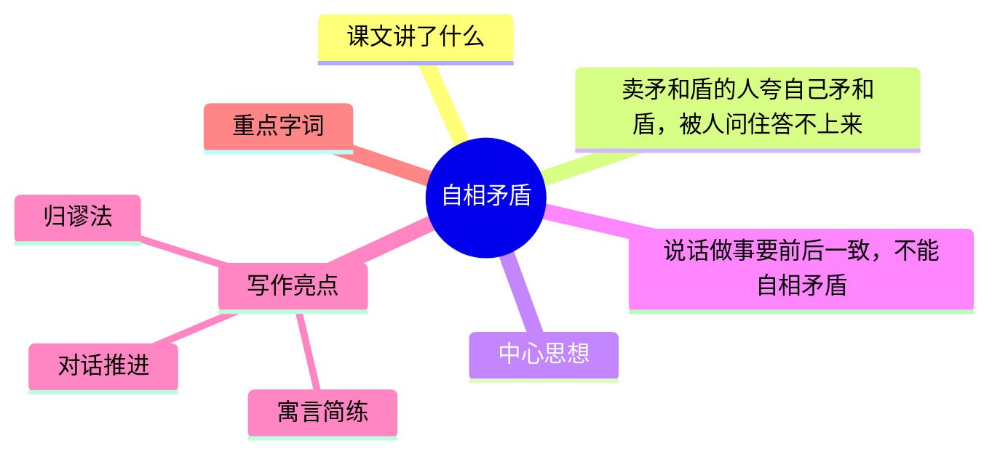

---
tags:
  - 五下
  - 语文
  - 思维
  - 逻辑
  - 文言文
  - 自相矛盾
---

# 第15课 自相矛盾

> 部编版五下第六单元 · 思维的火花
> **阅读重点**：了解人物的思维过程，加深理解
> **习作目标**：神奇的探险之旅（想象冒险）

---



### 📖 课文讲了什么

楚国有个卖盾和矛的人，夸自己的盾什么都戳不穿，又夸自己的矛什么都能戳穿——有人问"用你的矛戳你的盾呢？"他答不上来了。

---

### ❤️ 中心思想

**通过"自相矛盾"的故事，说明了说话做事要前后一致，不能自相矛盾的道理。**

---

### 📜 原文 & 翻译

> **原文**：楚人有鬻盾与矛者，誉之曰："吾盾之坚，物莫能陷也。"又誉其矛曰："吾矛之利，于物无不陷也。"或曰："以子之矛陷子之盾，何如？"其人弗能应也。

> **翻译**：楚国有个卖盾和矛的人，夸他的盾说："我的盾很坚固，什么都戳不穿。"又夸他的矛说："我的矛很锋利，什么都能戳穿。"有人说："用你的矛戳你的盾，会怎么样？"那个人答不上来了。

---

### 📝 生字

| 生字 | 拼音 | 组词 |
|:----|:-----|:-----|
| 矛 | máo | 矛盾、长矛 |
| 盾 | dùn | 盾牌、矛盾 |
| 誉 | yù | 赞誉、名誉 |
| 吾 | wú | 吾辈、吾国 |

---

### 🔤 多音字

| 字 | 读音 | 组词 |
|:--|:-----|:-----|
| 夫 | fū | 丈夫、夫人 |
| 夫 | fú | 夫子（文言助词） |

---

### 📚 词语积累

**必会字词**

| 词语 | 解释 |
|:-----|:-----|
| 鬻 | 卖 |
| 誉 | 夸耀 |
| 陷 | 刺穿、攻破 |
| 或 | 有的人 |
| 以 | 用 |
| 何如 | 怎么样 |
| 弗 | 不 |
| 应 | 回答 |

### 词语解释

| 词语 | 画面式解释 |
|:-----|:----------|
| 鬻 | 想象一下，一个人站在集市上大声吆喝："卖盾啦！卖矛啦！"——"鬻"就是"卖"的意思 |
| 誉 | 想象一下，卖东西的人竖起大拇指夸自己的东西好："我的盾天下第一坚固！"——"誉"就是夸耀 |
| 陷 | 想象一下，用一根锋利的矛去戳一块盾牌——"噗"一下刺进去了，"陷"就是刺穿 |
| 或 | 想象一下，一群人围观，其中有一个人站出来问问题——"或"就是"有的人" |
| 弗 | 想象一下，有人问了你一个问题，你张了张嘴，什么也说不出来——"弗"就是"不"的意思 |
| 应 | 想象一下，老师叫你回答问题，你站起来说——"应"就是"回答" |

**近义词**

| 词语 | 近义词 |
|:----|:-------|
| 誉 | 夸、赞 |
| 弗 | 不 |
| 或 | 有人 |

**反义词**

| 词语 | 反义词 |
|:----|:-------|
| 坚 | 薄、脆 |
| 利 | 钝 |

---

### 🏗️ 文章结构：超清晰！

| 自然段 | 内容概括 |
|:-------|:---------|
| 第1句 | 前提A：吾盾之坚，物莫能陷（什么都不能戳穿它） |
| 第2句 | 前提B：吾矛之利，于物无不陷（什么都能戳穿） |
| 第3句 | 推理：以子之矛陷子之盾（用矛戳盾） |
| 第4句 | 结论：前提A和前提B互相矛盾，无法同时成立 |

```
前提A：吾盾之坚，物莫能陷（什么都不能戳穿它）
前提B：吾矛之利，于物无不陷（什么都能戳穿）
   ↓
推理：以子之矛陷子之盾（用矛戳盾）
   ↓
结论：前提A和前提B互相矛盾，无法同时成立
```

---

### ✨ 阅读与写作：深挖课文"宝藏"

| 写法亮点 | 课文内容 | 写作技巧 |
|:---------|:---------|:---------|
| **归谬法** | 用对方的逻辑推导出不可能 | 不直接反驳，用逻辑让对手自己矛盾 |
| **对话推进** | 卖者夸→买者问→卖者无语 | 三句话完成一个完整的故事 |
| **寓言简练** | 全文仅几十个字 | 用最少的字讲最深的道理 |

---

### 📚 语言积累：词语库+句式库

**词语库**：矛、盾、誉、吾、陷、或、弗、应

**句式库**：
- "吾盾之坚，物莫能陷也。"——用"之"取消句子独立性
- "以子之矛陷子之盾，何如？"——反问句的简洁有力

---

### 📋 学习自评表

| 评价维度 | 我能…… | ⭐⭐⭐ |
|:---------|:-------|:------|
| **读** | 正确流利地朗读古文 | □ |
| **解** | 说出"自相矛盾"的含义 | □ |
| **讲** | 用自己的话讲这个故事 | □ |
| **用** | 在生活中避免自相矛盾 | □ |
