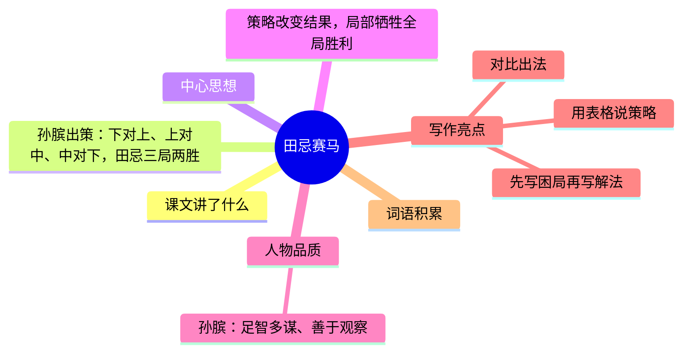

---
tags:
  - 五下
  - 语文
  - 思维
  - 逻辑
  - 田忌赛马
---

# 第16课 田忌赛马

> 部编版五下第六单元 · 思维的火花
> **阅读重点**：了解人物的思维过程，加深理解
> **习作目标**：神奇的探险之旅（想象冒险）

---



### 📖 课文讲了什么

| 核心问题 | 主要内容 |
|:---------|:---------|
| 孙膑用了什么策略让田忌赢了比赛？ | 田忌赛马 → 孙膑出策 → 下对上、上对中、中对下 → 三局两胜 |

**一句话速览**：齐国大将田忌和齐威王赛马。孙膑给田忌出主意：用下等马对上等马，上等马对中等马，中等马对下等马——三局两胜。田忌照做，果然赢了。

---

### ❤️ 中心思想

**策略改变结果，局部牺牲全局胜利。**

---

### 📝 生字

| 生字 | 拼音 | 组词 |
|:----|:-----|:-----|
| 策 | cè | 策略、计策 |
| 荐 | jiàn | 推荐、荐举 |
| 擂 | léi | 擂鼓、擂台 |
| 嬴 | yíng | 嬴政、输嬴 |

---

### 🔤 多音字

| 字 | 读音 | 组词 |
|:--|:-----|:-----|
| 擂 | léi | 擂鼓 |
| 擂 | lèi | 擂台 |
| 将 | jiàng | 将领、大将 |
| 将 | jiāng | 将要、将来 |

---

### 📚 词语积累

**必会字词**

| 词语 | 解释 |
|:----|:-----|
| **赏识** | 认识到才能而重视 |
| **胸有成竹** | 心里有把握 |
| **顺序** | 次序 |
| **不动声色** | 不说话不流露感情 |
| **转败为胜** | 从失败转为胜利 |

**近义词**

| 词语 | 近义词 |
|:----|:-------|
| 赏识 | 欣赏 |
| 胸有成竹 | 成竹在胸 |
| 转败为胜 | 扭转乾坤 |

**反义词**

| 词语 | 反义词 |
|:----|:-------|
| 转败为胜 | 功败垂成 |
| 胸有成竹 | 心中无数 |

---

### 🏗️ 文章结构：超清晰！

| 自然段 | 内容概括 |
|:-------|:---------|
| 第1-2段 | 赛马前：田忌与齐威王约定赛马 |
| 第3-4段 | 孙膑观察：发现双方马实力相近但分三等 |
| 第5-6段 | 出谋划策：调整出场顺序 |
| 第7-8段 | 实施：下vs上→输，上vs中→赢，中vs下→赢 |
| 第9段 | 田忌赢了：局部牺牲，全局胜利 |

```
赛马前（田忌与齐威王约定赛马）
    ↓
孙膑观察（发现双方马实力相近但分三等）
    ↓
出谋划策（调整出场顺序）
    ↓
实施（下vs上→输 上vs中→赢 中vs下→赢）
    ↓
田忌赢了（局部牺牲，全局胜利）
```

---

### ✨ 阅读与写作：深挖课文"宝藏"

| 写法亮点 | 课文内容 | 写作技巧 |
|:---------|:---------|:---------|
| **先写困局再写解法** | 实力相近 → 调整顺序就赢了 | 写出思维的"钥匙" |
| **对比出法** | 常规出法（输）vs 孙膑出法（赢） | 通过对比突出策略的价值 |
| **用表格说策略** | 三场马的对阵安排 | 用清晰的逻辑呈现思维过程 |

#### 💡 孙膑的思维过程

| 马的水平对比 | 常规出法 | 孙膑的调整 |
|:-------------|:---------|:-----------|
| 田忌上马 < 齐王上马 | 上vs上（输） | 下vs上（输一局，但用最差的马消耗对方最好的） |
| 田忌中马 > 齐王中马 | 中vs中（不一定赢） | 上vs中（稳赢） |
| 田忌下马 > 齐王下马 | 下vs下（不一定赢） | 中vs下（稳赢） |

**策略核心**：**局部牺牲，全局胜利。**

---

### 📚 语言积累：词语库+句式库

**词语库**：赏识、胸有成竹、不动声色、转败为胜、摩拳擦掌、跃跃欲试

**句式库**：
- "齐威王正在兴头上，得意洋洋地夸耀自己的马。"
- "孙膑胸有成竹地说：'将军请放心，按照我的主意办，一定能让您赢。'"

---

### 📋 学习自评表

| 评价维度 | 我能…… | ⭐⭐⭐ |
|:---------|:-------|:------|
| **读** | 读出孙膑的智慧 | □ |
| **说** | 讲清楚田忌赛马的策略 | □ |
| **析** | 说出孙膑的思维过程 | □ |
| **用** | 生活中运用"局部牺牲全局胜" | □ |
