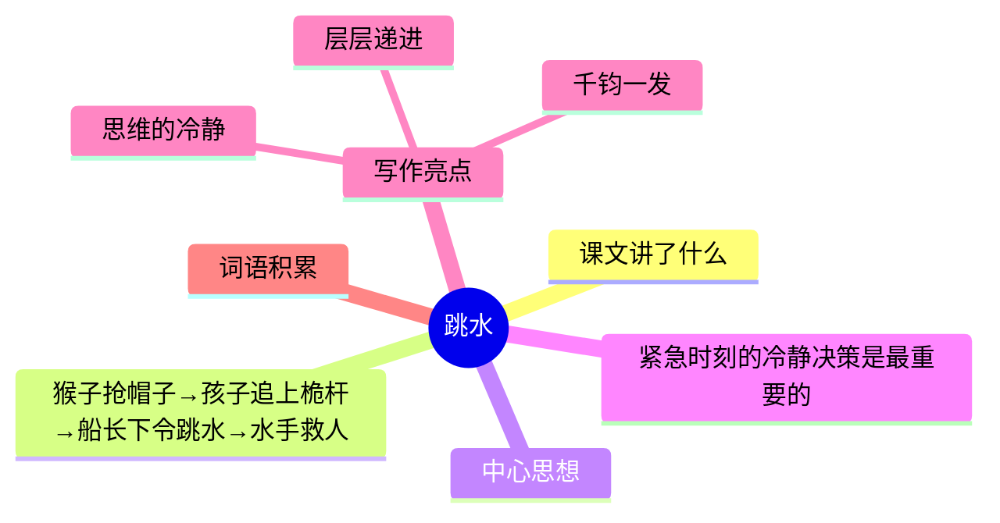

---
tags:
  - 五下
  - 语文
  - 思维
  - 逻辑
  - 跳水
---

# 第17课 跳水

> 部编版五下第六单元 · 思维的火花
> **阅读重点**：了解人物的思维过程，加深理解
> **习作目标**：神奇的探险之旅（想象冒险）

---



### 📖 课文讲了什么

| 核心问题 | 主要内容 |
|:---------|:---------|
| 船长为什么命令孩子跳海？这个决策妙在哪里？ | 猴子抢帽子 → 孩子追上桅杆 → 遇险 → 船长下令跳水 → 水手救人 |

**一句话速览**：船上一只猴子抢了孩子的帽子，孩子追猴子爬上了桅杆顶端。桅杆太高太危险，孩子随时会掉下来。船长（孩子的父亲）拿着枪命令："跳到水里去！"孩子跳了——水手们跳下去救起了他。

---

### ❤️ 中心思想

**紧急时刻的冷静决策是最重要的。**

---

### 📝 生字

| 生字 | 拼音 | 组词 |
|:----|:-----|:-----|
| 航 | háng | 航行、航天 |
| 桅 | wéi | 桅杆、船桅 |
| 咧 | liě | 咧嘴 |
| 哩 | li | 好哩 |
| 搜 | sōu | 搜寻、搜索 |
| 龇 | zī | 龇牙 |
| 咆 | páo | 咆哮 |
| 哮 | xiào | 咆哮、哮喘 |

---

### 🔤 多音字

| 字 | 读音 | 组词 |
|:--|:-----|:-----|
| 吓 | xià | 吓唬、惊吓 |
| 吓 | hè | 恐吓 |
| 模 | mó | 模仿、模型 |
| 模 | mú | 模样 |

---

### 📚 词语积累

**必会字词**

| 词语 | 解释 |
|:----|:-----|
| **一艘** | 量词，用于船只 |
| **航行** | 船在水上行驶 |
| **放肆** | 任性、没规矩 |
| **哭笑不得** | 哭也不是笑也不是 |
| **眼巴巴** | 看着却没办法 |
| **心惊胆战** | 非常害怕 |

**近义词**

| 词语 | 近义词 |
|:----|:-------|
| 放肆 | 放纵 |
| 心惊胆战 | 提心吊胆 |
| 哭笑不得 | 啼笑皆非 |

**反义词**

| 词语 | 反义词 |
|:----|:-------|
| 放肆 | 规矩 |
| 心惊胆战 | 泰然自若 |

---

### 🏗️ 文章结构：超清晰！

| 自然段 | 内容概括 |
|:-------|:---------|
| 第1段 | 起因：猴子抢孩子的帽子 |
| 第2-3段 | 发展：孩子追猴子爬上桅杆 |
| 第4段 | 高潮：孩子在桅杆顶端，随时会掉下来 |
| 第5-6段 | 转折：船长出现，冷静下令"跳水" |
| 第7-8段 | 结局：孩子跳海，水手救人成功 |

```
起因（猴子抢孩子的帽子）
    ↓
发展（孩子追猴子爬上桅杆）
    ↓
高潮（孩子在桅杆顶端，随时会掉下来）
    ↓
转折（船长出现，冷静下令"跳水"）
    ↓
结局（孩子跳海，水手救人成功）
```

---

### ✨ 阅读与写作：深挖课文"宝藏"

| 写法亮点 | 课文内容 | 写作技巧 |
|:---------|:---------|:---------|
| **层层递进** | 猴子抢帽→孩子追→越爬越高→危险 | 一步一步把紧张感拉到最高 |
| **千钧一发** | 船长拿枪逼孩子跳 | 最高潮处用最极端的方式解决问题 |
| **思维的冷静** | 1. 爬下来会掉 2. 跳海有一线生机 3. 水手能救人 | 紧急时刻的理性分析 |

#### 💡 船长的思维

为什么命令孩子跳海？因为：

1. 桅杆太高，爬下来可能掉下去
2. 只有跳海有一线生机
3. 水手随时准备救人

**千钧一发时的冷静决策**——这才是真正的智慧。

---

### 📚 语言积累：词语库+句式库

**词语库**：一艘、航行、放肆、哭笑不得、眼巴巴、心惊胆战、龇牙咧嘴、摇摇晃晃

**句式库**：
- "猴子不但不理，还撕得更凶了。"——递进关系
- "孩子气极了，他的手放开了绳子和桅杆，张开胳膊，摇摇晃晃地走上横木。"——动作描写写出危险

---

### 📋 学习自评表

| 评价维度 | 我能…… | ⭐⭐⭐ |
|:---------|:-------|:------|
| **读** | 读出故事的紧张感 | □ |
| **说** | 讲清楚整个故事 | □ |
| **析** | 说出船长的思维过程 | □ |
| **写** | 学习层层递进写紧张场景 | □ |
