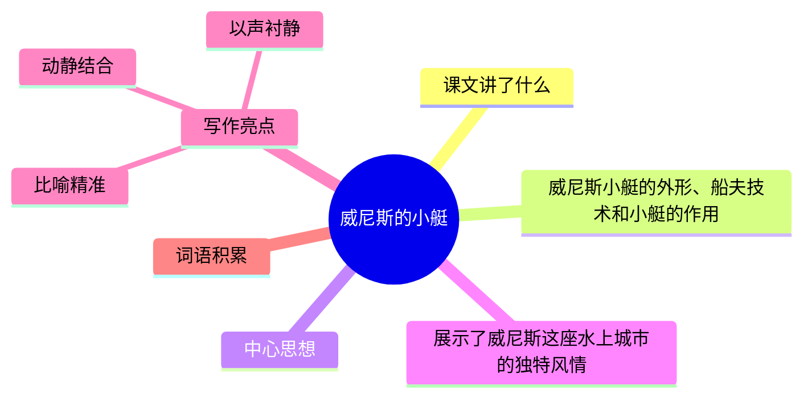

---
tags:
  - 五下
  - 语文
  - 异域风情
  - 写景
  - 威尼斯的小艇
---

# 第18课 威尼斯的小艇

> 部编版五下第七单元 · 异域风情
> **阅读重点**：体会静态描写和动态描写的表达效果
> **习作目标**：中国的世界文化遗产（资料整理）

---



### 📖 课文讲了什么

威尼斯是世界闻名的水上城市。小艇是主要的交通工具——又窄又深，像新月。船夫的驾驶技术特别好——快、稳、灵活。商人坐小艇做生意、老人带全家去教堂、戏院的散场时刻更是热闹非凡。

---

### ❤️ 中心思想

**通过介绍威尼斯小艇的特点和作用，展示了威尼斯这座水上城市的独特风情。**

---

### 📜 知背景

- 作者：**马克·吐温**（美国作家）

---

### 📝 生字

| 生字 | 拼音 | 组词 |
|:----|:-----|:-----|
| 尼 | ní | 威尼斯、尼姑 |
| 艄 | shāo | 船艄、艄公 |
| 翘 | qiào | 翘起、翘尾巴 |
| 姆 | mǔ | 保姆 |
| 祷 | dǎo | 祈祷、祷告 |
| 雇 | gù | 雇佣、雇船 |
| 哗 | huá | 哗笑、哗然 |

---

### 🔤 多音字

| 字 | 读音 | 组词 |
|:--|:-----|:-----|
| 翘 | qiáo | 翘首 |
| 翘 | qiào | 翘起 |
| 哗 | huā | 哗啦 |
| 哗 | huá | 哗笑 |

---

### 📚 词语积累

**必会字词**

| 词语 | 解释 |
|:----|:-----|
| **威尼斯** | 意大利水城 |
| **船艄** | 船尾 |
| **操纵自如** | 控制自如 |
| **手忙脚乱** | 慌乱、不从容 |
| **簇拥** | 很多人围着 |
| **哗笑** | 大声笑 |
| **沉寂** | 非常安静 |

**近义词**

| 词语 | 近义词 |
|:----|:-------|
| 操纵自如 | 运用自如 |
| 簇拥 | 蜂拥 |
| 沉寂 | 寂静 |

**反义词**

| 词语 | 反义词 |
|:----|:-------|
| 操纵自如 | 手忙脚乱 |
| 沉寂 | 喧闹 |

---

### 🏗️ 文章结构：超清晰！

| 自然段 | 内容概括 |
|:-------|:---------|
| 第1段 | 小艇的外形（又窄又深，像新月，像水蛇） |
| 第2-3段 | 船夫的驾驶技术（快、稳、灵活） |
| 第4段 | 小艇的作用（做生意、去教堂、看戏） |
| 第5段 | 白天——动态（热闹繁忙） |
| 第6段 | 夜晚——静态（沉沉入睡） |

```
小艇的外形（又窄又深，像新月，像水蛇）
    ↓
船夫的驾驶技术（快、稳、灵活）
    ↓
小艇的作用（做生意、去教堂、看戏）
    ↓
白天——动态（热闹繁忙）
    ↓
夜晚——静态（沉沉入睡）
```

---

### ✨ 阅读与写作：深挖课文"宝藏"

| 写法亮点 | 课文内容 | 写作技巧 |
|:---------|:---------|:---------|
| **比喻精准** | "像新月""像水蛇" | 两个比喻写出小艇的两个特点 |
| **动静结合** | 白天热闹（动）vs 夜晚宁静（静） | 鲜明的对比让两种美都更突出 |
| **以声衬静** | 戏院散场→哗笑告别→渐渐沉寂 | 从热闹到寂静的过渡自然流畅 |

#### 💡 动静对比

| 场景 | 状态 | 描写 |
|:----|:-----|:-----|
| 白天 | **动态** | 小艇穿梭、行人来往、戏院散场 |
| 夜晚 | **静态** | 小艇沉睡、水面平静、月光皎洁 |

> "水面上渐渐沉寂，只见月亮的影子在水中摇晃。高大的石头建筑耸立在河边，古老的桥梁横在水上，大大小小的船都停泊在码头上。静寂笼罩着这座水上城市，古老的威尼斯又沉沉地入睡了。"

---

### 📚 语言积累：词语库+句式库

**词语库**：威尼斯、船艄、操纵自如、手忙脚乱、簇拥、哗笑、沉寂、新月、水蛇

**句式库**：
- "威尼斯的小艇有二三十英尺长，又窄又深，有点像独木舟。"——比喻写外形
- "静寂笼罩着这座水上城市，古老的威尼斯又沉沉地入睡了。"——拟人写夜晚

---

### 📋 学习自评表

| 评价维度 | 我能…… | ⭐⭐⭐ |
|:---------|:-------|:------|
| **读** | 读出小艇的灵巧和威尼斯的魅力 | □ |
| **找** | 找出文中的比喻句和动态静态描写 | □ |
| **品** | 说出动静结合的好处 | □ |
| **写** | 能用比喻写一个事物的特点 | □ |
