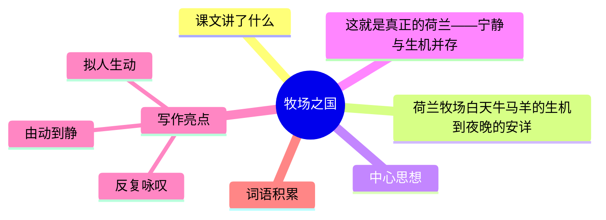

---
tags:
  - 五下
  - 语文
  - 异域风情
  - 写景
  - 牧场之国
---

# 第19课 牧场之国

> 部编版五下第七单元 · 异域风情
> **阅读重点**：体会静态描写和动态描写的表达效果
> **习作目标**：中国的世界文化遗产（资料整理）

---



### 📖 课文讲了什么

| 核心问题 | 主要内容 |
|:---------|:---------|
| 荷兰牧场的美体现在哪些方面？ | 白天牛马羊的生机 → 傍晚的宁静 → 夜晚的安详 |

**一句话速览**：荷兰是牧场之国——碧绿的草原上黑白花牛在吃草、骏马在奔跑、绵羊在悠闲地漫步。到了晚上，一切都安静下来，只有远处的灯塔在闪烁。

---

### ❤️ 中心思想

**这就是真正的荷兰——宁静与生机并存。**

---

### 📝 生字

| 生字 | 拼音 | 组词 |
|:----|:-----|:-----|
| 膝 | xī | 膝盖、膝盖 |
| 骏 | jùn | 骏马、骏逸 |
| 颇 | pō | 偏颇、颇为 |
| 牲 | shēng | 牲口、牲畜 |
| 畜 | chù | 牲畜、家畜 |
| 眺 | tiào | 眺望、远眺 |
| 赘 | zhuì | 赘述、累赘 |
| 遮 | zhē | 遮挡、遮盖 |

---

### 🔤 多音字

| 字 | 读音 | 组词 |
|:--|:-----|:-----|
| 畜 | chù | 牲畜 |
| 畜 | xù | 畜牧 |
| 模 | mó | 模仿 |
| 模 | mú | 模样 |

---

### 📚 词语积累

**必会字词**

| 词语 | 解释 |
|:----|:-----|
| **仪态端庄** | 姿态端正庄重 |
| **镶嵌** | 嵌入 |
| **辽阔** | 宽广 |
| **悠然自得** | 悠闲舒适 |
| **牲畜** | 家畜 |
| **遮掩** | 遮蔽 |

**近义词**

| 词语 | 近义词 |
|:----|:-------|
| 仪态端庄 | 仪表堂堂 |
| 辽阔 | 广阔 |
| 悠然自得 | 闲情逸致 |

**反义词**

| 词语 | 反义词 |
|:----|:-------|
| 辽阔 | 狭窄 |
| 悠然自得 | 忐忑不安 |

---

### 🏗️ 文章结构：超清晰！

| 自然段 | 内容概括 |
|:-------|:---------|
| 第1段 | 总起：荷兰是牧场之国 |
| 第2-3段 | 白天——牛群吃草（仪态端庄） |
| 第4段 | 白天——骏马奔跑（自由奔放） |
| 第5段 | 白天——绵羊悠闲（悠然自得） |
| 第6段 | 傍晚——慢慢安静 |
| 第7段 | 夜晚——沉睡（这就是真正的荷兰） |

```
总起（荷兰是牧场之国）
    ↓
白天——牛群吃草（仪态端庄）
    ↓
白天——骏马奔跑（自由奔放）
    ↓
白天——绵羊悠闲（悠然自得）
    ↓
傍晚——慢慢安静
    ↓
夜晚——沉睡（这就是真正的荷兰）
```

---

### ✨ 阅读与写作：深挖课文"宝藏"

| 写法亮点 | 课文内容 | 写作技巧 |
|:---------|:---------|:---------|
| **反复咏叹** | "这就是真正的荷兰"出现四次 | 像诗歌的副歌，不断强调主题 |
| **由动到静** | 白天热闹 → 傍晚安静 → 夜晚沉睡 | 时间顺序写出荷兰的一天 |
| **拟人生动** | "牛群吃草像在沉思""奶牛在思考什么" | 把动物当人写，画面更有趣 |

---

### 📚 语言积累：词语库+句式库

**词语库**：仪态端庄、镶嵌、辽阔、悠然自得、牲畜、遮掩、膘肥体壮、默无声音

**句式库**：
- "这就是真正的荷兰。"——反复句式，强调主题
- "牛群吃草时非常专注，有时站立不动，仿佛在思考什么。"——拟人句

---

### 📋 学习自评表

| 评价维度 | 我能…… | ⭐⭐⭐ |
|:---------|:-------|:------|
| **读** | 读出荷兰牧场的宁静与美丽 | □ |
| **找** | 找出"这就是真正的荷兰"出现几次 | □ |
| **品** | 说出反复写一句话的作用 | □ |
| **写** | 学习用反复的句式写一处景色 | □ |
