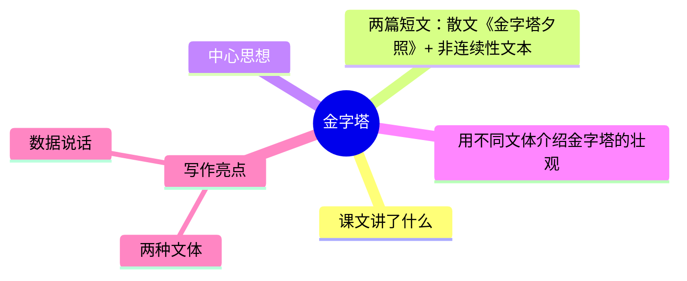

---
tags:
  - 五下
  - 语文
  - 异域风情
  - 写景
  - 金字塔
---

# 第20课 金字塔

> 部编版五下第七单元 · 异域风情（略读课文）
> **阅读重点**：体会静态描写和动态描写的表达效果
> **习作目标**：中国的世界文化遗产（资料整理）

---



### 📖 课文讲了什么

| 核心问题 | 主要内容 |
|:---------|:---------|
| 两篇短文用了什么不同的方式来介绍金字塔？ | 《金字塔夕照》写景抒情 → 《不可思议的金字塔》用数据图表说明 |

**一句话速览**：两篇短文——《金字塔夕照》（散文，写金字塔的壮观和神秘）和《不可思议的金字塔》（非连续性文本，用数据和图表介绍金字塔的建造之谜）。

---

### ❤️ 中心思想

**用不同文体介绍金字塔的壮观。**

---

### 📝 生字

| 生字 | 拼音 | 组词 |
|:----|:-----|:-----|
| 译 | yì | 翻译、译文 |
| 愧 | kuì | 惭愧、愧疚 |
| 耀 | yào | 照耀、耀眼 |
| 遐 | xiá | 遐想、遐迩 |
| 黏 | nián | 黏土、黏合 |
| 刃 | rèn | 刀刃、利刃 |
| 埃 | āi | 埃及、尘埃 |
| 滥 | làn | 泛滥、滥用 |

---

### 🔤 多音字

| 字 | 读音 | 组词 |
|:--|:-----|:-----|
| 曾 | céng | 曾经 |
| 曾 | zēng | 曾孙 |
| 称 | chēng | 称呼 |
| 称 | chèn | 称心 |

---

### 📚 词语积累

**必会字词**

| 词语 | 解释 |
|:----|:-----|
| **金字塔** | 古埃及法老的陵墓 |
| **熠熠发光** | 形容光彩闪耀 |
| **遐想** | 悠远地想象 |
| **黏着物** | 粘在一起的东西 |
| **刀刃** | 刀的锋利部分 |
| **泛滥** | 江河湖泊的水溢出 |

**近义词**

| 词语 | 近义词 |
|:----|:-------|
| 遐想 | 联想 |
| 熠熠发光 | 光彩夺目 |
| 泛滥 | 溢出 |

**反义词**

| 词语 | 反义词 |
|:----|:-------|
| 熠熠发光 | 黯淡无光 |

---

### 🏗️ 文章结构：超清晰！

| 自然段 | 内容概括 |
|:-------|:---------|
| 《金字塔夕照》第1-2段 | 金字塔在夕阳下的壮观景象 |
| 《金字塔夕照》第3段 | 作者的感受和联想 |
| 《不可思议的金字塔》第1段 | 金字塔的基本数据 |
| 《不可思议的金字塔》第2-4段 | 建造之谜和未解问题 |

```
《金字塔夕照》（散文）
  夕阳下的壮观 → 作者的感受和联想

《不可思议的金字塔》（非连续性文本）
  基本数据 → 建造之谜 → 未解问题
```

---

### ✨ 阅读与写作：深挖课文"宝藏"

| 写法亮点 | 课文内容 | 写作技巧 |
|:---------|:---------|:---------|
| **两种文体** | 散文 + 非连续性文本 | 同一个主题可以用完全不同的写法 |
| **数据说话** | 金字塔高度、重量、石头数量 | 用数据让介绍更有说服力 |

#### 💡 非连续性文本

五年级第一次接触——**有图表、有数据、有批注**的阅读材料。

---

### 📚 语言积累：词语库+句式库

**词语库**：金字塔、熠熠发光、遐想、黏着物、刀刃、泛滥、壮观、神秘

**句式库**：
- "在金色的夕阳下，金色的田野，金色的沙漠，连尼罗河水也闪着金光。"——排比句写壮观
- "塔身由230万块巨石砌成。"——用数据说明

---

### 📋 学习自评表

| 评价维度 | 我能…… | ⭐⭐⭐ |
|:---------|:-------|:------|
| **读** | 读懂散文和非连续性文本的不同 | □ |
| **说** | 说出两种文体的写法区别 | □ |
| **用** | 会用图表和数据说明事物 | □ |
