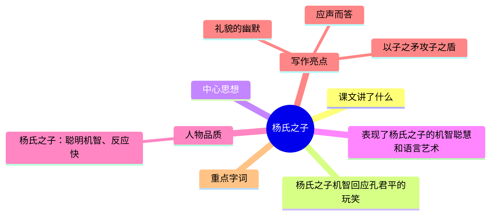

---
tags:
  - 五下
  - 语文
  - 幽默
  - 漫画
  - 杨氏之子
---

# 第21课 杨氏之子

> 部编版五下第八单元 · 幽默和风趣
> **阅读重点**：感受课文风趣的语言
> **习作目标**：漫画的启示（看图作文）

---



### 📖 课文讲了什么

梁国一户姓杨的人家有个九岁儿子，非常聪明。孔君平来拜访他父亲，指着杨梅开玩笑说"这是你家的水果"，孩子马上回了一句"没听说孔雀是先生您家的鸟"。

---

### ❤️ 中心思想

**通过杨氏之子与孔君平的对话，表现了杨氏之子的机智聪慧和语言艺术。**

---

### 📜 原文 & 翻译

> **原文**：梁国杨氏子九岁，甚聪惠。孔君平诣其父，父不在，乃呼儿出。为设果，果有杨梅。孔指以示儿曰："此是君家果。"儿应声答曰："未闻孔雀是夫子家禽。"

> **翻译**：梁国有一户姓杨的人家，有个九岁的儿子，非常聪明。孔君平来拜访他父亲，父亲不在，就叫孩子出来。孩子摆上水果，水果里有杨梅。孔君平指着杨梅对孩子说："这是你家的水果。"孩子马上回答："没听说孔雀是先生您家的鸟。"

---

### 📝 生字

| 生字 | 拼音 | 组词 |
|:----|:-----|:-----|
| 氏 | shì | 姓氏、氏族 |
| 甚 | shèn | 甚至、甚好 |
| 惠 | huì | 聪惠、实惠 |
| 诣 | yì | 造诣、诣其父 |
| 禽 | qín | 家禽、飞禽 |

---

### 🔤 多音字

| 字 | 读音 | 组词 |
|:--|:-----|:-----|
| 为 | wèi | 为人设果 |
| 为 | wéi | 因为 |
| 应 | yìng | 应声 |
| 应 | yīng | 应该 |

---

### 📚 词语积累

**必会字词**

| 词语 | 解释 |
|:-----|:-----|
| 氏 | 姓氏 |
| 甚 | 非常 |
| 聪惠 | 聪明（"惠"通"慧"） |
| 诣 | 拜访 |
| 乃 | 于是、就 |
| 设 | 摆放 |
| 示 | 给……看 |
| 应声 | 马上回答 |
| 未闻 | 没听说过 |
| 夫子 | 对男子的尊称 |

### 词语解释

| 词语 | 画面式解释 |
|:-----|:----------|
| 诣 | 想象一下，一个人穿戴整齐去别人家做客——"诣"就是"去拜访" |
| 乃 | 想象一下，因为爸爸不在家，所以就叫孩子出来——"乃"就是"于是、就"的意思 |
| 设 | 想象一下，一个九岁的小孩把水果一样一样摆在盘子里，端到客人面前——这叫"设果" |
| 示 | 想象一下，孔君平指着杨梅给小孩看——"示"就是"给……看" |
| 应声 | 想象一下，孔君平话音刚落，小孩想都没想就回答出来了——快到声音连着声音 |
| 未闻 | 想象一下，小孩很有礼貌地说"我从来没有听说过……"——"未闻"就是"没听说过" |
| 夫子 | 想象一下，古代人对有学问、有地位的男性的尊称——就像现在说"先生您" |

**近义词**

| 词语 | 近义词 |
|:----|:-------|
| 聪惠 | 聪明 |
| 诣 | 拜访 |
| 乃 | 就 |

**反义词**

| 词语 | 反义词 |
|:----|:-------|
| 聪惠 | 愚笨 |

---

### 🏗️ 文章结构：超清晰！

| 自然段 | 内容概括 |
|:-------|:---------|
| 第1句 | 总起：杨氏子九岁，甚聪惠 |
| 第2句 | 孔君平诣其父，父不在，乃呼儿出 |
| 第3句 | 为设果，果有杨梅 |
| 第4句 | 孔指以示儿曰："此是君家果。" |
| 第5句 | 儿应声答曰："未闻孔雀是夫子家禽。" |

```
总起：杨氏子九岁，甚聪惠
    ↓
孔君平来拜访，父亲不在，叫孩子出来
    ↓
孩子设果（杨梅）
    ↓
孔君平开玩笑："此是君家果"
    ↓
杨氏子回应："未闻孔雀是夫子家禽"
```

---

### ✨ 阅读与写作：深挖课文"宝藏"

| 写法亮点 | 课文内容 | 写作技巧 |
|:---------|:---------|:---------|
| **以子之矛攻子之盾** | "未闻孔雀是夫子家禽" | 用对方的逻辑回击对方，机智幽默 |
| **应声而答** | "应声答曰"——想都没想就回答 | 写出孩子的聪明和反应快 |
| **礼貌的幽默** | 先说"未闻"再反击 | 既不伤和气又让人无话可说 |

---

### 🏗️ 幽默逻辑

```
孔君平的玩笑：杨梅的"杨"=你的姓"杨"→杨梅是你家的水果
    ↓
杨氏子的回应：孔雀的"孔"=你的姓"孔"→孔雀是你家的鸟吗
    ↓
结果：用对方的逻辑回击对方（以其人之道还治其人之身）
```

---

### 📚 语言积累：词语库+句式库

**词语库**：氏、甚、聪惠、诣、乃、设、示、应声、未闻、夫子

**句式库**：
- "此是君家果。"——判断句
- "未闻孔雀是夫子家禽。"——否定句+敬称，机智回应

---

### 📋 学习自评表

| 评价维度 | 我能…… | ⭐⭐⭐ |
|:---------|:-------|:------|
| **读** | 正确流利地朗读古文 | □ |
| **解** | 说出杨氏之子的妙在哪里 | □ |
| **讲** | 用自己的话讲这个故事 | □ |
| **悟** | 感受语言幽默的智慧 | □ |
