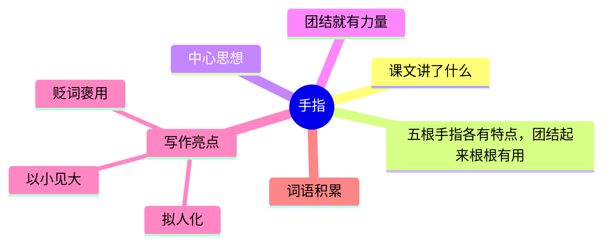

---
tags:
  - 五下
  - 语文
  - 幽默
  - 漫画
  - 手指
---

# 第22课 手指

> 部编版五下第八单元 · 幽默和风趣
> **阅读重点**：感受课文风趣的语言
> **习作目标**：漫画的启示（看图作文）

---



### 📖 课文讲了什么

| 核心问题 | 主要内容 |
|:---------|:---------|
| 五根手指各有什么特点？作者想告诉我们什么道理？ | 大拇指吃苦耐劳 → 食指勤奋机敏 → 中指养尊处优 → 无名指小指薄弱 → 团结就有力量 |

**一句话速览**：丰子恺用幽默的笔调写五根手指——大拇指吃苦耐劳、食指勤奋机敏、中指养尊处优、无名指和小指能力薄弱。团结起来，根根有用。

---

### ❤️ 中心思想

**团结就有力量。**

---

### 📜 知背景

- 作者：**丰子恺**（现代画家、散文家）
- 特点：用幽默的笔调写平常事

---

### 📝 生字

| 生字 | 拼音 | 组词 |
|:----|:-----|:-----|
| 拇 | mǔ | 拇指 |
| 搅 | jiǎo | 搅拌、搅乱 |
| 窈 | yǎo | 窈窕 |
| 窕 | tiǎo | 窈窕 |
| 秽 | huì | 污秽、秽土 |
| 轧 | yà | 倾轧、轧钢 |
| 拧 | níng | 拧螺丝 |
| 螺 | luó | 螺丝、螺母 |
| 纽 | niǔ | 纽扣、枢纽 |
| 扣 | kòu | 扣子、扣除 |
| 貌 | mào | 相貌、面貌 |
| 仓 | cāng | 仓库、仓促 |
| 瘦 | shòu | 瘦弱、消瘦 |
| 膘 | biāo | 膘肥体壮 |
| 酥 | sū | 酥软、酥油 |

---

### 🔤 多音字

| 字 | 读音 | 组词 |
|:--|:-----|:-----|
| 拧 | nǐng | 拧毛巾 |
| 拧 | nìng | 拧脾气 |
| 轧 | yà | 倾轧 |
| 轧 | zhá | 轧钢 |

---

### 📚 词语积累

**必会字词**

| 词语 | 解释 |
|:----|:-----|
| **窈窕** | 姿态美好 |
| **养尊处优** | 地位高、生活好 |
| **附庸** | 依附、从属 |
| **薄弱** | 不雄厚、不坚强 |
| **团结** | 联合起来 |
| **拧** | 扭转 |

**近义词**

| 词语 | 近义词 |
|:----|:-------|
| 养尊处优 | 娇生惯养 |
| 薄弱 | 虚弱 |
| 附庸 | 依附 |

**反义词**

| 词语 | 反义词 |
|:----|:-------|
| 养尊处优 | 吃苦耐劳 |
| 薄弱 | 强壮 |

---

### 🏗️ 文章结构：超清晰！

| 自然段 | 内容概括 |
|:-------|:---------|
| 第1段 | 总起：每个人都有五根手指，各有所长各有所短 |
| 第2段 | 大拇指（吃苦耐劳，最肯吃苦） |
| 第3段 | 食指（勤奋机敏，勇于冒险） |
| 第4段 | 中指（养尊处优，位置最优） |
| 第5段 | 无名指和小指（能力薄弱，但也很可爱） |
| 第6段 | 总结：团结起来，根根有用，根根有力量 |

```
总起（每个人都有五根手指，各有所长各有所短）
    ↓
大拇指（吃苦耐劳，最肯吃苦）
    ↓
食指（勤奋机敏，勇于冒险）
    ↓
中指（养尊处优，位置最优）
    ↓
无名指和小指（能力薄弱，但也很可爱）
    ↓
总结（团结起来，根根有用，根根有力量）
```

---

### ✨ 阅读与写作：深挖课文"宝藏"

| 写法亮点 | 课文内容 | 写作技巧 |
|:---------|:---------|:---------|
| **拟人化** | 每根手指都像一个人——有性格、有命运 | 把物当人写，生动有趣 |
| **贬词褒用** | 中指"曲线优美""养尊处优" | 明明是缺点，用褒义词写，幽默感十足 |
| **以小见大** | 五根手指 → 团结的力量 | 用最平常的事讲最深的道理 |

---

### 📚 语言积累：词语库+句式库

**词语库**：窈窕、养尊处优、附庸、薄弱、团结、拧、姿态、堂皇

**句式库**：
- "大在拇指在五指中，却是最肯吃苦的。"——转折句
- "他居于中央，左右都有屏障。"——拟人句

---

### 📋 学习自评表

| 评价维度 | 我能…… | ⭐⭐⭐ |
|:---------|:-------|:------|
| **读** | 读出幽默风趣的语言味道 | □ |
| **说** | 说出五根手指各有什么特点 | □ |
| **品** | 体会"贬词褒用"的幽默效果 | □ |
| **写** | 学习用拟人写一种事物 | □ |
