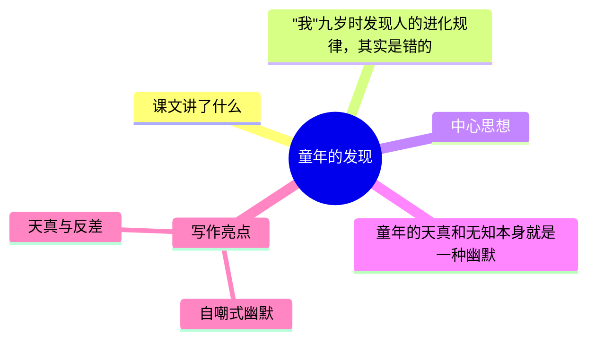

---
tags:
  - 五下
  - 语文
  - 幽默
  - 漫画
  - 童年的发现
---

# 第23课 童年的发现

> 部编版五下第八单元 · 幽默和风趣（略读课文）
> **阅读重点**：感受课文风趣的语言
> **习作目标**：漫画的启示（看图作文）

---



### 📖 课文讲了什么

| 核心问题 | 主要内容 |
|:---------|:---------|
| "我"的"大发现"为什么可笑？幽默从哪里来？ | "我"发现人的进化规律 → 其实是错的 → 用自嘲写天真 |

**一句话速览**："我"九岁时发现了一个"大秘密"——人的进化规律。其实这个"发现"是个错误，但老师不知道。作者用自嘲的口气写自己的"天才发现"——幽默来自天真和无知。

---

### ❤️ 中心思想

**童年的天真和无知本身就是一种幽默。**

---

### 📝 生字

| 生字 | 拼音 | 组词 |
|:----|:-----|:-----|
| 胚 | pēi | 胚胎、胚芽 |
| 赋 | fù | 天赋、赋予 |
| 淀 | diàn | 淀粉、沉淀 |
| 困 | kùn | 困惑、困难 |
| 窘 | jiǒng | 窘迫、窘境 |

---

### 🔤 多音字

| 字 | 读音 | 组词 |
|:--|:-----|:-----|
| 禁 | jīn | 禁不住 |
| 禁 | jìn | 禁止 |
| 澄 | chéng | 澄清 |
| 澄 | dèng | 澄沙 |

---

### 📚 词语积累

**必会字词**

| 词语 | 解释 |
|:----|:-----|
| **胚胎** | 初期发育的生物体 |
| **天赋** | 自然赋予的才能 |
| **困惑** | 感到疑难 |
| **窘迫** | 非常为难 |
| **绞尽脑汁** | 费尽心思 |

**近义词**

| 词语 | 近义词 |
|:----|:-------|
| 天赋 | 天资 |
| 困惑 | 迷惑 |
| 窘迫 | 尴尬 |

**反义词**

| 词语 | 反义词 |
|:----|:-------|
| 困惑 | 明白 |
| 窘迫 | 自在 |

---

### 🏗️ 文章结构：超清晰！

| 自然段 | 内容概括 |
|:-------|:---------|
| 第1-2段 | "我"对生命的疑问和思考 |
| 第3-4段 | "我"发现人的进化规律 |
| 第5-6段 | 老师讲答案，"我"的发现被证实（其实是错的） |
| 第7-8段 | "我"的发现被误解，老师让"我"出去 |

```
"我"对生命的疑问和思考
    ↓
"我"发现人的进化规律
    ↓
老师讲答案，"我"的发现被证实（其实是错的）
    ↓
"我"的发现被误解，老师让"我"出去
```

---

### ✨ 阅读与写作：深挖课文"宝藏"

| 写法亮点 | 课文内容 | 写作技巧 |
|:---------|:---------|:---------|
| **自嘲式幽默** | "我"以为自己发现了惊天大秘密 | 自己笑自己，最有趣的幽默 |
| **天真与反差** | 孩子的"发现" vs 真正的科学 | 认知差距越大，幽默感越强 |

---

### 📚 语言积累：词语库+句式库

**词语库**：胚胎、天赋、困惑、窘迫、绞尽脑汁、一本正经、情不自禁

**句式库**：
- "我渴望弄明白，人究竟是怎么来的。"——疑问句写好奇心
- "我和同学们常常情不自禁地哈哈大笑。"——夸张写幽默

---

### 📋 学习自评表

| 评价维度 | 我能…… | ⭐⭐⭐ |
|:---------|:-------|:------|
| **读** | 读出天真和幽默 | □ |
| **说** | 说出幽默从哪里来 | □ |
| **悟** | 学会自嘲也是一种幽默 | □ |
