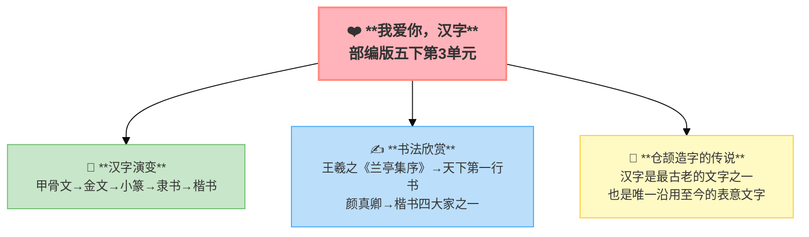

---
tags:
  - 五下
  - 语文
  - 汉字
  - 综合性学习
---

# 我爱你，汉字

> 部编版五下第3单元 · 阅读重点：感受汉字的趣味，了解汉字文化 · 习作目标：撰写简单的研究报告

## 📖 课文讲了什么

## ❤️ 中心思想

## 📝 生字

## 🔤 多音字

## 📚 词语积累

### 必会字词

### 近义词

### 反义词

## 汉字演变
甲骨文（商）→ 金文（周）→ 小篆（秦）→ 隶书（汉）→ 楷书（魏晋至今）

## 书法欣赏
- 王羲之《兰亭集序》——"天下第一行书"
- 颜真卿——楷书四大家之一

## 关于"汉字"的命名
仓颉造字的传说——汉字是最古老的文字之一，也是唯一沿用至今的表意文字。

## ✨ 阅读与写作：深挖课文"宝藏"

## 📚 语言积累：词语库+句式库

## 📋 学习自评表
