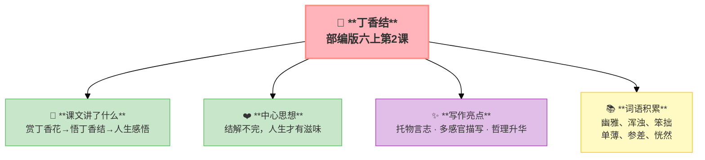

---
tags:
  - 六上
  - 语文
  - 触摸自然
  - 散文
  - 托物言志
  - 丁香结
---

# 第02课 丁香结

> 部编版六上第1单元 · 触摸自然
> **阅读重点**：从阅读内容想开去（联想和想象）
> **习作目标**：变形记（想象作文）

---

## 📖 课文讲了什么

| 核心问题 | 主要内容 |
|:---------|:---------|
| 丁香结是什么？作者从中悟出了什么？ | 赏丁香花→悟丁香结→人生感悟 |

**一句话速览**：宗璞喜欢丁香花——星星般的小花、香得直透毫端。她发现丁香结像人的"心结"——每个人一辈子都有许多不顺心的"结"，但正因如此，人生才有滋味。



---

## ❤️ 中心思想

**结解不完，人生才有滋味——作者通过丁香结悟出了豁达的人生态度。**

---

## 📜 知背景

- 作者：宗璞，当代女作家
- 这是一篇**托物言志的散文**

---

## 📝 生字

（本课无重点生字）

---

## 🔤 多音字

（本课无重点多音字）

---

## 📚 词语积累

| 词语 | 解释 |
|:----|:-----|
| **幽雅** | 幽静雅致 |
| **浑浊** | 不干净 |
| **笨拙** | 不灵巧 |
| **单薄** | 瘦弱、不厚实 |
| **参差** | 长短不齐 |
| **恍然** | 忽然明白 |

---

## 🏗️ 文章结构：超清晰！

```
赏丁香花（颜色——白/紫、形状——十字形、气味——甜香）
    ↓
悟丁香结（花苞像"结"→联想到人心中的"结"）
    ↓
人生感悟（结解不完→人生有滋味→豁达态度）
```

---

## ✨ 阅读与写作：深挖课文"宝藏"

| 写法亮点 | 课文内容 | 写作技巧 |
|:---------|:---------|:---------|
| **托物言志** | 丁香结（花苞）→ 人生的"心结" | 借具体事物表达抽象哲理 |
| **多感官描写** | 颜色（星星般）、形状（十字形）、气味（甜香） | 视觉+嗅觉+触觉，立体呈现 |
| **哲理升华** | "结，是解不完的；人生中的问题也是解不完的" | 从日常事物中悟出人生道理 |

---

## 📚 语言积累：词语库+句式库

### 句式库
- 结，是解不完的；人生中的问题也是解不完的，不然，岂不太平淡无味了吗？
- 每个人一辈子都有许多不顺心的"结"，但正因如此，人生才有滋味。

---

## 📋 学习自评表

| 评价维度 | 我能…… | ⭐⭐⭐ |
|:---------|:-------|:------|
| **读** | 读出作者对丁香花的喜爱 | □ |
| **说** | 说出"丁香结"的双重含义 | □ |
| **品** | 说出"托物言志"的写法 | □ |
| **悟** | 理解"结解不完"的人生态度 | □ |
