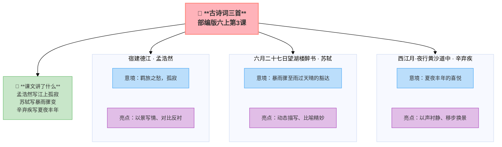

---
tags:
  - 六上
  - 语文
  - 触摸自然
  - 古诗
  - 写景
  - 古诗词三首
---

# 第03课 古诗词三首

> 部编版六上第1单元 · 触摸自然
> **阅读重点**：从阅读内容想开去（联想和想象）
> **习作目标**：变形记（想象作文）

---

## 📖 课文讲了什么

| 核心问题 | 主要内容 |
|:---------|:---------|
| 三首诗各自表达了怎样的情感？ | 羁旅之愁、豁达之气、丰收之喜 |

**一句话速览**：孟浩然写江上孤寂，苏轼写暴雨骤变，辛弃疾写夏夜丰年——三首诗词三种心境。

---

## ❤️ 中心思想

**三首诗词分别表达了羁旅之愁、豁达之气和丰收之喜。**

---

## 📝 生字

（本课无重点生字）

---

## 🔤 多音字

（本课无重点多音字）

---

## 宿建德江 · 孟浩然

> 移舟泊烟渚，日暮客愁新。
> 野旷天低树，江清月近人。

> 💡 读着玩——读顺了就好，感受节奏和画面

**📜 写作背景**：孟浩然40多岁那年跑去长安考进士——落榜了。他心情低落，离开长安往东南走，一路游山玩水。船走到浙江建德江时天快黑了，他把船停靠在雾气蒙蒙的岸边。站在船头四望——原野辽阔得让人心慌，远处的天空比树还低。月亮升起来了，倒映在清澈的江水里，好像只有它愿意靠近这个孤独的旅人。

**💡 逸事**：孟浩然是个"隐士中的网红"——他一生没当过什么大官，但在诗坛地位极高。他40多岁考不上进士，干脆不考了，回家种地。李白是他的铁杆粉丝——李白专门跑到襄阳去找他，还写了一首"吾爱孟夫子，风流天下闻"。王维跟他关系也极好，两人是"山水田园诗"的双子星。

**📜 时代回响**：唐朝读书人的人生道路只有两条——要么考科举当官，要么隐居山林。孟浩然选择了后者，但他不是真的"躺平"——他内心其实很纠结。这首诗里"日暮客愁新"的"愁"字，暴露了他真实的心事。唐代文人的"山水诗"往往不只是写景——山水是他们安放失意的地方。

### 🔑 注释

| 词语 | 解释 |
|:-----|:-----|
| 移舟 | 划船 |
| 烟渚 | 雾气笼罩的水中小洲 |
| 客愁新 | 游子又添了新愁 |
| 野旷 | 原野辽阔 |
| 天低树 | 天比树还低 |

### ✨ 读写深挖

| 写法亮点 | 课文内容 | 写作技巧 |
|:---------|:---------|:---------|
| **以景写情** | "野旷天低树，江清月近人" | 用景物写出孤独 |
| **对比反衬** | 天低树（孤独感）vs 月近人（安慰） | 一抑一扬，情感更深 |

---

## 六月二十七日望湖楼醉书 · 苏轼

> 黑云翻墨未遮山，白雨跳珠乱入船。
> 卷地风来忽吹散，望湖楼下水如天。

> 💡 读着玩——读顺了就好，感受节奏和画面

**📜 写作背景**：1072年6月27日，苏轼在杭州做通判（副市长）。那天他登上西湖边的望湖楼喝酒，正喝到兴头上，突然天色大变——黑云像打翻的墨汁一样压过来，白花花的雨点噼里啪啦砸进湖面，像千万颗珍珠在船板上乱跳。他还没来得及躲，一阵狂风卷过来，把乌云和暴雨全都吹散了——望湖楼下，水面平静如镜，好像什么都没发生过。

**💡 逸事**：苏轼是中国历史上最"好玩"的人——写诗、写词、写文章、画画、书法、做饭、酿酒、修堤坝……样样精通。他一生都在被贬，但从不消沉——到黄州发明了东坡肉，到惠州夸荔枝好吃，到海南岛研究怎么吃生蚝。他的人生哲学就八个字："竹杖芒鞋轻胜马，谁怕？"

**📜 时代回响**：北宋时期，杭州是当时世界上最繁华的城市之一。苏轼在杭州当官时做了很多实事——疏浚西湖、修建苏堤、开仓赈灾。这场暴雨对他来说只是生活中的一个小插曲，但他用诗把这个"小插曲"变成了永恒。这不是乐观，这是通透。

### 🔑 注释

| 词语 | 解释 |
|:-----|:-----|
| 翻墨 | 打翻的墨汁（形容黑云） |
| 跳珠 | 跳动的珍珠（形容雨点） |
| 卷地风 | 卷到地面的大风 |
| 水如天 | 水面平静如天空 |

### ✨ 读写深挖

| 写法亮点 | 课文内容 | 写作技巧 |
|:---------|:---------|:---------|
| **动态描写** | 黑云→白雨→大风→水天一色 | 一场暴雨的完整过程，像现场直播 |
| **比喻精妙** | "黑云翻墨""白雨跳珠" | 两个比喻写出颜色和声音 |
| **对比反差** | 暴雨骤至 vs 雨过天晴 | 人生也如此——风雨总会过去 |

---

## 西江月·夜行黄沙道中 · 辛弃疾

> 明月别枝惊鹊，清风半夜鸣蝉。
> 稻花香里说丰年，听取蛙声一片。
> 七八个星天外，两三点雨山前。
> 旧时茅店社林边，路转溪桥忽见。

> 💡 读着玩——读顺了就好，感受节奏和画面

**📜 写作背景**：辛弃疾被贬到江西上饶，在带湖边上建了一座庄园——他想通了：朝廷不让我打仗，我种地总行吧。他把庄园取名叫"稼轩"。一个夏天的夜晚，他走过黄沙岭的一条小路。月光把树枝上的喜鹊惊飞了，清风送来蝉鸣，稻田里的蛙声一片——热闹得像在开演唱会。老农们听到这个声音笑得合不拢嘴——青蛙叫得响，今年肯定是个丰收年。

**💡 逸事**：辛弃疾是个"被写词耽误了的将军"。他22岁那年组织了两千人的起义军，杀回南方。最牛的是——他听说叛徒张安国杀了起义军首领，带着五十个人冲进五万人的金兵大营，活捉了张安国就跑。到了南宋朝廷后，他一直想北伐，但朝廷只用他的文才，不用他的武略。他写了六百多首词，一半都在喊"打回去"，但直到68岁去世，朝廷也没派他上过战场。

**📜 时代回响**：南宋的"主战派"文人都有一个共同点：郁郁不得志。辛弃疾的特别之处在于：他不是只会喊口号，他是真的上过战场、杀过敌人。当他写"听取蛙声一片"的时候，他不是真的变成了田园诗人——他只是把心里的战鼓藏起来了。后人说"可怜白发生"——他最后也没等到"了却君王天下事"的那一天。

### 🔑 注释

| 词语 | 解释 |
|:-----|:-----|
| 别枝 | 另一枝、斜枝 |
| 惊鹊 | 惊动喜鹊 |
| 鸣蝉 | 蝉叫 |
| 社林 | 土地庙旁的树林 |
| 见 | 同"现"，出现 |

### ✨ 读写深挖

| 写法亮点 | 课文内容 | 写作技巧 |
|:---------|:---------|:---------|
| **以声衬静** | "蛙声一片""清风鸣蝉" | 用声音写出夏夜的热闹和宁静 |
| **侧面描写** | 不写丰收，写"蛙声" | 用蛙声代表丰收的喜悦 |
| **移步换景** | 天上→山前→溪桥 | 边走边看，动态之景 |

---

## 📚 词语积累

| 词语 | 解释 |
|:----|:-----|
| 移舟 | 划船 |
| 烟渚 | 雾气笼罩的水中小洲 |
| 翻墨 | 打翻的墨汁（形容黑云） |
| 跳珠 | 跳动的珍珠（形容雨点） |
| 别枝 | 另一枝、斜枝 |
| 惊鹊 | 惊动喜鹊 |
| 社林 | 土地庙旁的树林 |
| 见 | 同"现"，出现 |

---

### 词语解释

| 词语 | 画面式解释 |
|:-----|:----------|
| 烟渚 | 想象一下，傍晚的江面上飘着一层薄薄的雾气，水中间有一块小岛若隐若现——像仙境一样 |
| 客愁新 | 想象一下，一个在外漂泊的旅人，天快黑了还没找到住的地方——心里又添了一层新的忧愁 |
| 翻墨 | 想象一下，天空突然暗下来，一大片乌云像打翻了的墨汁一样涌过来，遮住了半边天 |
| 跳珠 | 想象一下，大雨点"噼里啪啦"砸在湖面上，溅起一颗颗水珠，像无数珍珠在跳舞 |
| 别枝 | 想象一下，月光照在树枝上，喜鹊被惊醒了——从这根枝头飞到了另一根枝头 |
| 社林 | 想象一下，村口土地庙旁边有一片小树林——夜晚经过时，树影婆娑，藏着小时候的记忆 |
| 见 | 想象一下，走啊走，转过一座小桥——咦，以前常去的那家小店突然出现在眼前！"见"就是"出现" |

---

## 📋 学习自评表

| 评价维度 | 我能…… | ⭐⭐⭐ |
|:---------|:-------|:------|
| **读** | 有感情地朗读三首诗词 | □ |
| **解** | 说出每首诗词表达的情感 | □ |
| **品** | 找出每首诗中的"诗眼" | □ |
| **背** | 背诵三首诗词 | □ |
