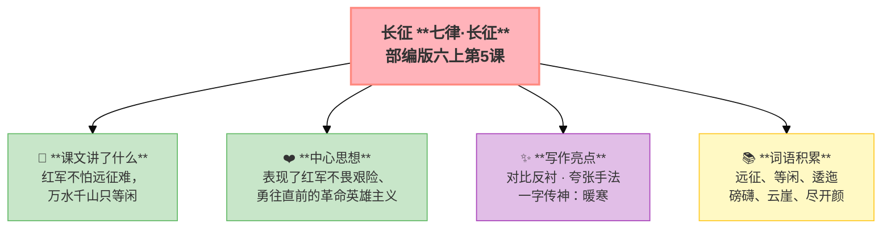

---
tags:
  - 六上
  - 语文
  - 革命岁月
  - 叙事
  - 场面描写
  - 七律长征
---

# 第05课 七律·长征

> 部编版六上第2单元 · 革命岁月
> **阅读重点**：了解点面结合的写法和场面描写
> **习作目标**：多彩的活动（场面描写）

---

## 📖 课文讲了什么

红军不怕远征难，万水千山只等闲——五岭乌蒙、金沙大渡、岷山雪，全部踩在脚下。



---

## ❤️ 中心思想

**概括了红军长征的艰难险阻，表现了红军不畏艰险、勇往直前的革命英雄主义和乐观主义精神。**

---

## 📜 知背景

- 作者：毛泽东
- 创作时间：1935年10月，长征即将胜利之时
- 体裁：七言律诗（八句，每句七字）

---

## 📝 生字

（本课无重点生字）

---

## 🔤 多音字

（本课无重点多音字）

---

## 📚 词语积累

| 词语 | 解释 |
|:-----|:-----|
| 远征 | 指二万五千里长征 |
| 等闲 | 平常、不放在眼里 |
| 五岭 | 大庾岭、骑田岭等五座山 |
| 逶迤 | 弯弯曲曲连绵不断 |
| 乌蒙 | 乌蒙山 |
| 磅礴 | 气势宏大 |
| 走泥丸 | 像滚动的泥丸（极小） |
| 云崖 | 高耸入云的山崖 |
| 三军 | 泛指红军队伍 |
| 尽开颜 | 全部笑逐颜开 |

---

### 词语解释

| 词语 | 画面式解释 |
|:-----|:----------|
| 远征 | 想象一下，红军叔叔们从江西出发，要走两万五千里——跨过山、蹚过河、走过草地，这叫"远征" |
| 等闲 | 想象一下，红军叔叔们看到前面的高山大河，笑笑说"这没什么"——"等闲"就是不把它当回事 |
| 逶迤 | 想象一下，你站在山顶往下看——五座大山像一条巨大的蛇，弯弯曲曲一直延伸到天边 |
| 磅礴 | 想象一下，乌蒙山又高又大，像一个巨人站在你面前——气势大得让人喘不过气来 |
| 走泥丸 | 想象一下，把那么高的乌蒙山看成是脚下滚过的一颗小泥丸——红军眼里，大山也不过如此 |
| 云崖 | 想象一下，金沙江两岸的山崖高得插进了云里——江水拍打着崖壁，"轰隆隆"地响 |
| 尽开颜 | 想象一下，翻过岷山后，所有的红军叔叔都笑了——脸上全是笑容，整座山都亮了起来 |

---

## 🏗️ 文章结构：超清晰！

```
首联（总起）：红军不怕远征难，万水千山只等闲
    ↓
颔联（山）：五岭逶迤腾细浪，乌蒙磅礴走泥丸
    ↓
颈联（水）：金沙水拍云崖暖，大渡桥横铁索寒
    ↓
尾联（总结）：更喜岷山千里雪，三军过后尽开颜
```

---

## ✨ 阅读与写作：深挖课文"宝藏"

| 写法亮点 | 课文内容 | 写作技巧 |
|:---------|:---------|:---------|
| **对比反衬** | "远征难" vs "只等闲" | 越难越不怕，英雄气概 |
| **夸张手法** | 大山是"细浪"和"泥丸" | 藐视困难的革命豪情 |
| **一字传神** | "暖"——巧渡金沙江，"寒"——飞夺泸定桥 | 一个温度词写出两种心境 |

---

## 📚 语言积累：词语库+句式库

### 句式库
- 红军不怕远征难，万水千山只等闲。
- 五岭逶迤腾细浪，乌蒙磅礴走泥丸。

---

## 📋 学习自评表

| 评价维度 | 我能…… | ⭐⭐⭐ |
|:---------|:-------|:------|
| **读** | 读出红军的英雄气概 | □ |
| **解** | 说出"暖"和"寒"的含义 | □ |
| **品** | 找出诗中的夸张手法 | □ |
| **背** | 背诵全诗 | □ |
