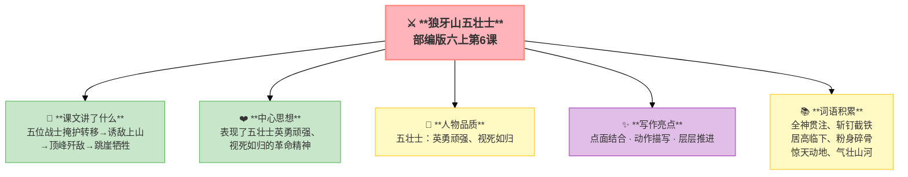

---
tags:
  - 六上
  - 语文
  - 革命岁月
  - 叙事
  - 场面描写
  - 狼牙山五壮士
---

# 第06课 狼牙山五壮士

> 部编版六上第2单元 · 革命岁月
> **阅读重点**：了解点面结合的写法和场面描写
> **习作目标**：多彩的活动（场面描写）

---

## 📖 课文讲了什么

| 核心问题 | 主要内容 |
|:---------|:---------|
| 五位战士做了什么？结局如何？ | 掩护转移→诱敌上山→顶峰歼敌→跳崖牺牲 |

**一句话速览**：1941年，五位战士为掩护群众和连队转移，把敌人引上狼牙山顶峰。弹药打完了就用石头砸，最后跳下悬崖——用生命谱写了一曲英雄壮歌。



---

## ❤️ 中心思想

**表现了五壮士英勇顽强、视死如归的革命精神。**

---

## 📜 知背景

- 本文选自《狼牙山五壮士》——真实历史事件
- 按事情发展顺序写作：接受任务→诱敌上山→英勇歼敌→顶峰歼敌→跳下悬崖

---

## 📝 生字

（本课无重点生字）

---

## 🔤 多音字

（本课无重点多音字）

---

## 📚 词语积累

| 词语 | 解释 |
|:----|:-----|
| **全神贯注** | 精神高度集中 |
| **斩钉截铁** | 形容说话坚决果断 |
| **居高临下** | 占据高处向下看 |
| **粉身碎骨** | 身体粉碎（形容决心） |
| **惊天动地** | 形容变化巨大 |
| **气壮山河** | 气势像高山大河 |

---

## 🏗️ 文章结构：超清晰！

```
接受任务（掩护群众和连队转移）
    ↓
诱敌上山（把敌人引上绝路——狼牙山顶峰）
    ↓
英勇歼敌（居高临下，狠狠打击敌人）
    ↓
顶峰歼敌（弹药打光，用石头砸）
    ↓
跳下悬崖（惊天动地，气壮山河）
```

---

## ✨ 阅读与写作：深挖课文"宝藏"

| 写法亮点 | 课文内容 | 写作技巧 |
|:---------|:---------|:---------|
| **点面结合** | 面（整体）："五位战士向敌人射击"；点（个体）：班长马宝玉、副班长葛振林……每个人的动作神态 | 先写整体场面，再聚焦个人 |
| **动作描写** | "抢""夺""插""举""喊"——一连串动词 | 用动词写出壮烈 |
| **层层推进** | 从打到砸到跳 | 紧张感逐步升级 |

---

## 📚 语言积累：词语库+句式库

### 句式库
- 狼牙山上响起了他们壮烈豪迈的口号声："打倒日本帝国主义！""中国共产党万岁！"

---

## 📋 学习自评表

| 评价维度 | 我能…… | ⭐⭐⭐ |
|:---------|:-------|:------|
| **读** | 读出五壮士的英勇壮烈 | □ |
| **找** | 找出文中的"点"和"面" | □ |
| **说** | 说出故事发展的五个阶段 | □ |
| **写** | 用点面结合的方法写一个场面 | □ |
