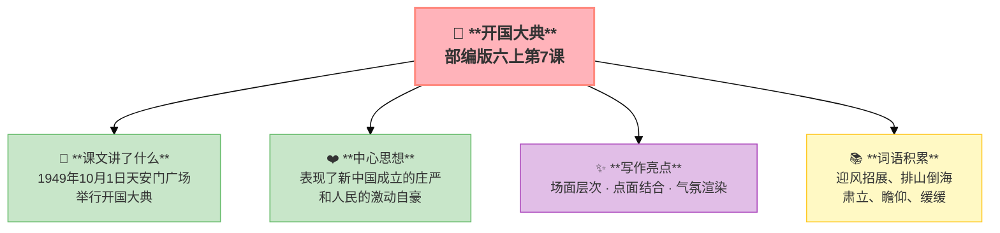

---
tags:
  - 六上
  - 语文
  - 革命岁月
  - 叙事
  - 场面描写
  - 开国大典
---

# 第07课 开国大典

> 部编版六上第2单元 · 革命岁月
> **阅读重点**：了解点面结合的写法和场面描写
> **习作目标**：多彩的活动（场面描写）

---

## 📖 课文讲了什么

| 核心问题 | 主要内容 |
|:---------|:---------|
| 开国大典上发生了什么？ | 典礼开始→毛主席宣布→升旗→阅兵→游行 |

**一句话速览**：1949年10月1日，天安门广场三十万人——毛主席宣布"中华人民共和国中央人民政府今天成立了"，五星红旗升起，阅兵式壮观，群众游行直到深夜。



---

## ❤️ 中心思想

**表现了新中国成立的庄严和人民的激动自豪。**

---

## 📜 知背景

- 这是中国现代史上最重大的事件之一
- 按时间顺序描写，场面宏大

---

## 📝 生字

（本课无重点生字）

---

## 🔤 多音字

（本课无重点多音字）

---

## 📚 词语积累

| 词语 | 解释 |
|:----|:-----|
| **迎风招展** | 随风飘动 |
| **排山倒海** | 气势极大 |
| **肃立** | 恭敬地站着 |
| **瞻仰** | 恭敬地看 |
| **缓缓** | 慢慢地 |

---

## 🏗️ 文章结构：超清晰！

```
典礼开始前（广场布置、群众入场）
    ↓
典礼进行（毛主席宣布→升旗→礼炮）
    ↓
阅兵式（海军→陆军→空军）
    ↓
群众游行（欢呼→火炬→深夜）
```

---

## ✨ 阅读与写作：深挖课文"宝藏"

| 写法亮点 | 课文内容 | 写作技巧 |
|:---------|:---------|:---------|
| **场面层次** | 典礼前→典礼中→阅兵→游行 | 按时间顺序，层层展开 |
| **点面结合** | 面（三十万人、广场全景）→点（毛主席、升旗手） | 宏大中不失细节 |
| **气氛渲染** | "这庄严的宣告……使全中国人民的心一齐欢跃起来" | 用群众反应烘托庄严 |

---

## 📚 语言积累：词语库+句式库

### 句式库
- 这庄严的宣告，这雄伟的声音，使全场三十万人一齐欢跃起来。

---

## 📋 学习自评表

| 评价维度 | 我能…… | ⭐⭐⭐ |
|:---------|:-------|:------|
| **读** | 读出开国大典的庄严和激动 | □ |
| **说** | 说出场面描写的四个阶段 | □ |
| **找** | 找出文中的"点"和"面" | □ |
| **写** | 学写一个有层次的场面 | □ |
