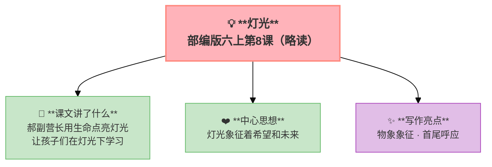

---
tags:
  - 六上
  - 语文
  - 革命岁月
  - 叙事
  - 象征
  - 灯光
---

# 第08课 灯光（略读）

> 部编版六上第2单元 · 革命岁月
> **阅读重点**：了解点面结合的写法和场面描写
> **习作目标**：多彩的活动（场面描写）

---

## 📖 课文讲了什么

| 核心问题 | 主要内容 |
|:---------|:---------|
| 灯光在文中有什么含义？ | 郝副营长用生命换来孩子们的灯光 |

**一句话速览**：战斗前夕，郝副营长看着课本上的插图说："赶明儿胜利了，咱们也用上电灯，让孩子们在灯光下学习。"战斗打响后，他在黑暗中点燃了那本书——暴露了自己，牺牲了。

---

## ❤️ 中心思想

**灯光象征着希望和未来——郝副营长用生命点亮了孩子们的灯光。**

---

## 📝 生字

（本课无重点生字）

---

## 🔤 多音字

（本课无重点多音字）

---

## 📚 词语积累

（本课为略读课文，无重点词语）

---

## 🏗️ 文章结构：超清晰！

（按事情发展顺序：战斗前夕→战斗打响→郝副营长点燃书→牺牲→灯光的象征意义）

---

## ✨ 阅读与写作：深挖课文"宝藏"

| 写法亮点 | 课文内容 | 写作技巧 |
|:---------|:---------|:---------|
| **物象象征** | 灯光 = 希望和未来 | 用具体事物表达抽象意义 |
| **首尾呼应** | 开头"灯光"→结尾"灯光" | 结构完整，情感升华 |

---

## 📚 语言积累：词语库+句式库

### 句式库
- "赶明儿胜利了，咱们也用上电灯，让孩子们在灯光下学习。"

---

## 📋 学习自评表

| 评价维度 | 我能…… | ⭐⭐⭐ |
|:---------|:-------|:------|
| **读** | 读懂灯光在文中的象征意义 | □ |
| **说** | 说出郝副营长的牺牲精神 | □ |
| **想** | 联想到今天的幸福生活 | □ |
